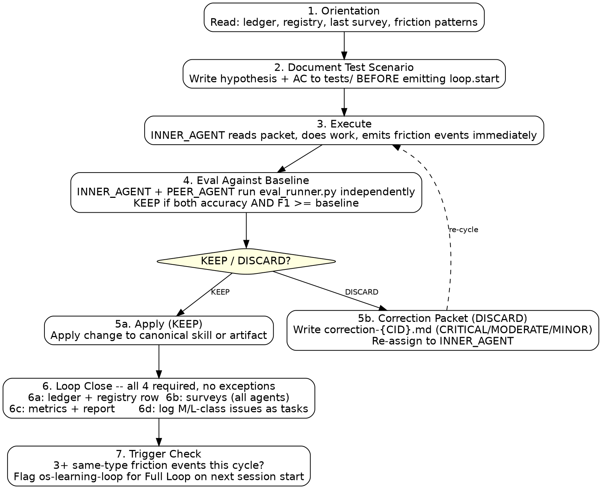

# Concurrent Agent Loop

> Pattern 5 in the agent-loops taxonomy. Treats concurrent Claude sessions as OS threads
> sharing a filesystem address space. The kernel event bus coordinates signals. Every cycle
> includes real work, eval against benchmark, friction tracking, agent self-assessment survey,
> post-run metrics, and memory persistence. The OS learns from every run.

---

## Dual-Flywheel Architecture

There are **two distinct flywheels** operating at different scopes. Do not conflate them.

```
┌─────────────────────────────────────────────────────────┐
│  OUTER FLYWHEEL — OS Self-Improvement (this skill)       │
│                                                          │
│  os-improvement-loop evaluates and improves the OS       │
│  workflows, protocols, agent coordination patterns,      │
│  and this SKILL.md itself.                               │
│                                                          │
│  Target: the OS machinery — ledgers, surveys, kernel,    │
│  event bus, loop protocol.                               │
│  Eval gate: ORCHESTRATOR + PEER_AGENT run eval_runner.py │
│  on the OS skill being patched.                          │
│  Self-improvement: ORCHESTRATOR updates this SKILL.md    │
│  when a confirmed protocol fix is found.                 │
└────────────────────┬────────────────────────────────────┘
                     │ spawns / governs
┌────────────────────▼────────────────────────────────────┐
│  INNER FLYWHEEL — Individual Skill Improvement           │
│                                                          │
│  os-eval-runner + os-skill-improvement evaluate and      │
│  improve a specific target SKILL.md (routing accuracy,   │
│  trigger descriptions, example blocks).                  │
│                                                          │
│  Target: a single skill's description and routing.       │
│  Eval gate: os-eval-runner scores the target skill.      │
│  Improvement: os-skill-improvement runs RED-GREEN-REFACTOR│
│  until score ≥ threshold.                                │
└─────────────────────────────────────────────────────────┘
```

**Key distinction:**
- The OUTER loop asks: *"Is the OS improvement process itself working correctly?"*
- The INNER loop asks: *"Does this specific skill route and execute correctly?"*

**`os-learning-loop` vs `os-improvement-loop`:** `os-learning-loop` (agent) is the
trigger/diagnostic layer — it analyzes friction events, identifies improvement targets,
and decides which flywheel to invoke. `os-improvement-loop` (skill) is the execution
protocol that agents follow once a target has been identified. Do not conflate them.

**Session Lifecycle Invariant**: The OUTER loop owns session lifecycle. INNER loop work
(`os-eval-runner`, `os-skill-improvement`) never closes a session. A session is incomplete
until Phase 6 (os-memory-manager) is executed. An INNER loop that completes without running
Phase 6/7 has silently discarded its learnings.

Each flywheel has its own eval targets, its own memory artifacts, and its own close protocol.
A session that runs INNER loop work must still close through the OUTER loop's Phase 6/7
(os-memory-manager + os-skill-improvement) to persist learnings and harden OS-level routing.

See `assets/diagrams/improvement-flywheel.mmd` for the full visual.

---

## CRITICAL: Two-Tier Loop Model

Every loop cycle uses one of two tiers. **Fast Cycle is the default.**
Use Standard Cycle only when the north star is regressing or explicitly requested.

### Fast Cycle (7 steps, ~30 min) -- default for every run



1. **Orientation** -- ORCHESTRATOR reads `improvement-ledger.md` (score trend, pending Section 2
   items) and the last registry row (what was recommended next).
2. **Test scenario documented** -- ORCHESTRATOR writes hypothesis + acceptance criteria to
   `context/memory/tests/[CYCLE_ID]_[TARGET].md` BEFORE emitting `task.assigned`.
3. **Execution** -- INNER_AGENT reads strategy packet, does real work, emits friction events
   immediately on uncertainty or wrong syntax.
4. **Eval against baseline** -- INNER_AGENT runs `eval_runner.py`. PEER_AGENT runs it
   independently. KEEP if both accuracy AND F1 score >= baseline. DISCARD otherwise.
   On BASELINE verdict (first run of a skill): record the score, do not apply or revert any
   change, proceed to step 5.
5. **Apply verdict** -- KEEP: apply change. DISCARD: correction packet, re-assign to INNER_AGENT.
6. **Loop close (4 required actions -- all mandatory every Fast Cycle):**

   **6a. Ledger + Registry** -- Append one row to ledger Section 1 (date, cycle ID, target,
   scores, verdict). Update `context/memory/tests/registry.md` row to CLOSED-KEEP or
   CLOSED-DISCARD. Full scenario file fill-in and ledger Section 2+3 are Standard Cycle only.

   **6b. Survey child agents** -- INNER_AGENT and PEER_AGENT each complete the Post-Run
   Self-Assessment Survey (`references/post_run_survey.md`), save to
   `context/memory/retrospectives/survey_[DATE]_[TIME]_[AGENT].md`, and emit `survey_completed`.
   Even on Fast Cycle, surveys are required -- they are the source of truth for what to improve next.

   **6c. Metrics + report** -- Run `post_run_metrics.py --correlation-id "$CID"`. If this is a
   KEEP cycle, optionally run `generate_report.py` to update the progress chart. Update
   `temp/agent-agentic-os-review/HOW-TO-RESTART.md` in UPSTREAM with any state changes
   (new known bugs fixed, backlog items added, what-exists status changed).

   **6d. Log issues as tasks** -- Any problem, opportunity, or improvement observed this cycle
   that is M-class or L-class (requires thought or architecture) MUST be created as a task file
   in `tasks/backlog/` in UPSTREAM using the naming convention `NNNN-[slug].md`:
   ```
   # Task NNNN: [Title]

   ## Objective
   [what needs to change and why -- cite cycle ID and agent that observed it]

   ## Acceptance Criteria
   [specific, testable definition of done]

   ## Notes
   [options considered, links to backlog.md entry if one exists]
   ```
   S-class issues (trivial, <5 min fix) can go directly into `backlog.md` without a task file.
   The next available task number is the highest NNNN across all lanes in `tasks/` + 1.
   Check with: `ls tasks/backlog/ tasks/todo/ tasks/in-progress/ tasks/done/ | grep -o '^[0-9]*' | sort -n | tail -1`

   **6e. ORCHESTRATOR memory ownership** -- ORCHESTRATOR is solely responsible for writing and
   keeping current all of the following at loop close. No other agent owns these files.

   | File | Location | When written |
   |------|----------|--------------|
   | `improvement-ledger.md` | LAB `context/memory/` | Every Fast Cycle (Section 1). Standard Cycle adds S2+S3. |
   | `tests/registry.md` | LAB `context/memory/tests/` | Every cycle -- row updated to CLOSED. |
   | `tests/[CID]_[TARGET].md` | LAB `context/memory/tests/` | Before emit (scenario). Results filled in on Standard Cycle. |
   | `memory/YYYY-MM-DD.md` | LAB `context/memory/` | Standard Cycle only (session log). |
   | `loop-reports/report_[CID].md` | LAB `context/memory/loop-reports/` | Standard Cycle only. |
   | `memory.md` | LAB `context/` | Standard Cycle -- promoted L3 facts via os-memory-manager. |
   | `HOW-TO-RESTART.md` | UPSTREAM `temp/agent-agentic-os-review/` | Every cycle -- reflect state changes. |
   | `tasks/backlog/NNNN-[slug].md` | UPSTREAM `tasks/backlog/` | When M/L-class issue is observed. |
   | `references/backlog.md` | UPSTREAM `references/` | When any issue is observed (S/M/L). |
   | **`SKILL.md` (this file)** | UPSTREAM `.agents/skills/os-improvement-loop/` | **When applicable** -- if the loop produces a confirmed protocol improvement (step unclear, gap found, new requirement), ORCHESTRATOR updates this file before closing the cycle. Self-improvement of the loop protocol is a first-class output of every loop. |

   A cycle that produces a protocol fix but does not update this SKILL.md has not fully closed.

**Cycle Completion Checklist** — a Fast Cycle is complete only when ALL of these exist:
- [ ] Ledger Section 1 row appended (`improvement-ledger.md`)
- [ ] Registry row updated to CLOSED (`tests/registry.md`)
- [ ] At least one survey saved (`context/memory/retrospectives/`)
- [ ] Metrics run (`post_run_metrics.py --correlation-id "$CID"`)
- [ ] `loop.close` event emitted

Missing any item = incomplete cycle. Do not start the next cycle until the checklist is done.

7. **Trigger check** -- if 3+ friction events of the same type this cycle, flag os-learning-loop
   for Full Loop at next session start. Read `context/memory/improvement-ledger.md` Section 3:
   if the last two Trend values are both negative, emit `north_star_regression` event and trigger
   os-learning-loop immediately (do not wait for next session).

Emitting `eval.result` without completing steps 6a-6d and 7 is an incomplete Fast Cycle.

---

### Standard Cycle -- adds these steps after step 5, before step 6

Used when: north star completion rate declining, or explicitly requested.
These steps are NOT required on every run:

- **4.2 Surveys** -- both PEER_AGENT and ORCHESTRATOR complete Post-Run Self-Assessment Survey,
  save to `context/memory/retrospectives/`.
- **4.4 Session log** -- ORCHESTRATOR writes `context/memory/YYYY-MM-DD.md`.
- **4.5 Loop report** -- write `context/memory/loop-reports/report_[CYCLE_ID].md` with baseline
  vs result table, survey summary, artifacts updated.
- **4.6 Test registry close** -- fill Results section of scenario file, update `registry.md`
  row to CLOSED, write recommended next test.
- **4.7 Ledger Section 2 + 3** -- Section 2: one row per friction item that generated a change
  (with grep verification -- see improvement-ledger-spec.md). Section 3: north star row.
- **4.8 Memory promotion** -- run `os-memory-manager` for L3 promotion.


---

## When to Use This Pattern

Use when:
- Two or more Claude sessions coordinating continuous improvement work
- N skills, workflows, or artifacts to eval and improve in parallel
- You want every cycle to produce measurable improvement and persistent memory

Do NOT use for:
- Single-session work (use `learning-loop` or `dual-loop` instead)
- Signal-only coordination with no eval, survey, or memory steps

---

## Agent Roles

| Role | Responsibility |
|------|---------------|
| ORCHESTRATOR | Orients, writes strategy packets, applies improvements on KEEP, owns git, runs metrics, closes all memory files, updates SKILL.md when protocol improvements are found |
| PEER_AGENT | Runs `os-eval-runner` independently, produces KEEP/DISCARD verdict, completes self-assessment survey |
| INNER_AGENT | Reads strategy packet, executes work, runs `eval_runner.py`, emits friction events during work, completes self-assessment survey |
| WORKER | Stateless subprocess, no bus, returns result via file/stdout, no survey required |

---

## Architecture

```
${CLAUDE_PROJECT_DIR}/context/
  events.jsonl                         <- shared event bus (append-only, atomic)
  agents.json                          <- permitted agent registry
  os-state.json                        <- shared counters and state
  agents/<id>.cursor                   <- per-agent read cursor (line-count)
  .locks/                              <- per-resource execution lock directories
  memory/YYYY-MM-DD.md                 <- session log written at every loop close
  memory/retrospectives/               <- per-agent self-assessment surveys
    survey_[DATE]_[TIME]_[AGENT].md    <- one file per agent per cycle
  memory.md                            <- L3 long-term facts (promoted from session logs)
  memory/hook-errors.log               <- hook failures (read by post_run_metrics.py)
```

Companion skills (all required for a complete loop):
- `dual-loop` — strategy packet format, correction packet protocol, verification
- `os-eval-lab-setup` — bootstrap experiment dirs (deploys program.md, evals.json, results.tsv); use **before** running any eval cycle on a new target
- `os-eval-runner` — eval_runner.py (pure scorer), evaluate.py (loop gate with KEEP/DISCARD exit codes), results.tsv baseline; the canonical eval engine
- `os-memory-manager` — session log template, L2/L3 promotion, deduplication
- `os-learning-loop` — root cause analysis, Full Loop improvement, auto-patching skills

> **Cross-Plugin Boundary** — `os-eval-lab-setup` and `os-eval-runner` are part of the
> **`agent-agentic-os` plugin** (same plugin as this skill). If not already installed:
> ```bash
> npx skills add agent-agentic-os
> ```

---

## Friction Event Protocol

Agents MUST emit a `type: friction` event immediately whenever they encounter:
- Uncertainty about what to do next
- An ambiguous or underspecified instruction, rule, or workflow step
- A wrong CLI command or tool syntax
- Being redirected or corrected by a human
- A `<WRITE_FAILED>` or tool error requiring retry

```bash
python3 "$KERNEL_PY" emit_event \
  --agent INNER_AGENT --type friction --action encountered \
  --correlation-id "$CID" \
  --summary "step:eval-runner cause:wrong-flag-name"
```

These events are counted by `post_run_metrics.py` at close and drive the os-learning-loop
auto-trigger (3+ friction events of same type = Full Loop improvement automatically).

---

## Bash Polling Pattern

```bash
poll_for_event() {
  local AGENT=$1 ACTION=$2 CID=$3
  for i in $(seq 1 30); do
    EVENTS=$(python3 "$KERNEL_PY" read_events --agent "$AGENT")
    MATCH=$(echo "$EVENTS" | python3 -c "
import sys, json
evs = json.load(sys.stdin)
hits = [e for e in evs if e.get('action') == '$ACTION'
        and (not '$CID' or e.get('correlation_id') == '$CID')]
print(json.dumps(hits[0]) if hits else '')
")
    if [ -n "$MATCH" ]; then echo "$MATCH"; return 0; fi
    sleep 2
  done
  echo ""; return 1
}
```

---

## Stage 1: Setup and Orientation

**Goal**: Every agent orients before any work begins. No agent starts cold.

> **New target?** Before running any eval cycle on a target skill for the first time, use
> `os-eval-lab-setup` to bootstrap the experiment dir. This deploys:
> - `evals/evals.json` — test prompts with `should_trigger` boolean schema (REQUIRED — legacy
>   `expected_behavior` string fields score 0.0 and will destroy accuracy)
> - `evals/results.tsv` — baseline ledger (written when you run `evaluate.py --baseline`)
> - `references/program.md` — your optimization goal, target score, and max iterations
>
> Without this setup, `evaluate.py` will fail with exit code 2 (missing experiment structure).

1. **ORCHESTRATOR reads (in order):**
   - `context/memory/improvement-ledger.md` — cross-session OS-level trajectory per skill, survey-to-action trace, north star trend
   - `<target-experiment-dir>/evals/results.tsv` — per-experiment baseline and iteration history (written by os-eval-runner's evaluate.py); this is the authoritative score history for the specific target being improved
   - `context/memory/tests/registry.md` — what has been tested, what was recommended next
   - `context/memory.md` (L3 long-term facts)
   - Last session log: `context/memory/YYYY-MM-DD.md`
   - Last retrospective surveys: `context/memory/retrospectives/` (most recent per agent)
   - `context/events.jsonl` last 100 lines for friction patterns from prior cycle
2. **ORCHESTRATOR answers before writing any strategy packet:**
   - What does the improvement ledger show for this target's score trajectory? (flat = try a different approach; declining = revert last change)
   - Is the north star completion rate regressing 2+ sessions in a row? (if yes, trigger os-learning-loop before this cycle)
   - What does the test registry say was the recommended next test?
   - Has this hypothesis already been confirmed or falsified? (check registry — do not re-run)
   - Which survey friction items from prior cycles have not been acted on yet? (Section 2 gaps)
3. Confirm `agents.json` lists all participating agents.
4. Each agent emits `agent_start`:
   ```bash
   python3 "$KERNEL_PY" emit_event \
     --agent ORCHESTRATOR --type agent_start --action registered \
     --summary "ORCHESTRATOR online — registry read, designing test from prior results"
   ```
5. **ORCHESTRATOR documents the test scenario** in `context/memory/tests/[CYCLE_ID]_[TARGET_SLUG].md`
   per `references/test-registry-protocol.md` — hypothesis, acceptance criteria, failure criteria,
   prior results consulted, known weaknesses — BEFORE emitting `loop.start`.
6. Add row to `context/memory/tests/registry.md` with status IN PROGRESS.
7. ORCHESTRATOR emits `loop.start`:
   ```bash
   CYCLE_ID="cycle-$(date +%Y%m%d-%H%M%S)"
   python3 "$KERNEL_PY" emit_event \
     --agent ORCHESTRATOR --type intent --action loop.start \
     --correlation-id "$CYCLE_ID" \
     --summary "target:[TARGET_SLUG] hypothesis:[one-line] scenario:tests/${CYCLE_ID}_[TARGET_SLUG].md"
   ```
8. ORCHESTRATOR writes strategy packet informed by the test scenario, prior survey
   recommendations, and friction patterns from the last cycle.

---

## Stage 2: Coordinate

### Pattern A: Turn Signal (Sequential Handoff)

```bash
# ORCHESTRATOR: apply fix, signal PEER_AGENT to eval
python3 "$KERNEL_PY" emit_event \
  --agent ORCHESTRATOR --type signal --action signal.wakeup \
  --to PEER_AGENT --correlation-id "$CID" \
  --summary "target:skills/skill-A/SKILL.md change:updated-triggers"

# PEER_AGENT: poll, run full eval cycle (Stage 3), emit verdict
RESULT=$(poll_for_event ORCHESTRATOR eval.result "$CID")
# ORCHESTRATOR: act on verdict (Stage 3 and Stage 4)
```

### Pattern B: Fan-Out (N Skills in Parallel)

```bash
for partition in 1 2 3; do
  (
    CLAIM=$(python3 "$KERNEL_PY" claim_task \
      --task-id "$CYCLE_ID" --partition $partition --agent INNER_AGENT --ttl 600)
    if [ "$CLAIM" = "claimed" ]; then
      # INNER_AGENT: full execution obligation (Stage 3)
      python3 "$KERNEL_PY" emit_event \
        --agent INNER_AGENT --type result --action task.complete \
        --status success --to ORCHESTRATOR --correlation-id "$CYCLE_ID" \
        --summary "partition:$partition score:0.88 verdict:KEEP survey:saved"
      python3 "$KERNEL_PY" release_lock "task_${CYCLE_ID}_p${partition}"
    fi
  ) &
done
wait
python3 "$KERNEL_PY" read_events --agent ORCHESTRATOR
```

### Pattern C: Request-Reply (Delegated Subtask)

```bash
CID=$(python3 -c "import uuid; print(uuid.uuid4().hex[:8])")
python3 "$KERNEL_PY" emit_event \
  --agent ORCHESTRATOR --type intent --action task.assigned \
  --to INNER_AGENT --correlation-id "$CID" \
  --summary "packet:handoffs/packet-${CID}.md target:skill-B"

# INNER_AGENT: poll, execute, eval, survey, reply (Stage 3)
REPLY=$(poll_for_event ORCHESTRATOR task.complete "$CID")
```

### Pattern D: Dual-Loop as Event-Native (Primary Improvement Pattern)

**Mandatory event chain:**
```
loop.start -> task.assigned -> task.complete -> eval.result -> orchestrator.decision -> loop.close
```

> **MANDATORY GATE: ORCHESTRATOR must receive `eval.result` with KEEP/DISCARD verdict from
> PEER_AGENT before applying any improvement or emitting `orchestrator.decision`. The
> eval.result event carries the verdict AND the PEER_AGENT self-assessment reference.
> Merging on `task.complete` alone is a protocol violation.**

```bash
# ORCHESTRATOR assigns task
python3 "$KERNEL_PY" emit_event \
  --agent ORCHESTRATOR --type intent --action task.assigned \
  --to INNER_AGENT --correlation-id "$CID" \
  --summary "packet:handoffs/packet-${CID}.md target:skills/skill-A/SKILL.md"

# Wait for task.complete
TC=$(poll_for_event ORCHESTRATOR task.complete "$CID")

# Signal PEER_AGENT to eval
python3 "$KERNEL_PY" emit_event \
  --agent ORCHESTRATOR --type signal --action signal.wakeup \
  --to PEER_AGENT --correlation-id "$CID" \
  --summary "eval-target:skills/skill-A/SKILL.md output:handoffs/out-${CID}.md"

# Wait for eval.result — MANDATORY before any decision
ER=$(poll_for_event ORCHESTRATOR eval.result "$CID")

# Emit decision
python3 "$KERNEL_PY" emit_event \
  --agent ORCHESTRATOR --type result --action orchestrator.decision \
  --status success --correlation-id "$CID" \
  --summary "verdict:KEEP improvements-applied:yes"
```

---

## Stage 3: Mandatory Loop Content (Every Agent, Every Cycle)

### INNER_AGENT Execution Obligation

Every time INNER_AGENT receives `task.assigned`, it MUST:

1. **Read the strategy packet** at the path in the event summary.
2. **Execute the assigned work** — edit target skill, workflow doc, or artifact.
3. **Emit friction events immediately** when hitting uncertainty, wrong syntax, or needing help.
4. **Run the eval engine** using the os-eval-runner canonical scripts.
   The experiment dir must have been bootstrapped by `os-eval-lab-setup` first
   (deploys `evals/evals.json` with `should_trigger` boolean schema, `evals/results.tsv`,
   and `references/program.md`).

   **Option A — pure scorer** (get JSON metrics, decide KEEP/DISCARD manually):
   ```bash
   python3 scripts/eval_runner.py --skill path/to/target/
   # Pass the FOLDER path, not a file. Output: JSON with accuracy + F1 scores.
   ```

   **Option B — loop gate** (evaluate.py returns exit 0=KEEP, 1=DISCARD automatically):
   ```bash
   python3 scripts/evaluate.py --skill path/to/target/
   # Exit 0 = KEEP (accuracy AND F1 >= baseline). Exit 1 = DISCARD. Exit 2 = path error.
   # Exit 3 = tampered env (.lock.hashes mismatch) — delete .lock.hashes, re-run --baseline.
   ```
   See `os-eval-runner` Troubleshooting section for exit code reference, keywords footgun,
   and 4-character word floor.

5. If DISCARD: revert edit, note failure in output file, emit `task.complete --status fail`.
6. Write output to `handoffs/out-${CID}.md`.
7. **Complete the Post-Run Self-Assessment Survey** (see Stage 4.2).
8. Emit `task.complete` including score, output path, and survey path in summary.

### PEER_AGENT Eval Obligation

Every time PEER_AGENT receives `signal.wakeup` for eval, it MUST:

1. **Read the INNER_AGENT output file** at the path in the wakeup summary.
2. **Run `evaluate.py` independently** — do NOT read the score from the INNER_AGENT event.
   Use `evaluate.py` (loop gate) for KEEP/DISCARD; it compares against `results.tsv` baseline
   automatically and returns exit code 0=KEEP or 1=DISCARD.
   ```bash
   python3 scripts/evaluate.py --skill path/to/target/
   # Note: PEER_AGENT runs this from its OWN session independently.
   ```
3. DISCARD if exit code 1. Note: `results.tsv` is the authoritative per-experiment baseline
   (written by os-eval-runner). The improvement-ledger.md tracks cross-cycle OS-level trajectory.
4. **Complete the Post-Run Self-Assessment Survey** (see Stage 4.2).
5. Emit `eval.result` with KEEP/DISCARD verdict, score delta, and survey path:
   ```bash
   python3 "$KERNEL_PY" emit_event \
     --agent PEER_AGENT --type result --action eval.result \
     --status success --to ORCHESTRATOR --correlation-id "$CID" \
     --summary "verdict:KEEP score-before:0.82 score-after:0.89 gaps:adversarial survey:retrospectives/survey_DATE_PEER_AGENT.md"
   ```

### ORCHESTRATOR Improvement Obligation

On **KEEP** verdict:
1. Apply the approved changes to the canonical skill or workflow doc.
2. Emit `orchestrator.decision`.
3. Update task tracking to Done.

On **DISCARD** verdict:
1. Write a correction packet to `handoffs/correction-${CID}.md` using severity schema:
   - CRITICAL: feature missing or tests fail
   - MODERATE: works but violates architecture or standards
   - MINOR: works, style issues only
2. Re-signal INNER_AGENT with correction packet for next sub-cycle.
3. Do NOT emit `orchestrator.decision` until KEEP is received.

---

## Stage 4: Mandatory Loop Close (Every Cycle — No Exceptions)

### 4.1 Emit loop.close

```bash
python3 "$KERNEL_PY" emit_event \
  --agent ORCHESTRATOR --type result --action loop.close \
  --status success --correlation-id "$CYCLE_ID" \
  --summary "improvements-applied:N friction-events:N"
```

### 4.2 Agent Self-Assessment Survey (Each Agent)

Every agent that performed work this cycle MUST complete the Post-Run Self-Assessment Survey
(`references/post_run_survey.md`). Answer every section — do not skip.

Save completed survey to:
```
context/memory/retrospectives/survey_[YYYYMMDD]_[HHMM]_[AGENT].md
```

Survey sections (all mandatory):

**Run Metadata**: date, task type, task complexity, skill under test

**Completion Outcome**:
- Did you complete the full intended workflow end to end? (Yes/No)
- Did the run require major human rescue? (Yes/No)

**Count-Based Signals (Karpathy Parity)**:
- How many times did you not know what to do next?
- How many times did you miss or skip a required step?
- How many times did you use the wrong CLI syntax?
- How many times were you redirected by a human?
- Total Friction Events

**Qualitative Friction**:
1. At what point were you most uncertain about what to do next?
2. Which instruction, rule, or workflow step felt ambiguous or underspecified?
3. Which command, tool, or template was most confusing in practice?
4. What was the single biggest source of friction in this run?
5. Which failure felt avoidable with a better prompt, skill, or rule?
6. What is the smallest workflow change that would have improved this run the most?

**Improvement Recommendation**:
- What one change should be tested before the next run?
- What evidence from this run supports that change?
- Target (Skill/Prompt/Script/Rule)?

After saving, emit survey_completed event:
```bash
python3 "$KERNEL_PY" emit_event \
  --agent PEER_AGENT --type learning --action survey_completed \
  --summary "retrospectives/survey_${DATE}_${TIME}_PEER_AGENT.md"
```

### 4.3 Run Post-Run Metrics

```bash
python3 "${CLAUDE_PROJECT_DIR}/context/kernel.py" emit_event \
  --agent post_run_hook --type intent --action session_summary

python3 scripts/post_run_metrics.py
```

This emits a `type: metric` event with:
- `human_interventions` — count of human rescues this cycle
- `workflow_uncertainty` — count of uncertainty friction events
- `missed_steps` — count of skipped required steps
- `cli_errors` — count of wrong CLI syntax errors
- `friction_events_total` — total friction events
- `hook_errors` — count from `context/memory/hook-errors.log`

### 4.4 Write Session Log

ORCHESTRATOR writes `context/memory/YYYY-MM-DD.md`:

```markdown
# Session Log: YYYY-MM-DD (Cycle: CYCLE_ID)

## Summary
[What was improved, which skills/workflows were modified]

## Eval Results
- Target: [skill or artifact]
- Score before: [baseline from results.tsv]
- Score after: [new score]
- Verdict: KEEP / DISCARD
- Gaps remaining: [from PEER_AGENT survey]

## Metrics (from post_run_metrics.py)
- Human interventions: N
- Friction events: N
- CLI errors: N
- Hook errors: N

## Agent Surveys
- INNER_AGENT: retrospectives/survey_DATE_TIME_INNER_AGENT.md
- PEER_AGENT: retrospectives/survey_DATE_TIME_PEER_AGENT.md
- Top recommendation: [single most impactful change from surveys]

## Skills / Workflows Updated
- [skill name]: [what changed and why]

## Open Items
- [ ] [Gaps flagged CRITICAL or MODERATE in surveys for next cycle]
```

### 4.5 Loop Report (Every Cycle — Published Before Memory Close)

ORCHESTRATOR writes a Loop Report before running `os-memory-manager`. This is the
cycle's official record. Save to `context/memory/loop-reports/report_[CYCLE_ID].md`:

```markdown
# Loop Report: [CYCLE_ID] — [YYYY-MM-DD HH:MM]

## Agent Summaries
### ORCHESTRATOR
[2-3 sentence summary: what was assigned, what decision was made, what was applied]

### INNER_AGENT
[2-3 sentence summary: what was executed, what score was produced, what friction was hit]

### PEER_AGENT
[2-3 sentence summary: eval run, verdict, gaps identified, self-assessment headline]

## Baseline vs Result
| Metric | Before | After | Delta |
|--------|--------|-------|-------|
| Eval score | [results.tsv baseline] | [new score] | [+/-] |
| Friction events | [prior cycle count] | [this cycle count] | [+/-] |
| Human interventions | [prior] | [this cycle] | [+/-] |

## Survey Response Summary
- INNER_AGENT biggest friction: [one line from survey qualitative section]
- PEER_AGENT biggest friction: [one line from survey qualitative section]
- ORCHESTRATOR biggest friction: [one line from survey qualitative section]
- Top improvement recommendation: [the single most impactful change cited across surveys]

## Artifacts Updated This Cycle
- [ ] Skill updated: [path] — [what changed]
- [ ] Script updated: [path] — [what changed]
- [ ] Hook updated: [path] — [what changed]
- [ ] Memory updated: context/memory/YYYY-MM-DD.md
- [ ] L3 promoted: [N facts to context/memory.md]
- [ ] Survey saved: retrospectives/survey_[DATE]_[AGENT].md (each agent)

## Status
- [ ] Results saved to memory: YES / NO
- [ ] os-learning-loop triggered: YES (cause: [friction pattern]) / NO
```

Emit loop report written event:
```bash
python3 "$KERNEL_PY" emit_event \
  --agent ORCHESTRATOR --type result --action loop.report \
  --correlation-id "$CYCLE_ID" \
  --summary "report:loop-reports/report_${CYCLE_ID}.md"
```

**The loop report is always written to disk.** After writing, ask the user:
> "Loop report saved to `context/memory/loop-reports/report_[CYCLE_ID].md`. Would you like me to surface the summary now?"

Only display the report content if the user says yes. Never display it automatically.

### 4.6 Test Registry Update (MANDATORY — Every Cycle)

After the loop report is written, update the test scenario record per
`references/test-registry-protocol.md`:

1. Open `context/memory/tests/[CYCLE_ID]_[TARGET_SLUG].md` and fill in the Results section:
   - Eval scores (baseline vs after, delta, verdict)
   - Metrics (friction count, human interventions, cycles to KEEP)
   - Survey findings (headline friction per agent, shared patterns)
   - Hypothesis outcome: Confirmed / Falsified / Inconclusive
   - What this test did NOT cover
   - **Recommended next test** (hypothesis, target, design improvement)

2. Update `context/memory/tests/registry.md` row from IN PROGRESS to CLOSED with verdict.

3. If the hypothesis was **Confirmed**: promote the finding to `context/memory.md` L3 with
   a dedup ID and a reference to the cycle ID as evidence.

4. If the hypothesis was **Falsified**: add a "DO NOT RE-TEST" entry to `context/memory.md`
   with the cycle ID, so future cycles do not waste time re-running it.

5. If **Inconclusive**: note what additional data would be needed and what to change in
   the test design before retrying.

Emit registry updated event:
```bash
python3 "$KERNEL_PY" emit_event \
  --agent ORCHESTRATOR --type learning --action test_registry_updated \
  --correlation-id "$CYCLE_ID" \
  --summary "scenario:tests/${CYCLE_ID}_[TARGET_SLUG].md verdict:[KEEP/DISCARD] next-hypothesis:[one-line]"
```

### 4.7 Update Improvement Ledger (Every Cycle — No Exceptions)

After the test registry update, ORCHESTRATOR appends to `context/memory/improvement-ledger.md`.
This is the longitudinal record that makes the cycle of improvement visible over time.
See `references/improvement-ledger-spec.md` for the full format and writing protocol.

**Section 1 — Eval Score Progression** (one row, every cycle):
```
| [DATE] | [CYCLE_ID] | [TARGET] | [baseline score] | [after score] | [+/-delta] | KEEP/DISCARD | [N sub-cycles] | [what changed in 5-10 words] |
```

**Section 2 — Survey-to-Action Trace** (one row per friction item that generated a change):
```
| [DATE] | [survey file name] | [AGENT] | [friction item — exact quote from survey] | [action taken] | [target file] | [what changed] | [eval delta after change] | KEEP/DISCARD/pending |
```

**Section 3 — North Star Metric** (one row per session, written ONCE at session close):
```
| [DATE] | [session ID] | [total cycles] | [cycles without human rescue] | [completion %] | [human interventions total] | [friction events total] | [trend vs prior session] |
```

After appending, emit:
```bash
python3 "$KERNEL_PY" emit_event \
  --agent ORCHESTRATOR --type learning --action ledger_updated \
  --correlation-id "$CYCLE_ID" \
  --summary "target:[TARGET] delta:[DELTA] verdict:[VERDICT] survey-actions:[N rows added to section 2]"
```

**Optional: update progress chart** (run after every KEEP cycle, or on user request):
```bash
python3 scripts/generate_report.py \
  --project-dir "${CLAUDE_PROJECT_DIR}" \
  --plugin-dir "${CLAUDE_PLUGIN_ROOT}"
```

After running: "Progress chart updated at `context/memory/reports/progress_[TIMESTAMP].png`. Want to see the summary?"
Only display the chart/summary if the user says yes — never auto-display.

**If north star regresses 2 consecutive sessions**: log a warning in the ledger and invoke
`os-learning-loop` in Full Loop mode at the start of the next session. Do not wait for the
friction event threshold — a completion rate decline is a systemic signal.

### 4.8 Promote to Long-Term Memory

Run `os-memory-manager` to evaluate session log entries for L3 promotion:
- Ephemeral state -> SKIP
- System facts, architectural decisions, new conventions -> PROMOTE with dedup ID
- Use `<SUPERSEDE old_id=NNN>` if overwriting a prior fact

### 4.10 os-learning-loop Trigger Check

After metrics are collected, ORCHESTRATOR checks the friction threshold:

```bash
FRICTION=$(python3 -c "
import json
events = [json.loads(l) for l in open('${CLAUDE_PROJECT_DIR}/context/events.jsonl') if l.strip()]
# Count friction events by cause this cycle
from collections import Counter
causes = Counter(e.get('summary','').split('cause:')[-1].split()[0]
                 for e in events if e.get('type') == 'friction' and e.get('correlation_id') == '$CYCLE_ID')
print(max(causes.values()) if causes else 0, list(causes.most_common(1)))
")
```

If any single friction cause appears 3+ times this cycle: invoke `os-learning-loop` in
**Full Loop mode** automatically. Pass the friction pattern and relevant survey excerpts.
The learning loop will run root cause analysis (Kernel/RAM/Stdlib layer), propose a fix,
run the eval-gate, and apply the improvement before the next cycle begins.

### 4.11 Release Locks and Shutdown

```bash
python3 "$KERNEL_PY" release_lock memory
# Each agent:
python3 "$KERNEL_PY" emit_event --agent <ROLE> --type agent_stop --action shutdown \
  --summary "surveys:saved metrics:emitted memory:written"
```

Invoke `os-clean-locks` if any `.lock` dirs remain.

---

## North Star Metric

**Autonomous Workflow Completion Rate**: percentage of cycles that complete the full
`loop.start -> task.complete -> eval.result -> orchestrator.decision -> loop.close`
chain without human rescue. Track this in the session log. Goal: increase every cycle.

Supporting metrics (all tracked by `post_run_metrics.py`, goal: decrease every cycle):
- Human Interventions
- Workflow Uncertainty events
- Missed Step Rate
- CLI Error Rate
- Friction Events Total

---

<example>
User: "run a continuous improvement loop on the os-eval-runner skill"
ORCHESTRATOR reads last survey (notes INNER_AGENT flagged eval_runner.py flag confusion as
biggest friction). Writes strategy packet incorporating that fix. INNER_AGENT runs, emits
friction event when hitting the confusing flag, completes eval, saves survey noting the fix
worked. PEER_AGENT runs os-eval-runner independently, produces KEEP verdict with
score delta, saves survey noting zero friction. ORCHESTRATOR applies edit, runs post_run_metrics
(friction count dropped from 3 to 0), writes session log with before/after scores, promotes
fix to memory.md. No os-learning-loop trigger needed — friction threshold not crossed.
</example>

<example>
User: "audit 3 skills in parallel"
ORCHESTRATOR dispatches 3 INNER_AGENTs via claim_task. Each emits friction events during work,
runs eval_runner.py, saves survey. ORCHESTRATOR collects all results, identifies lowest scorer,
writes correction packet. After correction cycle, runs post_run_metrics — 4 friction events
for same cause (wrong CLI syntax in eval_runner). Triggers os-learning-loop Full Loop to patch
eval_runner documentation in the skill. Closes with session log and memory promotion.
</example>

<example>
User: "replace AGENT_COMMS.md with the event bus and track whether it's faster"
ORCHESTRATOR establishes bus, runs Pattern A turn-signal cycle, records round-trip latency.
INNER_AGENT and PEER_AGENT both complete post-run surveys noting any friction with polling syntax.
post_run_metrics emitted. Session log records latency delta vs AGENT_COMMS baseline.
Surveys compared — if both agents report same confusion point, os-learning-loop patches SKILL.md.
</example>

---

## References

- [dual-loop protocol](references/dual-loop.md) - strategy packet format, correction packets, verification (inlined from agent-loops)
- [os-eval-runner SKILL](../os-eval-runner/SKILL.md) - eval_runner.py, KEEP/DISCARD, results.tsv
- [os-memory-manager SKILL](../os-memory-manager/SKILL.md) - session log template, L2/L3 promotion
- [os-learning-loop agent](../../agents/os-learning-loop.md) - root cause analysis, Full Loop patching
- [os-improvement-report SKILL](../os-improvement-report/SKILL.md) - generate progress chart from improvement ledger
- [improvement-ledger-spec.md](../../references/improvement-ledger-spec.md) - ledger format, Section 1/2/3 writing protocol
- [post_run_survey.md](../../references/post_run_survey.md) - self-assessment survey template (all sections mandatory)
- [post_run_metrics.py](scripts/post_run_metrics.py) - automated metric collection script
- [metrics.md](../../references/metrics.md) - North Star metric definition and review cadence
- [kernel.py](scripts/kernel.py) - v3 kernel: seven commands, ~200 lines
