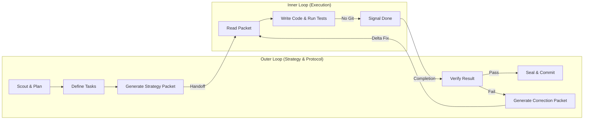

# Dual-Loop (Inner/Outer Agent Delegation)

> *Summary pending — run /wiki-distill*

## Key Ideas

- *(Bullets pending — run /wiki-distill)*

## Details

---
name: dual-loop
description: "(Industry standard: Sequential Agent / Agent as a Tool) Primary Use Case: Delegating a well-defined task to a worker agent, verifying its execution, and repeating if necessary. Inner/outer agent delegation pattern. Use when: work needs to be delegated from a strategic controller (Outer Loop) to a tactical executor (Inner Loop) via strategy packets, with verification and correction loops."
allowed-tools: Bash, Read, Write
---

## Dependencies

This skill requires **Python 3.8+** and standard library only. No external packages needed.

**To install this skill's dependencies:**
```bash
pip-compile ./requirements.in
pip install -r ./requirements.txt
```

See `../../requirements.txt` for the dependency lockfile (currently empty — standard library only).

---
# Dual-Loop (Inner/Outer Agent Delegation)

This skill defines the orchestration pattern for the **Dual-Loop Agent Architecture**. The **Outer Loop** (the directing agent) uses this protocol to organize work, delegate execution to an **Inner Loop** (the coding/tactical agent), and rigorously verify the results before merging.

This architecture is entirely framework-agnostic and can be utilized by any AI agent pairing (e.g., Antigravity directing Claude Code, or an OpenHands agent directing a specialized CLI sub-agent).

## CRITICAL: Anti-Simulation Rules

> **YOU MUST ACTUALLY PERFORM THE VALIDATIONS LISTED BELOW.**
> Describing what you "would do" or marking a step complete without actually doing the verification is a **PROTOCOL VIOLATION**.

---

## Architecture Overview



**Reference**: [Architecture Diagram](../../assets/diagrams/dual_loop_architecture.mmd)

---

## The Workflow Loop

### Step 1: The Plan (Outer Loop)

1. **Orientation**: The Outer Loop agent reads the project requirements or goals.
2. **Decomposition**: Break the goal down into distinct Work Packages (WPs) or sub-tasks.
3. **Verification**: Confirm that the tasks are atomic, testable, and do not overlap.

### Step 2: Prepare Execution Environment

1. **Isolation**: Ensure a safe workspace exists for the Inner Loop. Workspace creation (e.g., worktrees, branching, ephemeral containers) is strictly a delegated responsibility of the Orchestrator or external tooling. The Dual-Loop just receives the environment.
2. **Update State**: Mark the current Work Package as "In Progress" in whatever task-tracking system the project uses.

### Step 3: Generate Strategy Packet (Outer Loop)

1. Write a tightly scoped markdown document (the "Strategy Packet") specifically for the Inner Loop.
2. **Requirements for the Packet**:
   - The exact goal.
   - A **Pre-Execution Workflow Commitment Diagram** (an ASCII box) mapping out the steps the Inner Loop must take.
   - Only the specific file paths the sub-agent needs to care about.
   - Strict "NO GIT" constraints (the Inner Loop must not commit).
   - If generating scripts/pipelines, instruct the Inner Loop to use the "Modular Building Blocks" architecture (split convenience CLI wrappers from core Python APIs).
   - Clear Acceptance Criteria.
3. Save the packet (e.g., `handoffs/task_packet_001.md`).

### Step 4: Hand-off (The Bridge)

*(Best Practice: Run a functional CLI heartbeat using a simple health prompt to verify end-to-end connectivity before the first hand-off).*

The Outer Loop invokes the Inner Loop. To ensure stability and avoid shell fragility (e.g., quoting/pi

*(content truncated)*

## See Also

- [[concurrent-agent-loop]]
- [[1-read-the-agent-instructions-and-strip-yaml-frontmatter]]
- [[agent-agentic-os-hooks]]
- [[agent-bridge]]
- [[agent-harness-learning-layer]]
- [[agent-loops-execution-primitives]]

## Raw Source

- **Source:** `plugin-code`
- **File:** `agent-loops/skills/dual-loop/SKILL.md`
- **Indexed:** 2026-04-27T05:21:03.726361+00:00
