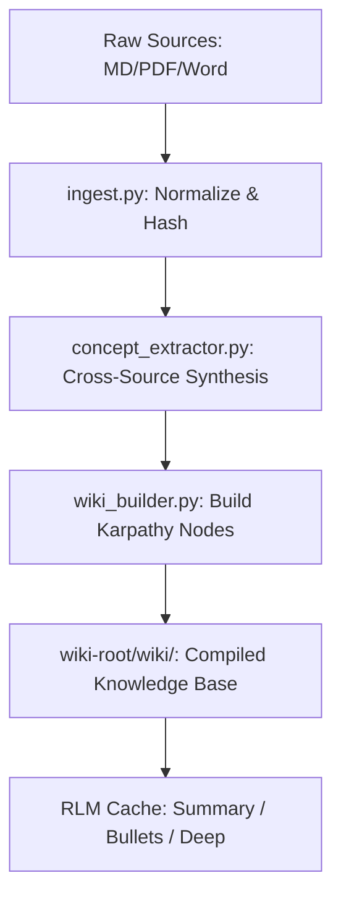

# Obsidian Wiki Engine Plugin

> *Summary pending — run /wiki-distill*

## Key Ideas

- *(Bullets pending — run /wiki-distill)*

## Details

# Obsidian Wiki Engine Plugin

**The "Active Cognitive Graph" for Enterprise Knowledge.**

Transforms raw markdown, Word, and PDF sources into a structured, queryable knowledge base. This is more than a database; it is a **Karpathy-style "Compile" step** for your repository—converting fragmented data into a synthesized "Senior Staff Architect" understanding of your project.

## 🧠 The Super-RAG Value Proposition (Why Mode D?)

Standard RAG systems operate "context-blind," chopping files into random chunks and hoping for a semantic match. They often fail on complex architectural rules and consume massive amounts of tokens by re-reading raw files. 

By combining **Mode D (Full Super-RAG)**, you transform your repository into a highly efficient **Active Cognitive Graph**:

1.  **Layer 1: RLM-Factory (The "Why")**
    * **Concept**: Pre-summarizes everything into a multi-layer cache (Summary $\rightarrow$ Bullets $\rightarrow$ Deep Dive).
    * **Efficiency**: Your agent doesn't have to "read the whole chapter" every time. It recurse into details only when required.
    * **Token Savings**: Pay the "analysis fee" once. Future queries use pre-distilled summaries instead of raw source bloat.
2.  **Layer 2: Vector DB (The "Where")**
    * **Concept**: Maps searches to intent rather than just exact keywords.
    * **Precision**: By ingesting RLM summaries, semantic search finds the right "needle" without the noise of raw code or formatting.
3.  **Layer 3: LLM Wiki (The "Synthesized Whole")**
    * **Concept**: The "Index at the back of the book." It merges multiple raw sources into authoritative **Concept Nodes**.
    * **Synthesis**: Implements the Karpathy metaphor—N raw files $\rightarrow$ M compiled concept nodes ($M \le N$).

**The Result:** A lightning-fast, dead-accurate knowledge layer that provides **Just-in-Time context** without the bloat of rich formatting like PDF or Word.

---

## 🚀 Start Here

**Skills run from `.agents/skills/`, not from `plugins/`.**
The `plugins/` directory is the source—skills are inactive until installed.

```bash
# Verify the plugin is installed and active
ls .agents/skills/obsidian-wiki-builder/   # should exist
ls .agents/agents/wiki-init-agent.md        # should exist

# If missing — install via uvx:
uvx --from git+https://github.com/richfrem/agent-plugins-skills plugin-add richfrem/agent-plugins-skills
```

**To initialize:** invoke `wiki-init-agent` (or say "set up my wiki" / `/wiki-init`).

---

## 🛠 Setup Modes

| Mode | Retrieval Depth | Dependencies Required |
|:-----|:----------------|:----------------------|
| **A — Standalone** | `/wiki-build` + Grep search | None |
| **B — Wiki + RLM** | + `/wiki-distill` (Summary Cache) | `rlm-factory` |
| **C — Wiki + Vector** | + Semantic Phase 2 search | `vector-db` |
| **D — Super-RAG** | **Full Active Cognitive Graph** | All of the above |

---

## 🏗 Core Pipeline


* **Cross-Source Synthesis**: Files from different sources about the same concept are merged into one authoritative node.
* **Token Efficiency**: Converting PDF/Word to Markdown consumes significantly fewer tokens and provides cleaner context for agents.

---

## 💻 Commands

| Command | Description |
|:--------|:------------|
| `/wiki-init` | Guided wizard for sources, wiki-root, and profile provisioning. |
| `/wiki-build` | Full build: Ingest $\rightarrow$ Synthesis $\rightarrow$ Wiki Nodes. |
| `/wiki-distill` | Generate RLM summary layers (summary, bullets, full). |
| `/wiki-query` | 3-phase search (Keyword $\rightarrow$ Vector $\rightarrow$ Wiki Node). |
| `/wiki-audit` | Structural health check (orphans, missing summaries, broken links). |
| `/wiki-lint` | Semantic health check (cont

*(content truncated)*

## See Also

- [[re-use-engine-detection-llm-call-from-distill-wiki]]
- [[add-script-dir-to-path-to-import-plugin-inventory]]
- [[adr-003-plugin-skill-resource-sharing-via-mirrored-folder-structure-and-file-level-symlinks]]
- [[adr-004-self-contained-plugins---no-cross-plugin-script-dependencies]]
- [[engine-registry-strict-cheap-model-only]]
- [[exploration-cycle-plugin-hooks]]

## Raw Source

- **Source:** `plugin-code`
- **File:** `obsidian-wiki-engine/README.md`
- **Indexed:** 2026-04-27T05:21:04.006874+00:00
