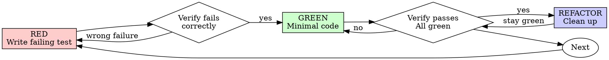

# Test-Driven Development (TDD)

> *Summary pending — run /wiki-distill*

## Key Ideas

- *(Bullets pending — run /wiki-distill)*

## Details

---
name: test-driven-development
description: Use when implementing any feature or bugfix, before writing implementation code
---

> **Source:** Ported from [obra/superpowers](https://github.com/obra/superpowers) by [Jesse Vincent](https://github.com/obra). Adapted for the `agent-plugins-skills` ecosystem. Original concepts and Iron Laws credit belongs to Jesse.

# Test-Driven Development (TDD)

## Overview

Write the test first. Watch it fail. Write minimal code to pass.

**Core principle:** If you didn't watch the test fail, you don't know if it tests the right thing.

**Violating the letter of the rules is violating the spirit of the rules.**

## When to Use

**Always:**
- New features
- Bug fixes
- Refactoring
- Behavior changes

**Exceptions (ask your human partner):**
- Throwaway prototypes
- Generated code
- Configuration files

Thinking "skip TDD just this once"? Stop. That's rationalization.

## The Iron Law

```
NO PRODUCTION CODE WITHOUT A FAILING TEST FIRST
```

Write code before the test? Delete it. Start over.

**No exceptions:**
- Don't keep it as "reference"
- Don't "adapt" it while writing tests
- Don't look at it
- Delete means delete

Implement fresh from tests. Period.

## Red-Green-Refactor



### RED - Write Failing Test

Write one minimal test showing what should happen.

One behavior. Clear name. Real code (no mocks unless unavoidable).

### Verify RED - Watch It Fail

**MANDATORY. Never skip.**

Run the test suite. Confirm:
- Test fails (not errors)
- Failure message is expected
- Fails because feature missing (not typos)

**Test passes?** You're testing existing behavior. Fix test.

**Test errors?** Fix error, re-run until it fails correctly.

### GREEN - Minimal Code

Write simplest code to pass the test.

Don't add features, refactor other code, or "improve" beyond the test.

### Verify GREEN - Watch It Pass

**MANDATORY.**

Confirm:
- Test passes
- Other tests still pass
- Output pristine (no errors, warnings)

**Test fails?** Fix code, not test.

### REFACTOR - Clean Up

After green only:
- Remove duplication
- Improve names
- Extract helpers

Keep tests green. Don't add behavior.

### Repeat

Next failing test for next feature.

## Good Tests

| Quality | Good | Bad |
|---------|------|-----|
| **Minimal** | One thing. "and" in name? Split it. | `test('validates email and domain and whitespace')` |
| **Clear** | Name describes behavior | `test('test1')` |
| **Shows intent** | Demonstrates desired API | Obscures what code should do |

## Why Order Matters

**"I'll write tests after to verify it works"**

Tests written after code pass immediately. Passing immediately proves nothing:
- Might test wrong thing
- Might test implementation, not behavior
- You never saw it catch the bug

Test-first forces you to see the test fail, proving it actually tests something.

**"Deleting X hours of work is wasteful"**

Sunk cost fallacy. The time is already gone. Working code without real tests is technical debt.

## Common Rationalizations

| Excuse | Reality |
|--------|---------|
| "Too simple to test" | Simple code breaks. Test takes 30 seconds. |
| "I'll test after" | Tests passing immediately prove nothing. |
| "Already

*(content truncated)*

## See Also

- [[triple-loop-architect-sample-test-prompt]]
- [[test-registry-protocol]]
- [[test-scenario-bank-agentic-os-plugin]]
- [[test-registry-protocol]]
- [[test-scenarios-seed]]
- [[test-registry-protocol]]

## Raw Source

- **Source:** `plugin-code`
- **File:** `spec-kitty-plugin/.agents/skills/test-driven-development/SKILL.md`
- **Indexed:** 2026-04-17T06:42:10.261720+00:00
