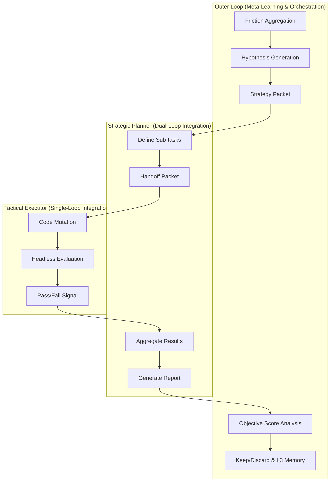

# Triple-Loop Learning (Meta-Learning System)

> *Summary pending — run /wiki-distill*

## Key Ideas

- *(Bullets pending — run /wiki-distill)*

## Details

---
name: triple-loop-learning
description: "(Industry standard: Meta-Learning System / Automated Autoresearch) Primary Use Case: Continuous, self-improving orchestration of an agentic system over multiple sessions. Use when: building a continuous improvement layer that autonomously identifies workflow friction, postulates hypotheses, and tests improved instructions/coding skills against an objective headless benchmark before merging and persisting."
allowed-tools: Bash, Read, Write
---

## Dependencies

This skill requires **Python 3.8+** and standard library only. It requires the `context-bundler` and a functional metrics engine (e.g. `eval_runner.py`).

---
# Triple-Loop Learning (Meta-Learning System)

This skill defines the orchestration pattern for the **Triple-Loop Architecture**. Pattern 5 is a robust, autonomous feedback loop where an independent **Meta-Learning Orchestrator** governs a long-horizon pipeline of execution, planning, and tactical problem-solving.

This architecture is entirely framework-agnostic. While originally developed for `agent-agentic-os`, it models the core loop defined by Meta-Harness research where autonomous systems evolve their own operating instructions based strictly on headless evaluators.

## Architecture Overview

---

## The Workflow Protocol

### Step 1: Friction Aggregation (Outer Loop)

1. The Orchestrator constantly ingests execution logs from existing operations. Look for repeated uncertainties, API errors, test failures, or syntax flaws.
2. Group the friction into clustered tasks.

### Step 2: Hypothesis Generation (Outer Loop)

1. Define a singular thesis: "If we change instruction X, the accuracy score on benchmark Y will improve by N."
2. Write a rigid **Strategy Packet** for the Mid-level Planner.

### Step 3: Distribution (Strategic Planner)

1. The Planner assigns disjoint code fixes to one or multiple Tactical Executors.
2. Ensure test boundaries are defined.

### Step 4: Mutation & Headless Scoring (Tactical Executor)

> *Constraint: Subjective LLM analysis is expressly prohibited.*

1. Apply the instruction set or code adjustment.
2. Run pure, headless deterministic tests. Return an objective integer/float score, not opinions. 

### Step 5: Verification & Promotion (Outer Loop)

1. Read the objective score differentials. 
2. **KEEP** only if Accuracy AND F1 score pass the current baseline. Reject otherwise.
3. Postulate a retrospective mapping.

---

## See Also

- [[triple-loop-learning-system---architecture-overview]]
- [[triple-loop-learning-system-outer-orchestrator-inner-execution]]
- [[triple-loop-learning-system---architecture-overview]]
- [[triple-loop-learning-system---architecture-overview]]
- [[triple-loop-learning-system-outer-orchestrator-inner-execution]]
- [[triple-loop-learning-system-outer-orchestrator-inner-execution]]

## Raw Source

- **Source:** `plugin-code`
- **File:** `spec-kitty-plugin/.agents/skills/triple-loop-learning/SKILL.md`
- **Indexed:** 2026-04-17T06:42:10.266801+00:00
