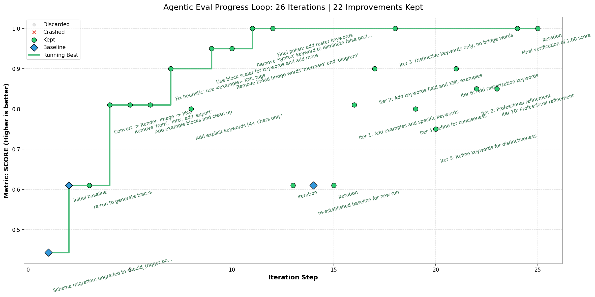

# Universal Agent Plugins & Skills Ecosystem

**123 skills · 23 plugins** — a self-improving, cross-platform library of reusable AI agent
capabilities for Claude Code, GitHub Copilot, Gemini CLI, and any compliant agent framework.

---

## Platforms

A strictly cross-platform (Windows, Mac, Ubuntu) library — the universal upstream source for reusable AI agent plugins and skills across multiple IDEs and agent frameworks: **Claude Code**, **GitHub Copilot**, **Gemini CLI**, **Antigravity**, **Roo Code**, **Windsurf**, **Cursor**, and other compliant integrations.

*All plugins deploy to the single `.agents/` folder standard — no duplicate copies needed for `.github`, `.gemini`, `.agent`, etc.*

---

## Installation

> [!IMPORTANT]
> **Start here — fresh clone or first-time setup.** The single `.agents/` environment directory is **not committed** to your repo. It will be empty by default.
>
> All installation methods (**uvx**, **bootstrap.py**, **npx skills**, and **Marketplace / Extension CLI**) are now consolidated in a single authoritative guide:
>
> ### 👉 [Go to INSTALL.md](./INSTALL.md)

**Quick install (all plugins):**
```bash
uvx --from git+https://github.com/richfrem/agent-plugins-skills plugin-add richfrem/agent-plugins-skills
```

---

## Core Philosophy: Transitional Architectures & Decoupled Skills

This repository is built on a pragmatic acceptance of the current AI engineering landscape: **the ecosystem changes weekly, and workflows that were revolutionary six months ago are obsolete today.**

Frameworks like `agent-agentic-os` and `spec-kitty` are treated as **Transitional Architectures** — bridges between what agents need to do today and what native SDKs will eventually handle. When Anthropic, Google, and GitHub harden native memory persistence, execution safety, and multi-agent orchestration, large swaths of this tooling will be happily discarded.

**Skills are Applications; the SDK is the OS.** Individual skills must function in complete isolation — no hard dependencies on sibling plugins, no assumptions about which framework is running.

---

## Architecture

### Pillar 1: The Improvement OS (`agent-agentic-os`)

The OS implements an eval-gated improvement pipeline for autonomous skill evolution:

```
os-architect           ← intent classifier + ecosystem router
    ↓
os-improvement-loop    ← learning engine: orchestrates multi-iteration improvement
    ↓
os-eval-runner         ← inner gate: KEEP/DISCARD per iteration (evaluate.py)
    ↓
os-eval-backport       ← human gate: review before lab winner → production
    ↓
os-experiment-log      ← scientific backbone: longitudinal tracking + synthesis
```

**Entry point:** `/os-architect` — describe what you want in plain language. The agent classifies intent, audits the ecosystem, proposes Path A/B/C, and dispatches via your available CLI tools. `os-evolution-planner` writes the task plan + delegation prompt. `os-architect-tester` validates after any changes.

### Karpathy Autoresearch Loop

Skills that score HIGH on the autoresearch viability rubric (objectivity + speed + frequency + utility) can run fully autonomous self-improvement loops:

```
mutate SKILL.md → evaluate.py → exit 0 (KEEP) or exit 1 (DISCARD) → repeat
```

**Not all skills are good candidates** — use [`eval-autoresearch-fit`](plugins/agent-scaffolders/skills/eval-autoresearch-fit/SKILL.md) to score a skill before running a loop.

**Live example — `convert-mermaid` skill, 26 iterations across 2 rounds: 0.61 → 1.00**



Each blue diamond is a baseline anchor (one per session). Green = new best score. Amber = kept but not a record. The two-segment shape shows a fresh re-baseline for round 2.

Monitor a live run: `python plugins/agent-agentic-os/scripts/plot_eval_progress.py --tsv <lab>/evals/ --live`

**Flywheel layers:**
- **OUTER flywheel** (`os-improvement-loop`): improves OS-level protocols and session ledgers between sessions
- **INNER flywheel** (`os-eval-runner`): evaluate.py KEEP/DISCARD gate per iteration within a session

### Pillar 2: Execution Patterns (`agent-loops`)

5 composable primitives used as the execution substrate by the Improvement OS and standalone by any agent workflow:

`learning-loop` · `dual-loop` · `agent-swarm` · `red-team-review` · `triple-loop-learning`

### Pillar 3: Super-RAG 3-Tier Retrieval

O(1) RLM keyword → O(log N) vector semantic → wiki concept nodes.

**Super-RAG stack:** `rlm-factory` (O(1) keyword) + `vector-db` (O(log N) semantic) + `obsidian-wiki-engine` (full concept nodes)

Each plugin works **standalone** (Mode A) or combined for full Super-RAG power. Init agents detect what is installed in `.agents/skills/` and configure only the available layers.

### Hub-and-Spoke ADR

All shared scripts live once at `plugins/<plugin>/scripts/`. Skills reference them via file-level symlinks (`skills/<skill>/scripts/script.py → ../../../scripts/script.py`). Directory-level symlinks are forbidden — `npx` drops them on install.

---

## Plugin Ecosystem (23 plugins · 123 skills)

### Group 1: The Improvement OS

#### agent-agentic-os — Continuous Self-Improvement

The flagship operational framework. Eval-gated improvement loops, memory management, session lifecycle, and ecosystem evolution orchestration.

**Skills (16):** [`os-architect`](plugins/agent-agentic-os/skills/os-architect/SKILL.md) · [`os-evolution-planner`](plugins/agent-agentic-os/skills/os-evolution-planner/SKILL.md) · [`os-guide`](plugins/agent-agentic-os/skills/os-guide/SKILL.md) · [`os-improvement-loop`](plugins/agent-agentic-os/skills/os-improvement-loop/SKILL.md) · [`os-eval-lab-setup`](plugins/agent-agentic-os/skills/os-eval-lab-setup/SKILL.md) · [`os-eval-runner`](plugins/agent-agentic-os/skills/os-eval-runner/SKILL.md) · [`os-eval-backport`](plugins/agent-agentic-os/skills/os-eval-backport/SKILL.md) · [`os-environment-probe`](plugins/agent-agentic-os/skills/os-environment-probe/SKILL.md) · [`os-evolution-verifier`](plugins/agent-agentic-os/skills/os-evolution-verifier/SKILL.md) · [`os-experiment-log`](plugins/agent-agentic-os/skills/os-experiment-log/SKILL.md) · [`os-memory-manager`](plugins/agent-agentic-os/skills/os-memory-manager/SKILL.md) · [`os-improvement-report`](plugins/agent-agentic-os/skills/os-improvement-report/SKILL.md) · [`os-init`](plugins/agent-agentic-os/skills/os-init/SKILL.md) · [`os-clean-locks`](plugins/agent-agentic-os/skills/os-clean-locks/SKILL.md) · [`todo-check`](plugins/agent-agentic-os/skills/todo-check/SKILL.md) · [`optimize-agent-instructions`](plugins/agent-agentic-os/skills/optimize-agent-instructions/SKILL.md)

**Agents:** [`os-architect-agent`](plugins/agent-agentic-os/agents/os-architect-agent.md) · [`os-architect-tester-agent`](plugins/agent-agentic-os/agents/os-architect-tester-agent.md) · [`improvement-intake-agent`](plugins/agent-agentic-os/agents/improvement-intake-agent.md) · [`os-health-check`](plugins/agent-agentic-os/agents/os-health-check.md) · [`agentic-os-setup`](plugins/agent-agentic-os/agents/agentic-os-setup.md)

---

### Group 2: Engineering Workflows

#### spec-kitty-plugin — Spec-Driven Development

Enterprise-grade `Spec → Plan → Tasks → Implement → Review → Merge` pipeline.

**Skills (19):** [`spec-kitty-specify`](plugins/spec-kitty-plugin/skills/spec-kitty-specify/SKILL.md) · [`spec-kitty-plan`](plugins/spec-kitty-plugin/skills/spec-kitty-plan/SKILL.md) · [`spec-kitty-tasks`](plugins/spec-kitty-plugin/skills/spec-kitty-tasks/SKILL.md) · [`spec-kitty-implement`](plugins/spec-kitty-plugin/skills/spec-kitty-implement/SKILL.md) · [`spec-kitty-review`](plugins/spec-kitty-plugin/skills/spec-kitty-review/SKILL.md) · [`spec-kitty-merge`](plugins/spec-kitty-plugin/skills/spec-kitty-merge/SKILL.md) · [`spec-kitty-analyze`](plugins/spec-kitty-plugin/skills/spec-kitty-analyze/SKILL.md) · [`spec-kitty-accept`](plugins/spec-kitty-plugin/skills/spec-kitty-accept/SKILL.md) · [`spec-kitty-clarify`](plugins/spec-kitty-plugin/skills/spec-kitty-clarify/SKILL.md) · [`spec-kitty-research`](plugins/spec-kitty-plugin/skills/spec-kitty-research/SKILL.md) · [`spec-kitty-dashboard`](plugins/spec-kitty-plugin/skills/spec-kitty-dashboard/SKILL.md) · [`spec-kitty-status`](plugins/spec-kitty-plugin/skills/spec-kitty-status/SKILL.md) · [`spec-kitty-checklist`](plugins/spec-kitty-plugin/skills/spec-kitty-checklist/SKILL.md) · [`spec-kitty-constitution`](plugins/spec-kitty-plugin/skills/spec-kitty-constitution/SKILL.md) · [`spec-kitty-tasks-outline`](plugins/spec-kitty-plugin/skills/spec-kitty-tasks-outline/SKILL.md) · [`spec-kitty-tasks-finalize`](plugins/spec-kitty-plugin/skills/spec-kitty-tasks-finalize/SKILL.md) · [`spec-kitty-tasks-packages`](plugins/spec-kitty-plugin/skills/spec-kitty-tasks-packages/SKILL.md) · [`spec-kitty-workflow`](plugins/spec-kitty-plugin/skills/spec-kitty-workflow/SKILL.md) · [`spec-kitty-sync-plugin`](plugins/spec-kitty-plugin/skills/spec-kitty-sync-plugin/SKILL.md)

**Agents:** [`spec-kitty-agent`](plugins/spec-kitty-plugin/agents/spec-kitty-agent.md) · [`spec-kitty-setup`](plugins/spec-kitty-plugin/agents/spec-kitty-setup.md)

#### exploration-cycle-plugin — Discovery & Requirements

Autonomous discovery loop: idea framing → business requirements → user stories → prototype → handoff into formal engineering specs.

**Skills (11):** [`exploration-workflow`](plugins/exploration-cycle-plugin/skills/exploration-workflow/SKILL.md) · [`exploration-session-brief`](plugins/exploration-cycle-plugin/skills/exploration-session-brief/SKILL.md) · [`discovery-planning`](plugins/exploration-cycle-plugin/skills/discovery-planning/SKILL.md) · [`business-requirements-capture`](plugins/exploration-cycle-plugin/skills/business-requirements-capture/SKILL.md) · [`business-workflow-doc`](plugins/exploration-cycle-plugin/skills/business-workflow-doc/SKILL.md) · [`user-story-capture`](plugins/exploration-cycle-plugin/skills/user-story-capture/SKILL.md) · [`exploration-handoff`](plugins/exploration-cycle-plugin/skills/exploration-handoff/SKILL.md) · [`exploration-optimizer`](plugins/exploration-cycle-plugin/skills/exploration-optimizer/SKILL.md) · [`prototype-builder`](plugins/exploration-cycle-plugin/skills/prototype-builder/SKILL.md) · [`visual-companion`](plugins/exploration-cycle-plugin/skills/visual-companion/SKILL.md) · [`subagent-driven-prototyping`](plugins/exploration-cycle-plugin/skills/subagent-driven-prototyping/SKILL.md)

**Agents (11):** `business-rule-audit-agent` · `discovery-planning-agent` · `exploration-cycle-orchestrator-agent` · `handoff-preparer-agent` · `intake-agent` · `planning-doc-agent` · `problem-framing-agent` · `prototype-builder-agent` · `prototype-companion-agent` · `requirements-doc-agent` · `requirements-scribe-agent`

---

### Group 3: Execution Patterns

#### agent-loops — Composable Loop Primitives

5 execution primitives used as the substrate for the Improvement OS and standalone agent workflows.

**Skills (6):** [`orchestrator`](plugins/agent-loops/skills/orchestrator/SKILL.md) · [`learning-loop`](plugins/agent-loops/skills/learning-loop/SKILL.md) · [`dual-loop`](plugins/agent-loops/skills/dual-loop/SKILL.md) · [`agent-swarm`](plugins/agent-loops/skills/agent-swarm/SKILL.md) · [`red-team-review`](plugins/agent-loops/skills/red-team-review/SKILL.md) · [`triple-loop-learning`](plugins/agent-loops/skills/triple-loop-learning/SKILL.md)

**Agents:** [`orchestrator`](plugins/agent-loops/agents/orchestrator.md)

---

### Group 4: Code Quality & Safety

#### coding-conventions — Standards Enforcement *(34/40 HIGH)*

Centralized rules engine for file headers, naming conventions, and linting across Python, TypeScript, and C#.

**Skills (1):** [`coding-conventions-agent`](plugins/coding-conventions/skills/coding-conventions-agent/SKILL.md) · **Agent:** `coding-conventions-agent`

#### agent-scaffolders — Boilerplate & Audit (25 skills)

Interactive creators for exact file hierarchies + structured audit framework for plugin architectural maturity.

**Scaffolding skills:** [`create-plugin`](plugins/agent-scaffolders/skills/create-plugin/SKILL.md) · [`create-skill`](plugins/agent-scaffolders/skills/create-skill/SKILL.md) · [`create-sub-agent`](plugins/agent-scaffolders/skills/create-sub-agent/SKILL.md) · [`create-command`](plugins/agent-scaffolders/skills/create-command/SKILL.md) · [`create-hook`](plugins/agent-scaffolders/skills/create-hook/SKILL.md) · [`create-github-action`](plugins/agent-scaffolders/skills/create-github-action/SKILL.md) · [`create-agentic-workflow`](plugins/agent-scaffolders/skills/create-agentic-workflow/SKILL.md) · [`create-azure-agent`](plugins/agent-scaffolders/skills/create-azure-agent/SKILL.md) · [`create-docker-skill`](plugins/agent-scaffolders/skills/create-docker-skill/SKILL.md) · [`create-mcp-integration`](plugins/agent-scaffolders/skills/create-mcp-integration/SKILL.md) · [`create-stateful-skill`](plugins/agent-scaffolders/skills/create-stateful-skill/SKILL.md)

**Audit & analysis skills:** [`audit-plugin`](plugins/agent-scaffolders/skills/audit-plugin/SKILL.md) · [`audit-plugin-l5`](plugins/agent-scaffolders/skills/audit-plugin-l5/SKILL.md) · [`l5-red-team-auditor`](plugins/agent-scaffolders/skills/l5-red-team-auditor/SKILL.md) · [`analyze-plugin`](plugins/agent-scaffolders/skills/analyze-plugin/SKILL.md) · [`self-audit`](plugins/agent-scaffolders/skills/self-audit/SKILL.md) · [`mine-skill`](plugins/agent-scaffolders/skills/mine-skill/SKILL.md) · [`mine-plugins`](plugins/agent-scaffolders/skills/mine-plugins/SKILL.md) · [`path-reference-auditor`](plugins/agent-scaffolders/skills/path-reference-auditor/SKILL.md) · [`fix-plugin-paths`](plugins/agent-scaffolders/skills/fix-plugin-paths/SKILL.md) · [`synthesize-learnings`](plugins/agent-scaffolders/skills/synthesize-learnings/SKILL.md) · [`eval-autoresearch-fit`](plugins/agent-scaffolders/skills/eval-autoresearch-fit/SKILL.md) · [`manage-marketplace`](plugins/agent-scaffolders/skills/manage-marketplace/SKILL.md) · [`ecosystem-standards`](plugins/agent-scaffolders/skills/ecosystem-standards/SKILL.md) · [`ecosystem-authoritative-sources`](plugins/agent-scaffolders/skills/ecosystem-authoritative-sources/SKILL.md)

#### link-checker — Documentation Hygiene

Continuous markdown hyperlink validation with multi-stage pipeline (inventory → extract → audit → fix).

**Skills (2):** [`link-checker-agent`](plugins/link-checker/skills/link-checker-agent/SKILL.md) · [`symlink-manager`](plugins/link-checker/skills/symlink-manager/SKILL.md) · **Agent:** `link-checker-agent`

---

### Group 5: CLI Sub-Agents

Dispatch specialized analysis to isolated fresh model contexts via CLI tools (security audits, architecture review, QA).

#### claude-cli

**Skills (3):** [`claude-cli-agent`](plugins/claude-cli/skills/claude-cli-agent/SKILL.md) · [`claude-project-setup`](plugins/claude-cli/skills/claude-project-setup/SKILL.md) · [`optimize-context`](plugins/claude-cli/skills/optimize-context/SKILL.md)

**Agents (3):** `architect-review` · `refactor-expert` · `security-auditor`

#### copilot-cli

**Skills (1):** [`copilot-cli-agent`](plugins/copilot-cli/skills/copilot-cli-agent/SKILL.md) — GPT-5 mini via Copilot CLI; used in autoresearch mutation delegation

**Agents (3):** `architect-review` · `refactor-expert` · `security-auditor`

#### gemini-cli

**Skills (2):** [`gemini-cli-agent`](plugins/gemini-cli/skills/gemini-cli-agent/SKILL.md) · [`antigravity-project-setup`](plugins/gemini-cli/skills/antigravity-project-setup/SKILL.md)

**Agents (3):** `architect-review` · `refactor-expert` · `security-auditor`

### Execution Disciplines — Safety & Quality

Behavioural guardrails enforcing best practices on every coding session. These skills come from [`obra/superpowers`](https://github.com/obra/superpowers) — install that plugin to get them. This ecosystem builds on superpowers rather than duplicating it.

**Install:** `uvx --from git+https://github.com/richfrem/agent-plugins-skills plugin-add obra/superpowers`

Skills available via superpowers: `verification-before-completion` · `test-driven-development` · `using-git-worktrees` · `systematic-debugging` · `finishing-a-development-branch` · `requesting-code-review`

---

### Group 6: Knowledge & Memory

#### obsidian-wiki-engine — Karpathy LLM Wiki + Super-RAG

Karpathy-style LLM wiki with cross-source concept synthesis. Transforms raw markdown sources into structured, queryable concept nodes. Full Obsidian vault CRUD, canvas, and graph traversal.

**Wiki skills:** [`obsidian-wiki-builder`](plugins/obsidian-wiki-engine/skills/obsidian-wiki-builder/SKILL.md) · [`obsidian-rlm-distiller`](plugins/obsidian-wiki-engine/skills/obsidian-rlm-distiller/SKILL.md) · [`obsidian-query-agent`](plugins/obsidian-wiki-engine/skills/obsidian-query-agent/SKILL.md) · [`obsidian-wiki-linter`](plugins/obsidian-wiki-engine/skills/obsidian-wiki-linter/SKILL.md)

**Vault skills:** [`obsidian-init`](plugins/obsidian-wiki-engine/skills/obsidian-init/SKILL.md) · [`obsidian-vault-crud`](plugins/obsidian-wiki-engine/skills/obsidian-vault-crud/SKILL.md) · [`obsidian-canvas-architect`](plugins/obsidian-wiki-engine/skills/obsidian-canvas-architect/SKILL.md) · [`obsidian-graph-traversal`](plugins/obsidian-wiki-engine/skills/obsidian-graph-traversal/SKILL.md) · [`obsidian-markdown-mastery`](plugins/obsidian-wiki-engine/skills/obsidian-markdown-mastery/SKILL.md) · [`obsidian-bases-manager`](plugins/obsidian-wiki-engine/skills/obsidian-bases-manager/SKILL.md)

**Setup agents:** `wiki-init-agent` · `wiki-build-agent` · `wiki-distill-agent` · `wiki-lint-agent` · `wiki-query-agent` · `super-rag-setup-agent`

#### rlm-factory — O(1) Keyword Search

Dense per-file summaries with zero external dependencies. Works standalone or as Phase 1 of the Super-RAG stack.

**Skills (6):** [`rlm-init`](plugins/rlm-factory/skills/rlm-init/SKILL.md) · [`rlm-curator`](plugins/rlm-factory/skills/rlm-curator/SKILL.md) · [`rlm-search`](plugins/rlm-factory/skills/rlm-search/SKILL.md) · [`rlm-distill-agent`](plugins/rlm-factory/skills/rlm-distill-agent/SKILL.md) · [`rlm-cleanup-agent`](plugins/rlm-factory/skills/rlm-cleanup-agent/SKILL.md) · [`rlm-audit`](plugins/rlm-factory/skills/rlm-audit/SKILL.md)

**Setup agent:** `rlm-factory-init-agent` (guided setup, Modes A–D)

#### vector-db — Semantic Search

ChromaDB-driven semantic embedding indexing with Parent-Child retrieval. Supports In-Process mode (zero server setup) and HTTP Server mode. Works standalone or as Phase 2 of the Super-RAG stack.

**Skills (6):** [`vector-db-init`](plugins/vector-db/skills/vector-db-init/SKILL.md) · [`vector-db-launch`](plugins/vector-db/skills/vector-db-launch/SKILL.md) · [`vector-db-ingest`](plugins/vector-db/skills/vector-db-ingest/SKILL.md) · [`vector-db-search`](plugins/vector-db/skills/vector-db-search/SKILL.md) · [`vector-db-cleanup`](plugins/vector-db/skills/vector-db-cleanup/SKILL.md) · [`vector-db-audit`](plugins/vector-db/skills/vector-db-audit/SKILL.md)

**Setup agent:** `vector-db-init-agent` — guided wizard (Modes A–D)

#### memory-management — Multi-Tiered Cognition

Multi-tiered cognition and context caching between long-term persistent storage and active memory.

**Skills (1):** [`memory-management`](plugins/memory-management/skills/memory-management/SKILL.md)

---

### Group 7: Infrastructure & Utilities

#### plugin-manager — Ecosystem Sync

**Skills (3):** [`plugin-installer`](plugins/plugin-manager/skills/plugin-installer/SKILL.md) · [`plugin-remover`](plugins/plugin-manager/skills/plugin-remover/SKILL.md) · [`plugin-syncer`](plugins/plugin-manager/skills/plugin-syncer/SKILL.md)

#### task-manager

**Skills (1):** [`task-agent`](plugins/task-manager/skills/task-agent/SKILL.md)

#### dependency-management — pip-compile Workflows

Cross-platform pip-compile with strict `.in` → `.txt` lockfile discipline.

**Skills (1):** [`dependency-management`](plugins/dependency-management/skills/dependency-management/SKILL.md)

#### context-bundler — Context Packaging

Package deep directory contexts and code traces into single payloads for external LLM review.

**Skills (2):** [`context-bundler`](plugins/context-bundler/skills/context-bundler/SKILL.md) · [`red-team-bundler`](plugins/context-bundler/skills/red-team-bundler/SKILL.md)

#### mermaid-to-png

**Skills (1):** [`convert-mermaid`](plugins/mermaid-to-png/skills/convert-mermaid/SKILL.md) *(autoresearch score: 30/40 MEDIUM — eval run complete: 0.61 → 1.00 in 26 iterations)*

#### adr-manager — Architecture Decision Records

**Skills (1):** [`adr-management`](plugins/adr-manager/skills/adr-management/SKILL.md)

#### huggingface-utils — HuggingFace Lifecycle

**Skills (2):** [`hf-init`](plugins/huggingface-utils/skills/hf-init/SKILL.md) · [`hf-upload`](plugins/huggingface-utils/skills/hf-upload/SKILL.md)

#### voice-writer — Tone & Humanization

**Skills (1):** [`humanize`](plugins/voice-writer/skills/humanize/SKILL.md)

#### rsvp-speed-reader

Token-stream speed reading with pause/resume, comprehension check-ins, and session management.

**Skills (2):** [`rsvp-reading`](plugins/rsvp-speed-reader/skills/rsvp-reading/SKILL.md) · [`rsvp-comprehension-agent`](plugins/rsvp-speed-reader/skills/rsvp-comprehension-agent/SKILL.md)

---

## Completed Experiments

### Ecosystem Fitness Sweep v1 — COMPLETE (`temp/ecosystem-fitness-sweep-v1/`)

Scored all 116/120 production skills for **Karpathy autoresearch loop viability** using GPT-5 mini via Copilot CLI.
Each skill scored on: objectivity (can a shell command measure it?), execution speed, frequency of use, and potential utility (max 40).

**Top HIGH candidates:**

| Rank | Skill | Score | Loop |
|---|---|---|---|
| 1 | superpowers/verification-before-completion | 35/40 | LLM_IN_LOOP |
| 2 | superpowers/test-driven-development | 35/40 | LLM_IN_LOOP |
| 3 | coding-conventions/coding-conventions-agent | 34/40 | HYBRID |
| 4 | superpowers/using-git-worktrees | 33/40 | DETERMINISTIC |
| 5 | spec-kitty-plugin/spec-kitty-status | 33/40 | DETERMINISTIC |
| 6 | agent-agentic-os/os-eval-runner | 32/40 | DETERMINISTIC |

Full ranked results: [`summary-ranked-skills.json`](plugin-research/experiments/analyze-candidates-for-auto-reseaarch/skills/eval-autoresearch-fit/assets/resources/summary-ranked-skills.json)
Top 20 opportunities with metrics + blockers: [`autoresearch-opportunities-report.md`](plugin-research/experiments/analyze-candidates-for-auto-reseaarch/skills/eval-autoresearch-fit/assets/resources/autoresearch-opportunities-report.md)

Regenerate report:
```bash
python plugin-research/experiments/analyze-candidates-for-auto-reseaarch/skills/eval-autoresearch-fit/scripts/update_ranked_skills.py \
  --json-path plugin-research/experiments/analyze-candidates-for-auto-reseaarch/skills/eval-autoresearch-fit/assets/resources/summary-ranked-skills.json \
  --morning-report
```

---

## Repository Structure

```
plugins/                    ← upstream source (23 plugins, 123 skills)
  <plugin>/
    plugin.json
    skills/<skill>/
      SKILL.md              ← skill definition (mutation target for autoresearch loops)
      evals/evals.json      ← routing evaluation suite (should_trigger boolean schema)
      evals/results.tsv     ← per-experiment score history
      autoresearch/         ← optional: evaluate.py + golden task set for improvement loops
      scripts/              ← file-level symlinks → ../../scripts/
    scripts/                ← canonical scripts (shared via symlinks, never duplicated)
    agents/                 ← sub-agent .md definitions
    assets/diagrams/        ← architecture diagrams

.agents/                    ← deployed skill copies (bridge installer output)
  skills/
  agents/

plugin-research/            ← experiments and autoresearch infrastructure
  experiments/
    analyze-candidates-for-auto-reseaarch/

temp/                       ← local scratch (gitignored except scripts)
  ecosystem-fitness-sweep-v1/
```

---

*123 skills · 23 plugins · Improvement OS (os-architect) · Karpathy autoresearch loops · Super-RAG 3-tier retrieval*
