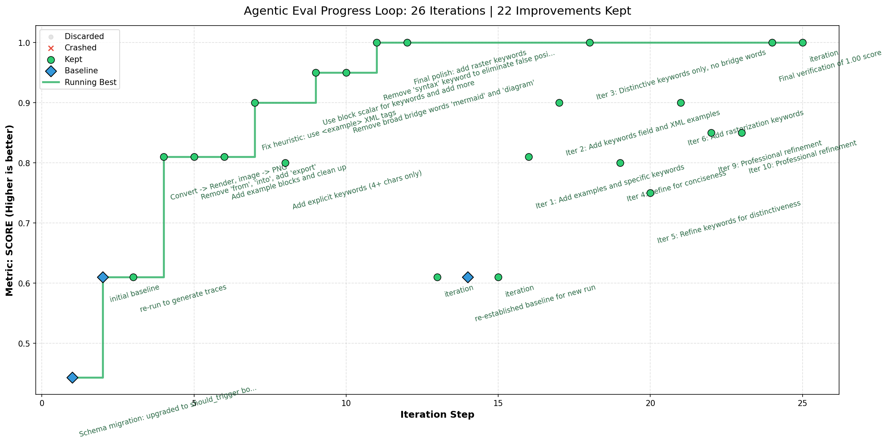
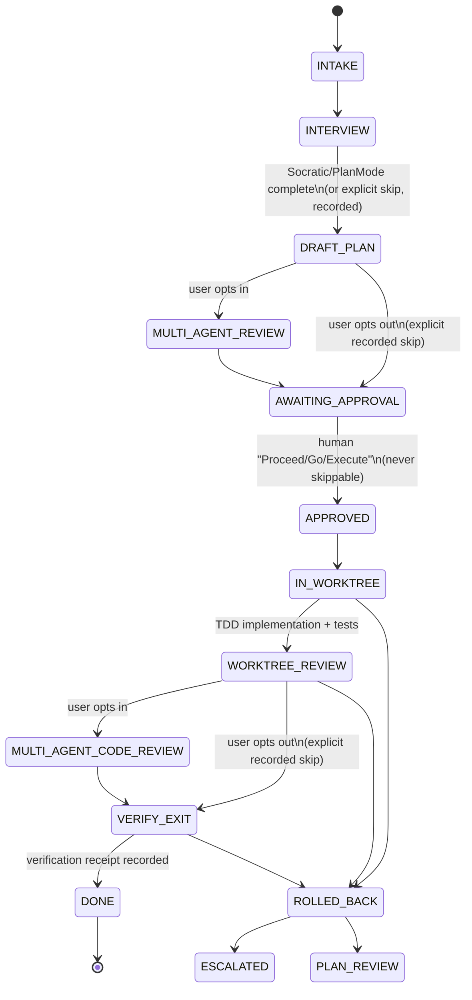

# Universal Agent Plugins & Skills Ecosystem

<!-- ECOSYSTEM_STATS_START -->**Current Scale:** 10 Plugins · 143 Skills · 47 Sub-Agents<!-- ECOSYSTEM_STATS_END --> — a self-improving, cross-platform library of reusable AI agent
capabilities for Claude Code, GitHub Copilot, Gemini CLI, and any compliant agent framework..

A strictly cross-platform (Windows, Mac, Ubuntu) library — the universal upstream source for reusable AI agent plugins and skills across multiple IDEs and agent frameworks: **Claude Code**, **GitHub Copilot**, **Gemini CLI**, **Antigravity**, **Roo Code**, **Windsurf**, **Cursor**, and other compliant integrations. All plugins deploy to a single `.agents/` folder standard — no duplicate copies needed for `.github`, `.gemini`, `.agent`, etc.

> [!IMPORTANT]
> **Start here — fresh clone or first-time setup.** The single `.agents/` environment directory is **not committed** to your repo. See [INSTALL.md](./INSTALL.md) for the full guide. Quick install (all plugins):
> ```bash
> uvx --from git+https://github.com/richfrem/agent-plugins-skills plugin-add richfrem/agent-plugins-skills
> ```

---

## The Three Pillars

### 1. Self-Evolution — `agent-agentic-os`

A deterministic graph state machine drives every skill/plugin improvement cycle:

```
TRIAGE → PLAN → AWAITING_APPROVAL (human gate) → AUTHORIZED → CREATE_WORKTREE → EXECUTE
       → VERIFY_GATE → PRE_COMMIT_RECEIPT → COMMIT / ROLLBACK → FINAL_RECEIPT
```

Proposal Mode (`TRIAGE`/`PLAN`) is strictly read-only until a human explicitly approves — no worktrees, no mutations. The controller (`evolution_state.py`) runs the declared verifier itself via subprocess, so results can never be self-reported; verifier files are SHA256-locked at init and any mutation aborts the cycle. A cryptographic Evolution Integrity Receipt binds the staged git tree, ordered audit-event digest, and verifier exit code before a commit is allowed. On a 3rd-attempt failure, code rolls back but the knowledge gained (wiki insights, negative constraints, map-debt) is durably preserved to a dedicated branch — never lost, never merged to main without review.

Every invariant above is machine-enforced, not just asserted: a negative-capability test suite drives forged exit codes, undeclared verifier mutation, a forced 4th-attempt loop, and forged/stale receipt tokens at the controller and confirms each is blocked, backed by an end-to-end smoke test that runs a full PASS cycle and a ROLLBACK cycle end to end.

**Entry point:** `/os-architect` — describe what you want in plain language. The agent classifies intent, audits the ecosystem, proposes Path A/B/C, and dispatches via your available CLI tools.

### 2. Execution Primitives — `agent-orchestration`

Composable loop and graph-execution primitives used as the substrate by the Improvement OS and standalone by any agent workflow:

`orchestrator` · `select-loop-strategy` · `learning-loop` · `dual-loop` · `co-pilot-loop` · `agent-swarm` · `red-team-review` · `triple-loop-learning` · `graph-execution`

`graph-execution` is the deterministic DAG engine underneath Pillar 1's self-evolution state machine — state lives in files, not in prompt memory, with explicit transition rules and rollback semantics.

### 3. Memory — `agent-memory`

**Default is a zero-dependency, filesystem-native 3-Layer Engine** ([`memory-management`](plugins/agent-memory/skills/memory-management/SKILL.md)) — no vector database, no daemon, no external packages:

- **Layer 1 — Runtime Context:** lean, on-demand `SKILL.md` files (≤100 lines); raw traces and wiki dossiers are barred from active-task context to prevent bloat.
- **Layer 2 — Compounding Wiki:** permanent `wiki/`/`references/` playbooks tagged with a confidence taxonomy (`OBSERVED` → `CONFIRMED`/`REJECTED`, with 30-day decay); survives rollback even when code doesn't. Synthesized and indexed automatically via `distill_playbook.py` and audited via `audit_map_debt.py`.
- **Layer 3 — Safe Audit:** append-only, hash-chained `cycle_manifests.jsonl` — structured event metadata only, zero raw terminal output.

Retrieval is native (`rg` / direct file reads), targeting <50ms with no background processes. Layer 2 playbook indexing and map debt aging are enforced by `pre-commit-evolution-guard` and `turn_evolution_guard.py`. `memory-management` has no dependency on and makes no reference to RLM, vector search, or Obsidian — those remain separate, unrelated skills in `agent-memory` for projects that specifically want keyword/semantic/graph retrieval on top (see Group 6 below).

### Hub-and-Spoke ADR

All shared scripts live once at `plugins/<plugin>/scripts/`. Skills reference them via file-level symlinks (`skills/<skill>/scripts/script.py → ../../../scripts/script.py`). Directory-level symlinks are forbidden — `npx` drops them on install.

---

## Core Philosophy: Transitional Architectures & Decoupled Skills

This repository is built on a pragmatic acceptance of the current AI engineering landscape: **the ecosystem changes weekly, and workflows that were revolutionary six months ago are obsolete today.**

`agent-agentic-os` is treated as a **Transitional Architecture** — a bridge between what agents need to do today and what native SDKs will eventually handle. When Anthropic, Google, and GitHub harden native memory persistence, execution safety, and multi-agent orchestration, large swaths of this tooling will be happily discarded.

- Portable `.md` manifests and `SKILL.md` files remain the source of truth across all runtimes
- Multiple runtime adapters (Claude Code, Copilot CLI, Gemini CLI, **MAF**) are supported side-by-side
- Strong custom control plane for safety and governance that no hosted framework currently matches
- Selective adoption of excellent patterns from frontier frameworks (e.g. MAF's typed handoffs and AGT governance)

**Skills are Applications; the SDK is the OS.** Individual skills must function in complete isolation — no hard dependencies on sibling plugins, no assumptions about which framework is running.

---

## Karpathy Autoresearch Loop

Skills that score HIGH on the autoresearch viability rubric (objectivity + speed + frequency + utility) can run fully autonomous self-improvement loops:

```
mutate SKILL.md → evaluate.py → exit 0 (KEEP) or exit 1 (DISCARD) → repeat
```

**Not all skills are good candidates** — use [`eval-autoresearch-fit`](plugins/agent-scaffolders/skills/eval-autoresearch-fit/SKILL.md) to score a skill before running a loop.

**Live example — `convert-mermaid` skill, 26 iterations across 2 rounds: 0.61 → 1.00**



Each blue diamond is a baseline anchor (one per session). Green = new best score. Amber = kept but not a record. The two-segment shape shows a fresh re-baseline for round 2.

Monitor a live run: `python plugins/agent-agentic-os/scripts/plot_eval_progress.py --tsv <lab>/evals/ --live`

**Flywheel layers:**
- **OUTER flywheel** (`os-improvement-loop`): improves OS-level protocols and session ledgers between sessions
- **INNER flywheel** (`os-eval-runner`): evaluate.py KEEP/DISCARD gate per iteration within a session

---

## Plugin Ecosystem (10 plugins · 143 skills)

### Group 1: The Improvement OS

#### agent-agentic-os — Continuous Self-Improvement

The flagship operational framework. Eval-gated improvement loops, memory management, session lifecycle, and ecosystem evolution orchestration.

**Skills (23):** [`os-architect`](plugins/agent-agentic-os/skills/os-architect/SKILL.md) · [`os-evolution-planner`](plugins/agent-agentic-os/skills/os-evolution-planner/SKILL.md) · [`os-guide`](plugins/agent-agentic-os/skills/os-guide/SKILL.md) · [`os-improvement-loop`](plugins/agent-agentic-os/skills/os-improvement-loop/SKILL.md) · [`os-eval-lab-setup`](plugins/agent-agentic-os/skills/os-eval-lab-setup/SKILL.md) · [`os-eval-runner`](plugins/agent-agentic-os/skills/os-eval-runner/SKILL.md) · [`os-eval-backport`](plugins/agent-agentic-os/skills/os-eval-backport/SKILL.md) · [`os-environment-probe`](plugins/agent-agentic-os/skills/os-environment-probe/SKILL.md) · [`os-evolution-verifier`](plugins/agent-agentic-os/skills/os-evolution-verifier/SKILL.md) · [`os-experiment-log`](plugins/agent-agentic-os/skills/os-experiment-log/SKILL.md) · [`os-memory-manager`](plugins/agent-agentic-os/skills/os-memory-manager/SKILL.md) · [`os-improvement-report`](plugins/agent-agentic-os/skills/os-improvement-report/SKILL.md) · [`os-init`](plugins/agent-agentic-os/skills/os-init/SKILL.md) · [`os-clean-locks`](plugins/agent-agentic-os/skills/os-clean-locks/SKILL.md) · [`todo-check`](plugins/agent-agentic-os/skills/todo-check/SKILL.md) · [`optimize-agent-instructions`](plugins/agent-agentic-os/skills/optimize-agent-instructions/SKILL.md) · [`self-evolution`](plugins/agent-agentic-os/skills/self-evolution/SKILL.md) · [`critical-auditor`](plugins/agent-agentic-os/skills/critical-auditor/SKILL.md) · [`interview-spec`](plugins/agent-agentic-os/skills/interview-spec/SKILL.md) · [`os-skill-improvement`](plugins/agent-agentic-os/skills/os-skill-improvement/SKILL.md) · [`os-health-check`](plugins/agent-agentic-os/skills/os-health-check/SKILL.md) · [`issue-resolution-reviewer`](plugins/agent-agentic-os/skills/issue-resolution-reviewer/SKILL.md) · [`repository-improvement`](plugins/agent-agentic-os/skills/repository-improvement/SKILL.md)

**Agents (4):** [`os-architect-agent`](plugins/agent-agentic-os/agents/os-architect-agent.md) · [`os-architect-tester-agent`](plugins/agent-agentic-os/agents/os-architect-tester-agent.md) · [`improvement-intake-agent`](plugins/agent-agentic-os/agents/improvement-intake-agent.md) · [`agentic-os-setup`](plugins/agent-agentic-os/agents/agentic-os-setup.md)

##### The SQLite Control Plane

`agent_control.py` is the ACID state machine that governs the task lifecycle for agent-driven
engineering work in this repo — intake, Socratic intake/Plan Mode, draft plan, optional
multi-agent review, human approval, isolated worktree, TDD implementation, post-implementation
review, and verified exit. It exists because agents previously jumped straight from code changes
to `git push`/`gh pr create` without stopping for human review — the pipeline below is what
closes that gap, with a `pre-push-review-guard` git hook enforcing the review states before any
push is allowed.


```mermaid
stateDiagram-v2
    [*] --> INTAKE
    INTAKE --> INTERVIEW
    INTERVIEW --> DRAFT_PLAN : Socratic/PlanMode complete\n(or explicit skip, recorded)
    DRAFT_PLAN --> MULTI_AGENT_REVIEW : user opts in
    DRAFT_PLAN --> AWAITING_APPROVAL : user opts out\n(explicit recorded skip)
    MULTI_AGENT_REVIEW --> AWAITING_APPROVAL
    AWAITING_APPROVAL --> APPROVED : human "Proceed/Go/Execute"\n(never skippable)
    APPROVED --> IN_WORKTREE
    IN_WORKTREE --> WORKTREE_REVIEW : TDD implementation + tests
    WORKTREE_REVIEW --> MULTI_AGENT_CODE_REVIEW : user opts in
    WORKTREE_REVIEW --> VERIFY_EXIT : user opts out\n(explicit recorded skip)
    MULTI_AGENT_CODE_REVIEW --> VERIFY_EXIT
    VERIFY_EXIT --> DONE : verification receipt recorded
    IN_WORKTREE --> ROLLED_BACK
    WORKTREE_REVIEW --> ROLLED_BACK
    VERIFY_EXIT --> ROLLED_BACK
    ROLLED_BACK --> ESCALATED
    ROLLED_BACK --> PLAN_REVIEW
    DONE --> [*]
```

Source diagram: [`docs/diagrams/control-plane-pipeline.mermaid`](docs/diagrams/control-plane-pipeline.mermaid).

---

### Group 2: Engineering Workflows

> **spec-kitty-plugin** was removed from this repo (2026-09-05) — it was a legacy/deprecated pointer, never part of the tracked 10-plugin set. Spec Kitty v3.2.2+ manages agent workspaces natively via its own CLI (`spec-kitty init . --ai antigravity`).

#### exploration-cycle-plugin — Discovery & Requirements

Autonomous discovery loop: idea framing → business requirements → user stories → prototype → handoff into formal engineering specs.

**Skills (20):** [`exploration-workflow`](plugins/exploration-cycle-plugin/skills/exploration-workflow/SKILL.md) · [`exploration-session-brief`](plugins/exploration-cycle-plugin/skills/exploration-session-brief/SKILL.md) · [`discovery-planning`](plugins/exploration-cycle-plugin/skills/discovery-planning/SKILL.md) · [`business-requirements-capture`](plugins/exploration-cycle-plugin/skills/business-requirements-capture/SKILL.md) · [`business-workflow-doc`](plugins/exploration-cycle-plugin/skills/business-workflow-doc/SKILL.md) · [`user-story-capture`](plugins/exploration-cycle-plugin/skills/user-story-capture/SKILL.md) · [`exploration-handoff`](plugins/exploration-cycle-plugin/skills/exploration-handoff/SKILL.md) · [`exploration-optimizer`](plugins/exploration-cycle-plugin/skills/exploration-optimizer/SKILL.md) · [`prototype-builder`](plugins/exploration-cycle-plugin/skills/prototype-builder/SKILL.md) · [`visual-companion`](plugins/exploration-cycle-plugin/skills/visual-companion/SKILL.md) · [`subagent-driven-prototyping`](plugins/exploration-cycle-plugin/skills/subagent-driven-prototyping/SKILL.md) · [`vibe-browser-audit`](plugins/exploration-cycle-plugin/skills/vibe-browser-audit/SKILL.md) · [`vibe-behavioral-test-capture`](plugins/exploration-cycle-plugin/skills/vibe-behavioral-test-capture/SKILL.md) · [`vibe-domain-extractor`](plugins/exploration-cycle-plugin/skills/vibe-domain-extractor/SKILL.md) · [`vibe-slice-migrator`](plugins/exploration-cycle-plugin/skills/vibe-slice-migrator/SKILL.md) · [`vibe-reengineer`](plugins/exploration-cycle-plugin/skills/vibe-reengineer/SKILL.md) · [`vibe-spec-packager`](plugins/exploration-cycle-plugin/skills/vibe-spec-packager/SKILL.md) · [`vibe-togaf-architect`](plugins/exploration-cycle-plugin/skills/vibe-togaf-architect/SKILL.md) · [`vibe-to-speckit-superpowers`](plugins/exploration-cycle-plugin/skills/vibe-to-speckit-superpowers/SKILL.md) · [`using-exploration-cycle`](plugins/exploration-cycle-plugin/skills/using-exploration-cycle/SKILL.md)

**Agents (15):** `business-rule-audit-agent` · `certification-verifier` · `discovery-planning-agent` · `domain-purity-auditor` · `exploration-cycle-orchestrator-agent` · `handoff-preparer-agent` · `intake-agent` · `planning-doc-agent` · `problem-framing-agent` · `prototype-builder-agent` · `prototype-companion-agent` · `requirements-doc-agent` · `runtime-observer-agent` · `semantic-drift-auditor` · `vibe-orchestrator-agent`

---

### Group 3: Execution Patterns

#### agent-orchestration — Composable Loop & Graph Primitives

Execution primitives for loops and deterministic state graphs, serving as the substrate for the Improvement OS and standalone agent workflows.

**Skills (9):** [`orchestrator`](plugins/agent-orchestration/skills/orchestrator/SKILL.md) · [`select-loop-strategy`](plugins/agent-orchestration/skills/select-loop-strategy/SKILL.md) · [`learning-loop`](plugins/agent-orchestration/skills/learning-loop/SKILL.md) · [`dual-loop`](plugins/agent-orchestration/skills/dual-loop/SKILL.md) · [`co-pilot-loop`](plugins/agent-orchestration/skills/co-pilot-loop/SKILL.md) · [`agent-swarm`](plugins/agent-orchestration/skills/agent-swarm/SKILL.md) · [`red-team-review`](plugins/agent-orchestration/skills/red-team-review/SKILL.md) · [`triple-loop-learning`](plugins/agent-orchestration/skills/triple-loop-learning/SKILL.md) · [`graph-execution`](plugins/agent-orchestration/skills/graph-execution/SKILL.md)

**Agents:** [`orchestrator`](plugins/agent-orchestration/agents/orchestrator.md)

---

### Group 4: Code Quality & Safety

#### agent-scaffolders — Boilerplate & Audit (32 skills)

Interactive creators for exact file hierarchies + structured audit framework for plugin architectural maturity.

**Scaffolding skills:** [`create-plugin`](plugins/agent-scaffolders/skills/create-plugin/SKILL.md) · [`create-skill`](plugins/agent-scaffolders/skills/create-skill/SKILL.md) · [`create-rule`](plugins/agent-scaffolders/skills/create-rule/SKILL.md) · [`create-sub-agent`](plugins/agent-scaffolders/skills/create-sub-agent/SKILL.md) · [`create-command`](plugins/agent-scaffolders/skills/create-command/SKILL.md) · [`create-hook`](plugins/agent-scaffolders/skills/create-hook/SKILL.md) · [`create-github-action`](plugins/agent-scaffolders/skills/create-github-action/SKILL.md) · [`create-agentic-workflow`](plugins/agent-scaffolders/skills/create-agentic-workflow/SKILL.md) · [`create-azure-agent`](plugins/agent-scaffolders/skills/create-azure-agent/SKILL.md) · [`create-docker-skill`](plugins/agent-scaffolders/skills/create-docker-skill/SKILL.md) · [`create-mcp-integration`](plugins/agent-scaffolders/skills/create-mcp-integration/SKILL.md) · [`create-stateful-skill`](plugins/agent-scaffolders/skills/create-stateful-skill/SKILL.md) · [`create-apm-package`](plugins/agent-scaffolders/skills/create-apm-package/SKILL.md) · [`convert-plugin-to-apm`](plugins/agent-scaffolders/skills/convert-plugin-to-apm/SKILL.md) · [`compile-apm-package`](plugins/agent-scaffolders/skills/compile-apm-package/SKILL.md) · [`install-apm-package`](plugins/agent-scaffolders/skills/install-apm-package/SKILL.md)

**Audit & analysis skills:** [`audit-plugin`](plugins/agent-scaffolders/skills/audit-plugin/SKILL.md) · [`audit-plugin-l5`](plugins/agent-scaffolders/skills/audit-plugin-l5/SKILL.md) · [`audit-skill`](plugins/agent-scaffolders/skills/audit-skill/SKILL.md) · [`l5-red-team-auditor`](plugins/agent-scaffolders/skills/l5-red-team-auditor/SKILL.md) · [`analyze-plugin`](plugins/agent-scaffolders/skills/analyze-plugin/SKILL.md) · [`self-audit`](plugins/agent-scaffolders/skills/self-audit/SKILL.md) · [`mine-skill`](plugins/agent-scaffolders/skills/mine-skill/SKILL.md) · [`mine-plugins`](plugins/agent-scaffolders/skills/mine-plugins/SKILL.md) · [`path-reference-auditor`](plugins/agent-scaffolders/skills/path-reference-auditor/SKILL.md) · [`fix-plugin-paths`](plugins/agent-scaffolders/skills/fix-plugin-paths/SKILL.md) · [`synthesize-learnings`](plugins/agent-scaffolders/skills/synthesize-learnings/SKILL.md) · [`eval-autoresearch-fit`](plugins/agent-scaffolders/skills/eval-autoresearch-fit/SKILL.md) · [`manage-marketplace`](plugins/agent-scaffolders/skills/manage-marketplace/SKILL.md) · [`ecosystem-standards`](plugins/agent-scaffolders/skills/ecosystem-standards/SKILL.md) · [`ecosystem-authoritative-sources`](plugins/agent-scaffolders/skills/ecosystem-authoritative-sources/SKILL.md) · [`update-ecosystem-index`](plugins/agent-scaffolders/skills/update-ecosystem-index/SKILL.md)

---

### Group 5: CLI Sub-Agents

#### cli-agents — Multi-LLM Task Router (v2.2.0)

`run_agent.py` dispatches bounded tasks to 6 backends. **Measured: ~2s wall clock** for `--cli llama` (direct HTTP to llama-server, no proxy, no 29K system prompt overhead).

**Skills (14):**
- [`local-llm-bridge`](plugins/cli-agents/skills/local-llm-bridge/SKILL.md) — `--cli llama`: direct Gemma 4 12B, **~2s**, no proxy
- [`local-llm-setup`](plugins/cli-agents/skills/local-llm-setup/SKILL.md) — cross-platform setup wizard; scripts/ symlinks for Day 1 bootstrap + Mode B config
- [`codex-cli-agent`](plugins/cli-agents/skills/codex-cli-agent/SKILL.md) — `--cli codex`: Codex/OpenAI-compatible, prompt piped via stdin
- [`agy-cli-agent`](plugins/cli-agents/skills/agy-cli-agent/SKILL.md) — `--cli agy`: Antigravity CLI, primary path for Gemini models (Gemini CLI consumer access ended June 18, 2026)
- [`claude-cli-agent`](plugins/cli-agents/skills/claude-cli-agent/SKILL.md) — `--cli claude`: Claude CLI, Haiku 4.5 default
- [`copilot-cli-agent`](plugins/cli-agents/skills/copilot-cli-agent/SKILL.md) — `--cli copilot`: GitHub Copilot CLI, gpt-5-mini ⚠️ AI Credits June 2026
- [`gemini-cli-agent`](plugins/cli-agents/skills/gemini-cli-agent/SKILL.md) — `--cli gemini`: Gemini CLI, DEPRECATED for consumer use (enterprise-only since June 18, 2026)
- [`agent-file-synchronization`](plugins/cli-agents/skills/agent-file-synchronization/SKILL.md) — replicates CLAUDE.md into GEMINI.md/copilot-instructions.md/AGENTS.md, preserving each target's platform-specific section
- [`update-cli-models`](plugins/cli-agents/skills/update-cli-models/SKILL.md) — model catalog/pricing sync
- [`claude-project-setup`](plugins/cli-agents/skills/claude-project-setup/SKILL.md) · [`antigravity-project-setup`](plugins/cli-agents/skills/antigravity-project-setup/SKILL.md) · [`project-setup`](plugins/cli-agents/skills/project-setup/SKILL.md) · [`maf-adapter`](plugins/cli-agents/skills/maf-adapter/SKILL.md) · [`agt-security`](plugins/cli-agents/skills/agt-security/SKILL.md)

**12 Expert Agent Personas** (flat `agents/` directory, shared across all backends):

| Persona | Role | Pattern Family |
|---------|------|---------------|
| `refactor-expert` | Code quality — SOLID/DRY smell taxonomy | Code Review |
| `security-auditor` | OWASP vulnerability audit | Code Review |
| `architect-review` | C4/SOLID structural review, layer violations | Code Review |
| `compliance-reviewer` | Coding standards drift detection | Code Review |
| `pr-reviewer` | Diff review — ship/hold decision | Code Review |
| `test-writer` | Unit test generation — all path types | Code Review |
| `tdd-contract-reviewer` | Test fixture/assertion validity review (not generation) | Code Review |
| `performance-analyst` | Bottleneck analysis — Big-O, I/O amplification | Code Review |
| `red-team-reviewer` | Adversarial exploit analysis, attack surface | Adversarial |
| `debate-synthesizer` | Dialectical synthesis, conflict resolution | Adversarial |
| `output-validator` | Output guardrail — hallucination/schema/policy | Adversarial |
| `self-critic` | Reflection loop — task-fit, completeness check | Adversarial |

**Graph Planning Phase 1 Fan-Out Trio** (per `graph-planning-superpowers-policy.md` §2.3): `architect-review` (Architecture Skeptic), `security-auditor` (Security / Edge-Case Auditor), `tdd-contract-reviewer` (TDD Contract Reviewer) — dispatched together via `context-bundler`'s Multi-Persona Fan-Out Mode, orchestrated by `red-team-review`.

**KV Cache Orchestrator:** `kv_cache_orchestrator.py` — SHA-256 keyed slot save/restore, 4 GiB budget, 31 TDD tests. Proxy integration wired. Eviction scoring inspired by [antirez/ds4](https://github.com/antirez/ds4).

**What changed in v2.0.0 (June 2026):**
- 12 duplicate agent files (3 personas × 4 backends) → 12 deep flat personas with OWASP/C4/SOLID analytical frameworks
- Added adversarial pattern family: red-team-reviewer, debate-synthesizer, output-validator, self-critic
- `run_agent.py` argparse v2: `--cli`, `--model`, `--max-tokens`, `--isolated` + legacy positional compat
- Security contract: `--isolated` suppresses `--yolo`/`--dangerously-skip-permissions` per backend
- Codex stdin: `codex exec --model M -` (avoids ARG_MAX + process listing exposure)
- `local-llm-setup` skill with scripts/ symlinks for Day 1 bootstrap
- `plugin.yaml` stale skills list corrected (4 non-existent `local-llm-bridge-*` removed; all 12 real skills listed)

### Execution Disciplines — Safety & Quality

Behavioural guardrails enforcing best practices on every coding session. These skills come from [`obra/superpowers`](https://github.com/obra/superpowers) — install that plugin to get them.

**Install:** `uvx --from git+https://github.com/richfrem/agent-plugins-skills plugin-add obra/superpowers`

Skills available via superpowers: `verification-before-completion` · `test-driven-development` · `using-git-worktrees` · `systematic-debugging` · `finishing-a-development-branch` · `requesting-code-review`

---

### Group 6: Knowledge & Memory

#### agent-memory (v1.0.0)

**Default:** [`memory-management`](plugins/agent-memory/skills/memory-management/SKILL.md) — the zero-dependency, filesystem-native 3-Layer Engine described in Pillar 3 above (runtime context, compounding wiki, hash-chained audit log). No vector database, no daemon, no dependency on any other skill in this plugin.

This plugin also carries two unrelated, separately-installable retrieval tools for projects that specifically want them — they are not wired into `memory-management` and are not needed for it:

**RLM skills (6):** [`rlm-init`](plugins/agent-memory/skills/rlm-init/SKILL.md) · [`rlm-curator`](plugins/agent-memory/skills/rlm-curator/SKILL.md) · [`rlm-search`](plugins/agent-memory/skills/rlm-search/SKILL.md) · [`rlm-distill-agent`](plugins/agent-memory/skills/rlm-distill-agent/SKILL.md) · [`rlm-cleanup-agent`](plugins/agent-memory/skills/rlm-cleanup-agent/SKILL.md) · [`rlm-audit`](plugins/agent-memory/skills/rlm-audit/SKILL.md) — O(1) keyword search over dense file summaries

**Vector DB skills (6):** [`vector-db-init`](plugins/agent-memory/skills/vector-db-init/SKILL.md) · [`vector-db-launch`](plugins/agent-memory/skills/vector-db-launch/SKILL.md) · [`vector-db-ingest`](plugins/agent-memory/skills/vector-db-ingest/SKILL.md) · [`vector-db-search`](plugins/agent-memory/skills/vector-db-search/SKILL.md) · [`vector-db-cleanup`](plugins/agent-memory/skills/vector-db-cleanup/SKILL.md) · [`vector-db-audit`](plugins/agent-memory/skills/vector-db-audit/SKILL.md) — ChromaDB semantic search

**Agents (9):** `rlm-cleanup-agent` · `rlm-curator` · `rlm-distill-agent` · `rlm-factory-init-agent` · `rlm-init` · `rlm-search` · `vector-db-cleanup` · `vector-db-ingest` · `vector-db-init-agent`

#### obsidian-wiki-engine — Karpathy LLM Wiki (v3.1.0)

Karpathy-style LLM wiki with cross-source concept synthesis. Transforms raw markdown into structured, queryable concept nodes. Full Obsidian vault CRUD, canvas, and graph traversal. Can optionally combine with `agent-memory`'s RLM/vector-db skills for projects building a multi-layer retrieval stack, but has no dependency on them.

**Wiki skills:** [`obsidian-wiki-builder`](plugins/obsidian-wiki-engine/skills/obsidian-wiki-builder/SKILL.md) · [`obsidian-rlm-distiller`](plugins/obsidian-wiki-engine/skills/obsidian-rlm-distiller/SKILL.md) · [`obsidian-query-agent`](plugins/obsidian-wiki-engine/skills/obsidian-query-agent/SKILL.md) · [`obsidian-wiki-linter`](plugins/obsidian-wiki-engine/skills/obsidian-wiki-linter/SKILL.md)

**Vault skills:** [`obsidian-init`](plugins/obsidian-wiki-engine/skills/obsidian-init/SKILL.md) · [`obsidian-vault-crud`](plugins/obsidian-wiki-engine/skills/obsidian-vault-crud/SKILL.md) · [`obsidian-canvas-architect`](plugins/obsidian-wiki-engine/skills/obsidian-canvas-architect/SKILL.md) · [`obsidian-graph-traversal`](plugins/obsidian-wiki-engine/skills/obsidian-graph-traversal/SKILL.md) · [`obsidian-markdown-mastery`](plugins/obsidian-wiki-engine/skills/obsidian-markdown-mastery/SKILL.md) · [`obsidian-bases-manager`](plugins/obsidian-wiki-engine/skills/obsidian-bases-manager/SKILL.md)

**Setup agents:** `wiki-init-agent` · `super-rag-setup-agent`

---

### Group 7: Infrastructure & Utilities

#### dev-utils — Developer Utilities Suite (v1.4.0)

Nine standalone plugins consolidated into one. All tools are stateless and self-contained.

**Skills (17):** [`adr-management`](plugins/dev-utils/skills/adr-management/SKILL.md) · [`coding-conventions-agent`](plugins/dev-utils/skills/coding-conventions-agent/SKILL.md) · [`context-bundler`](plugins/dev-utils/skills/context-bundler/SKILL.md) · [`convert-mermaid`](plugins/dev-utils/skills/convert-mermaid/SKILL.md) · [`github-issue-agent`](plugins/dev-utils/skills/github-issue-agent/SKILL.md) · [`github-issue-backlog-agent`](plugins/dev-utils/skills/github-issue-backlog-agent/SKILL.md) · [`github-issue-prioritizer`](plugins/dev-utils/skills/github-issue-prioritizer/SKILL.md) · [`hf-download`](plugins/dev-utils/skills/hf-download/SKILL.md) · [`hf-init`](plugins/dev-utils/skills/hf-init/SKILL.md) · [`hf-upload`](plugins/dev-utils/skills/hf-upload/SKILL.md) · [`humanize`](plugins/dev-utils/skills/humanize/SKILL.md) · [`issue-pr-lifecycle-agent`](plugins/dev-utils/skills/issue-pr-lifecycle-agent/SKILL.md) · [`issue-worktree-agent`](plugins/dev-utils/skills/issue-worktree-agent/SKILL.md) · [`link-checker-agent`](plugins/dev-utils/skills/link-checker-agent/SKILL.md) · [`optimize-context`](plugins/dev-utils/skills/optimize-context/SKILL.md) · [`symlink-manager`](plugins/dev-utils/skills/symlink-manager/SKILL.md) · [`task-agent`](plugins/dev-utils/skills/task-agent/SKILL.md)

**Agents (2):** `coding-conventions-agent` · `link-checker-agent`

#### plugin-manager — Ecosystem Sync

**Skills (3):** [`plugin-installer`](plugins/plugin-manager/skills/plugin-installer/SKILL.md) · [`plugin-remover`](plugins/plugin-manager/skills/plugin-remover/SKILL.md) · [`plugin-syncer`](plugins/plugin-manager/skills/plugin-syncer/SKILL.md)

#### dependency-management — pip-compile Workflows

Cross-platform pip-compile with strict `.in` → `.txt` lockfile discipline.

**Skills (1):** [`dependency-management`](plugins/dependency-management/skills/dependency-management/SKILL.md)

---

## Version History

> v1.7 — Lean 3-Layer Memory & Self-Evolution Architecture (Aug 2026): graph state machine controller, cryptographic evolution receipts, `agent-orchestration` (renamed from `agent-loops`, +`graph-execution`/`select-loop-strategy`), zero-dependency `memory-management` as the new default.

### v1.3 — Hardened Control Plane (May 2026)

Replaced fragile markdown-based state with a transactional SQLite control plane (`state_engine.py`), added strong process sandboxing (`sandbox_runner.py`), HMAC-signed envelopes, approval gating, and WAL concurrency safety. Implementation is stdlib-only (`sqlite3`, `hmac`, `hashlib`, `subprocess`, `os`, `secrets`) — no framework dependencies. This made the custom Python kernel production-grade and laid the foundation for the v1.4 hybrid strategy.

### v1.4 — MAF Synthesis & Hybrid Strategy (May 31, 2026)

After extensive MAF research and 12 hands-on C# experiments (including full loading of real `exploration-cycle-plugin` manifests), we pivoted from "do not adopt MAF" to a **hybrid architecture**:

> **Manifest-first. Multiple certified runtime adapters second.**

**Key outcomes:**
- Kept the hardened Python control plane as the authoritative kernel
- Adopted AGT (Agent Governance Toolkit) for deterministic policy enforcement
- Ported 4 high-value patterns from MAF: alias resolution, standardized handoff envelopes, per-agent skill scoping, per-phase premium call budgets
- MAF is now a **certified optional runtime adapter** alongside Claude Code, Copilot CLI, and Gemini CLI ([ADR-007](docs/ADRs/007_maf_adapter_runtime_decision.md))
- All `.md` agent manifests and `SKILL.md` files remain fully portable

**References:** [ADR-001](docs/ADRs/) · [ADR-002](docs/ADRs/) · [ADR-007](docs/ADRs/007_maf_adapter_runtime_decision.md)

### v1.5 — CLI Agents Major Update (June 2026)

`cli-agents` plugin promoted from a basic CLI dispatcher to a full multi-LLM task routing suite with adversarial agent pattern support.

**Key outcomes:**
- `run_agent.py` task router: 6 backends, argparse v2, `--isolated` security contract, codex stdin pattern. **76 TDD tests across 3 files.**
- **~2s wall clock** for `--cli llama` direct HTTP to llama-server (measured: 1.977s). 20-30x faster than Mode A proxy path.
- **11 expert agent personas** with structured analytical frameworks: OWASP, C4, SOLID, Big-O, TOGAF-level depth. Adversarial pattern family: red-team-reviewer, debate-synthesizer, output-validator, self-critic.
- `local-llm-setup` skill with scripts/ symlinks: Day 1 bootstrap for macOS Metal / Windows CUDA/Vulkan / Linux CUDA/ROCm.
- KV Cache Orchestrator (P0 collision fix): `_extract_cache_key()` returns `None` for system-prompt-free requests. 8 new proxy tests.
- Plugin manifests (`plugin.yaml`, `plugin.json`, `marketplace.json`) fully corrected and aligned.

---

## Completed Experiments

### Ecosystem Fitness Sweep v1 — COMPLETE (`temp/ecosystem-fitness-sweep-v1/`)

Scored all 116/120 production skills for **Karpathy autoresearch loop viability** using GPT-5 mini via Copilot CLI.
Each skill scored on: objectivity (can a shell command measure it?), execution speed, frequency of use, and potential utility (max 40).

**Top HIGH candidates:**

| Rank | Skill | Score | Loop |
|---|---|---|---|
| 1 | superpowers/verification-before-completion | 35/40 | LLM_IN_LOOP |
| 2 | superpowers/test-driven-development | 35/40 | LLM_IN_LOOP |
| 3 | coding-conventions/coding-conventions-agent | 34/40 | HYBRID |
| 4 | superpowers/using-git-worktrees | 33/40 | DETERMINISTIC |
| 5 | spec-kitty-plugin/spec-kitty-status¹ | 33/40 | DETERMINISTIC |
| 6 | agent-agentic-os/os-eval-runner | 32/40 | DETERMINISTIC |

¹ Historical result from when spec-kitty-plugin was still tracked; the plugin is now a deprecated pointer, not part of the current 10-plugin set (see Group 2 above).

Full ranked results: [`summary-ranked-skills.json`](plugin-research/experiments/analyze-candidates-for-auto-reseaarch/skills/eval-autoresearch-fit/assets/resources/summary-ranked-skills.json)
Top 20 opportunities with metrics + blockers: [`autoresearch-opportunities-report.md`](plugin-research/experiments/analyze-candidates-for-auto-reseaarch/skills/eval-autoresearch-fit/assets/resources/autoresearch-opportunities-report.md)

Regenerate report:
```bash
python plugin-research/experiments/analyze-candidates-for-auto-reseaarch/skills/eval-autoresearch-fit/scripts/update_ranked_skills.py \
  --json-path plugin-research/experiments/analyze-candidates-for-auto-reseaarch/skills/eval-autoresearch-fit/assets/resources/summary-ranked-skills.json \
  --morning-report
```

---

## Repository Structure

```
plugins/                    ← upstream source (10 plugins, 138 skills)
  <plugin>/
    plugin.yaml             ← plugin manifest
    .claude-plugin/plugin.json
    skills/<skill>/
      SKILL.md              ← skill definition (mutation target for autoresearch loops)
      evals/evals.json      ← routing evaluation suite (should_trigger boolean schema)
      evals/results.tsv     ← per-experiment score history
      scripts/              ← file-level symlinks → ../../scripts/
    scripts/                ← canonical scripts (shared via symlinks, never duplicated)
    agents/                 ← sub-agent .md definitions
    commands/               ← slash commands
    assets/diagrams/        ← architecture diagrams

.agents/                    ← deployed skill copies (bridge installer output)
  skills/
  agents/

plugin-research/            ← experiments and autoresearch infrastructure
  experiments/
    analyze-candidates-for-auto-reseaarch/

temp/                       ← local scratch (gitignored except scripts)
  ecosystem-fitness-sweep-v1/
```

---

*138 skills · 10 plugins · Improvement OS (os-architect) · deterministic self-evolution graph · zero-dependency 3-layer memory · Karpathy autoresearch loops*
