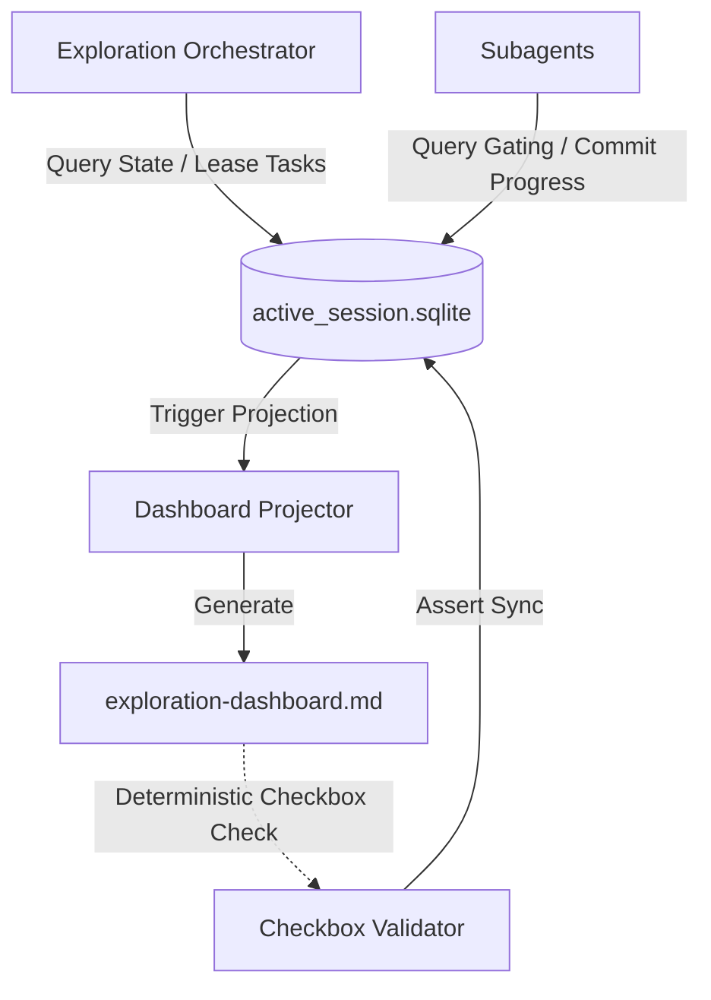

# Design Specification: Hardened Control Plane, Sandboxing, and Critical Security Patches v1.3

## 1. Executive Summary

This design specification details the architecture, schemas, and hardening measures for the **Control Plane, Sandboxing, and Critical Security Patches v1.3** in the Agentic OS ecosystem. It consolidates the findings of the Red Team audits (Opus and GPT-5.5) to patch vulnerabilities, move system state from human-editable markdown to a local transactional SQLite database, and enforce macOS-compatible process-level capability sandboxing.

---

## 2. Phase 0: Critical Security Hotfixes

Prior to database migration, the following pre-existing vulnerabilities in `agent-agentic-os` and `exploration-cycle-plugin` must be resolved.

### 2.1. `update_memory.py` Lockless State Write & Fallback Bypass
- **Vulnerabilities (C-1, C-3)**: `update_memory.py` performs a lockless read-modify-write on `os-state.json`, clobbering updates written by the kernel under lock. Additionally, if `kernel.py` is missing, it falls back to direct append to `events.jsonl` with no write locks, validation, or size caps.
- **Fix**: Remove the fallback code path entirely. If `kernel.py` is not found, the hook fails closed immediately. Route state modifications through `kernel.py state_update` via `sys.executable` to ensure spinlock acquisition.

### 2.2. TOCTOU Lock Theft in `_spinlock` & PID Recycling
- **Vulnerabilities (C-2, L-1)**: Spinlock cleanup removes stale lock directories non-atomically. If Spinner B acquires the lock during Spinner A's cleanup, Spinner A will delete Spinner B's `meta.json` and rmdir the lock, causing a double-acquisition window.
- **Fix**: Implement `_safe_clear_stale` which reads PID from `meta.json`, checks if that process is active, double-checks the meta file's integrity, and cleans up only if verification passes. Verify process start times using `ps` to prevent recycled PID collisions.

### 2.3. Event Size Check & Rotation Race Check
- **Vulnerability (H-1)**: Emitters check size and perform rotation before acquiring the write lock, creating a TOCTOU race.
- **Fix**: Move the file size check and rename operations entirely inside the `events_write.lock` transaction block, eliminating `events_rotate.lock`.

### 2.4. Default Privilege Level & Multi-Block Frontmatter Injection
- **Vulnerabilities (H-2, M-1 / C-NEW-4)**: `dispatch.py` defaults to Tier 1, appending `--dangerously-skip-permissions` to Claude CLI. Regex frontmatter stripping only removes the first block, allowing injected YAML frontmatter blocks to bypass filters.
- **Fix**: Invert the default risk level to Tier 2 (require confirmation prompts). Implement a strict frontmatter parser that only strips YAML blocks starting at byte 0, bounded by `---`, and ending before the first non-frontmatter heading. Add a frontmatter injection detector that fails closed if a secondary YAML-like block is detected after the body begins.

### 2.5. Evaluator Baseline Integrity & Symlink Trace Spoofing
- **Vulnerabilities (H-3, L-2)**: Baseline runs bypass SHA256 integrity verification. Predictable trace filenames are vulnerable to symlink redirection attacks.
- **Fix**: Verify files against `git HEAD` during baseline runs to check for uncommitted changes. Open trace files using `os.O_CREAT | os.O_EXCL | os.O_NOFOLLOW` with random nonces on name collision.

---

## 3. The SQLite Control Plane & Schema (Phase 1)

All active session state is migrated from `exploration-dashboard.md` to `active_session.sqlite`, located at a project-scoped context path: `${CLAUDE_PROJECT_DIR}/context/exploration/active_session.sqlite` (C-NEW-2). The path is added to `.gitignore`. Dashboard markdown files will serve as read-only projections.



### 3.1. Database Schema
```sql
CREATE TABLE IF NOT EXISTS sessions (
    id TEXT PRIMARY KEY,
    session_name TEXT NOT NULL,
    status TEXT CHECK(status IN ('in_progress', 'complete', 'suspended')) DEFAULT 'in_progress',
    awaiting_human_validation BOOLEAN DEFAULT 0,
    premium_calls_used INTEGER DEFAULT 0,
    parallel_agents_running INTEGER DEFAULT 0,
    review_passes_used INTEGER DEFAULT 0,
    created_at TIMESTAMP DEFAULT CURRENT_TIMESTAMP,
    updated_at TIMESTAMP DEFAULT CURRENT_TIMESTAMP
);

CREATE TABLE IF NOT EXISTS tasks (
    id TEXT PRIMARY KEY,
    session_id TEXT NOT NULL,
    phase_ordinal INTEGER NOT NULL,
    phase_name TEXT NOT NULL,
    component_name TEXT NOT NULL,
    status TEXT CHECK(status IN ('pending', 'leased', 'complete', 'failed')) DEFAULT 'pending',
    assigned_subagent_id TEXT DEFAULT NULL,
    version INTEGER DEFAULT 1, -- Optimistic concurrency token
    payload_hash TEXT DEFAULT NULL,
    lease_expires_at TIMESTAMP DEFAULT NULL,
    leased_at TIMESTAMP DEFAULT NULL,
    completed_at TIMESTAMP DEFAULT NULL,
    retry_count INTEGER DEFAULT 0,
    last_error TEXT DEFAULT NULL,
    updated_at TIMESTAMP DEFAULT CURRENT_TIMESTAMP,
    FOREIGN KEY(session_id) REFERENCES sessions(id)
);

CREATE TABLE IF NOT EXISTS approvals (
    id TEXT PRIMARY KEY,
    session_id TEXT NOT NULL,
    phase TEXT NOT NULL,
    approved_actions TEXT NOT NULL,      -- JSON list of approved actions
    allowed_paths TEXT NOT NULL,        -- JSON list of read/write glob paths
    spec_hash TEXT NOT NULL,            -- Hash of the specification document
    spec_source_path TEXT NOT NULL,     -- File path of the spec document
    is_active BOOLEAN DEFAULT 1,        -- Revocation flag
    created_at TIMESTAMP DEFAULT CURRENT_TIMESTAMP,
    used_at TIMESTAMP DEFAULT NULL,
    revoked_at TIMESTAMP DEFAULT NULL,
    revocation_reason TEXT DEFAULT NULL,
    expires_at TIMESTAMP NOT NULL,
    FOREIGN KEY(session_id) REFERENCES sessions(id),
    CHECK(expires_at <= datetime(created_at, '+1 hour')) -- Cap TTL to max 1 hour
);

CREATE TABLE IF NOT EXISTS artifacts (
    id TEXT PRIMARY KEY,
    task_id TEXT NOT NULL,
    path TEXT NOT NULL,
    original_sha256 TEXT NOT NULL,
    sanitized_sha256 TEXT NOT NULL,
    sanitizer_version TEXT NOT NULL,
    sanitization_report TEXT NOT NULL,
    artifact_type TEXT NOT NULL,
    created_by TEXT NOT NULL,
    created_at TIMESTAMP DEFAULT CURRENT_TIMESTAMP,
    FOREIGN KEY(task_id) REFERENCES tasks(id)
);

CREATE TABLE IF NOT EXISTS reviews (
    id TEXT PRIMARY KEY,
    artifact_id TEXT NOT NULL,
    reviewer TEXT NOT NULL,
    review_type TEXT CHECK(review_type IN ('spec_alignment', 'code_quality', 'runtime_observer', 'semantic_drift', 'domain_purity')) NOT NULL,
    verdict TEXT CHECK(verdict IN ('pass', 'fail', 'warning')) NOT NULL,
    artifact_sha256 TEXT NOT NULL,
    created_at TIMESTAMP DEFAULT CURRENT_TIMESTAMP,
    FOREIGN KEY(artifact_id) REFERENCES artifacts(id)
);

CREATE TABLE IF NOT EXISTS dispatches (
    id TEXT PRIMARY KEY,
    task_id TEXT NOT NULL,
    approval_id TEXT,
    envelope_hash TEXT NOT NULL,
    status TEXT CHECK(status IN ('queued', 'running', 'complete', 'failed', 'rejected')) NOT NULL,
    created_at TIMESTAMP DEFAULT CURRENT_TIMESTAMP,
    updated_at TIMESTAMP DEFAULT CURRENT_TIMESTAMP,
    FOREIGN KEY(task_id) REFERENCES tasks(id),
    FOREIGN KEY(approval_id) REFERENCES approvals(id)
);

CREATE TABLE IF NOT EXISTS policy_decisions (
    id TEXT PRIMARY KEY,
    dispatch_id TEXT NOT NULL,
    decision TEXT CHECK(decision IN ('allow', 'deny', 'defer')) NOT NULL,
    reason_code TEXT NOT NULL,
    created_at TIMESTAMP DEFAULT CURRENT_TIMESTAMP,
    FOREIGN KEY(dispatch_id) REFERENCES dispatches(id)
);
```

### 3.2. Concurrency Safety & Network FS Check
To handle high write contention:
1. **WAL mode check**: Initialize with `PRAGMA journal_mode=WAL;`. If the WAL mode setup fails (e.g. because of filesystem constraints), fail closed and abort immediately since concurrency guarantees cannot be met.
2. **Busy Timeout**: Configure `PRAGMA busy_timeout=5000;`.
3. **Write Retries**: Implement an exponential backoff loop for `BEGIN IMMEDIATE` operations (up to 5 retries).
4. **Task-Hijacking Prevention**: Mutate task status with leased validation filters (GPT-5.5 Critique 1):
   ```sql
   UPDATE tasks
   SET status = 'complete',
       payload_hash = ?,
       version = version + 1,
       completed_at = CURRENT_TIMESTAMP
   WHERE id = ?
     AND status = 'leased'
     AND assigned_subagent_id = ?
     AND version = ?
   ```

### 3.3. Deterministic Dashboard Validator & Projector
- Avoid parsing checkbox markdown using LLM text comprehension.
- Implement a regex-based checkbox parser inside `state_engine.py` to deterministically validate markdown checkboxes against the database status and halt if discrepancies are found.
- Projector: The markdown dashboard is rendered as a read-only projection from SQLite. If manual edit/drift is detected, regenerate from the DB. Only halt if manual edits or regeneration fails.

### 3.4. One-Time Migration Strategy
- Create a migration utility that parses any existing `exploration-dashboard.md` in active sessions, inserts the session/task rows into SQLite, and renames the old file to `.md.migrated`.

---

## 4. Scoped Sandboxing & HMAC Envelope Validation (Phase 2)

### 4.1. macOS Sandboxing & Process Hygiene (`sandbox_runner.py`)
Provides two-tiered execution boundaries:
1. **Process Hygiene Mode (Default - Not a Security Boundary)**: Clears `os.environ` and runs subprocesses with `shell=False`, passing only an explicit whitelist: `PATH`, `HOME`, `TMPDIR`, `LANG`, `LC_ALL`. Explicitly blocks system parameters: `PYTHONPATH`, `PYTHONSTARTUP`, `PYTHONHOME`, `LD_PRELOAD`, `DYLD_INSERT_LIBRARIES`, `DYLD_LIBRARY_PATH`, `NODE_OPTIONS`, `NODE_PATH`.
2. **Containerized Sandbox (Optional)**: If Podman or Docker is available, wraps execution inside a read-only container with `--network=none`, CPU/memory limits (`--cpus=1.0`, `--memory=512m`), and restricted folder mounts. Supports `podman` as primary and `docker` as fallback.
3. **macOS Container Lifecycle & Cleanup**: Track container IDs using labels (`agentic_os_session=<id>`, `agentic_os_dispatch=<id>`). Stale containers are removed on start/shutdown.
4. **Graceful Timeout & Orphan Tracking**: Terminates processes exceeding 300 seconds using `SIGTERM` first (10-second grace window) before executing a final `SIGKILL`. Enforces process tracking to terminate orphans if the parent exits.

### 4.2. HMAC Signed Envelopes
All messages on the local dispatch bus are validated using timing-safe SHA256 HMAC tokens:
- **Timing-Safe Checks**: Validate tokens using `hmac.compare_digest()`.
- **Key File Storage (Option B)**: Derive session keys using `os.urandom(32)` at session start. Save the key to `${CLAUDE_PROJECT_DIR}/context/exploration/.secrets/session_hmac.key` with permissions `0600` (readable/writable only by owner). Rotate per session and delete on close.
- **Nonce Bounds**: Track message nonces inside a size-capped cache to prevent memory bloat.

### 4.3. Economic Loop Constraints
Enforce budget controls directly inside `state_engine.py` during leasing queries:
- Query active parallel tasks and block if `parallel_agents_running >= max_parallel_agents` (default 2).
- Query session premium call count and block if `premium_calls_used >= max_premium_calls_per_phase` (default 1).
- Invalidate/reject dispatches if the artifact has been modified since its associated review hash was recorded.

---

## 5. Approaches & Trade-Off Analysis

A formal Architecture Decision Record (ADR) will be compiled under `docs/adr/ADR-001-sqlite-path-strategy.md` to analyze path allocation and error recovery options.

| Dimension | Approach A: Dynamic Path | Approach B: Fixed Path + Fallback | Approach C: Hardened Fixed Path & Fail-Closed (Selected) |
| :--- | :--- | :--- | :--- |
| **Path Allocation** | Dynamically allocated per session. | Fixed path with dynamic fallback to `/tmp` on lock. | Fixed path: `${CLAUDE_PROJECT_DIR}/context/exploration/active_session.sqlite`. |
| **Gating Security** | Low: Dynamic directory permissions are hard to secure. | Critical Failure: Bypassing paths opens holes to split-brain drift and injection. | Maximum: Fail-closed guarantees execution halts on permission/write failure. |
| **Transactional Concurrency** | Prone to file lock errors under concurrent runs. | Silent state drift occurs on fallback paths. | Enforced busy timeout (5000ms) and retry loops handle concurrent writer access. |

---

## 6. Verification & Implementation Roadmap

1. **Phase 0 Hotfixes**: Patch `update_memory.py`, `kernel.py`, `evaluate.py`, and `dispatch.py`.
2. **SQLite State Setup**: Create `state_engine.py` with tables, WAL check, retry loop, and projector. Include Task 2.0 migration script.
3. **Sandboxing & Envelopes**: Create `sandbox_runner.py` with environment whitelist, timeouts, and HMAC token validation.
4. **Integration & Audit**: Refactor `dispatch.py` and `SKILL.md` to lease tasks, verify approvals, and project dashboard. Run `audit.py` to confirm compliance.
