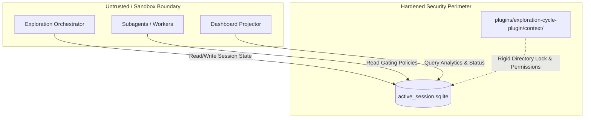

# Design Specification: Hardened Control Plane, Sandboxing, and Critical Security Patches v1.2

## 1. Executive Summary

This design specification details the architecture and hardening measures for the **Control Plane, Sandboxing, and Critical Security Patches v1.2** in the Agentic OS ecosystem. 

To prevent split-brain state drift, guarantee secure gating, and avoid security-bypass vulnerabilities, we establish a rigid, deterministic system of record. The primary control plane state will transition to a hardened SQLite database residing at a fixed path relative to the plugin root. Under no circumstances will fallback paths or soft failures be permitted; if the target control plane is unavailable or non-writable, the system will execute a fail-closed sequence, terminating all active orchestration cycles immediately.

---

## 2. System Architecture & Component Interactions

The hardened control plane guarantees that all orchestrators, subagents, and dashboard projectors interact with a single, highly-secured, transactional database.



### Component Roles
1. **Exploration Orchestrator**: The primary conductor of exploration cycles. It writes session state, step history, and gating metadata directly to the SQLite database.
2. **Subagents**: Execute specific, bounded tasks in sandboxed subprocesses. They read active gating rules and validation criteria from the control plane database to ensure dynamic security limits are enforced.
3. **Dashboard Projectors**: Project near real-time telemetry and state changes to external views. They query the SQLite database via read-only transactions.

---

## 3. Core Technical Decisions

### 3.1. SQLite Control Plane Database
- **Fixed Database Path**: The control plane resides strictly at `plugins/exploration-cycle-plugin/context/active_session.sqlite`.
- **No Dynamic / Fallback Paths**: Dynamic session directories or temporary directories (e.g., `/tmp` or OS-specific cache directories) are prohibited to eliminate split-brain anomalies and security-bypass vectors.
- **Single-System-of-Record**: Standardizes telemetry, transaction logs, and checkpointing for orchestrators, subagents, and monitoring projectors.

### 3.2. Directory Gating & Write Validation
- Prior to database initialization or connection, the plugin environment must perform an explicit write verification check on `plugins/exploration-cycle-plugin/context/`.
- If the directory does not exist, it is created with strict user-only read/write/execute permissions (`0700`).
- If the directory is read-only, lacks adequate disk space, or is otherwise non-writable, the control plane raises a `HardenedControlPlaneWriteError` and halts the process.

---

## 4. Hardened Security Gating & Error Handling

### 4.1. Fail-Closed Gating
We strictly enforce a "fail-closed" security posture. If the control plane database becomes corrupt, unwritable, or locked:
1. **Immediate Execution Halt**: Raise an uncatchable fatal exception.
2. **Subprocess Termination**: Send `SIGKILL` to all active child processes and sandboxed tasks.
3. **Transaction Rollback**: Any uncommitted changes are discarded to maintain absolute state integrity.
4. **No Fallback Gating**: A backup or fallback database path is **explicitly rejected** as it violates strict state gating guarantees and allows attackers to bypass security enforcement.

### 4.2. Concrete Exception Class
```python
class HardenedControlPlaneWriteError(Exception):
    """
    Raised when the designated SQLite control plane directory/file is not writable.
    Triggers an immediate, fail-closed system termination to prevent security bypass.
    """
    pass
```

---

## 5. Approaches & Trade-Off Analysis

During the design phase, three primary architectural patterns for database location and error recovery were evaluated:

| Dimension / Metric | Approach A: Dynamic Session Directory | Approach B: Fixed Path with Fallback Path | Approach C: Hardened Fixed Path & Fail-Closed (Selected) |
| :--- | :--- | :--- | :--- |
| **Database Path** | Dynamically allocated per session (e.g., `context/sessions/session_xyz.sqlite`). | Fixed path with dynamic fallback to `/tmp` if non-writable. | Fixed relative path: `plugins/exploration-cycle-plugin/context/active_session.sqlite`. |
| **Availability Risk** | **High**: Hard to coordinate state between independent subagents and external dashboard projectors. | **Medium**: Avoids crashes but introduces state synchronization gaps. | **Low**: High visibility; guarantees single system of record. |
| **Security Integrity** | **Low**: Difficult to apply consistent OS-level access control controls dynamically. | **Critical Violation**: Opens doors to security-bypass and split-brain attacks. | **Maximum**: Fail-closed ensures no operation proceeds under unvalidated environments. |
| **Operational Impact** | Complex path negotiation required for every subagent startup. | High chance of silent state drift and data loss. | Direct, predictable, and robust. Requires writable local disk structure. |

---

## 6. Implementation Checklist & Verification

1. **Permissions Gating Check**:
   Implement synchronous check before opening the database:
   ```python
   import os
   
   db_dir = "plugins/exploration-cycle-plugin/context"
   os.makedirs(db_dir, exist_ok=True)
   
   # Explicit write permission validation
   if not os.access(db_dir, os.W_OK | os.X_OK):
       raise HardenedControlPlaneWriteError(
           f"Security Gate Failure: Control plane directory '{db_dir}' is not writable. Fail-closed triggered."
       )
   ```

2. **SQLite WAL Mode & Locking**:
   - Enable **Write-Ahead Logging (WAL)** for high concurrency across the orchestrator and projectors.
   - Use strict `IMMEDIATE` transaction locking to prevent write collisions and deadlocks.
