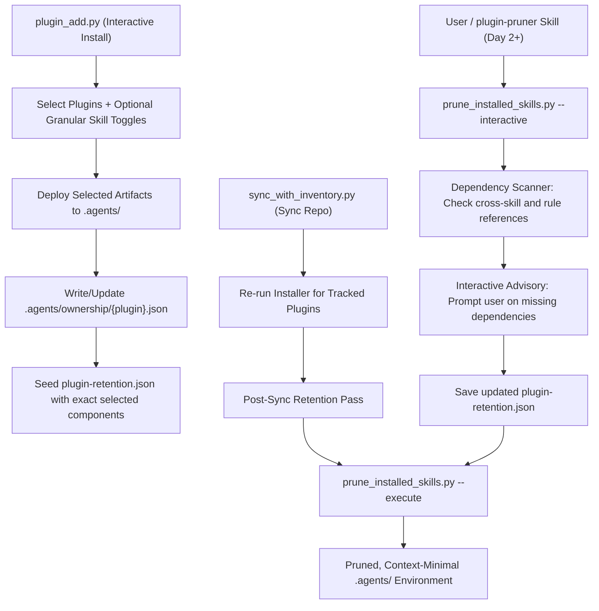

# Design Specification: Component Retention Pruner & Progressive Disclosure Architecture

**Date:** 2026-09-11  
**Status:** Approved for Implementation Planning  
**Target Plugins:** `plugins/plugin-manager/`, `plugins/agent-scaffolders/`

---

## 1. Executive Summary

As the plugin ecosystem grows across platforms, installing full plugins can introduce dozens of skills, sub-agents, and rules into the target repository's `.agents/` environment, substantially increasing model context size, token consumption, and cognitive load.

This specification introduces:
1. **Granular Install-Time Selection (Day 1)**: `plugin_add.py` interactive prompt allows users to check/uncheck specific skills within each selected plugin (defaulting all checked), avoiding installing unwanted components in the first place.
2. **Component Retention Lifecycle**: A unified manifest (`plugin-retention.json`) and template (`assets/templates/plugin-retention.template.json`) enabling users to track, version, and enforce exact retained skills, rules, and agents.
3. **`plugin-pruner` Skill & Tool (Day 2+)**: A deterministic Python engine (`prune_installed_skills.py`) in `plugins/plugin-manager/` that performs interactive selection, dependency-aware advisory warnings, and safe physical pruning on an already-populated environment.
4. **Installer & Syncer Integration**: Seeding `plugin-retention.json` from installation choices, and automatically enforcing retention boundaries during `sync_with_inventory.py`.
5. **Progressive Disclosure & Deterministic-First Refactoring**: Applying the Crow architecture patterns (`crow-agent-skill-authoring`) to create ultra-lean `SKILL.md` routers ($\le 60$ lines) with conditional module loading across `plugin-manager` and `agent-scaffolders` (`create-skill`, `audit-skill`), while preserving all self-healing, TDD gates, and evolution invariants.

---

## 2. Retention Architecture & Lifecycle



### 2.1 Manifest Schema (`plugin-retention.json`)
The manifest lives at the repository root and is tracked in version control:

```json
{
  "version": 1,
  "updated_at": "2026-09-11T09:00:00Z",
  "protected_defaults": [
    "plugin-installer",
    "plugin-remover",
    "plugin-syncer",
    "plugin-pruner",
    "symlink-manager",
    "worktree-manager"
  ],
  "retained": {
    "skills": [
      "plugin-installer",
      "plugin-remover",
      "plugin-syncer",
      "plugin-pruner",
      "symlink-manager",
      "worktree-manager"
    ],
    "rules": [
      "plugin-architecture-policy.md",
      "test-driven-development.md"
    ],
    "agents": []
  }
}
```

### 2.2 Installer Integration (`plugin_add.py` / `plugin_installer.py`)
- Reads the generated `.agents/ownership/<plugin>.json`.
- Merges all newly installed skills into `retained.skills`, rules into `retained.rules`, and agents into `retained.agents`.
- Prints a clear user message advising that `plugin-pruner` is available to trim unneeded components.

### 2.3 Syncer Integration (`sync_with_inventory.py`)
- After synchronizing all plugins from `plugin-sources.json`, `sync_with_inventory.py` checks if `plugin-retention.json` exists.
- If present, it executes:
  ```bash
  python3 plugins/plugin-manager/scripts/prune_installed_skills.py --manifest plugin-retention.json --execute --confirm-token PRUNE-INSTALLED-SKILLS
  ```
- Supports a `--no-prune` flag to allow dry synchronization when desired.

---

## 3. `plugin-pruner` Skill & Engine Specification

### 3.1 Deterministic Script (`prune_installed_skills.py`)
Located canonically at `plugins/plugin-manager/scripts/prune_installed_skills.py`:
1. **Interactive Multiselect TUI (Plugin-by-Plugin / Grouped)**:
   - Uses the established zero-dependency terminal TUI (`_read_key`, ANSI rendering, arrow keys, space-to-toggle, `/` search, `a` toggle-all, `Enter` confirm) mirroring `plugin_add.py` and `plugin_remove.py`.
   - Iterates plugin by plugin (or presents a grouped view):
     - Displays all skills, rules, and agents owned by that plugin (sourced from `.agents/ownership/<plugin>.json`).
     - Pre-checks checkboxes (`[x]`) for components currently marked as retained in `plugin-retention.json`.
     - The user navigates with arrow keys and hits `Space` to untoggle skills or rules they no longer need.
2. **Safety Confirmation & Execution Token**: Requires `--confirm-token PRUNE-INSTALLED-SKILLS` when `--execute` is specified; otherwise operates in dry-run mode or prompts for interactive confirmation.
3. **Protected Defaults**: Protects core management tools (`plugin-installer`, `plugin-remover`, `plugin-syncer`, `plugin-pruner`, `symlink-manager`, `worktree-manager`) from deletion.
4. **Dependency Advisory Engine**:
   - Parses `SKILL.md` content and frontmatter of all retained skills.
   - Identifies referenced rules in `.agent/rules/` or `rules/`.
   - Identifies companion skills referenced in prompts or instructions.
   - When a user untoggles a component that another retained component references, the TUI renders an inline advisory:
     `[ADVISORY] Rule 'plugin-architecture-policy.md' is referenced by retained skill 'plugin-pruner'. Retain this rule? [Y/n]`
5. **Physical Pruning & Lock Cleanup**:
   - Deletes unselected directories in `.agents/skills/`.
   - Deletes unselected markdown files in `.agent/rules/`.
   - Deletes unselected agent manifests in `.agents/agents/`.
   - Updates `skills-lock.json` and `plugin-retention.json`.

### 3.2 Hub-and-Spoke & Symlink Layout
Per ADR-002 and ADR-003:
- Canonical script: `plugins/plugin-manager/scripts/prune_installed_skills.py`
- Spoke script: `plugins/plugin-manager/skills/plugin-pruner/scripts/prune_installed_skills.py`
- Canonical template: `plugins/plugin-manager/assets/templates/plugin-retention.template.json`
- Spoke template: `plugins/plugin-manager/skills/plugin-pruner/assets/templates/plugin-retention.template.json`
- Canonical diagram: `plugins/plugin-manager/references/retention-workflow.md`
- Spoke diagram: `plugins/plugin-manager/skills/plugin-pruner/references/retention-workflow.md`
- All registered in `symlinks.json` and validated via `symlink_manager.py`.

---

## 4. Progressive Disclosure & Continuous Evolution

### 4.1 Refactoring `plugin-manager` Skills
All skills in `plugin-manager` (`plugin-installer`, `plugin-remover`, `plugin-syncer`, and `plugin-pruner`):
- `SKILL.md` limited to $\le 50$ lines acting strictly as a workflow router.
- Background documentation, platform caveats, and manual recovery steps moved to `references/`.

### 4.2 Enhancing `agent-scaffolders` (`create-skill` & `audit-skill`)
1. **`create-skill`**:
   - `SKILL.md` trimmed from 189 lines to $\le 60$ lines.
   - Discovery interview script extracted to `references/discovery-interview.md`.
   - Platform capability notes extracted to `references/platform-primitives.md`.
   - New skills generated by `create-skill` will follow the progressive disclosure layout by default.
2. **`audit-skill` & `audit_skill.py`**:
   - Automated check in `audit_skill.py` enforces Progressive Disclosure:
     - Warning if `SKILL.md` exceeds 80 lines.
     - Verification that static templates and deep documentation are stored in `assets/` and `references/`.
   - Preserves all 6 alignment invariants and the `--fix` self-healing engine.

---

## 5. Verification & Test Plan

1. **Unit & Functional Tests**:
   - `tests/test_prune_installed_skills.py`: Tests allowlist loading, dependency detection, dry-run safety, and confirmed execution.
   - `tests/test_retention_lifecycle.py`: Tests `plugin_add.py` seeding and `sync_with_inventory.py` post-sync pruning.
2. **Structural Invariant Audits**:
   - `python3 .agents/skills/symlink-manager/scripts/symlink_manager.py diagnose` -> 0 broken links or imposter files.
   - `python3 plugins/agent-scaffolders/scripts/audit.py --path plugins/plugin-manager` -> PASS.
   - `python3 plugins/agent-scaffolders/scripts/audit_plugin_structure.py plugins/plugin-manager` -> PASS.
   - `python3 plugins/agent-scaffolders/scripts/audit_skill.py plugins/plugin-manager/skills/plugin-pruner` -> 100% PASS.
3. **Runtime Deployment**:
   - Reinstall updated plugins into `.agents/`:
     `python3 plugins/plugin-manager/scripts/plugin_add.py plugins/plugin-manager -y`
     `python3 plugins/plugin-manager/scripts/plugin_add.py plugins/agent-scaffolders -y`
