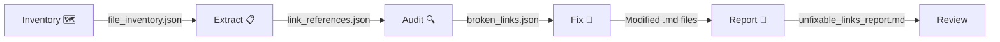

# Red Team Review: Link Checker Plugin Hardening
**Generated:** 2026-03-29 14:18:45

Security and architectural audit of the newly standardized 5-step link-checking pipeline.

### 📊 Bundle Metadata
- **Total Files:** 23
- **Estimated Tokens:** ~11,632

---

## 📑 Index
1. `plugins/link-checker/.claude-plugin/plugin.json` (132 tokens | 132 total) - Target: The complete Link Checker plugin folder. (from plugins/link-checker/)
2. `plugins/link-checker/README.md` (898 tokens | 1,030 total) - Target: The complete Link Checker plugin folder. (from plugins/link-checker/)
3. `plugins/link-checker/agents/link-checker-agent.md` (795 tokens | 1,825 total) - Target: The complete Link Checker plugin folder. (from plugins/link-checker/) [symlink → plugins/link-checker/skills/link-checker-agent/SKILL.md]
4. `plugins/link-checker/assets/diagrams/link-checker-workflow.mmd` (242 tokens | 2,067 total) - Target: The complete Link Checker plugin folder. (from plugins/link-checker/)
5. `plugins/link-checker/assets/diagrams/logic.mmd` (209 tokens | 2,276 total) - Target: The complete Link Checker plugin folder. (from plugins/link-checker/)
6. `plugins/link-checker/assets/diagrams/workflow.mmd` (249 tokens | 2,525 total) - Target: The complete Link Checker plugin folder. (from plugins/link-checker/)
7. `plugins/link-checker/references/best-practices.md` (506 tokens | 3,031 total) - Target: The complete Link Checker plugin folder. (from plugins/link-checker/)
8. `plugins/link-checker/references/docs_index.md` (184 tokens | 3,215 total) - Target: The complete Link Checker plugin folder. (from plugins/link-checker/)
9. `plugins/link-checker/references/link-checker-standards.md` (416 tokens | 3,631 total) - Target: The complete Link Checker plugin folder. (from plugins/link-checker/)
10. `plugins/link-checker/references/specification.md` (1,208 tokens | 4,839 total) - Target: The complete Link Checker plugin folder. (from plugins/link-checker/)
11. `plugins/link-checker/requirements.txt` (47 tokens | 4,886 total) - Target: The complete Link Checker plugin folder. (from plugins/link-checker/)
12. `plugins/link-checker/scripts/01_build_file_inventory.py` (606 tokens | 5,492 total) - Target: The complete Link Checker plugin folder. (from plugins/link-checker/)
13. `plugins/link-checker/scripts/02_extract_link_references.py` (1,006 tokens | 6,498 total) - Target: The complete Link Checker plugin folder. (from plugins/link-checker/)
14. `plugins/link-checker/scripts/03_audit_broken_links.py` (970 tokens | 7,468 total) - Target: The complete Link Checker plugin folder. (from plugins/link-checker/)
15. `plugins/link-checker/scripts/04_autofix_unique_links.py` (1,616 tokens | 9,084 total) - Target: The complete Link Checker plugin folder. (from plugins/link-checker/)
16. `plugins/link-checker/scripts/05_report_unfixable_links.py` (650 tokens | 9,734 total) - Target: The complete Link Checker plugin folder. (from plugins/link-checker/)
17. 🔗 `plugins/link-checker/skills/link-checker-agent/SKILL.md` - *[Symlink — content already included from `plugins/link-checker/skills/link-checker-agent/SKILL.md`]*
18. `plugins/link-checker/skills/link-checker-agent/acceptance-criteria.md` (489 tokens | 10,223 total) - Target: The complete Link Checker plugin folder. (from plugins/link-checker/)
19. 🔗 `plugins/link-checker/skills/link-checker-agent/assets/diagrams/link-checker-workflow.mmd` - *[Symlink — content already included from `plugins/link-checker/assets/diagrams/link-checker-workflow.mmd`]*
20. 🔗 `plugins/link-checker/skills/link-checker-agent/assets/diagrams/logic.mmd` - *[Symlink — content already included from `plugins/link-checker/assets/diagrams/logic.mmd`]*
21. 🔗 `plugins/link-checker/skills/link-checker-agent/assets/diagrams/workflow.mmd` - *[Symlink — content already included from `plugins/link-checker/assets/diagrams/workflow.mmd`]*
22. `plugins/link-checker/skills/link-checker-agent/evals/evals.json` (786 tokens | 11,009 total) - Target: The complete Link Checker plugin folder. (from plugins/link-checker/)
23. `plugins/link-checker/skills/link-checker-agent/fallback-tree.md` (522 tokens | 11,531 total) - Target: The complete Link Checker plugin folder. (from plugins/link-checker/)
24. 🔗 `plugins/link-checker/skills/link-checker-agent/references/acceptance-criteria.md` - *[Symlink — content already included from `plugins/link-checker/skills/link-checker-agent/acceptance-criteria.md`]*
25. 🔗 `plugins/link-checker/skills/link-checker-agent/references/best-practices.md` - *[Symlink — content already included from `plugins/link-checker/references/best-practices.md`]*
26. 🔗 `plugins/link-checker/skills/link-checker-agent/references/docs_index.md` - *[Symlink — content already included from `plugins/link-checker/references/docs_index.md`]*
27. 🔗 `plugins/link-checker/skills/link-checker-agent/references/fallback-tree.md` - *[Symlink — content already included from `plugins/link-checker/skills/link-checker-agent/fallback-tree.md`]*
28. 🔗 `plugins/link-checker/skills/link-checker-agent/references/link-checker-standards.md` - *[Symlink — content already included from `plugins/link-checker/references/link-checker-standards.md`]*
29. 🔗 `plugins/link-checker/skills/link-checker-agent/references/link-checker-workflow.mmd` - *[Symlink — content already included from `plugins/link-checker/assets/diagrams/link-checker-workflow.mmd`]*
30. 🔗 `plugins/link-checker/skills/link-checker-agent/references/logic.mmd` - *[Symlink — content already included from `plugins/link-checker/assets/diagrams/logic.mmd`]*
31. 🔗 `plugins/link-checker/skills/link-checker-agent/references/specification.md` - *[Symlink — content already included from `plugins/link-checker/references/specification.md`]*
32. 🔗 `plugins/link-checker/skills/link-checker-agent/references/workflow.mmd` - *[Symlink — content already included from `plugins/link-checker/assets/diagrams/workflow.mmd`]*
33. 🔗 `plugins/link-checker/skills/link-checker-agent/requirements.txt` - *[Symlink — content already included from `plugins/link-checker/requirements.txt`]*
34. 🔗 `plugins/link-checker/skills/link-checker-agent/scripts/01_build_file_inventory.py` - *[Symlink — content already included from `plugins/link-checker/scripts/01_build_file_inventory.py`]*
35. 🔗 `plugins/link-checker/skills/link-checker-agent/scripts/02_extract_link_references.py` - *[Symlink — content already included from `plugins/link-checker/scripts/02_extract_link_references.py`]*
36. 🔗 `plugins/link-checker/skills/link-checker-agent/scripts/03_audit_broken_links.py` - *[Symlink — content already included from `plugins/link-checker/scripts/03_audit_broken_links.py`]*
37. 🔗 `plugins/link-checker/skills/link-checker-agent/scripts/04_autofix_unique_links.py` - *[Symlink — content already included from `plugins/link-checker/scripts/04_autofix_unique_links.py`]*
38. 🔗 `plugins/link-checker/skills/link-checker-agent/scripts/05_report_unfixable_links.py` - *[Symlink — content already included from `plugins/link-checker/scripts/05_report_unfixable_links.py`]*
39. `plugins/link-checker/test-fixtures/docs/api/reference.md` (20 tokens | 11,551 total) - Target: The complete Link Checker plugin folder. (from plugins/link-checker/)
40. `plugins/link-checker/test-fixtures/docs/guide/setup.md` (23 tokens | 11,574 total) - Target: The complete Link Checker plugin folder. (from plugins/link-checker/)
41. `plugins/link-checker/test-fixtures/docs/index.md` (33 tokens | 11,607 total) - Target: The complete Link Checker plugin folder. (from plugins/link-checker/)
42. `plugins/link-checker/test-fixtures/src/main.py` (25 tokens | 11,632 total) - Target: The complete Link Checker plugin folder. (from plugins/link-checker/)

---

## File: `plugins/link-checker/.claude-plugin/plugin.json`
> Note: Target: The complete Link Checker plugin folder. (from plugins/link-checker/)

```json
{
    "name": "link-checker",
    "version": "2.0.0",
    "description": "Quality assurance agent for documentation link integrity. Checks, fixes, and audits documentation links across a repository using a deterministic Map-Fix-Verify workflow.",
    "author": {
        "name": "Richard Fremmerlid"
    },
    "repository": "https://github.com/richfrem/agent-plugins-skills",
    "license": "MIT",
    "keywords": [
        "links",
        "documentation",
        "validation",
        "auto-repair",
        "markdown"
    ]
}
```

---

## File: `plugins/link-checker/README.md`
> Note: Target: The complete Link Checker plugin folder. (from plugins/link-checker/)

````markdown
# Link Checker Plugin 🔗

Validate and auto-repair broken documentation links across your repository using
file inventory mapping and unique-basename matching.

## Installation

### Local Development
```bash
claude --plugin-dir ./plugins/link-checker
```

### From Marketplace (when published)
```
/plugin install link-checker
```

### Prerequisites
- **Claude Code** ≥ 1.0.33
- **Python** ≥ 3.8 (stdlib only — no pip dependencies)

### Verify Installation
With native plugins enabled, your agent autonomously detects the task and executes the required python scripts.

---

## Usage Guide

The autonomous agent executes a strict **5-Step Pipeline**: **Inventory → Extract → Audit → Fix → Report**

### Tell your agent:
```text
"Run the link checker to fix any broken documentation paths."
"Move docs/auth.md to docs/api/auth.md and run the link checker."
```

### Direct CLI Usage (without an Agent)
```bash
cd /path/to/your/repo

# Step 1: Build file inventory
python3 ./scripts/01_build_file_inventory.py

# Step 2: Extract all link references
python3 ./scripts/02_extract_link_references.py

# Step 3: Audit — identify broken links
python3 ./scripts/03_audit_broken_links.py

# Step 4: Auto-fix unique matches (preview first)
python3 ./scripts/04_autofix_unique_links.py --dry-run
python3 ./scripts/04_autofix_unique_links.py --backup

# Step 5: Report remaining unfixable links
python3 ./scripts/05_report_unfixable_links.py
```

### How the Fixer Works

1. Scans `.md` files for `[text](broken/path)` and `` patterns
2. Extracts the basename from broken paths
3. Looks up the basename in `file_inventory.json`
4. **Unique match** → rewrites with correct relative path
5. **Ambiguous** (multiple files with same name) → skips with warning
6. **Not found** → left as-is; appears in `unfixable_links_report.md`

### Safety Features
- Use `--dry-run` to preview all changes before any file is modified
- Use `--backup` to create `.bak` copies before modifying files
- Only modifies files listed in `broken_links.json` (from Step 3)
- Skips `README.md` basename matches (too ambiguous across repos)
- Preserves anchor fragments (`#section`)
- Skips links inside fenced code blocks
- Excludes `.git`, `node_modules`, `.venv`, `bin`, `obj` from scanning

---

## Architecture

See [workflow diagram](assets/diagrams/workflow.mmd) for the full 5-step flow.



Additional diagrams:
- [logic.mmd](assets/diagrams/logic.mmd) — Internal decision logic
- [workflow.mmd](assets/diagrams/workflow.mmd) — User workflow
- [link-checker-workflow.mmd](assets/diagrams/link-checker-workflow.mmd) — Full sequence diagram

### Plugin Directory Structure
```
link-checker/
├── .claude-plugin/
│   └── plugin.json              # Plugin identity
├── scripts/
│   ├── 01_build_file_inventory.py   # The Mapper
│   ├── 02_extract_link_references.py # The Extractor
│   ├── 03_audit_broken_links.py     # The Auditor
│   ├── 04_autofix_unique_links.py   # The Fixer
│   └── 05_report_unfixable_links.py # The Reporter
├── skills/
│   └── link-checker-agent/
│       ├── SKILL.md             # Auto-invoked QA skill
│       ├── scripts/             # Symlinks → ../../scripts/
│       └── references/          # Symlinks → ../../references/
└── README.md
```

---

## License

MIT

## Plugin Components

### Skills
- `link-checker-agent`
````

---

## File: `plugins/link-checker/agents/link-checker-agent.md`
> Note: Target: The complete Link Checker plugin folder. (from plugins/link-checker/) [symlink → plugins/link-checker/skills/link-checker-agent/SKILL.md]

````markdown
---
name: link-checker-agent
description: >
  Quality assurance agent for documentation link integrity. Auto-invoked when tasks
  involve checking, fixing, or auditing documentation links across a repository.
allowed-tools: Bash, Read, Write
---

# Identity: The Link Checker 🔗

You are the **Quality Assurance Operator**. Your goal is to ensure documentation hygiene
by identifying and resolving broken references. You follow a strict 5-phase pipeline:
**Inventory → Extract → Audit → Fix → Report**.

## 🛠️ The 5-Step Pipeline

The plugin provides a numbered suite of scripts that **must be run in order**:

| Step | Script | Role |
|:---|:---|:---|
| 1 | `01_build_file_inventory.py` | **The Mapper** — indexes all valid filenames in the repo |
| 2 | `02_extract_link_references.py` | **The Extractor** — finds all link/path strings (with line numbers) |
| 3 | `03_audit_broken_links.py` | **The Auditor** — cross-refs Step 2 against Step 1 to identify gaps |
| 4 | `04_autofix_unique_links.py` | **The Fixer** — auto-corrects unambiguous matches |
| 5 | `05_report_unfixable_links.py` | **The Reporter** — generates a structured review of remaining issues |

## 📂 Execution Protocol

### 1. Initialization (Mapping & Extraction)
Run the first two steps to build the knowledge base.
```bash
python3 scripts/01_build_file_inventory.py
python3 scripts/02_extract_link_references.py
```

### 2. Auditing
Identify what is broken. This produces `broken_links.log` and `broken_links.json`.
```bash
python3 scripts/03_audit_broken_links.py
```

### 3. Automated Repair
**Always verify the git working tree is clean before this step** (`git status`), so that `git restore .` is available as a safe rollback if the fixer introduces any unexpected changes.

Preview changes first, then apply:
```bash
python3 scripts/04_autofix_unique_links.py --dry-run
python3 scripts/04_autofix_unique_links.py --backup
```

### 4. Final Reporting
Generate the human-review report for ambiguous or truly missing files.
```bash
python3 scripts/05_report_unfixable_links.py
```
Review: Open `unfixable_links_report.md` to see items requiring manual intervention.

## ⚠️ Critical Rules
1. **Pipeline Order**: Do NOT skip steps. Steps 1 and 2 must complete before Step 3, and Step 3 must complete before Step 4.
2. **Step 4 reads `file_inventory.json`, not `broken_links.json`, for its lookup table**. If `broken_links.json` is missing, the fixer falls back to walking the entire repo — it will NOT halt. Always run Step 3 first to enable targeted fixing.
3. **CWD matters**: Run from the root of the repository you wish to scan.
4. **No Silent Failures**: If a link is Ambiguous (multiple files with the same name), the tool will NOT fix it. You must check the Step 5 report and resolve it manually.
5. **Verify git state before fixing**: Run `git status` to confirm a clean working tree before running Step 4. This ensures `git restore .` is a reliable rollback option.

## 📖 Progressive Disclosure
For detailed standards on what constitutes a "broken link" and common pathing pitfalls, see:
[Link Checking Standards](references/link-checker-standards.md)

---
*Maintained by the Agentic OS Quality Team*
````

---

## File: `plugins/link-checker/assets/diagrams/link-checker-workflow.mmd`
> Note: Target: The complete Link Checker plugin folder. (from plugins/link-checker/)

```mmd
flowchart TD
    subgraph Discovery [Phase 1: Setup]
        Start([Start Scan]) --> Mapper[01_build_file_inventory.py]
        Mapper -- \"Analyzes repo files\" --> Inv[(file_inventory.json)]
    end

    subgraph Extraction [Phase 2: Identification]
        Inv --> Extractor[02_extract_link_references.py]
        Extractor -- \"Finds all text links\" --> Refs[(link_references.json)]
    end

    subgraph Analysis [Phase 3: Auditing]
        Refs --> Auditor[03_audit_broken_links.py]
        Auditor -- \"Identifies broken refs\" --> Log[broken_links.log]
        Auditor --> Json[broken_links.json]
    end

    subgraph Repair [Phase 4: Fixing]
        Json --> Fixer[04_autofix_unique_links.py]
        Fixer -- \"Applies unique fixes\" --> ModDocs[Modified Files]
    end

    subgraph Finalize [Phase 5: Reporting]
        ModDocs --> Reporter[05_report_unfixable_links.py]
        Reporter -- \"Summarizes gaps\" --> Report[unfixable_links_report.md]
    end
```

---

## File: `plugins/link-checker/assets/diagrams/logic.mmd`
> Note: Target: The complete Link Checker plugin folder. (from plugins/link-checker/)

```mmd
flowchart TD
    subgraph Input [Stage 1: Documentation]
        Doc1[MD Files]
        Doc2[Source Files]
        Doc3[Asset References]
    end

    subgraph Discovery [Stage 2: Inventory]
        Mapper[01_build_file_inventory.py]
        Mapper -- Index --> Inv[(file_inventory.json)]
    end

    subgraph Extraction [Stage 3: Parsing]
        Extractor[02_extract_link_references.py]
        Extractor -- Parse --> Refs[(link_references.json)]
    end

    subgraph Logic [Stage 4: Auditing]
        Inv --> Auditor[03_audit_broken_links.py]
        Refs --> Auditor
        Auditor -- Cross-Ref --> Broken[(broken_links.json)]
    end

    subgraph Action [Stage 5: Remediation — Sequential]
        Broken --> Fixer[04_autofix_unique_links.py]
        Fixer -- Remaining issues --> Reporter[05_report_unfixable_links.py]
    end
```

---

## File: `plugins/link-checker/assets/diagrams/workflow.mmd`
> Note: Target: The complete Link Checker plugin folder. (from plugins/link-checker/)

```mmd
flowchart TD
    Start([User Needs Link Fixes]) --> Step1[01: Build File Inventory]
    Step1 --> Cmd1[/\"python 01_build_file_inventory.py\"/]
    Cmd1 -- \"Maps filename -> paths\" --> Inv[file_inventory.json]
    
    Inv --> Step2[02: Extract Link References]
    Step2 --> Cmd2[/\"python 02_extract_link_references.py\"/]
    Cmd2 -- \"Finds all link/path strings (with lines)\" --> Refs[link_references.json]
    
    Refs --> Step3[03: Audit Broken Links]
    Step3 --> Cmd3[/\"python 03_audit_broken_links.py\"/]
    Cmd3 -- \"Cross-refs Step 1 & 2\" --> Log[broken_links.log/json]
    
    Log --> Step4[04: Auto-Fix Unique Links]
    Step4 --> Cmd4[/\"python 04_autofix_unique_links.py\"/]
    Cmd4 -- \"Repairs unambiguous matches\" --> Fixed{Fixed?}
    
    Fixed --> Step5[05: Report Unfixable Links]
    Step5 --> Cmd5[/\"python 05_report_unfixable_links.py\"/]
    Cmd5 -- \"Groups remaining gaps\" --> Report[unfixable_links_report.md]
    
    Report --> Clean([Review & Done])
```

---

## File: `plugins/link-checker/references/best-practices.md`
> Note: Target: The complete Link Checker plugin folder. (from plugins/link-checker/)

````markdown
# Agent Skills Best Practices

Source: [agentskills.io](https://agentskills.io/skill-creation/best-practices.md)
Built with [Mintlify](https://mintlify.com)

---

# Best practices for skill creators

How to write skills that are well-scoped and calibrated to the task.

### Match specificity to fragility
**Give the agent freedom** when multiple approaches are valid and the task tolerates variation. For flexible instructions, explaining *why* can be more effective than rigid directives.

**Be prescriptive** when operations are fragile, consistency matters, or a specific sequence must be followed:

````markdown
## Database migration

Run exactly this sequence:
```bash
python scripts/migrate.py --verify --backup
```
Do not modify the command or add additional flags.
````

### Provide defaults, not menus
When multiple tools or approaches could work, pick a default and mention alternatives briefly rather than presenting them as equal options.

### Favor procedures over declarations
A skill should teach the agent *how to approach* a class of problems, not *what to produce* for a specific instance.

### Gotchas sections
The highest-value content in many skills is a list of gotchas — environment-specific facts that defy reasonable assumptions.

### Templates for output format
When you need the agent to produce output in a specific format, provide a template.

### Checklists for multi-step workflows
An explicit checklist helps the agent track progress and avoid skipping steps.

### Validation loops
Instruct the agent to validate its own work before moving on.

### Plan-validate-execute
For batch or destructive operations, have the agent create an intermediate plan in a structured format, validate it against a source of truth, and only then execute.

### Bundling reusable scripts
When iterating on a skill, if you notice the agent independently reinventing the same logic each run, that's a signal to write a tested script once and bundle it in `scripts/`.

---
Built with [Mintlify](https://mintlify.com)
````

---

## File: `plugins/link-checker/references/docs_index.md`
> Note: Target: The complete Link Checker plugin folder. (from plugins/link-checker/)

````markdown
# Agent Skills Documentation Index

Source: [agentskills.io](https://agentskills.io/llms.txt)
Built with [Mintlify](https://mintlify.com)

---

## Specification

> The complete format specification for Agent Skills.
> [Read Specification](specification.md)

## Best Practices

> How to write skills that are well-scoped and calibrated to the task.
> [Read Best Practices](best-practices.md)

## Lifecycle of a Skill

1. **Metadata**: The `name` and `description` fields are loaded at startup.
2. **Instructions**: The full `SKILL.md` body is loaded when the skill is activated.
3. **Execution**: Scripts are loaded as needed.
4. **References**: Documentation files are loaded as needed.

---
Built with [Mintlify](https://mintlify.com)
````

---

## File: `plugins/link-checker/references/link-checker-standards.md`
> Note: Target: The complete Link Checker plugin folder. (from plugins/link-checker/)

````markdown
# Link Checking Standards & Best Practices

This document outlines the standards for defining, extracting, and repairing broken link references.

## What is a "Broken Link"?

A broken link is any reference to a file or resource that cannot be resolved at the time of the scan. These generally fall into three categories:

1.  **Missing Resource**: The target file does not exist anywhere in the repository.
2.  **Incorrect Relative Path**: The file exists, but the relative path in the link (`../path/to/file.md`) is incorrect.
3.  **Invalid Absolute Reference**: A path starting with `/` that does not resolve relative to the repository root.

## Supported Reference Types

The Link Checker pipeline extracts and validates the following:

-   **Markdown Links**: `[Label](path/to/file.md)`
-   **Markdown Images**: ``
-   **Code Path References**: Strings that look like relative paths in source files (e.g., `import '../styles.css'`).

## Best Practices for Prevention

-   **Shift Left**: Run the link checker audit as a pre-commit hook or as part of continuous integration.
-   **Prefer Relative Links**: Documentation links should be relative to the source file to maintain portability across different viewers (GitHub, VS Code, website generators).
-   **Line Number Correlation**: Always include line numbers in broken link reports to enable fast remediation.

## Acknowledgments & Inspiration

-   **Structure Inspired By**: [Mintlify](https://mintlify.com) documentation standards.
-   **Architectural Concept**: Inspired by the pipeline model used in tools like `lychee` and `htmltest`.

---
*Generated by the Link Checker Plugin*
````

---

## File: `plugins/link-checker/references/specification.md`
> Note: Target: The complete Link Checker plugin folder. (from plugins/link-checker/)

````markdown
Source: [agentskills.io](https://agentskills.io/specification.md)
Built with [Mintlify](https://mintlify.com)

---

# Specification

The complete format specification for Agent Skills.

## Directory structure

A skill is a directory containing, at minimum, a `SKILL.md` file:

```
skill-name/
├── SKILL.md          # Required: metadata + instructions
├── scripts/          # Optional: executable code
├── references/       # Optional: documentation
├── assets/           # Optional: templates, resources
└── ...               # Any additional files or directories
```

## `SKILL.md` format

The `SKILL.md` file must contain YAML frontmatter followed by Markdown content.

### Frontmatter

| Field           | Required | Constraints                                                                                                       |
| --------------- | -------- | ----------------------------------------------------------------------------------------------------------------- |
| `name`          | Yes      | Max 64 characters. Lowercase letters, numbers, and hyphens only. Must not start or end with a hyphen.             |
| `description`   | Yes      | Max 1024 characters. Non-empty. Describes what the skill does and when to use it.                                 |
| `license`       | No       | License name or reference to a bundled license file.                                                              |
| `compatibility` | No       | Max 500 characters. Indicates environment requirements (intended product, system packages, network access, etc.). |
| `metadata`      | No       | Arbitrary key-value mapping for additional metadata.                                                              |
| `allowed-tools` | No       | Space-delimited list of pre-approved tools the skill may use. (Experimental)                                      |

#### `name` field

The required `name` field:

* Must be 1-64 characters
* May only contain unicode lowercase alphanumeric characters (`a-z`) and hyphens (`-`)
* Must not start or end with a hyphen (`-`)
* Must not contain consecutive hyphens (`--`)
* Must match the parent directory name

#### `description` field

The required `description` field:

* Must be 1-1024 characters
* Should describe both what the skill does and when to use it
* Should include specific keywords that help agents identify relevant tasks

#### `license` field

The optional `license` field:

* Specifies the license applied to the skill
* We recommend keeping it short (either the name of a license or the name of a bundled license file)

#### `compatibility` field

The optional `compatibility` field:

* Must be 1-500 characters if provided
* Should only be included if your skill has specific environment requirements
* Can indicate intended product, required system packages, network access needs, etc.

#### `metadata` field

The optional `metadata` field:

* A map from string keys to string values
* Clients can use this to store additional properties not defined by the Agent Skills spec
* We recommend making your key names reasonably unique to avoid accidental conflicts

#### `allowed-tools` field

The optional `allowed-tools` field:

* A space-delimited list of tools that are pre-approved to run
* Experimental. Support for this field may vary between agent implementations

### Body content

The Markdown body after the frontmatter contains the skill instructions. There are no format restrictions. Write whatever helps agents perform the task effectively.

### `scripts/`
Contains executable code that agents can run. Scripts should:
* Be self-contained or clearly document dependencies
* Include helpful error messages
* Handle edge cases gracefully

### `references/`
Contains additional documentation that agents can read when needed:
* `REFERENCE.md` - Detailed technical reference
* `FORMS.md` - Form templates or structured data formats
* Domain-specific files (`finance.md`, `legal.md`, etc.)

### `assets/`
Contains static resources:
* Templates (document templates, configuration templates)
* Images (diagrams, examples)
* Data files (lookup tables, schemas)

## Progressive disclosure
Skills should be structured for efficient use of context:
1. **Metadata** (~100 tokens): The `name` and `description` fields are loaded at startup for all skills.
2. **Instructions** (< 5000 tokens recommended): The full `SKILL.md` body is loaded when the skill is activated.
3. **Resources** (as needed): Files (e.g. those in `scripts/`, `references/`, or `assets/`) are loaded only when required.

## File references
When referencing other files in your skill, use relative paths from the skill root:
```markdown
See [the reference guide](references/REFERENCE.md) for details.

Run the extraction script:
scripts/extract.py
```

---
Built with [Mintlify](https://mintlify.com)
````

---

## File: `plugins/link-checker/requirements.txt`
> Note: Target: The complete Link Checker plugin folder. (from plugins/link-checker/)

```txt
#
# This file is autogenerated by pip-compile with python 3.11
# by the following command:
#
#    pip-compile requirements.in
#
# No external dependencies required. Standard library only.
```

---

## File: `plugins/link-checker/scripts/01_build_file_inventory.py`
> Note: Target: The complete Link Checker plugin folder. (from plugins/link-checker/)

```python
#!/usr/bin/env python3
"""
01_build_file_inventory.py (CLI)
=====================================

Purpose:
    Mapper: Indexes the entire repository to create a file inventory for link fixing.
    This is Phase 1 of the Link Checker pipeline.

Usage:
    python3 01_build_file_inventory.py --root .

Output:
    - file_inventory.json: Mapping of filename -> [list of relative paths]
"""
import os
import json
import argparse
from typing import Dict, List

def generate_file_map(root_dir: str, extra_excludes: List[str] = None) -> Dict[str, List[str]]:
    """
    Scans the directory structure and maps filenames to their relative paths.
    """
    file_map = {}
    
    # Default excludes
    excludes = {'.git', 'node_modules', '.venv', '.next', 'bin', 'obj', '.agents', '.gemini', '__pycache__'}
    if extra_excludes:
        excludes.update(extra_excludes)
    
    print(f"Mapping files in: {os.path.abspath(root_dir)}")
    
    for root, dirs, files in os.walk(root_dir):
        # Prune excludes in place
        dirs[:] = [d for d in dirs if d not in excludes]
        
        for filename in files:
            # Skip common noise files
            if filename in {'.DS_Store', 'Thumbs.db'}:
                continue
                
            try:
                if filename not in file_map:
                    file_map[filename] = []
                
                full_path = os.path.join(root, filename)
                rel_path = os.path.relpath(full_path, root_dir).replace('\\', '/')
                file_map[filename].append(rel_path)
            except Exception as e:
                print(f"  Error mapping {filename}: {e}")
                continue
            
    return file_map

def main() -> None:
    parser = argparse.ArgumentParser(description="Step 1: Build repository file inventory.")
    parser.add_argument("--root", default=".", help="Root directory to scan (default: current)")
    parser.add_argument("--output", default="file_inventory.json", help="Output JSON file name")
    args = parser.parse_args()

    root_dir = args.root
    file_map = generate_file_map(root_dir)
    
    # Save in current directory
    output_path = args.output
    with open(output_path, 'w', encoding='utf-8') as f:
        json.dump(file_map, f, indent=2)
        
    print(f"✅ Inventory saved to {output_path}. Mapped {len(file_map)} unique filenames.")

if __name__ == "__main__":
    main()
```

---

## File: `plugins/link-checker/scripts/02_extract_link_references.py`
> Note: Target: The complete Link Checker plugin folder. (from plugins/link-checker/)

```python
#!/usr/bin/env python3
"""
02_extract_link_references.py (CLI)
=====================================

Purpose:
    Extractor: Generic scanner that extracts all link/path references from files.
    This is Phase 2 of the Link Checker pipeline.

Usage:
    python3 02_extract_link_references.py --root .

Output:
    - link_references.json: { "source_file": [{"link": "path", "line": 1, "type": "markdown"}, ...] }
"""
import os
import json
import re
import argparse
from typing import Dict, List, Any

# Regex patterns for different reference types
PATTERNS = {
    'markdown_link': re.compile(r'\[.*?\]\((?!http|mailto|#)(.*?)\)'),
    'markdown_image': re.compile(r'\!\[.*?\]\((?!http|#)(.*?)\)'),
    # Simple heuristic for relative paths in code (starting with ./ or ../)
    'relative_path': re.compile(r'[\'"](\.{1,2}/[a-zA-Z0-9_\-\./]+)[\'"]'),
    # Reference to other files in the same directory (no path, just filename with extension)
    # This is noisier, but useful for documentation linking.
    # 'file_ref': re.compile(r'\[\[(.*?)\]\]') # Obsidian style wikilinks
}

def extract_links_from_file(file_path: str, root_dir: str) -> List[Dict[str, Any]]:
    """
    Extracts all link references from a single file.
    """
    results = []
    try:
        with open(file_path, 'r', encoding='utf-8') as f:
            for line_num, line in enumerate(f, 1):
                for ref_type, pattern in PATTERNS.items():
                    matches = pattern.findall(line)
                    for match in matches:
                        # Clean up fragments and queries
                        clean_ref = match.split('#')[0].split('?')[0]
                        if clean_ref:
                            results.append({
                                'ref': clean_ref,
                                'line': line_num,
                                'type': ref_type
                            })
    except (UnicodeDecodeError, PermissionError):
        # Skip binary or inaccessible files
        pass
    except Exception as e:
        print(f"  Error reading {file_path}: {e}")
        
    return results

def main() -> None:
    parser = argparse.ArgumentParser(description="Step 2: Extract all link references.")
    parser.add_argument("--root", default=".", help="Root directory to scan")
    parser.add_argument("--output", default="link_references.json", help="Output JSON file name")
    args = parser.parse_args()

    root_dir = args.root
    all_refs = {}
    
    # Same excludes as Step 1
    excludes = {'.git', 'node_modules', '.venv', '.next', 'bin', 'obj', '.agents', '.gemini', '__pycache__'}
    
    # We primarily care about documentation and source files
    target_extensions = {'.md', '.txt', '.py', '.js', '.ts', '.json', '.yaml', '.yml', '.mmd', '.mermaid'}
    
    print(f"Extracting references in: {os.path.abspath(root_dir)}")
    
    for root, dirs, files in os.walk(root_dir):
        dirs[:] = [d for d in dirs if d not in excludes]
        
        for filename in files:
            ext = os.path.splitext(filename)[1].lower()
            if ext not in target_extensions:
                continue
                
            file_path = os.path.join(root, filename)
            rel_file_path = os.path.relpath(file_path, root_dir).replace('\\', '/')
            
            # Skip the output files from this pipeline (prevents false positives on re-runs)
            if filename in {
                'file_inventory.json', 'link_references.json',
                'broken_links.log', 'broken_links.json', 'unfixable_links_report.md',
            }:
                continue
                
            found = extract_links_from_file(file_path, root_dir)
            if found:
                all_refs[rel_file_path] = found
                
    with open(args.output, 'w', encoding='utf-8') as f:
        json.dump(all_refs, f, indent=2)
        
    print(f"✅ Extracted references from {len(all_refs)} files to {args.output}")

if __name__ == "__main__":
    main()
```

---

## File: `plugins/link-checker/scripts/03_audit_broken_links.py`
> Note: Target: The complete Link Checker plugin folder. (from plugins/link-checker/)

```python
#!/usr/bin/env python3
"""
03_audit_broken_links.py (CLI)
=====================================

Purpose:
    Auditor: Cross-references extracted links with the file inventory.
    This is Phase 3 of the Link Checker pipeline.

Usage:
    python3 03_audit_broken_links.py --root .

Output:
    - broken_links.log: Human-readable log of issues.
    - broken_links.json: Machine-readable JSON for integration.
"""
import os
import json
import argparse
from urllib.parse import unquote
from typing import List, Dict, Any

def audit_links(inventory: Dict[str, List[str]], raw_refs: Dict[str, List[Dict[str, Any]]], root_dir: str) -> List[Dict[str, Any]]:
    """
    Identifies broken internal links across the repository.
    """
    broken_results = []
    
    for source_file, refs in raw_refs.items():
        source_dir = os.path.dirname(os.path.join(root_dir, source_file))
        
        for ref_data in refs:
            link_path = ref_data['ref']
            
            # 1. Handle absolute paths (from repo root)
            if link_path.startswith('/'):
                target_abs = os.path.join(root_dir, link_path.lstrip('/'))
            else:
                # 2. Handle relative paths (from source file)
                target_abs = os.path.normpath(os.path.join(source_dir, unquote(link_path)))
            
            if not os.path.exists(target_abs):
                # It's broken. Record it.
                basename = os.path.basename(target_abs)
                
                # Check inventory for candidates
                candidates = inventory.get(basename, [])
                
                broken_results.append({
                    'source_file': source_file,
                    'link': link_path,
                    'line': ref_data['line'],
                    'type': ref_data['type'],
                    'basename': basename,
                    'candidates': candidates
                })
                
    return broken_results

def main() -> None:
    parser = argparse.ArgumentParser(description="Step 3: Audit extract references against filesystem.")
    parser.add_argument("--root", default=".", help="Root directory of the repo")
    args = parser.parse_args()

    root_dir = os.path.abspath(args.root)
    inventory_path = "file_inventory.json"
    refs_path = "link_references.json"
    
    if not os.path.exists(inventory_path) or not os.path.exists(refs_path):
        print("Required files (inventory or refs) not found. Run Steps 1 and 2 first.")
        return

    with open(inventory_path, 'r', encoding='utf-8') as f:
        inventory = json.load(f)
    with open(refs_path, 'r', encoding='utf-8') as f:
        raw_refs = json.load(f)
        
    print(f"Auditing links in {root_dir}...")
    broken_list = audit_links(inventory, raw_refs, root_dir)
    
    # Write JSON output
    with open("broken_links.json", 'w', encoding='utf-8') as f:
        json.dump(broken_list, f, indent=2)
        
    # Write human-readable log
    with open("broken_links.log", 'w', encoding='utf-8') as f:
        if not broken_list:
            f.write("No broken links found! All references are valid.\n")
        else:
            f.write(f"Found {len(broken_list)} broken references.\n\n")
            current_file = None
            for idx, item in enumerate(broken_list, 1):
                if item['source_file'] != current_file:
                    current_file = item['source_file']
                    f.write(f"FILE: {current_file}\n")
                
                f.write(f"  [{item['line']}] [MISSING] {item['link']}\n")
                if item['candidates']:
                    f.write(f"    Possible matches: {', '.join(item['candidates'])}\n")
                    
    print(f"✅ Audit complete. Found {len(broken_list)} broken links. See broken_links.log/json.")

if __name__ == "__main__":
    main()
```

---

## File: `plugins/link-checker/scripts/04_autofix_unique_links.py`
> Note: Target: The complete Link Checker plugin folder. (from plugins/link-checker/)

```python
#!/usr/bin/env python3
"""
04_autofix_unique_links.py (CLI)
=====================================

Purpose:
    Fixer: Auto-corrects broken links using unique filename matches in the inventory.
    This is Phase 4 of the Link Checker pipeline.
    Reads broken_links.json (from Step 3) to target only files with known broken links.
    Falls back to a full repo walk if broken_links.json is not present.

Usage:
    python3 04_autofix_unique_links.py --root . [--dry-run] [--backup]
"""
import os
import json
import re
import shutil
import argparse
from urllib.parse import unquote
from typing import Dict, List, Optional, Set, Any


def calculate_relative_path(start_file: str, target_abs_path: str) -> str:
    """Calculates relative path from start_file to target_abs_path."""
    start_dir = os.path.dirname(start_file)
    return os.path.relpath(target_abs_path, start_dir).replace('\\', '/')


def fix_links_in_file(
    file_path: str,
    inventory: Dict[str, List[str]],
    root_dir: str,
    dry_run: bool,
    backup: bool,
) -> int:
    """
    Scans a file for broken markdown and image links and attempts to fix them
    if a unique basename match exists in the inventory.
    Handles both standard links [label](path) and image links .
    """
    try:
        with open(file_path, 'r', encoding='utf-8') as f:
            content = f.read()
    except Exception:
        return 0

    original_content = content

    # Capture optional leading '!' so image links are preserved correctly.
    # Group 1: label portion (e.g. [text] or ![alt])
    # Group 2: path inside parentheses
    link_pattern = re.compile(r'(!?\[.*?\])\((.*?)\)')

    fix_count = 0
    in_code_block = False

    def replace_link(match: re.Match) -> str:
        nonlocal fix_count
        label = match.group(1)
        link_path = match.group(2)

        # Skip web links, anchors, and root-absolute paths
        if link_path.startswith(('http', 'mailto:', '#', '/')):
            return match.group(0)

        clean_link = unquote(link_path.split('#')[0])
        anchor = '#' + link_path.split('#')[1] if '#' in link_path else ''

        # Check if the path already resolves
        file_dir = os.path.dirname(file_path)
        if os.path.exists(os.path.join(file_dir, clean_link)):
            return match.group(0)

        # It's broken — look up by basename
        basename = os.path.basename(clean_link)
        if not basename or basename.lower() == 'readme.md':
            return match.group(0)

        candidates = inventory.get(basename, [])

        # Only fix if the match is UNIQUE
        if len(candidates) == 1:
            target_abs = os.path.join(root_dir, candidates[0])
            new_rel = calculate_relative_path(file_path, target_abs)

            if dry_run:
                print(f"  [DRY-RUN] {file_path}: {basename} -> {new_rel}")
            else:
                print(f"  [FIXED]   {file_path}: {basename} -> {new_rel}")

            fix_count += 1
            return f"{label}({new_rel}{anchor})"

        return match.group(0)

    # Process line-by-line to skip code blocks
    lines = content.splitlines(keepends=True)
    processed_lines = []
    for line in lines:
        stripped = line.strip()
        if stripped.startswith('```'):
            in_code_block = not in_code_block
        if in_code_block:
            processed_lines.append(line)
        else:
            processed_lines.append(link_pattern.sub(replace_link, line))

    new_content = ''.join(processed_lines)

    if not dry_run and new_content != original_content:
        if backup:
            shutil.copy2(file_path, file_path + '.bak')
        with open(file_path, 'w', encoding='utf-8') as f:
            f.write(new_content)

    return fix_count


def collect_files_from_broken_links(
    broken_links_path: str, root_dir: str
) -> Optional[Set[str]]:
    """
    Reads broken_links.json to get the targeted set of files that need fixing.
    Returns None if the file doesn't exist (triggers fallback full-walk mode).
    """
    if not os.path.exists(broken_links_path):
        return None
    with open(broken_links_path, 'r', encoding='utf-8') as f:
        broken_list: List[Dict[str, Any]] = json.load(f)
    return {os.path.join(root_dir, item['source_file']) for item in broken_list}


def main() -> None:
    parser = argparse.ArgumentParser(description="Step 4: Auto-fix unique link matches.")
    parser.add_argument("--root", default=".", help="Root directory of the repo")
    parser.add_argument("--dry-run", action="store_true", help="Preview changes without writing")
    parser.add_argument("--backup", action="store_true", help="Write .bak copy before modifying each file")
    parser.add_argument("--broken-links", default="broken_links.json",
                        help="broken_links.json from Step 3 (used to target only affected files)")
    args = parser.parse_args()

    root_dir = os.path.abspath(args.root)
    inventory_path = "file_inventory.json"

    if not os.path.exists(inventory_path):
        print("Error: file_inventory.json not found. Run Step 1 first.")
        return

    with open(inventory_path, 'r', encoding='utf-8') as f:
        inventory = json.load(f)

    print(f"Repairing links in {root_dir} (Dry-run: {args.dry_run})...")

    # Prefer targeted mode: only visit files flagged by the auditor in Step 3
    files_to_fix = collect_files_from_broken_links(args.broken_links, root_dir)

    if files_to_fix is not None:
        print(f"Targeting {len(files_to_fix)} file(s) from broken_links.json.")
        file_iter = sorted(f for f in files_to_fix if f.endswith(('.md', '.markdown')))
    else:
        print("Warning: broken_links.json not found — falling back to full repo walk.")
        print("Run Step 3 first for targeted, efficient fixing.")
        file_iter = []
        for walk_root, dirs, files in os.walk(root_dir):
            dirs[:] = [d for d in dirs if d not in {'.git', 'node_modules', '.venv', '.next', 'bin', 'obj'}]
            for filename in files:
                if filename.endswith(('.md', '.markdown')):
                    file_iter.append(os.path.join(walk_root, filename))

    total_fixed = 0
    for file_path in file_iter:
        total_fixed += fix_links_in_file(file_path, inventory, root_dir, args.dry_run, args.backup)

    print(f"{'Would have fixed' if args.dry_run else 'Fixed'} {total_fixed} link(s).")


if __name__ == "__main__":
    main()
```

---

## File: `plugins/link-checker/scripts/05_report_unfixable_links.py`
> Note: Target: The complete Link Checker plugin folder. (from plugins/link-checker/)

```python
#!/usr/bin/env python3
"""
05_report_unfixable_links.py (CLI)
=====================================

Purpose:
    Reporter: Generates a structured markdown report for human review of remaining issues.
    This is Phase 5 of the Link Checker pipeline.

Usage:
    python3 05_report_unfixable_links.py

Output:
    - unfixable_links_report.md: Human-readable report of gaps.
"""
import os
import json
import argparse
from typing import List, Dict, Any

def main() -> None:
    parser = argparse.ArgumentParser(description="Step 5: Generate unfixable links report.")
    parser.add_argument("--input", default="broken_links.json", help="Input JSON file from Step 3")
    parser.add_argument("--output", default="unfixable_links_report.md", help="Output Markdown report name")
    args = parser.parse_args()

    if not os.path.exists(args.input):
        print(f"Error: {args.input} not found. Run Step 3 first.")
        return

    with open(args.input, 'r', encoding='utf-8') as f:
        broken_list = json.load(f)
        
    print(f"Generating report from {len(broken_list)} broken links...")
    
    with open(args.output, 'w', encoding='utf-8') as f:
        f.write("# Unfixable Links Report\n\n")
        f.write("The following link references require manual review or content creation. ")
        f.write("They could not be auto-fixed by the unique-naming pipeline.\n\n")
        
        if not broken_list:
            f.write("✅ **No broken links found!** All references either resolved correctly or were auto-fixed.\n")
        else:
            # Group by source file
            grouped = {}
            for item in broken_list:
                sf = item['source_file']
                if sf not in grouped:
                    grouped[sf] = []
                grouped[sf].append(item)
                
            for source_file, issues in grouped.items():
                f.write(f"## {source_file}\n\n")
                f.write("| Line | Link Reference | Issue Type | Candidates / Note |\n")
                f.write("|:---|:---|:---|:---|\n")
                
                for issue in issues:
                    status = "MISSING" if not issue['candidates'] else "AMBIGUOUS"
                    note = "File not found in inventory." if not issue['candidates'] else f"Potential matches: `{', '.join(issue['candidates'])}`"
                    
                    f.write(f"| {issue['line']} | `{issue['link']}` | **{status}** | {note} |\n")
                f.write("\n")
                
    print(f"✅ Report generated: {args.output}")

if __name__ == "__main__":
    main()
```

---

## File: `plugins/link-checker/skills/link-checker-agent/acceptance-criteria.md`
> Note: Target: The complete Link Checker plugin folder. (from plugins/link-checker/)

````markdown
# Acceptance Criteria: Link Checker

The link-checker skill must meet the following criteria to be considered operational:

## 1. File Inventory (Step 1)
- [ ] `scripts/01_build_file_inventory.py` correctly indexes all `.md` and source files within the target repository.
- [ ] The generated `file_inventory.json` maps basenames to relative paths and ignores blocked directories (`.git`, `node_modules`, `.venv`, etc.).

## 2. Link Extraction (Step 2)
- [ ] `scripts/02_extract_link_references.py` correctly extracts all relative `[text](path)` and `` references from `.md` and source files.
- [ ] The generated `link_references.json` maps each source file to its list of references with line numbers and types.
- [ ] Pipeline output files (`broken_links.json`, `unfixable_links_report.md`, etc.) are excluded from scanning on re-runs.

## 3. Audit (Step 3)
- [ ] `scripts/03_audit_broken_links.py` correctly identifies references whose resolved path does not exist on the filesystem.
- [ ] Outputs both `broken_links.log` (human-readable) and `broken_links.json` (machine-readable with candidates).

## 4. Auto-Fix (Step 4)
- [ ] `scripts/04_autofix_unique_links.py` reads `broken_links.json` to target only affected files (not a full repo walk).
- [ ] Correctly fixes both standard links `[label](path)` and image links ``.
- [ ] Only rewrites links with a **unique** basename match in the inventory; skips ambiguous and missing entries.
- [ ] `--dry-run` prints proposed changes without modifying any files.
- [ ] `--backup` creates `.bak` copies before modifying files.

## 5. Report (Step 5)
- [ ] `scripts/05_report_unfixable_links.py` generates `unfixable_links_report.md` grouping remaining broken links by source file.
- [ ] Report distinguishes `MISSING` (no candidates) from `AMBIGUOUS` (multiple candidates).
- [ ] Reports "No broken links found" when `broken_links.json` is empty or all issues were resolved in Step 4.
````

---

## File: `plugins/link-checker/skills/link-checker-agent/evals/evals.json`
> Note: Target: The complete Link Checker plugin folder. (from plugins/link-checker/)

```json
{
    "plugin": "link-checker",
    "skill": "link-checker-agent",
    "evaluations": [
        {
            "id": "eval-1-inventory-before-fix",
            "type": "negative",
            "prompt": "Fix all the broken links in the documentation.",
            "expected_behavior": "Agent runs 01_build_file_inventory.py FIRST and verifies file_inventory.json is created, then 02_extract_link_references.py, then 03_audit_broken_links.py before running 04_autofix_unique_links.py. It does NOT run the fixer without a current inventory and audit."
        },
        {
            "id": "eval-2-full-5-step-sequence",
            "type": "positive",
            "prompt": "Run a full link audit and repair on this repository.",
            "expected_behavior": "Agent runs all five steps in order: (1) 01_build_file_inventory.py, (2) 02_extract_link_references.py, (3) 03_audit_broken_links.py, (4) 04_autofix_unique_links.py --dry-run then without --dry-run, (5) 05_report_unfixable_links.py. After each step it verifies the expected output file exists before proceeding."
        },
        {
            "id": "eval-3-review-before-commit",
            "type": "positive",
            "prompt": "The fix script ran and changed some files. Should I commit them?",
            "expected_behavior": "Agent insists on reviewing the diff before committing. It runs 'git diff' (or equivalent) and presents the changes to the user for approval. It does NOT auto-commit link fixes."
        },
        {
            "id": "eval-4-stale-inventory",
            "type": "edge-case",
            "prompt": "Run the link fixer. I ran the mapper yesterday.",
            "expected_behavior": "Agent checks the mtime of file_inventory.json. If it was generated before the most recent file changes in the repo, it warns that the inventory may be stale and recommends re-running 01_build_file_inventory.py before fixing."
        },
        {
            "id": "eval-5-clean-repo-no-broken-links",
            "type": "positive",
            "prompt": "Audit the links in this repository.",
            "expected_behavior": "Agent runs the full pipeline. When broken_links.json is empty (no broken links found), it reports success and does NOT proceed to run the fixer. It presents the clean result to the user."
        },
        {
            "id": "eval-6-ambiguous-match-no-autofix",
            "type": "negative",
            "prompt": "There are broken links that match multiple files.",
            "expected_behavior": "Agent does NOT auto-select a candidate when multiple files share the same basename. It reports all candidates with their full relative paths to the user and awaits explicit instruction before making any changes."
        },
        {
            "id": "eval-7-dry-run-before-write",
            "type": "positive",
            "prompt": "Fix broken links but show me what will change first.",
            "expected_behavior": "Agent runs 04_autofix_unique_links.py --dry-run first, presents the proposed changes, then asks for confirmation before running without --dry-run. It does not skip the preview step."
        }
    ]
}
```

---

## File: `plugins/link-checker/skills/link-checker-agent/fallback-tree.md`
> Note: Target: The complete Link Checker plugin folder. (from plugins/link-checker/)

````markdown
# Procedural Fallback Tree: Link Checker Agent

## 1. file_inventory.json Missing When Fixer Runs
If `scripts/04_autofix_unique_links.py` is invoked but `file_inventory.json` does not exist:
- **Action**: HALT. Do NOT run the fixer with a missing inventory. Run `scripts/01_build_file_inventory.py` first and verify `file_inventory.json` is created before retrying.

## 2. broken_links.json Missing When Fixer Runs
If `scripts/04_autofix_unique_links.py` is invoked but `broken_links.json` does not exist:
- **Action**: WARN the user. The fixer will fall back to a full repo walk, which is slower and may fix links that were not actually flagged as broken. Strongly recommend running `scripts/03_audit_broken_links.py` first to produce `broken_links.json`, then re-running the fixer.

## 3. Fixer Reports Ambiguous Match (Multiple Candidates)
If `scripts/04_autofix_unique_links.py` finds multiple files matching a broken link's basename:
- **Action**: Do NOT silently pick one. Report all candidates to the user with their full relative paths. Ask the user to specify the correct target. Never auto-select when ambiguous.

## 4. Broken Links Remain After Fix (Step 5 Report Has Entries)
If `unfixable_links_report.md` contains unresolved links after running the full workflow:
- **Action**: Report each remaining broken link individually. Do NOT mark the audit as complete. Present options: (a) manual fix, (b) delete the dead reference. Await user decision per link.

## 5. Script Run from Wrong Directory (CWD Mismatch)
If any script produces errors about relative paths or produces an empty inventory:
- **Action**: Report that CWD must be the repository root. Print the current working directory and the expected root. Do NOT retry from the wrong directory.

## 6. Regex Corruption Suspected After Fix
If `git diff` shows unexpected changes after running the fixer (e.g., links inside code blocks were altered, or syntax was mangled):
- **Action**: HALT. Run `git restore .` (or `git checkout -- .`) to discard the changes. Report the issue to the user. Do NOT commit corrupted files.
````

---

## File: `plugins/link-checker/test-fixtures/docs/api/reference.md`
> Note: Target: The complete Link Checker plugin folder. (from plugins/link-checker/)

````markdown
# API Reference

- [Back](../../docs/index.md)
- [Broken Local](./nonexistent.md)
````

---

## File: `plugins/link-checker/test-fixtures/docs/guide/setup.md`
> Note: Target: The complete Link Checker plugin folder. (from plugins/link-checker/)

````markdown
# Setup Guide

- [Home](../../docs/index.md)
- [Broken Absolute](/missing/absolute/path.md)
````

---

## File: `plugins/link-checker/test-fixtures/docs/index.md`
> Note: Target: The complete Link Checker plugin folder. (from plugins/link-checker/)

````markdown
# Documentation Index

- [API](./api/reference.md)
- [Guide](./guide/setup.md)
- [Broken](../legacy/old.md)
- [Missing](./missing.md)
````

---

## File: `plugins/link-checker/test-fixtures/src/main.py`
> Note: Target: The complete Link Checker plugin folder. (from plugins/link-checker/)

```python
import os

def main():
    # Broken path string
    path = './nonexistent/config.json'
    print(path)
```

---

