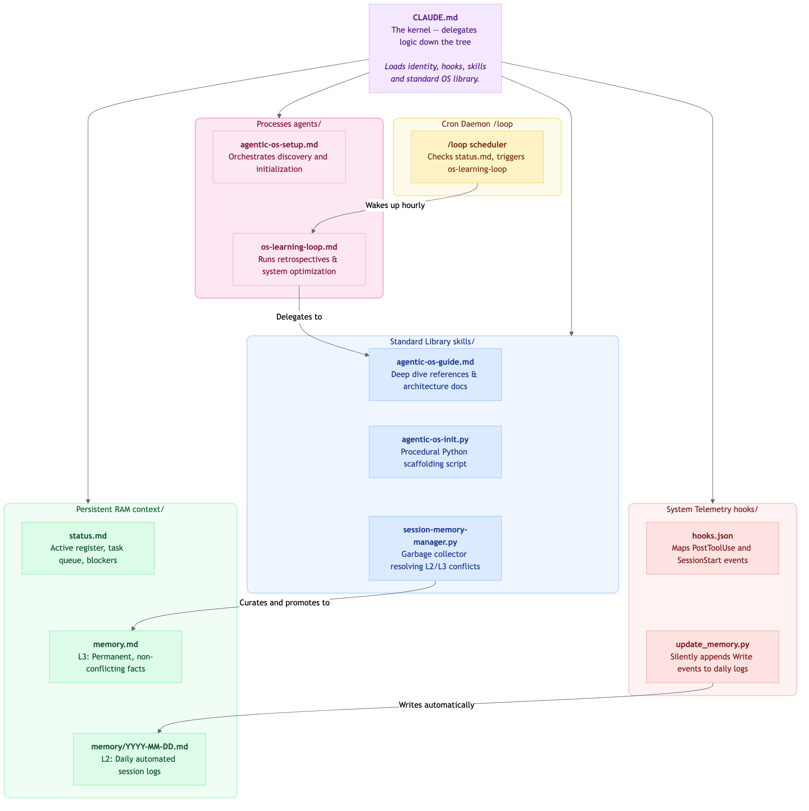
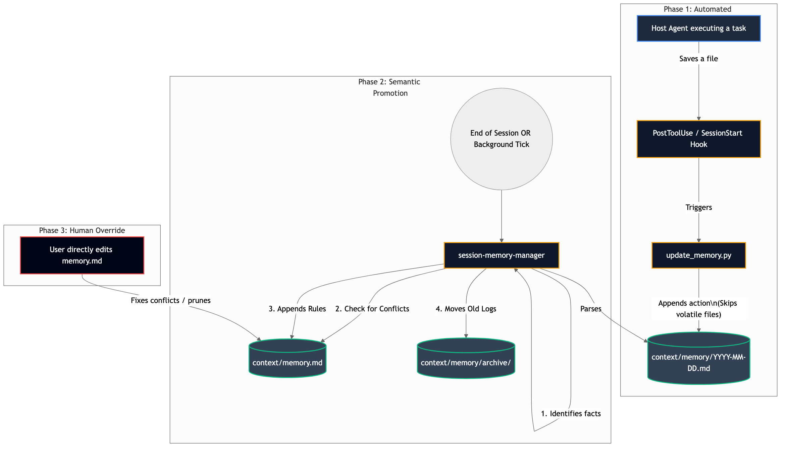

# Agent Agentic OS Plugin

> **Executive Summary**: For a conceptual overview of the architecture, OS analogy deep-dive, and key differentiators from a traditional operating system, read [`SUMMARY.md`](./SUMMARY.md) first.

## Purpose

`plugins/agent-agentic-os` is the canonical operational reference for the **Agentic OS / Agent Harness** pattern.

LLMs are stateless functions. `CLAUDE.md` is the only file loaded into every conversation by default. The Agentic OS pattern turns this constraint into a full OS metaphor: your `CLAUDE.md` files are the kernel, `context/` is persistent RAM, `skills/` is the standard library, and `/loop` is your cron daemon.

This plugin teaches agents how to:
- Understand and navigate the full CLAUDE.md hierarchy (global -> org -> project -> local)
- Structure and maintain the `context/` folder (soul, user prefs, dated memory logs)
- Use `.claude/agents/`, `.claude/hooks/`, and `.claude/commands/` effectively
- Run background scheduled tasks with `/loop` and `heartbeat.md`
- Bootstrap new sessions via `START_HERE.md` and `MEMORY.md`
- Manage memory hygiene: when to write, promote, archive, and expire

## Supervised Learning & Improvement Loop (Karpathy Parity)

The Agentic OS implements a rigorous, objective self-improvement loop inspired by Andrej Karpathy's `autoresearch`:

- **Objective Metrics (The Trainer)**: `skill-improvement-eval` uses `eval_runner.py` to calculate routing accuracy against a fixed validation set (`evals/evals.json`). A change is only kept if it improves the objective score.
- **Persistent Benchmarking**: All evaluation results are recorded in `evals/results.tsv` (commit, score, status), establishing a clear baseline for every skill.
- **Autonomous Supervision**: The `post_run_metrics.py` hook automatically captures session errors and friction events, emitting them to the Event Bus (`events.jsonl`) without human intervention.
- **Continuous Optimization**: The `os-learning-loop` agent mines these metrics to propose patches to scripts, skills, and memory.

## Part of the Triad

| Plugin | Role |
|--------|------|
| `agent-skill-open-specifications` | Spec - what ecosystem artifacts are |
| `agent-scaffolders` | Factory - how to create them |
| **`agent-agentic-os`** | **Operations - how to run the environment** |

## Plugin Components

### Skills

- **`agentic-os-guide`**: Master reference skill. The full anatomy of the Agentic OS pattern - all layers and their interactions.
- **`agentic-os-init`**: The core execution script and interview framework to scaffold a new OS environment.
- **`session-memory-manager`**: Operational skill for managing memory hygiene across sessions.
- **`os-clean-locks`**: System administration utility to cleanly remove stale agent locks and prevent deadlocks.
- **`skill-improvement-eval`**: QA evaluation engine mimicking Anthropic's benchmark suites to rigorously gate self-modifying autonomous behaviors.

### Agents

- **`agentic-os-setup`**: A persistent conversational architect that wraps the `agentic-os-init` skill to guide users through discovery, component planning, and post-init CLAUDE.md filling.
- **`os-learning-loop`**: The continuous improvement engine. Performs post-session retrospectives to identify friction points and writes permanent updates to skills and memory conventions.

## Kernel Architecture (v10+)

The OS operates on a centralized Python-based event bus (`context/kernel.py`) instead of relying solely on reactive filesystem reads:
- **Event Bus (`events.jsonl`)**: All agents publish their intents, results, and errors to the event bus using strict JSON schemas.
- **Atomic Concurrency**: The kernel uses atomic locks (`os.mkdir()`) to prevent race conditions during memory promotion or learning cycles.
- **Agent Registry**: Security validation via `agents.json` ensures only whitelisted sub-agents can mutate the OS state.

## Directory Structure

```text
agent-agentic-os
│   ├── CONNECTORS.md
│   ├── README.md
│   ├── agent-agentic-os-architecture.mmd
│   ├── agents
│   │   ├── agentic-os-setup.md
│   │   ├── os-learning-loop.md
│   ├── commands
│   │   ├── os-init.md
│   │   ├── os-loop.md
│   │   ├── os-memory.md
│   ├── hooks
│   │   ├── hooks.json
│   │   ├── scripts
│   │   ├── update_memory.py
│   ├── lsp.json
│   ├── references
│   │   ├── anthropic-official-docs.md
│   │   ├── diagrams
│   │   │   ├── agentic-os-loop-lifecycle.mmd
│   │   │   ├── agentic-os-loop-lifecycle.png
│   │   │   ├── agentic-os-memory-subsystem.mmd
│   │   │   ├── agentic-os-memory-subsystem.png
│   │   │   ├── agentic-os-overview.mmd
│   │   │   ├── agentic-os-overview.png
│   │   │   ├── agentic-os-structure.mmd
│   │   │   ├── agentic-os-structure.png
│   │   │   ├── agentic-os-system-architecture.mmd
│   │   │   ├── agentic-os-system-architecture.png
│   │   ├── status-file-spec.md
│   ├── requirements.in
│   ├── skills
│   │   ├── agentic-os-guide
│   │   │   ├── CONNECTORS.md
│   │   │   ├── SKILL.md
│   │   │   ├── acceptance-criteria.md
│   │   │   ├── agentic-os-guide-flow.mmd
│   │   │   ├── evals
│   │   │   │   ├── evals.json
│   │   │   │   ├── results.tsv
│   │   │   ├── examples
│   │   │   ├── references
│   │   │   │   ├── acceptance-criteria.md
│   │   │   │   ├── architecture.md
│   │   │   │   ├── canonical-file-structure.md
│   │   │   │   ├── claude-md-hierarchy.md
│   │   │   │   ├── context-folder-patterns.md
│   │   │   │   ├── loop-scheduler.md
│   │   │   │   ├── memory-hygiene.md
│   │   │   │   ├── sub-agents-and-hooks.md
│   │   │   ├── scripts
│   │   │   ├── templates
│   │   ├── agentic-os-init
│   │   │   ├── CONNECTORS.md
│   │   │   ├── SKILL.md
│   │   │   ├── acceptance-criteria.md
│   │   │   ├── agentic-os-init-flow.mmd
│   │   │   ├── evals
│   │   │   │   ├── evals.json
│   │   │   │   ├── results.tsv
│   │   │   ├── examples
│   │   │   ├── references
│   │   │   │   ├── acceptance-criteria.md
│   │   │   │   ├── architecture.md
│   │   │   │   ├── project-setup-guide.md
│   │   │   ├── scripts
│   │   │   │   ├── init_agentic_os.py
│   │   │   ├── templates
│   │   ├── session-memory-manager
│   │   │   ├── CONNECTORS.md
│   │   │   ├── SKILL.md
│   │   │   ├── acceptance-criteria.md
│   │   │   ├── evals
│   │   │   │   ├── evals.json
│   │   │   │   ├── results.tsv
│   │   │   ├── examples
│   │   │   ├── references
│   │   │   │   ├── acceptance-criteria.md
│   │   │   │   ├── architecture.md
│   │   │   │   ├── memory-promotion-guide.md
│   │   │   ├── scripts
│   │   │   ├── session-memory-manager-flow.mmd
│   │   │   ├── templates
```

## Architecture Visualizations

### 1. Conceptual OS Structure
How the `agent-agentic-os` concepts map logically to a standard operating system.


### 2. Physical Plugin Architecture
How the individual data layers, processes, and hooks inside this code repository interact.


### 3. Loop Lifecycle
Sequence mapping how the scheduled `/loop` cron interacts with the status queue and triggers internal handlers.


### 4. Memory Promotion Subsystem
Flowchart portraying how raw logs are transitioned from short-term memory arrays to clean L3 curated rulesets.


## Key References

- [Executive Summary & OS Analogy](./SUMMARY.md) — conceptual architecture, analogy table, and key differentiators
- [Anthropic CLAUDE.md documentation](https://docs.anthropic.com/en/docs/claude-code/memory)
- [Anthropic /loop scheduler](https://docs.anthropic.com/en/docs/claude-code/loop)
- [Agent Skills Open Standard](https://agentskills.io)
