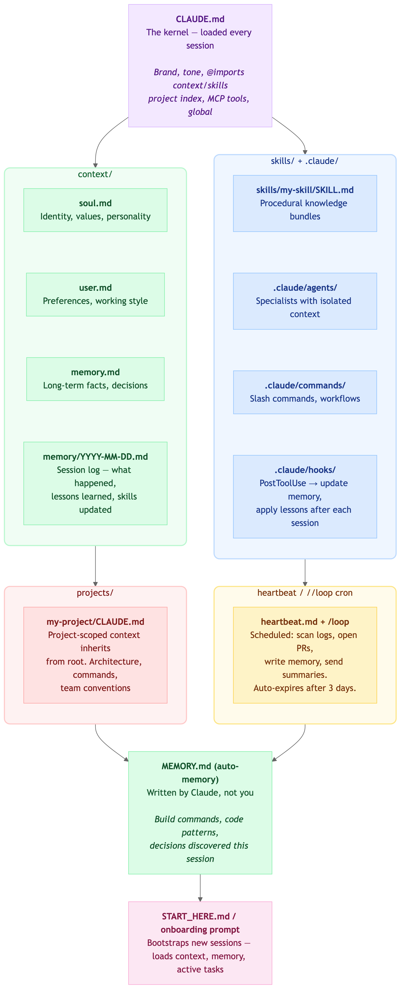

# Agent Harness & Learning Layer (formerly Agentic OS)

A developer **meta-harness** that gives your AI agent **persistent memory**, a **self-improving feedback loop**, and **cross-IDE orchestration** — helping solo developers coordinate workflows and continuously improve skills with every execution across multiple environments (VS Code, Cursor, Windsurf, Copilot).

A *harness* controls what information a model sees at each step: prompting, context management, memory retrieval, and tool orchestration. A *meta-harness* adds an outer loop that searches over and improves the harness itself. This plugin is both: the memory and coordination layer is the harness; the `os-eval-runner` + `triple-loop-architect` orchestration is the meta-layer that evolves the harness's own skills and protocols continuously.

This architecture is independently validated by Meta-Harness (Lee et al., arXiv:2603.28052, 2026), which demonstrates that code-space search over harness definitions — using an LLM proposer with access to prior candidates and evaluation traces — outperforms hand-designed harnesses by significant margins across benchmarks. See [`plugin-research/meta-harness/`](../../plugin-research/meta-harness/) for the full analysis.

> **Positioning:** Anthropic now ships auto-memory, native hooks, and subagent coordination natively. This plugin is not an operating system, but rather an **opinionated discipline layer** on top of those primitives — a structured meta-harness for solo developer workflows. See [`SUMMARY.md`](./SUMMARY.md) for full context and known limitations.

---

## The Problem

Claude Code ships persistent memory. What it gives you is a 200-line `MEMORY.md` with no structured deduplication, no promotion logic, and no eval gate. That works for a few sessions. It breaks down when you have multiple agents, background loops, and workflows that span days or weeks where the quality of what gets remembered directly affects the quality of every future session.

The harder problem: coordination. How does the background improvement agent share what it learned with the foreground session? How does an outer-loop supervisor pass context to an inner-loop worker? How do two agents write to shared memory without corrupting it?

This plugin provides a system for that.

---

## What It Does

### Structured Memory Hierarchy

Every session writes structured logs to `context/events.jsonl` and `context/memory/`. At end-of-session, the `os-memory-manager` deduplicates and promotes important facts to `context/memory.md` - a curated long-term store that bootstraps every future session. Dedup IDs, conflict detection, and size limits prevent the memory from drifting into contradiction over hundreds of sessions.

### Continuous Improvement Loop (The Meta-Harness Layer)

### Continuous Improvement Loop (The Meta-Harness Layer)

This is the system's core differentiator: a unified **Triple-Loop Learning System** that continuously improves the instructions the model receives based on objective evaluation.

```text
TRIPLE-LOOP (Outer Meta-Learning Orchestrator via os-improvement-loop/nightly-evolver):
  Runs automated loops unattended
    -> oversees all experiments and delegates strategic targets
    -> reviews cross-loop patterns to improve OS-level protocols 

DOUBLE-LOOP (Strategic Planner via os-skill-improvement):
  Session runs
    -> errors and friction logged to events.jsonl
    -> formulates hypotheses and generates strategy packets 

SINGLE-LOOP (Tactical Executor via os-eval-runner):
    -> executes the patch against a SKILL.md (The Target)
    -> scores it against locked evals/evals.json fixtures (Headless Evaluation)
    -> if DISCARD: auto-reverted via git checkout; if KEEP: retained for next session
```

The loop relies strictly on headless evaluation — no subjective LLM "mental" testing — defeating Goodhart's Law. A test registry prevents re-testing falsified hypotheses. The plugin applies this loop to its own skills: it is a live lab as much as a tool.

**Research basis:** This architecture implements the [Karpathy 3-file autoresearch pattern](./skills/os-eval-runner/references/research/karpathy-autoresearch-3-file-eval.md) and is structurally equivalent to the Meta-Harness outer-loop described in [Lee et al., arXiv:2603.28052 (2026)](../../plugin-research/meta-harness/summary.md) — which independently validates that code-space search over harness definitions, gated by objective evaluation, produces improvements that text-space optimizers cannot reach. The key open enhancement (raw execution trace access for the proposer) is documented in [`plugin-research/meta-harness/implementation-plan.md`](../../plugin-research/meta-harness/implementation-plan.md).

### Agent Signaling and Turn Management

Three simple signaling patterns built into the system:

**Inner/outer loop** - outer supervisor sets goals and reviews results; inner worker executes and signals completion in the shared event log. Context flows through shared memory, not tight coupling.

**Background + foreground** - background agents (`Triple-Loop Retrospective`, `os-health-check`) run asynchronously with simple execution locks preventing collisions. Their findings surface in the next foreground session through promoted memory.

**Sequential agent handoff** - Agent A writes structured output to the event log. Agent B reads the log to pick up where A left off. Agents coordinate their turns through the simple shared log, not through each other.

---

## Who This Is For

Developers running **long-horizon, multi-session workflows** — projects where Claude Code runs across days or weeks, with multiple agents that need to build on each other's context.

This is NOT for:
- Single-session tasks (native auto-memory is sufficient)
- Enterprise multi-machine deployments (see `references/architecture/vision.md`)
- Framework-agnostic portability requirements

---

## Scope

- **Developer tool, single machine** - designed and tested for solo developer use
- **No external dependencies** - file system only, standard library Python
- **Academic/research quality** - clarity of implementation over production hardening
- **Not enterprise scale** - for multi-machine coordination or high-throughput streaming, see `references/architecture/vision.md`

---

---

## Quick Start

After installation, ask your agent:

```
"Set up an agentic OS for this project"
```

The `agentic-os-setup` agent runs a discovery interview and scaffolds the environment. Then:

```bash
/os-loop      # run improvement retrospective after a session
/os-memory    # manually trigger memory promotion
/os-init      # re-initialize or repair the environment
```

---

## Entry Points

| Skill | Purpose |
|-------|---------|
| `os-architect` | Front-door intake for all ecosystem evolution — the recommended starting point for improving, creating, or orchestrating agent capabilities. |
| `os-improvement-loop` | Direct skill improvement loop (called by os-architect for Category 3) |
| `triple-loop-architect` | Full triple-loop lab setup (called by os-architect for deep runs) |
| `os-eval-runner` | Standalone eval runner (called by os-architect for scoring) |

---

## Plugin Components

### Skills

| Skill | Purpose |
|-------|---------|
| `os-architect` | Front-door intake for all ecosystem evolution — start here |
| `os-guide` | Full reference: all layers, interactions, and patterns explained |
| `os-init` | Scaffolds a new OS environment via discovery interview |
| `os-memory-manager` | Deduplicates and promotes session facts to long-term memory |
| `os-eval-runner` | Scores proposed skill patches against objective evals before applying |
| `os-eval-lab-setup` | Bootstraps the testing arena for a specific skill |
| `os-eval-backport` | Exports test results back to an external ledger |
| `os-clean-locks` | Removes stale execution locks that block agent execution |
| `os-improvement-loop` | Orchestrates the autonomous testing and fixing loop |
| `os-improvement-report` | Generates improvement metrics from eval history |
| `os-skill-improvement` | Applies Test-Driven Development logic to agent instructions |
| `todo-check` | Audits files for unresolved TODO items |

### Agents

| Agent | Purpose |
|-------|---------|
| `agentic-os-setup` | Conversational setup guide; runs the init interview |
| `Triple-Loop Retrospective` | Post-session retrospective; mines friction, proposes and validates skill patches |
| `os-health-check` | System diagnostics; inspects event log, memory state, lock status |

### Hooks

`hooks/hooks.json` registers hooks:
- `post_run_metrics.py` - captures session errors and friction events to the event log automatically
- `update_memory.py` - triggers memory promotion after significant sessions

### Commands

| Command | Purpose |
|---------|---------|
| `/os-init` | Initialize or repair the OS environment |
| `/os-loop` | Run the improvement loop retrospective |
| `/os-memory` | Manually run memory management |

---

## Architecture

The OS metaphor explains the design: the context window is finite RAM. Every byte consumed by infrastructure is a byte unavailable for actual work. The architecture is built around that constraint.

```
CONTEXT WINDOW (RAM - finite, cleared every session)
  Always present: skill metadata headers, CLAUDE.md, soul.md, user.md

DISK (context/ folder - persistent across sessions)
  context/memory.md          <- L3 long-term curated facts
  context/memory/YYYY-MM-DD.md  <- L2 session logs
  context/events.jsonl       <- event log / audit trail
  context/os-state.json      <- system registry
  context/.locks/            <- execution locks

SKILLS (loaded into RAM only when triggered)
  skills/*/SKILL.md          <- full body stays on disk until invoked

HOOKS (fire on every tool call)
  PreToolUse                 <- inspect, block, or log before execution
  PostToolUse                <- audit results, capture metrics
```

For the full OS analogy table and three-tier lazy loading details, see [`SUMMARY.md`](./SUMMARY.md).

### Architecture Diagrams

| Diagram | Description |
|---------|-------------|
|  | Conceptual OS structure |
|  | Physical plugin architecture |
|  | The Unified Triple-Loop Architecture |
|  | Memory promotion flowchart |

---

## Part of the Plugin Triad

| Plugin | Role |
|--------|------|
| `agent-scaffolders` | Spec - what ecosystem artifacts are |
| `agent-scaffolders` | Factory - how to create them |
| **`agent-agentic-os`** | **Operations - how to run and improve the environment** |

---

## Acknowledgements

The self-healing patterns in this plugin's v5 architecture — specifically the **contribute-back reflex** (every friction discovery becomes a skill artifact), **gotchas embedded in the artifact** (field-tested failures live in `SKILL.md` not an external log), and the **thin-core / extensible domain-layer** separation (see `references/domain-patterns/`) — were informed by studying the design of [`browser-use/browser-harness`](https://github.com/browser-use/browser-harness), an elegant self-healing CDP harness where agents extend the harness itself mid-task.

browser-harness is MIT licensed. Patterns were adapted conceptually, not by copying code.

---

## Key References

- [`SUMMARY.md`](./SUMMARY.md) - scope, architecture, OS analogy, how-to
- [`references/architecture/vision.md`](./references/architecture/vision.md) - where this pattern is heading; what enterprise and hyperscaler solutions will need to solve
- [`references/operations/triple-loop.md`](./references/operations/triple-loop.md) - the Triple-Loop system strategy packets and verification protocols
- [`references/operations/operating-protocols.md`](./references/operations/operating-protocols.md) - **Canonical** test arenas (sibling-repo) and overnight orchestrator execution paths
- [`skills/os-eval-runner/references/research/karpathy-autoresearch-3-file-eval.md`](./skills/os-eval-runner/references/research/karpathy-autoresearch-3-file-eval.md) - foundational 3-file autoresearch pattern
- [`plugin-research/meta-harness/`](../../plugin-research/meta-harness/) - Meta-Harness paper analysis, artifact code review, and enhancement implementation plan (Lee et al., arXiv:2603.28052, 2026)
- [Anthropic CLAUDE.md docs](https://docs.anthropic.com/en/docs/claude-code/memory)
- [Anthropic /loop scheduler](https://docs.anthropic.com/en/docs/claude-code/loop)
