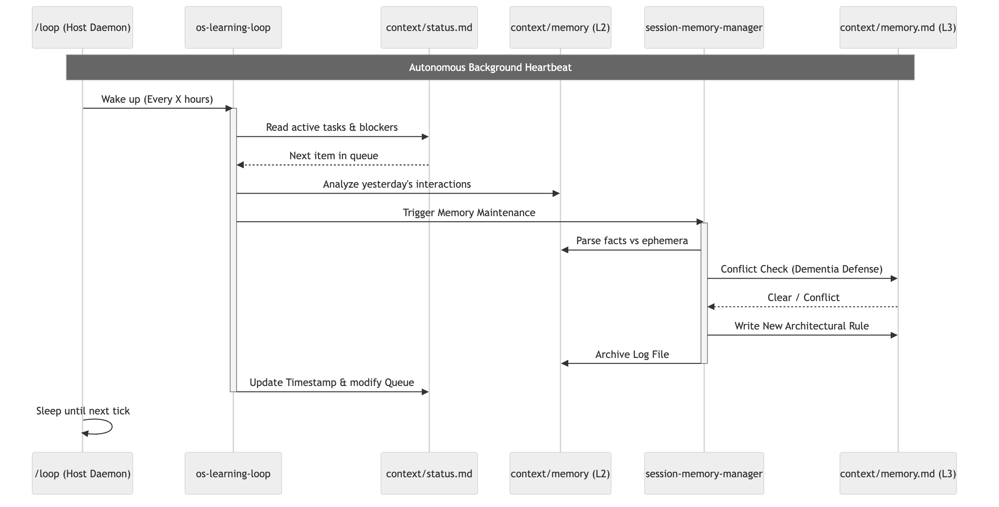

# Agent Agentic OS

A developer harness that gives your AI agent **persistent memory**, a **self-improvement loop**, and **multi-agent coordination** — working together as a system rather than as isolated primitives.

> **Transitional tool**: Frontier labs are building native agentic OS capabilities into their platforms. This plugin fills the gap for developers who need these patterns now, and serves as a working reference for what those platforms will need to get right. See [`SUMMARY.md`](./SUMMARY.md) for full context.

---

## The Problem

LLMs are stateless. Every session starts from scratch. Most developers paper over this with manual CLAUDE.md maintenance and repeated context-setting. That breaks down when you have multiple agents, background loops, and workflows that span days.

The harder problem: coordination. How does the background improvement agent share what it learned with the foreground session? How does an outer-loop supervisor pass context to an inner-loop worker? How do two agents write to shared memory without corrupting it?

This plugin provides a system for that.

---

## What It Does

### Persistent Memory Across Sessions

Every session writes structured logs to `context/events.jsonl` and `context/memory/`. At end-of-session, the `session-memory-manager` deduplicates and promotes important facts to `context/memory.md` - a curated long-term store that bootstraps every future session. Agents don't rediscover what they already learned.

### Self-Improvement Loop (Instruction-Level Learning)

This is the differentiator. Not just memory - a reinforcement + supervised learning cycle that improves the instructions the model receives, not the model itself:

```
Session runs
  -> errors and friction logged to events.jsonl
  -> os-learning-loop mines the event log
  -> proposes patches to SKILL.md files and CLAUDE.md
  -> skill-improvement-eval scores the patch against evals/evals.json
  -> patch committed only if objective score improves
  -> next session runs with better instructions
```

Skills measurably improve over runs. The plugin applies this loop to its own skills - it is a live lab as much as a tool.

### Multi-Agent Coordination

Three coordination patterns built into the system:

**Inner/outer loop** - outer supervisor sets goals and reviews results; inner worker executes and writes to the shared event bus. Context flows through shared memory, not tight coupling.

**Background + foreground** - background daemons (`os-learning-loop`, `os-health-check`) run asynchronously with mutex locks preventing collisions. Their findings surface in the next foreground session through promoted memory.

**Sequential agent handoff** - Agent A writes structured output to the event bus. Agent B reads the bus to pick up where A left off. Agents are swappable because they coordinate through the shared bus, not through each other.

---

## Scope

- **Developer tool, single machine** - designed and tested for solo developer use
- **No external dependencies** - file system only, standard library Python
- **Academic/research quality** - clarity of implementation over production hardening
- **Not enterprise scale** - for multi-machine coordination or high-throughput streaming, see `references/vision.md`

---

## Installation

### From the Marketplace (Recommended)
```bash
/plugin marketplace add richfrem/agent-plugins-skills
/plugin install agent-agentic-os
```

### From GitHub Directly
```bash
# Full plugin (Claude Code)
/plugin marketplace add richfrem/agent-plugins-skills
/plugin install agent-agentic-os

# Skills only (portable, works with Claude, Copilot, Gemini CLI)
npx skills add richfrem/agent-plugins-skills --path plugins/agent-agentic-os
```

### Local Development
```bash
/plugin marketplace add ./
/plugin install agent-agentic-os
```

---

## Quick Start

After installation, ask your agent:

```
"Set up an agentic OS for this project"
```

The `agentic-os-setup` agent runs a discovery interview and scaffolds the environment. Then:

```bash
/os-loop      # run improvement retrospective after a session
/os-memory    # manually trigger memory promotion
/os-init      # re-initialize or repair the environment
```

---

## Plugin Components

### Skills

| Skill | Purpose |
|-------|---------|
| `agentic-os-guide` | Full reference: all layers, interactions, and patterns explained |
| `agentic-os-init` | Scaffolds a new OS environment via discovery interview |
| `session-memory-manager` | Deduplicates and promotes session facts to long-term memory |
| `skill-improvement-eval` | Scores proposed skill patches against objective evals before applying |
| `os-clean-locks` | Removes stale mutex locks that block agent execution |
| `concurrent-agent-loop` | Coordinates multiple parallel agents through the shared event bus |
| `loop-progress-report` | Generates improvement metrics from eval history |
| `todo-check` | Audits files for unresolved TODO items |

### Agents

| Agent | Purpose |
|-------|---------|
| `agentic-os-setup` | Conversational setup guide; runs the init interview |
| `os-learning-loop` | Post-session retrospective; mines friction, proposes and validates skill patches |
| `os-health-check` | System diagnostics; inspects event log, memory state, lock status |

### Hooks

`hooks/hooks.json` registers two hooks:
- `post_run_metrics.py` - captures session errors and friction events to the event bus automatically, without human intervention
- `update_memory.py` - triggers memory promotion after significant sessions

### Commands

| Command | Purpose |
|---------|---------|
| `/os-init` | Initialize or repair the OS environment |
| `/os-loop` | Run the improvement loop retrospective |
| `/os-memory` | Manually run memory management |

---

## Architecture

The OS metaphor explains the design: the context window is finite RAM. Every byte consumed by infrastructure is a byte unavailable for actual work. The architecture is built around that constraint.

```
CONTEXT WINDOW (RAM - finite, cleared every session)
  Always present: skill metadata headers, CLAUDE.md, soul.md, user.md

DISK (context/ folder - persistent across sessions)
  context/memory.md          <- L3 long-term curated facts
  context/memory/YYYY-MM-DD.md  <- L2 session logs
  context/events.jsonl       <- event bus / audit log
  context/os-state.json      <- system registry
  context/.locks/            <- mutex locks

SKILLS (loaded into RAM only when triggered)
  skills/*/SKILL.md          <- full body stays on disk until invoked

HOOKS (fire on every tool call)
  PreToolUse                 <- inspect, block, or log before execution
  PostToolUse                <- audit results, capture metrics
```

For the full OS analogy table and three-tier lazy loading details, see [`SUMMARY.md`](./SUMMARY.md).

### Architecture Diagrams

| Diagram | Description |
|---------|-------------|
|  | Conceptual OS structure |
|  | Physical plugin architecture |
|  | Improvement loop sequence |
|  | Memory promotion flowchart |

---

## Part of the Plugin Triad

| Plugin | Role |
|--------|------|
| `agent-skill-open-specifications` | Spec - what ecosystem artifacts are |
| `agent-scaffolders` | Factory - how to create them |
| **`agent-agentic-os`** | **Operations - how to run and improve the environment** |

---

## Key References

- [`SUMMARY.md`](./SUMMARY.md) - scope, architecture, OS analogy, how-to
- [`references/vision.md`](./references/vision.md) - where this pattern is heading; what enterprise and hyperscaler solutions will need to solve
- [`references/dual-loop.md`](./references/dual-loop.md) - inner/outer loop coordination patterns
- [`references/memory-hygiene.md`](./references/memory-hygiene.md) - when to write, promote, archive, and expire
- [Anthropic CLAUDE.md docs](https://docs.anthropic.com/en/docs/claude-code/memory)
- [Anthropic /loop scheduler](https://docs.anthropic.com/en/docs/claude-code/loop)
