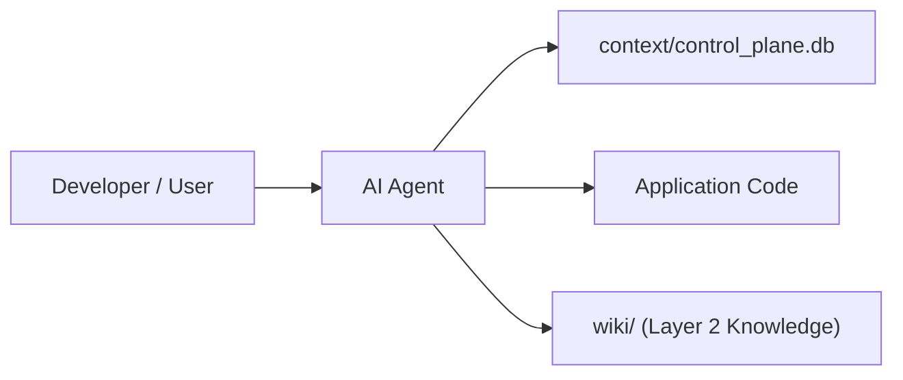

# Architecture Overview

This document provides agents and developers with a fast, accurate understanding of this repository's architectural principles, system structure, component boundaries, and runtime state layout.

## 1. What This Repository Is

- **Project Name**: {project_name}
- **Purpose**: <!-- Brief 1-2 sentence description of what this system does and what problem it solves -->
- **System Type**: <!-- E.g. Web Application, Microservice, Monorepo, CLI Tool, AI Agent Hub -->
- **Primary Runtime/Language**: <!-- E.g. Python 3.12, TypeScript/Node.js, Go, Rust -->

## 2. Component Boundaries & Directory Layout

```
[Project Root]/
├── context/                 # Agentic OS Layer 1: In-prompt context, control plane DB, runtime state
│   ├── control_plane.db    # SQLite ACID state machine & verifier receipt ledger (WAL mode)
│   ├── soul.md             # Core behavioral soul & operational ethos
│   └── user.md             # Developer profile, environment constraints, preferences
├── wiki/                   # Agentic OS Layer 2: Confirmed domain playbooks & failure knowledge
│   └── index.md            # Playbook index & structural standards
├── references/             # Progressive disclosure documentation & map debt tracking
│   └── map-debt.md         # Map debt ledger tracking architectural friction
├── .agent/                 # Workspace rules, agent definitions, and trace ledgers
│   ├── rules/              # Modular behavioral rules
│   └── learning/traces/    # Layer 3 append-only execution trace manifests
```

## 3. Data Flow & Execution Lifecycles

<!-- Document primary request/data flow diagrams and task state transitions -->


## 4. Key Architectural Invariants

1. **Explicit State & Verification**: State transitions must be validated against contracts before execution.
2. **Layered Memory Separation**: Dynamic session context (Layer 1) is decoupled from confirmed permanent domain playbooks (Layer 2) and audit trace manifests (Layer 3).
3. **Surgical Evolution**: Do not blindly clobber existing application conventions or configurations. Preserve domain context.
