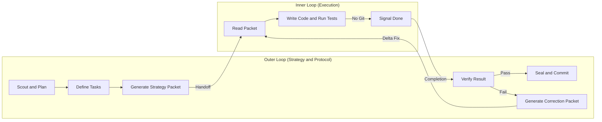

# Dual-Loop (Inner/Outer Agent Delegation)

> Inlined from `agent-loops/skills/dual-loop` to remove cross-plugin dependency.
> This is the canonical reference for the strategy packet, correction packet, and
> verification protocol used by `concurrent-agent-loop` Pattern D.

---

## Architecture Overview



---

## The Workflow Loop

### Step 1: The Plan (Outer Loop / ORCHESTRATOR)

1. **Orientation**: Read project requirements or the current improvement ledger.
2. **Decomposition**: Break the goal into distinct Work Packages (WPs) or sub-tasks.
3. **Verification**: Confirm tasks are atomic, testable, and non-overlapping.

### Step 2: Prepare Execution Environment

1. **Isolation**: Ensure a safe workspace exists for INNER_AGENT. Workspace creation is
   a delegated responsibility of the ORCHESTRATOR, not the Dual-Loop itself.
2. **Update State**: Mark the current Work Package as "In Progress".

### Step 3: Generate Strategy Packet (ORCHESTRATOR)

Write a tightly scoped markdown document for INNER_AGENT.

**Required packet contents:**
- The exact goal and target skill/artifact path.
- A Pre-Execution Workflow Commitment Diagram (ASCII box mapping steps).
- Only the specific file paths INNER_AGENT needs.
- Strict "NO GIT" constraint (INNER_AGENT must not commit).
- Clear Acceptance Criteria.

Save the packet to `handoffs/packet-${CID}.md`.

### Step 4: Hand-off

ORCHESTRATOR emits `task.assigned` with the packet path in the event summary.
INNER_AGENT polls the event bus and reads the packet.

### Step 5: Execute (INNER_AGENT)

1. Reads the strategy packet.
2. Executes the assigned work (edits skill, workflow, or artifact).
3. Emits `type: friction` events immediately when hitting uncertainty or errors.
4. Runs `eval_runner.py` to score the change.
5. Writes output to `handoffs/out-${CID}.md`.
6. Emits `task.complete` with score, output path, and survey path.

> INNER_AGENT must NOT run git commands.

### Step 6: Verify (PEER_AGENT via `skill-improvement-eval`)

Once `task.complete` is received:
1. **Delta Check**: Inspect what INNER_AGENT changed via the output file.
2. **Eval Check**: Run `skill-improvement-eval` independently. Do not read the score
   from the event -- run it fresh.
3. Compare to `results.tsv` baseline. DISCARD if same or lower.

#### On KEEP:
- ORCHESTRATOR applies the approved changes to the canonical skill.
- Emits `orchestrator.decision`.

#### On DISCARD:
Generate a **Correction Packet** using the Severity-Stratified Output Schema:

| Severity | Condition |
|----------|-----------|
| CRITICAL | Code fails, tests fail, or feature is entirely missing |
| MODERATE | Works but violates architecture, ADRs, or standards |
| MINOR | Works and correct, but has style or naming issues |

Save to `handoffs/correction-${CID}.md`. Re-signal INNER_AGENT for next sub-cycle.
Do NOT emit `orchestrator.decision` until a KEEP verdict is received.

### Step 7: Self-Assessment Survey (Mandatory -- All Agents)

Every agent that performed work MUST complete the Post-Run Self-Assessment Survey.
See `../../references/post_run_survey.md` for the template.

Save to: `${CLAUDE_PROJECT_DIR}/context/memory/retrospectives/survey_[YYYYMMDD]_[HHMM]_[AGENT].md`

Emit on completion:
```bash
python3 context/kernel.py emit_event --agent <ROLE> \
  --type learning --action survey_completed \
  --summary "retrospectives/survey_[DATE]_[TIME]_[AGENT].md"
```

If any single friction cause appears 3+ times: flag for `os-learning-loop` Full Loop.

### Step 8: Completion

Once all Work Packages are KEEP-verified and surveys saved, the Dual-Loop cycle is
complete. Return control to ORCHESTRATOR for memory persistence via `session-memory-manager`.

---

## Task Lane States

| Transition | When |
|-----------|------|
| Backlog -> Doing | Strategy Packet generated |
| Doing -> Review | INNER_AGENT signals task.complete |
| Review -> Done | PEER_AGENT returns KEEP verdict |
| Review -> Doing | PEER_AGENT returns DISCARD; Correction Packet sent |

---

## Fundamental Constraints

- **No Protocol Crossing**: INNER_AGENT manages tacticals (code, tests). ORCHESTRATOR
  manages strategy (git, architecture decisions, human interactions).
- **Isolation**: Strategy Packets must be minimal. Send only what INNER_AGENT needs
  for the specific Work Package -- not thousands of lines of context.
- **Anti-Simulation**: Validations must be actually performed, not described as if performed.
