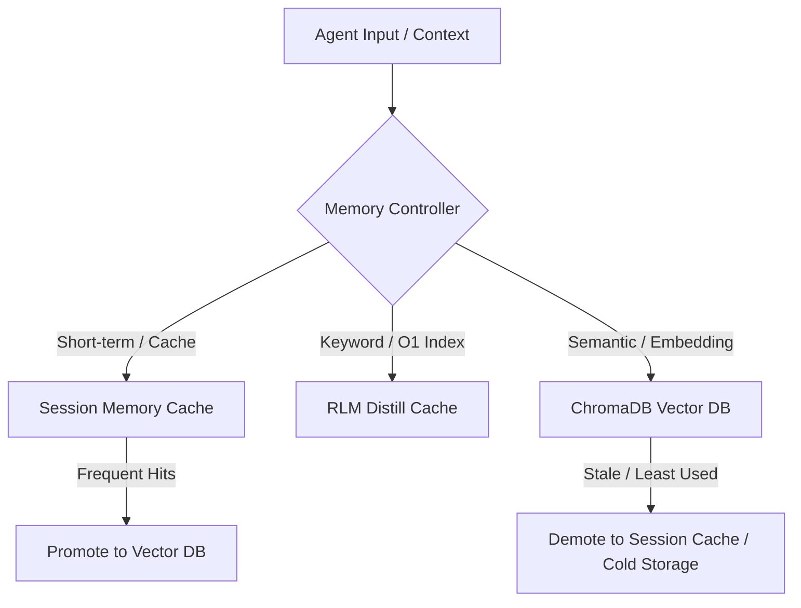

# agent-memory Plugin 🧠

Unified Cognitive Memory & Retrieval Suite. This plugin integrates three critical memory architectures for AI agents:
1. **Recursive Language Model (RLM) Distills**: Hierarchical file-level summarization for O(1) keyword retrieval.
2. **ChromaDB Vector Semantic Search**: Dense vector embeddings for similarity-based context retrieval.
3. **Session Cache & Tiered Promotion-Demotion**: Memory management layers to manage long-term cache promotion and short-term session cleanup.

All 13 component skills run completely self-contained with no cross-plugin dependencies at runtime.

---

## Architecture Overview



See [assets/diagrams/](assets/diagrams/) for detailed sequence and deployment diagrams.

---

## Directory Structure

```
agent-memory/
├── .claude-plugin/
│   └── plugin.json           # Manifest
├── README.md                 # This file
├── plugin.yaml               # Metadata manifest
├── requirements.in           # Python backend dependencies source
├── requirements.txt           # Compiled Python backend dependencies
├── assets/                   # Shared templates, diagrams, prompts
├── references/               # Research references and examples
├── scripts/                  # Shared utility scripts (distiller, query, config)
└── skills/                   # Modular cognitive memory and retrieval skills
```

---

## Installed Skills

The consolidated `agent-memory` suite registers the following 13 skills:

### RLM Distillation & Indexing
- `rlm-init`: Bootstrap caching and profile config setup.
- `rlm-search`: O(1) keyword search across the summary ledger.
- `rlm-curator`: Audit coverage and analyze cache gaps.
- `rlm-distill-agent`: Agent-powered fast summarization engine.
- `rlm-cleanup-agent`: Prune stale and orphan entries.
- `rlm-audit`: Validation audits on RLM integrity.

### Semantic Vector Database (ChromaDB)
- `vector-db-init`: Bootstrapping ChromaDB and collection profiles.
- `vector-db-search`: Dense vector search using embeddings.
- `vector-db-ingest`: Chunking and ingest pipeline for files/folders.
- `vector-db-cleanup`: Remove stale collections or document references.
- `vector-db-audit`: Database consistency and embedding verification.
- `vector-db-launch`: Local/remote DB connection shims.

### Tiered Session Caching
- `memory-management`: Controls tiered session caching, promotion rules, and demotion policies.

---

## Setup & Initialization

### Standard Installation
All skills are installed into `.agents/skills/` via the unified local installer:
```bash
python plugins/plugin-manager/scripts/plugin_add.py --all -y
```

### Initializing RLM & Vector Database
To initialize RLM:
```bash
python scripts/init.py --type project
```

To ingest files into ChromaDB:
```bash
python scripts/ingest.py --path ./docs
```

---

## License
MIT
