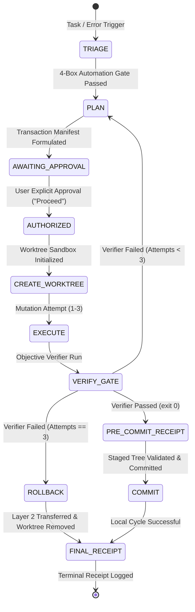

# Graph-Planned Execution (Deterministic State Machine Protocol)

Provides a deterministic, graph-planned execution primitive for tasks requiring formal state tracking, non-negotiable human approval gates, isolated worktree sandboxing, and guaranteed safe rollback.

---

## 1. Overview: Loops vs. Graphs

While standard agent loops rely on conversational context to decide next steps, **Graph Execution** models tasks as a formal Directed Acyclic Graph (DAG) or finite state machine:

---

## 2. The Core Invariants

1. **State in Files, Not Prompts:**
   The active node, attempt count, and operation bounds are stored in `.agent/learning/evolution_state.json` and mediated by a deterministic controller script (e.g., `evolution_state.py`).
2. **Proposal Mode Invariant (Read-Only Planning):**
   Prior to explicit user approval (`AWAITING_APPROVAL`), the agent executes **zero state-changing operations**, creates **no git worktrees**, and runs **no mutations**.
3. **Transactional Worktree Sandboxing:**
   Mutations are executed inside an isolated git worktree (`../worktree-evolution-<cid>`), keeping the main checkout 100% clean during execution.
4. **Verifier Sovereignty:**
   The agent cannot modify the test scripts, holdout sets, or evaluation criteria that judge its own work. Pre-execution hashes of verifiers are locked.
5. **Asymmetric Persistence:**
   If a task fails after maximum retry attempts (e.g., 3 attempts):
   - **Code changes are safely rolled back** and the worktree is deleted.
   - **Failure learnings, negative constraints, and reproduction notes** are permanently preserved in Layer 2 Markdown playbooks and debt logs before worktree teardown.
6. **Integrity Receipts:**
   No commit is permitted without an **Evolution Integrity Receipt** (`EVO-INTEGRITY-<cid>-<hash>`) binding the exact staged git tree to the audit event sequence.

---

## 3. The Canonical Graph Node Lifecycle

### Node 1: `TRIAGE` (Intake & Qualification)
- Ingests the task, error signature, or trigger.
- Evaluates the **4-Box Automation Gate**:
  1. Is the problem structural or recurring?
  2. Is there an objective programmatic verifier (`exit 0`)?
  3. Is there an iteration ceiling (max 3 attempts)?
  4. Is there an immutable persistence sink for learnings?

### Node 2: `PLAN` (Proposal Mode)
- Formulates an immutable **Transaction Manifest** declaring:
  - `mutation_targets`: Exact relative file paths to edit.
  - `verifier`: The objective verification command (`argv` array).
  - `forbidden_paths`: Protected files (verifiers, test runners, root policies).
- Halts at `AWAITING_APPROVAL` and presents the plan to the human.

### Node 3: `AUTHORIZED` & `CREATE_WORKTREE`
- Entered **only** upon explicit user confirmation ("Proceed").
- Spawns the isolated worktree (`git worktree add -b evolution/<cid> ../worktree-evolution-<cid>`).
- Captures baseline untracked files.

### Node 4: `EXECUTE` (Surgical Mutation)
- Applies surgical edits against declared `mutation_targets` inside the worktree.
- Records all created or modified files.

### Node 5: `VERIFY_GATE` (Objective Proof Check)
- Validates verifier hashes are unmodified.
- Runs the verifier command in non-mutating mode.
- If `exit 0`: transitions to `PRE_COMMIT_RECEIPT`.
- If `exit != 0` and attempts < 3: increments attempt count and transitions to `PLAN`.
- If `exit != 0` and attempts == 3: transitions to `ROLLBACK`.

### Node 6: `COMMIT` or `ROLLBACK` (Asymmetric Resolution)
- **On Pass:** Persists confirmed knowledge to Layer 2 wiki $\rightarrow$ Stages files $\rightarrow$ Generates Pre-Commit Receipt $\rightarrow$ Commits.
- **On 3rd Failure:** Transfers failure insights to main checkout $\rightarrow$ Removes worktree $\rightarrow$ Logs open debt item.

### Node 7: `FINAL_RECEIPT` (Closure)
- Emits final receipt token and marks cycle `COMPLETED` or `ESCALATED`.

---

## Operational References
See [`references/PATTERN_GUIDE.md`](../references/PATTERN_GUIDE.md) and [`references/acceptance-criteria.md`](references/acceptance-criteria.md) for complete state machine contracts.
