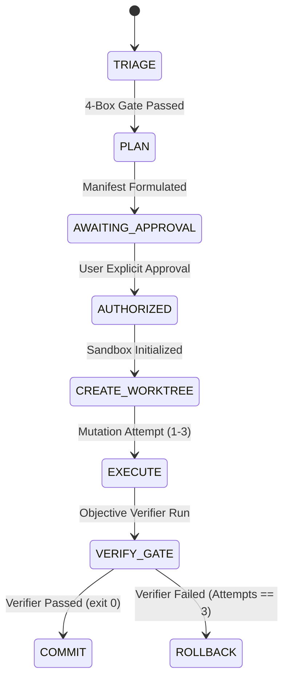

# Graph-Planned Execution (`graph-execution`)

Deterministic execution primitive for tasks requiring formal state tracking, human approval gates, worktree sandboxing, and safe rollback.

## Contents

- [Constraints](#constraints)
- [Quick start](#quick-start)
- [State Machine](#state-machine)
- [Workflow](#workflow)
- [Verification](#verification)
- [References](#references)

## Constraints

- **State persistence**: Active node and attempt counts persist in `.agent/learning/evolution_state.json`.
- **Proposal mode invariant**: Zero mutations or worktrees are created before explicit human authorization.
- **Verifier sovereignty**: Pre-execution hashes of verifiers are locked; mutation target cannot alter the verifier.
- **Asymmetric persistence**: On 3rd failure, code changes rollback while learnings and debt persist to Layer 2.

## Quick start

```bash
# Query active graph execution state or initiate node transition
python3 plugins/agent-agentic-os/scripts/evolution_state.py status
```

## State Machine


```mermaid
stateDiagram-v2
    [*] --> TRIAGE
    TRIAGE --> PLAN: 4-Box Gate Passed
    PLAN --> AWAITING_APPROVAL: Manifest Formulated
    AWAITING_APPROVAL --> AUTHORIZED: User Explicit Approval
    AUTHORIZED --> CREATE_WORKTREE: Sandbox Initialized
    CREATE_WORKTREE --> EXECUTE: Mutation Attempt (1-3)
    EXECUTE --> VERIFY_GATE: Objective Verifier Run
    VERIFY_GATE --> COMMIT: Verifier Passed (exit 0)
    VERIFY_GATE --> ROLLBACK: Verifier Failed (Attempts == 3)
```

## Workflow

1. **TRIAGE**: Evaluate 4-Box Automation Gate (structural issue, objective verifier, ceiling <= 3, persistence sink).
2. **PLAN**: Formulate Transaction Manifest declaring `mutation_targets`, `verifier`, and `forbidden_paths`.
3. **AUTHORIZED**: Request explicit user authorization; spawn isolated git worktree upon approval.
4. **EXECUTE**: Apply surgical code edits strictly confined inside the isolated worktree sandbox.
5. **VERIFY_GATE**: Run objective verifier command. Advance on exit 0; retry or rollback on exit != 0.
6. **COMMIT / ROLLBACK**: On pass, stage and commit with receipt; on 3rd failure, rollback code and export learnings.

## Verification

```bash
# Verify state machine integrity and receipt logs
python3 plugins/agent-agentic-os/scripts/verify_evolution_receipt.py --audit
# Ensure active worktree clean status
git status --short
```

## References

- [PATTERN_GUIDE.md](references/PATTERN_GUIDE.md) — Comprehensive comparative pattern guide.
- [acceptance-criteria.md](references/acceptance-criteria.md) — Verification criteria and contracts.
- [fallback-tree.md](references/fallback-tree.md) — Recovery and failure escalation paths.
