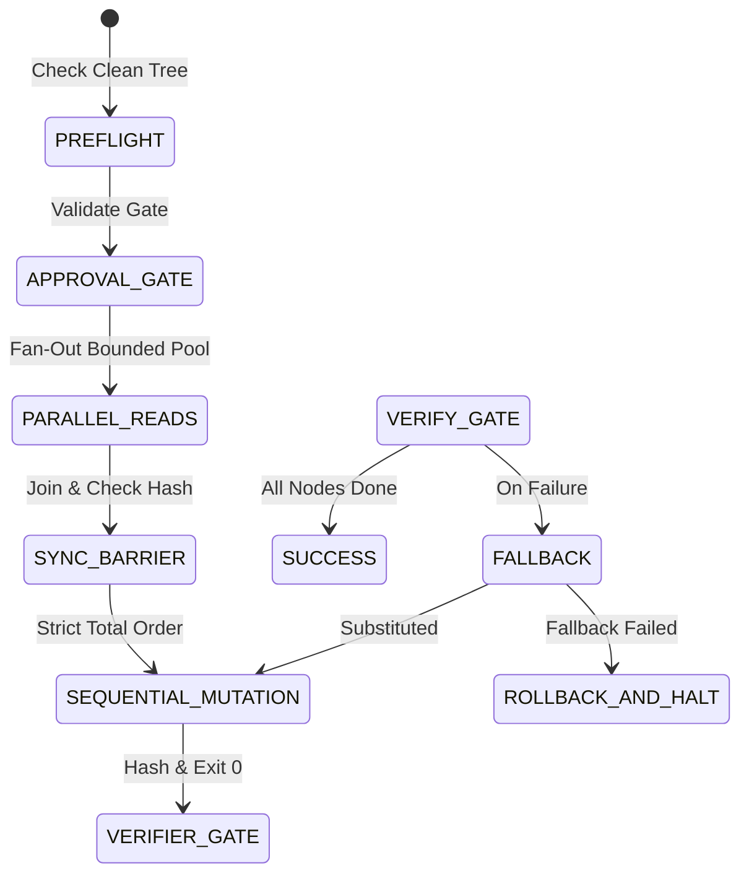

# Graph Execution (`graph-execution`)

Deterministic executor for task graphs compiled by `graph-planner`. Enforces total ordering for mutations, concurrency caps for reads, and automated rollback upon failure.

## Contents

- [Constraints](#constraints)
- [Quick start](#quick-start)
- [State Machine](#state-machine)
- [Workflow](#workflow)
- [Verification](#verification)
- [References](#references)

## Constraints

- **Workspace Confinement**: Mutations require an isolated git worktree via `--worktree` or `--create-worktree`. `--no-workspace` is permitted only for read-only DAGs.

- **Caller Governance Contract**: Caller environment owns workspace lifecycle and human approval. The runner never pushes, merges, or deletes worktrees.

- **Zero Autonomous Merge**: Merging is strictly caller-managed; the runner stops after recording terminal state.

- **Mutation Boundaries**: Mutations must touch only declared `mutation_targets` and never modify `forbidden_paths`.

- **Fail Closed**: If `--approval prompt` is selected in a non-interactive shell, execution halts immediately before any mutation.

## Quick start

```bash
# Execute compiled manifest inside an isolated worktree
python3 scripts/graph_runner.py graph-manifest.json --worktree .worktrees/task-001 --approval prompt

# Run read-only graph in current directory
python3 scripts/graph_runner.py read-manifest.json --no-workspace --approval none
```

## State Machine


```mermaid
stateDiagram-v2
    [*] --> PREFLIGHT: Check Clean Tree
    PREFLIGHT --> APPROVAL_GATE: Validate Gate
    APPROVAL_GATE --> PARALLEL_READS: Fan-Out Bounded Pool
    PARALLEL_READS --> SYNC_BARRIER: Join & Check Hash
    SYNC_BARRIER --> SEQUENTIAL_MUTATION: Strict Total Order
    SEQUENTIAL_MUTATION --> VERIFIER_GATE: Hash & Exit 0
    VERIFY_GATE --> SUCCESS: All Nodes Done
    VERIFY_GATE --> FALLBACK: On Failure
    FALLBACK --> SEQUENTIAL_MUTATION: Substituted
    FALLBACK --> ROLLBACK_AND_HALT: Fallback Failed
```

## Workflow

1. **PREFLIGHT**: Verify working tree is clean (`git status --porcelain`). Record starting commit SHA.

2. **APPROVAL_GATE**: If `--approval none` is set on a mutation graph, verify leading `verifier_gate` with `role: "approval"`.

3. **PARALLEL_READS**: Execute read-only nodes concurrently up to `max_parallel_concurrency`. Calculate git status hash before scatter.

4. **SYNC_BARRIER**: Join parallel reads. Verify git status hash is unchanged; fail barrier if modified.

5. **SEQUENTIAL_MUTATIONS**: Execute mutation nodes one at a time in strict dependency order. Check `mutation_targets` and `forbidden_paths`. Commit once per successful mutation.

6. **VERIFIER_GATE**: Check `verifier_hash`, run verifier command, and confirm exit 0. On failure, attempt retries or transition to `fallback_node_id`.

7. **TERMINAL**: On completion, record terminal state in `state.json`. On unrecovered failure, execute `rollback_and_halt` (`git reset --hard <start_sha>` and `git clean -fd`).

## Verification

```bash
# Inspect append-only execution receipts (anchored in git common dir to survive rollback)
cat "$(git rev-parse --git-common-dir)/graph-run/<graph_id>/<run_id>/receipts.jsonl"

# Audit runner state and exit status
cat "$(git rev-parse --git-common-dir)/graph-run/<graph_id>/<run_id>/state.json"
```

## References

- [PATTERN_GUIDE.md](references/PATTERN_GUIDE.md) - Comparative loop patterns.
- [acceptance-criteria.md](references/acceptance-criteria.md) - Phase gates and exit criteria.
- [fallback-tree.md](references/fallback-tree.md) - Error recovery protocols.
