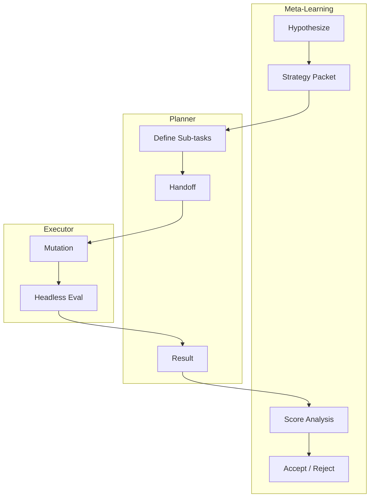

## Dependencies

This skill requires **Python 3.8+** and standard library only.

**Evaluation gate**: NOT included in this primitive. The calling system (e.g., agent-agentic-os os-improvement-loop) is responsible for wrapping this skill with an eval gate and experiment log.

---

# Triple-Loop Learning (`triple-loop-learning`)

Autonomous multi-session improvement architecture that identifies friction, forms hypotheses, and tests mutations against headless benchmarks.

## Contents

- [Dependencies](#dependencies)
- [Constraints](#constraints)
- [Quick start](#quick-start)
- [Architecture](#architecture)
- [Workflow](#workflow)
- [Verification](#verification)
- [References](#references)

## Constraints

- **Objective scoring**: Subjective self-evaluation is prohibited; acceptance requires deterministic tests and score differentials.
- **Process suspension**: Always append `< /dev/null` to background sub-agent execution.
- **Promotion gate**: Only promote mutations where regression suites pass and scores exceed the established baseline.

## Quick start

```bash
pytest plugins/agent-orchestration/tests/test_loop_strategies.py
```

## Architecture



## Workflow

1. **Friction Ingestion**: Ingest logs and cluster repeated friction events.
2. **Hypothesize**: Formulate testable hypothesis ("Modifying X improves metric Y").
3. **Dispatch**: Select backend, author strategy packet, and assign tasks.
4. **Mutate & Score**: Tactical executor mutates code and runs headless tests.

## Verification

```bash
pytest plugins/agent-orchestration/tests/test_loop_strategies.py
git diff --check
```

## References

- [acceptance-criteria.md](references/acceptance-criteria.md) — Acceptance criteria for autonomous improvement cycles.
- [fallback-tree.md](references/fallback-tree.md) — Fallback escalation protocol for loop stagnation.
