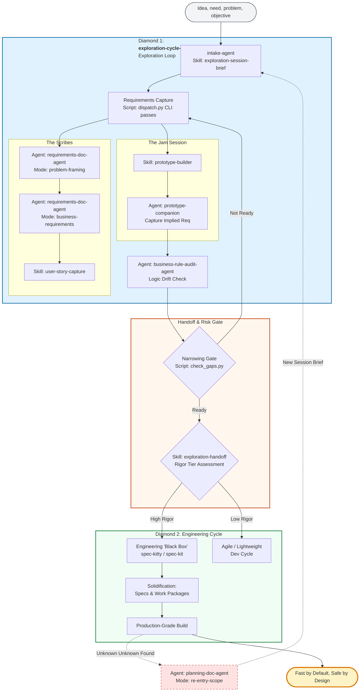

# The GenAI Double Diamond: Vision-to-Execution Framework

The **GenAI Double Diamond** is the foundational framework for this plugin. It bridges the "Maturity Gap" between a raw idea (The Vibe) and a hardened engineering contract (The Spec).

---

## 🖼️ Framework Overview

---

## 1. The First Diamond: Exploration (Discovery)
**Goal:** Pure vision translation and "Vibe" capture.
**Role:** The "Scouting Party."
- **Cheap Exploration:** We use a `dispatch.py` wrapper to call focused, low-cost sub-agents (like `requirements-doc-agent`) for framing and user stories.
- **Prototype-Led Discovery:** Instead of weeks of meetings, we build functional prototypes in minutes to discover the requirements through the code.
- **Eliminating the Bottleneck:** We remove the high-cost BA/UX multi-week gap, allowing visionaries to see their ideas instantly.

## 2. The Transition: Handoff & Risk Analysis
**Goal:** Collapsing the "Vibe" into a "Spec."
**Logic:** A mandatory filter before any high-rigor engineering begins.
- **Rigor Tiers:** We categorize projects based on the **AI Security & Safety Lab's** assessment:
    - **Tier 1 (Low):** Internal R&D. Agile/Lightweight cycle.
    - **Tier 2 (Moderate):** Internal data + standard tools. Red-Teaming mandatory.
    - **Tier 3 (High):** PII/Sensitive data + High-privilege access. Full architectural audit and hardening required.
- **Gatekeeping:** Ensures Tier 3 projects are forced into the full `spec-kitty` engineering lifecycle.

## 3. The Second Diamond: Execution (Solidification)
**Goal:** Structural builds and enterprise-grade validation.
**Role:** The "Static Map."
- **Solidification:** We use the `spec-kitty-plugin` to convert the exploration's output into formal specifications and verified work packages.
- **Logic Drift Audit:** Our `business-rule-audit-agent` cross-references prototype behavior against captured BRDs to ensure the "Fast" build remains "Safe."

---

## 🔄 Bidirectional Re-Entry
Engineering is non-linear. When an "unknown unknown" surfaces during Diamond 2, we formally trigger a **Re-Entry** to Diamond 1 to resolve the vision gap before continuing.

---

## 📂 Key Architectural Diagrams
- [GenAI Double Diamond (Evolved)](assets/diagrams/genai-double-diamond-evolved.mmd)
- [Dual-Loop Architecture](assets/diagrams/dual_loop_architecture.mmd)
- [Exploration Workflow](assets/diagrams/exploration-cycle-workflow.mmd)

## 📚 Technical References
- [Core Architecture](references/architecture.md)
- [Dual-Loop Architecture Pattern](references/dual-loop-architecture.md)
- [Learning-Loop Architecture Pattern](references/learning-loop-architecture.md)
- [Post-Run Survey Workflow](references/post-run-survey.md)

---

*This framework ensures we are **Fast by Default, but Safe by Design.***
