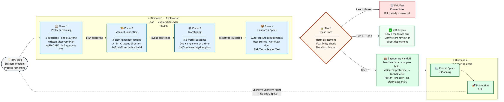

# GenAI Double Diamond: The Operating System for Discovery

The **exploration-cycle-plugin** is a technical implementation of the **GenAI Double Diamond** framework. It provides a non-linear "Scouting Party" for the fuzzy front end of development, bridging the maturity gap between raw intent (The Vibe) and a hardened engineering contract (The Spec).

---

## 🖼️ Framework Overview
See the **[GenAI Double Diamond Flowchart](assets/diagrams/genai-double-diamond.mmd)** for a visual representation of the Scouting Party (Diamond 1) and Engineering Factory (Diamond 2) cycle.

See the **[Hybrid Workflow Diagram](assets/diagrams/hybrid-workflow.mmd)** for how the exploration-cycle-plugin and superpowers skills work together. Blue phases are owned by the exploration-cycle-plugin; green phases are powered by superpowers.

---

## 🧭 Core Philosophy: The Scouting Party

Standard specification kits (like GitHub's `spec-kit`) serve as a "Static Map" for engineering. They are world-class at recording the destination, but they often suffer from **Blank Page Syndrome**—they require structured input to function.

The **exploration-cycle-plugin** solves this by acting as the **Scouting Party**. It is designed for Diamond 1 (Discovery):
- **Right Problem First**: Before asking "what should we build?", the Scouting Party asks "is building the right intervention?" Sometimes the best outcome is a policy change, a process simplification, or a communication fix — not new software. The discovery phase includes an explicit **Intervention Check** to prevent solutioneering.
- **Vision Translation**: Pulls ambiguous intent out of a visionary's head and converts it into structured captures before a spec even exists.
- **Cheap Exploration**: Uses the `dispatch.py` wrapper to call focused, cheap-model sub-agents for framing, BRDs, and user stories. This eliminates the multi-week BA/UX bottleneck.
- **Non-Linear Iteration**: Allows for "breaking things," hallucinating UIs, and testing "What if?" scenarios without premature architectural solidification.
- **Output-Agnostic**: The exploration loop produces whatever the problem actually needs — a software prototype, a process map, a policy recommendation, a requirements document, or a "don't build this" conclusion. All are valid, high-value outcomes.

---

## 🛡️ Safety & Governance: The Rigor Gate

Accountability and traceability are not optional in public sector or enterprise GenAI. This plugin mandates a **Risk & Rigor Assessment** (TierGate) during the handoff phase. The exploration does **not** always route to Opportunity 4 (formal engineering). The TierGate produces one of four outcomes:

| Outcome | Risk Profile | Delivery Path |
| :--- | :--- | :--- |
| **Throwaway** | Idea proved non-viable during exploration. | Session closed. Learning preserved at near-zero cost. |
| **Tier 1 (Low)** | Internal utility, limited/no PII. | BAE deploys directly — no formal engineering needed. |
| **Tier 2 (Moderate)** | Internal data, broader user exposure. | Security review & mandatory Red Teaming before deployment. |
| **Tier 3 (High)** | PII/Sensitive data, public-facing, high-privilege tools. | **Mandatory** formal engineering cycle (Opportunity 4) with architectural hardening. |

This gate ensures that we remain **Fast by Default, but Safe by Design.** Low-risk tools ship immediately. High-risk systems get the rigor they need. Failed ideas die cheaply.

---

## 🔄 Bidirectional Re-Entry: Navigating the Unknown

Engineering is rarely linear. A core design feature of this plugin is the **Bidirectional Re-Entry loop**. 

When Diamond 2 (Execution) uncovers an "unknown unknown"—unresolved ambiguity in the spec, a missed edge case in the data model, or a shift in vision—the `planning-doc-agent` triggers a re-entry cycle back to Diamond 1. This allows the team to resolve the vision gap in a low-cost discovery mode without losing momentum in the production factory.

---

## 🏗️ Technical Architecture

### CLI Invocation Pattern (Cheap Sub-Agents)
To maintain the "Cheap Exploration" economic advantage, all documentation sub-agents are invoked via a dedicated `dispatch.py` wrapper. This avoids context truncation and ensures precise subprocess execution.

```bash
python3 ./skills/exploration-workflow/scripts/dispatch.py \
  --agent ./agents/requirements-doc-agent.md \
  --context exploration/session-brief.md exploration/captures/problem-framing.md \
  --instruction "Mode: business-requirements. Extract functional requirements." \
  --output exploration/captures/brd-draft.md
```

### Directory Structure
```text
exploration-cycle-plugin/
├── OVERVIEW.md                     # GenAI Double Diamond framework overview
├── README.md                       # Entry point and philosophy
├── agents/                         # Vision Translators and Scribes
├── assets/diagrams/                # Technical and philosophical flowcharts
├── references/                     # Architectural patterns (Dual-Loop, Learning-Loop)
├── skills/                         # Technical capabilities
│   ├── business-requirements-capture/
│   ├── business-workflow-doc/
│   ├── discovery-planning/         # NEW: HARD-GATE SME discovery session
│   ├── exploration-handoff/
│   ├── exploration-optimizer/
│   ├── exploration-session-brief/
│   ├── exploration-workflow/
│   ├── prototype-builder/          # NEW: orchestrates full prototype build cycle
│   ├── subagent-driven-prototyping/ # NEW: component-by-component builder
│   ├── user-story-capture/
│   └── visual-companion/           # NEW: layout direction before building
└── requirements.in                 # Python dependencies
```

---

## 🔌 Required Dependency: `orba/superpowers`

The `exploration-cycle-plugin` **requires** the [orba/superpowers](https://github.com/obra/superpowers) plugin to be installed. The exploration workflow does not replace superpowers — it **augments and leverages** its execution discipline skills during Phase 3 (Build).

### Why use execution discipline on prototypes?

The prototype is the **evidence** that the exploration captured the right thing. If the
prototype doesn't match the Discovery Plan, the SME reviews the wrong behavior, the
handoff describes the wrong system, and the engineering team builds from a flawed spec.

Execution discipline during Phase 3 isn't about production code quality — it's about
**exploration accuracy**. Sub-agents keep components focused. Validation checks verify
each component against the plan. Code review catches drift before the SME sees it.
Even a prototype that will be thrown away after handoff must be verified.

### What superpowers provides (used by this plugin)

| Superpowers Skill | Used During | Exploration Purpose |
|---|---|---|
| `using-git-worktrees` | Phase 3 start | Isolated workspace — don't break the existing app while exploring |
| `subagent-driven-development` | Phase 3 build loop | Fresh sub-agent per component — context isolation keeps each piece focused |
| `test-driven-development` | Phase 3 build loop | Verify each component meets a Discovery Plan requirement |
| `requesting-code-review` | Phase 3 review | Plan alignment check — does this demonstrate what the SME asked for? |
| `finishing-a-development-branch` | Phase 3 completion | Structured merge/PR/cleanup flow |

### How the relationship works

```
exploration-cycle-plugin          orba/superpowers
========================          ================
Phase 1: Problem Framing    →    (standalone — no superpowers needed)
Phase 2: Visual Blueprinting →   (standalone — no superpowers needed)
Phase 3: Build               →   uses: worktrees, sub-agent dispatch, TDD, code review
Phase 4: Handoff             →    (standalone — no superpowers needed)
```

The exploration-cycle-plugin owns the **what** (discovery, framing, layout, handoff).
Superpowers owns the **how** (isolation, dispatch, testing, review, finishing).

### Installation

**Claude Code (recommended):**
```bash
# Install superpowers first
claude mcp add-plugin orba/superpowers

# Then install exploration-cycle-plugin
claude mcp add-plugin richfrem/agent-plugins-skills --path plugins/exploration-cycle-plugin
```

**Plugin Manager (if using agent-plugins-skills marketplace):**
```bash
# Install superpowers
uvx --from git+https://github.com/obra/superpowers plugin-install orba/superpowers

# Install exploration-cycle-plugin
uvx --from git+https://github.com/richfrem/agent-plugins-skills plugin-install exploration-cycle-plugin
```

**Manual installation:**
1. Clone `https://github.com/obra/superpowers` into your plugins directory
2. Clone or symlink `plugins/exploration-cycle-plugin` from this repo into your plugins directory
3. Ensure both are discoverable by your agent harness (Claude Code, Copilot CLI, Gemini CLI, etc.)

**Verification:** After installation, confirm both plugins are loaded:
```bash
# In Claude Code
/skills  # should list both exploration-workflow and using-git-worktrees
```

---

## 📜 Attribution & License

### Architectural Foundation: `obra/superpowers`

The `exploration-cycle-plugin` is built on top of
[**obra/superpowers**](https://github.com/obra/superpowers), an open-source
agentic harness by Jesse Vincent (obra). Superpowers is a **required runtime
dependency**, not just an inspiration — the execution discipline skills are
invoked directly during Phase 3.

Patterns adapted from superpowers:

| Pattern | Superpowers Source | Exploration-Cycle Adaptation |
|---|---|---|
| `<HARD-GATE>` execution block | `brainstorming` skill | `discovery-planning` skill — SME approval gate |
| Blank-slate context isolation | `subagent-driven-development` | `subagent-driven-prototyping` — fresh sub-agent per component |
| Two-stage verification | Spec + Quality reviewers | Plan alignment check + Quality check |
| Git worktree isolation | `using-git-worktrees` | Referenced directly — isolated workspace before build |
| TDD cycle | `test-driven-development` | Adapted: evals for skills, tests for code, validation for docs |
| Branch finishing | `finishing-a-development-branch` | Referenced directly — merge/PR/cleanup flow |
| Model tiering | Cheap→standard→capable | 3 dispatch strategies: copilot-cli, claude-subagents, direct |
| Linguistic Detox (persona scan) | Jargon policing | SME language enforcement across all agents |

**superpowers is licensed under the MIT License.**
Full text: https://github.com/obra/superpowers/blob/main/LICENSE

The `exploration-cycle-plugin` is independently authored and not affiliated with or endorsed by obra/superpowers.

---

*See [OVERVIEW.md](OVERVIEW.md) for a deeper conceptual dive into the GenAI Double Diamond.*

## BAE Start Guide

A concise how-to for Business Area Experts (BAEs) has been added: `plugins/exploration-cycle-plugin/BAE-start-guide.md`.
Recommended entrypoint for BAEs: `intake-agent` (interactive). For CLI-driven automation, use `exploration-workflow` as described in the guide.


### BAE Start Guide & Diagram

- BAE Start Guide: [BAE Quick Start — Guided Exploration Process](./BAE-start-guide.md)

High-level process diagram:



