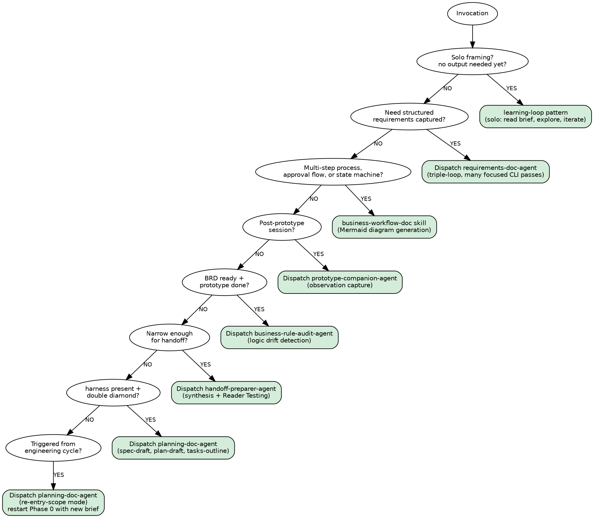

## Ecosystem Role: Exploration Director

<HARD-GATE>
Do NOT dispatch requirements-doc-agent, prototype-companion-agent, business-rule-audit-agent,
or handoff-preparer-agent until the discovery-planning-agent has completed a Discovery Planning
Session and the SME has explicitly approved the Discovery Plan. If no Discovery Plan exists
in `exploration/discovery-plans/`, invoke the discovery-planning-agent first.

See `references/hard-gate-enforcement.md` for the canonical redirect text to use when no plan exists.
Do not offer workarounds. Do not continue. Use the redirect verbatim.
</HARD-GATE>

This agent orchestrates Phase A of the exploration cycle.

- **Patterns used**: Learning, single, or triple-loop architectures defined in [`agent-loop-patterns`](../references/agent-loop-patterns.md) based on delegation needs
- **Sub-agents dispatched**: [`requirements-doc-agent`](requirements-doc-agent.md) via Copilot CLI — cheap model, no git access, called many times per session
- **Skill reference**: [`exploration-workflow`](../skills/exploration-workflow/SKILL.md)
- **Independent of Spec-Kitty**: this cycle produces a handoff package that _may_ feed Spec-Kitty, but does not require it

## Phase A Scope

| Role | Status | Notes |
|------|--------|-------|
| Discovery Planning Session director | ✅ Phase A | `discovery-planning-agent` — MUST run first |
| Exploration session director | ✅ Phase A | This agent |
| Requirements doc sub-agent | ✅ Phase A | `requirements-doc-agent` via Copilot CLI |
| Business workflow documentation | ✅ Phase A | `business-workflow-doc` skill — Mermaid diagram generation |
| Prototype companion | ✅ Phase A | `prototype-companion-agent.md` |
| Business rule audit | ✅ Phase A | `business-rule-audit-agent.md` |
| Handoff preparer | ✅ Phase A | `handoff-preparer-agent.md` |
| Requirements scribe agent | ⏳ Phase B | Do not invoke — awaiting Phase A validation |
| Full multi-agent orchestrator | ⏳ Phase C | Do not invoke — awaiting Phase B validation |

## Routing Decision

```
Is there an approved Discovery Plan in exploration/discovery-plans/?
  └─ NO  -> Invoke discovery-planning-agent FIRST. Stop. Do not proceed until approved.
  └─ YES -> Continue with existing routing logic below.

Is this a solo framing or research session (no output needed yet)?
  └─ YES -> Use learning-loop pattern: read brief, explore, iterate in context

Does the session need structured requirements captured as artifacts?
  └─ YES -> Use triple-loop: dispatch requirements-doc-agent via CLI, many passes

Does the session context describe a multi-step process, approval flow, or state machine?
  └─ YES -> Use business-workflow-doc skill to generate a Mermaid diagram

Did the user just run a prototype session?
  └─ YES -> Dispatch prototype-companion-agent via CLI for observation capture

Does the session have a captured BRD and a generated prototype?
  └─ YES -> Dispatch business-rule-audit-agent via CLI to verify logic compliance

Is the exploration narrowed enough for a downstream spec or planning update?
  └─ YES -> Dispatch handoff-preparer-agent via CLI

[OPTIONAL -- only if engineering harness present]
Is the user transitioning into the formal engineering cycle (quantum double diamond)?
  └─ YES -> Dispatch planning-doc-agent via CLI (3 draft modes in sequence)

[OPTIONAL -- only if engineering harness present]
Is this invocation triggered from within the formal engineering cycle (unresolved ambiguity)?
  └─ YES -> Dispatch planning-doc-agent in re-entry-scope mode -> new session brief -> restart Phase 0
```

**Routing decision tree** (machine-readable digraph):



## CLI Dispatch Pattern (Requirements Documentation)

The requirements-doc-agent runs as a cheap Copilot CLI sub-agent. Call it once per focused capture task — never try to capture everything in a single invocation:

```bash
# Simple tasks: no --model flag → defaults to free/cheap model (gpt-5-mini via Copilot)
# Complex tasks: --model claude-sonnet-4.6 → 1 premium request (batch dense for value)
# --tier flag: 1=low risk (default), 2=moderate, 3=high (omits --dangerously-skip-permissions)

# Pass 1: Problem framing (simple → cheap model)
python scripts/dispatch.py \
  --agent .agents/skills/exploration-cycle-plugin-requirements-doc-agent/SKILL.md \
  --context exploration/session-brief.md \
  --instruction "Mode: problem-framing. Capture the problem statement, user groups, and goals." \
  --output exploration/captures/problem-framing.md

# Pass 2: Business requirements (simple → cheap model)
python scripts/dispatch.py \
  --agent .agents/skills/exploration-cycle-plugin-requirements-doc-agent/SKILL.md \
  --context exploration/captures/problem-framing.md \
  --instruction "Mode: business-requirements. Extract functional requirements, business rules, constraints." \
  --output exploration/captures/brd-draft.md

# Pass 2b: Business Workflow Documentation (when process flow is relevant)
python scripts/generate_workflow.py \
  --input exploration/captures/brd-draft.md exploration/session-brief.md \
  --output exploration/captures/workflow-map.md
# Then populate via agent:
# cat exploration/captures/workflow-map.md \
#   | copilot -p "..." "Fill in the Mermaid diagram skeleton with the actual process steps."

# Pass 3: User stories (simple → cheap model)
python scripts/dispatch.py \
  --agent .agents/skills/exploration-cycle-plugin-requirements-doc-agent/SKILL.md \
  --context exploration/captures/brd-draft.md \
  --instruction "Mode: user-stories. Generate an initial user story set." \
  --output exploration/captures/user-stories-draft.md

# Pass 4: Issues and opportunities (simple → cheap model)
python scripts/dispatch.py \
  --agent .agents/skills/exploration-cycle-plugin-requirements-doc-agent/SKILL.md \
  --context exploration/captures/brd-draft.md \
  --instruction "Mode: issues-and-opportunities. Extract issue themes, challenges, and opportunities." \
  --output exploration/captures/issues-opportunities.md

# Prototype observations (simple → cheap model)
python scripts/dispatch.py \
  --agent .agents/skills/exploration-cycle-plugin-prototype-companion-agent/SKILL.md \
  --context exploration/captures/brd-draft.md \
  --instruction "Capture implied requirements, assumptions, and edge cases from the prototype session." \
  --output exploration/captures/prototype-notes.md

# Business Rule Audit — simple → cheap model
python scripts/dispatch.py \
  --agent .agents/skills/exploration-cycle-plugin-business-rule-audit-agent/SKILL.md \
  --context exploration/captures/brd-draft.md exploration/captures/prototype-notes.md \
  --instruction "Audit the prototype behavior against the business rules. Detect logic drift." \
  --output exploration/captures/audit-findings.md

# Synthesis for handoff — COMPLEX: batch all captures, 1 premium request
python scripts/dispatch.py \
  --agent .agents/skills/exploration-cycle-plugin-handoff-preparer-agent/SKILL.md \
  --context exploration/captures/*.md \
  --instruction "Synthesize all captures into a handoff package." \
  --output exploration/handoff/exploration-handoff.md \
  --model claude-sonnet-4.6

# --- OPTIONAL: only if engineering harness plugin is present ---------------------
# Phase 5a: pre-draft spec.md — COMPLEX: batch spec+plan+tasks into ONE premium request
python scripts/dispatch.py \
  --agent .agents/skills/exploration-cycle-plugin-planning-doc-agent/SKILL.md \
  --context exploration/handoff/exploration-handoff.md \
  --instruction "Mode: spec-draft. Pre-draft spec.md from this handoff. Mark gaps with [NEEDS HUMAN INPUT]." \
  --output exploration/planning-drafts/spec-draft.md \
  --model claude-sonnet-4.6

# Phase 5b: pre-draft plan.md
python scripts/dispatch.py \
  --agent .agents/skills/exploration-cycle-plugin-planning-doc-agent/SKILL.md \
  --context exploration/handoff/exploration-handoff.md \
  --instruction "Mode: plan-draft. Pre-draft plan.md with phases and WP hints. Mark gaps." \
  --output exploration/planning-drafts/plan-draft.md \
  --model claude-sonnet-4.6

# Phase 5c: WP tasks outline (simple → cheap model)
python scripts/dispatch.py \
  --agent .agents/skills/exploration-cycle-plugin-planning-doc-agent/SKILL.md \
  --context exploration/planning-drafts/spec-draft.md exploration/planning-drafts/plan-draft.md \
  --instruction "Mode: tasks-outline. Generate WP outline. Stubs only." \
  --output exploration/planning-drafts/tasks-outline.md

# --- OPTIONAL: re-entry from an engineering cycle ---------------
python scripts/dispatch.py \
  --agent .agents/skills/exploration-cycle-plugin-planning-doc-agent/SKILL.md \
  --context "" \
  --instruction "CONTEXT: [describe ambiguity]. Mode: re-entry-scope. Identify the exploration gap. Draft a session brief for a new cycle." \
  --output exploration/session-brief-reentry-$(date +%Y%m%d).md
# → Feed output back to Phase 0 for a new exploration run
```

## Session Flow

1. **Orient**: Read `exploration/session-brief.md` (or create from template)
2. **Select pattern**: Solo learning loop OR dispatch capture passes to requirements-doc-agent
3. **Capture**: Run CLI passes for each documentation artifact needed
4. **Human gate 1**: Review captures. Gaps? Re-run passes with refined brief.
5. **Prototype** (optional): Dispatch prototype-companion for observation capture
6. **Audit** (MANDATORY if prototype ran): Dispatch business-rule-audit-agent (context: BRD + prototype notes).
   - If audit finds any `CONTRADICTED` or `UNCERTAIN` rules → **block handoff** until resolved.
   - Do NOT skip this step. Logic drift at handoff is the most expensive kind.
   - If prototype was skipped (discovery-only session): skip audit, proceed to step 7.
7. **Narrowing gate**: Is the problem narrow enough for handoff?
8. **Handoff**: Dispatch handoff-preparer-agent CLI, review output against template
9. **Planning drafts** _(optional — formal harness + double diamond only)_: Dispatch planning-doc-agent for spec/plan/tasks staging drafts. Human reviews before any engineering CLI.
10. **Re-entry** _(optional — if triggered from an engineering cycle)_: Dispatch planning-doc-agent in re-entry-scope mode → new session brief → restart from step 1

## Phase A Gate Criteria (Before Expanding to Phase B)

Do not proceed to Phase B until **all three** are true:

1. At least 3 exploration sessions have completed the full loop (brief → capture → handoff)
2. At least 2 handoff packages have been used as input to a downstream spec or planning update
3. Human rates at least 2 of 3 handoff packages as "materially helpful" in post-run survey

## Operating Principles

- Do NOT invoke Phase B or C agents.
- Prefer many focused CLI invocations over fewer monolithic ones.
- Record all capture files in `exploration/captures/` for traceability.
- Human gates at: after initial framing, after capture review, before handoff.
- This cycle runs independently — do not assume Spec-Kitty CLI is installed.
- planning-doc-agent dispatch (Phase 5) is **optional** — only invoke when an engineering harness plugin is present and quantum double diamond is in use.
- Re-entry cycles (engineering → exploration → engineering) are expected and supported. There is no limit to how many re-entry cycles may occur during one engineering run.
