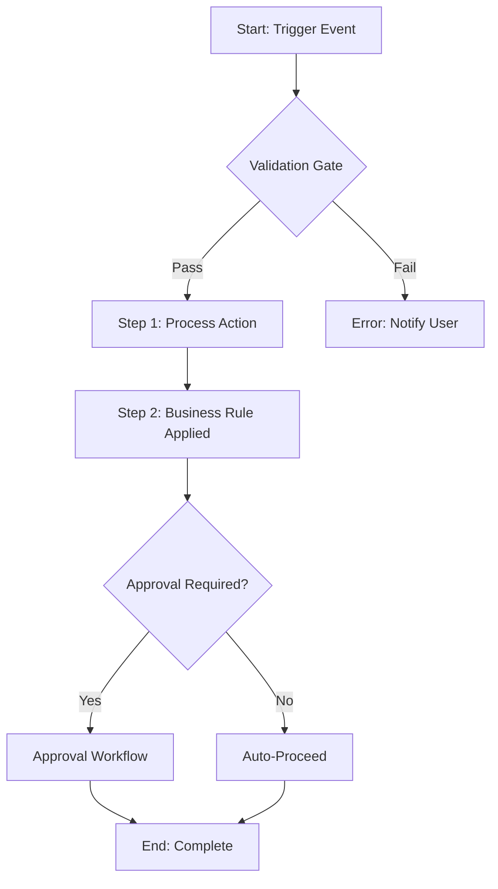

# Business Workflow Documentation

Generate visual Mermaid flowcharts from exploration session captures and session briefs.

## Usage

```bash
python3 ./scripts/generate_workflow.py \
  --input <capture_file_or_glob> \
  --output <output_file.md> \
  --type <flowchart|stateDiagram|sequenceDiagram>
```

**Flags:**
- `--input PATH` : Input file(s) — session brief, BRD draft, or problem framing capture
- `--output PATH` : Output markdown file (default: `exploration/captures/workflow-map.md`)
- `--type TYPE` : Diagram type: `flowchart` (default), `stateDiagram`, or `sequenceDiagram`
- `--title TEXT` : Optional diagram title

## Capture Pass (CLI dispatch pattern)

```bash
cat exploration/session-brief.md exploration/captures/brd-draft.md \
  | copilot -p "$(cat .agents/skills/exploration-cycle-plugin-requirements-doc-agent/SKILL.md)" \
    "Mode: workflow-map. Generate a Mermaid flowchart diagram of the core business process described in this context. Use a flowchart TD layout. Label each step clearly. Include decision nodes for branches and validation gates." \
  > exploration/captures/workflow-map.md
```

## Output Format

The skill always outputs a Markdown file with one or more fenced Mermaid code blocks:

````markdown
# Business Workflow: [Process Name]
Source: [input file(s)]
Date: [today]

## Core Process Flow



## Open Questions
- [NEEDS HUMAN INPUT: step ordering unclear from captures]
````

## Diagram Types

| Type | Use When |
|------|----------|
| `flowchart` | Sequential multi-step processes with decision branches |
| `stateDiagram` | Object lifecycle states (e.g., order status transitions) |
| `sequenceDiagram` | Service-to-service or user-to-system interaction flows |

## Anti-Hallucination Rules

- Do NOT invent process steps not described in the source captures.
- If step ordering is ambiguous, list the options and mark `[NEEDS HUMAN INPUT]`.
- Do NOT add error handling paths unless explicitly mentioned in the source.
- Mark every diagram as `DRAFT` until confirmed by the human explorer.

<example>
Context: User has completed problem framing and BRD draft.
user: "Can you map out the checkout flow based on what we've captured?"
assistant: "I'll use `business-workflow-doc` to generate a Mermaid flowchart from your BRD draft."
</example>

<example>
Context: User wants to visualize a state machine.
user: "Document the order status workflow as a state diagram."
assistant: "I'll use `business-workflow-doc` with `--type stateDiagram` to map the order lifecycle."
</example>

<example>
Context: Brownfield re-entry, documenting existing system behavior.
user: "Map the current approval process before we redesign it."
assistant: "I'll run `business-workflow-doc` against the current-system capture to produce a baseline flowchart."
</example>
