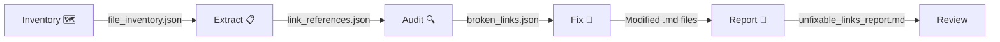

# Link Checker Plugin 🔗

Validate and auto-repair broken documentation links across your repository using
file inventory mapping and unique-basename matching.

## Usage Guide

The autonomous agent executes a strict **5-Step Pipeline**: **Inventory → Extract → Audit → Fix → Report**

### Tell your agent:
```text
"Run the link checker to fix any broken documentation paths."
"Move docs/auth.md to docs/api/auth.md and run the link checker."
```

### Script Location
Scripts live at `./scripts/` in the plugin root. When installed into an agent environment, they are available at `scripts/` relative to the skill directory. Always run from the **repository root** you want to scan.

For installation instructions, consult the authoritative project hub:
> ### 👉 [INSTALL.md](https://github.com/richfrem/agent-plugins-skills/blob/main/INSTALL.md)

### Direct CLI Usage (without an Agent)
```bash
cd /path/to/your/repo

# Full pipeline (one-liner)
python3 ./scripts/01_build_file_inventory.py && \
python3 ./scripts/02_extract_link_references.py && \
python3 ./scripts/03_audit_broken_links.py && \
python3 ./scripts/04_autofix_unique_links.py --dry-run && \
python3 ./scripts/04_autofix_unique_links.py --backup && \
python3 ./scripts/05_report_unfixable_links.py
```

### How the Fixer Works

1. Scans `.md` files for `[text](broken/path)` and `` patterns
2. Extracts the basename from broken paths
3. Looks up the basename in `file_inventory.json`
4. **Unique match** → rewrites with correct relative path
5. **Ambiguous** (multiple files with same name) → skips with warning
6. **Not found** → left as-is; appears in `unfixable_links_report.md`

### Safety Features
- Use `--dry-run` to preview all changes before any file is modified
- Use `--backup` to create `.bak` copies before modifying files
- Only modifies files listed in `broken_links.json` (from Step 3)
- Skips `README.md` basename matches (too ambiguous across repos)
- Preserves anchor fragments (`#section`)
- Skips links inside fenced code blocks
- Excludes `.git`, `node_modules`, `.venv`, `bin`, `obj` from scanning

---

## Architecture

See [workflow diagram](assets/diagrams/workflow.mmd) for the full 5-step flow.



Additional diagrams:
- [logic.mmd](assets/diagrams/logic.mmd) — Internal decision logic
- [workflow.mmd](assets/diagrams/workflow.mmd) — User workflow
- [link-checker-workflow.mmd](assets/diagrams/link-checker-workflow.mmd) — Full sequence diagram

### Plugin Directory Structure
```
link-checker/
├── .claude-plugin/
│   └── plugin.json              # Plugin identity
├── scripts/
│   ├── 01_build_file_inventory.py   # The Mapper
│   ├── 02_extract_link_references.py # The Extractor
│   ├── 03_audit_broken_links.py     # The Auditor
│   ├── 04_autofix_unique_links.py   # The Fixer
│   └── 05_report_unfixable_links.py # The Reporter
├── skills/
│   └── link-checker-agent/
│       ├── SKILL.md             # Auto-invoked QA skill
│       ├── scripts/             # Symlinks → ../../scripts/
│       └── references/          # Symlinks → ../../references/
└── README.md
```

---

## License

MIT

## Plugin Components

### Skills
- `link-checker-agent`
