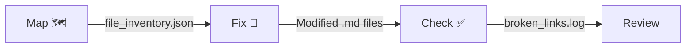

# Link Checker Plugin 🔗

Validate and auto-repair broken documentation links across your repository using
file inventory mapping and fuzzy matching.

## Installation

### Local Development
```bash
claude --plugin-dir ./plugins/link-checker
```

### From Marketplace (when published)
```
/plugin install link-checker
```

### Prerequisites
- **Claude Code** ≥ 1.0.33
- **Python** ≥ 3.8 (stdlib only — no pip dependencies)

### Verify Installation
With native plugins enabled, your agent autonomously detects the task and executes the required python scripts.

---

## Usage Guide

The autonomous agent executes a strict 3-Step Protocol: **Order matters: Map → Fix → Verify**

### Tell your agent:
```text
"Run the link checker to fix any broken documentation paths."
"Move docs/auth.md to docs/api/auth.md and run the link checker."
```

### Direct CLI Usage (without an Agent)
```bash
cd /path/to/your/repo

# Step 1: Map
python3 ./scripts/map_repository_files.py

# Step 2: Fix
python3 ./scripts/smart_fix_links.py

# Step 3: Check
python3 ./scripts/check_broken_paths.py
python3 ./scripts/check_broken_paths.py --file docs/specific.md
```

### How the Fixer Works

1. Scans `.md` files for `[text](broken/path)` patterns
2. Extracts the basename from broken paths
3. Looks up the basename in `file_inventory.json`
4. **Unique match** → rewrites with correct relative path
5. **Ambiguous** (multiple files with same name) → skips with warning
6. **Not found** → marks as `(Reference Missing: filename)`

### Safety Features
- Only modifies files with actual broken links
- Skips `README.md` basename matches (too ambiguous across repos)
- Preserves anchor fragments (`#section`)
- Excludes `.git`, `node_modules`, `.venv`, `bin`, `obj` from scanning

---

## Architecture

See [docs/link-checker-workflow.mmd](assets/diagrams/link-checker-workflow.mmd) for the full
sequence diagram.



Additional diagrams (from original tool):
- [logic.mmd](assets/diagrams/logic.mmd) — Internal decision logic
- [workflow.mmd](assets/diagrams/workflow.mmd) — User workflow
- [unpacking.mmd](assets/diagrams/unpacking.mmd) — Legacy unpacking flow

### Plugin Directory Structure
```
link-checker/
├── .claude-plugin/
│   └── plugin.json              # Plugin identity
├── skills/
│   └── link-checker-agent/
│       ├── SKILL.md             # Auto-invoked QA skill
│       ├── scripts/
│       │   ├── map_repository_files.py  # The Mapper
│       │   ├── smart_fix_links.py       # The Fixer
│       │   └── check_broken_paths.py    # The Inspector
│       └── references/
│           ├── link-checker-workflow.mmd  # Sequence diagram
│           ├── logic.mmd                  # Internal logic
│           ├── workflow.mmd               # User workflow
│           └── unpacking.mmd             # Legacy flow
└── README.md
```

---

## License

MIT

## Plugin Components

### Skills
- `link-checker-agent`

