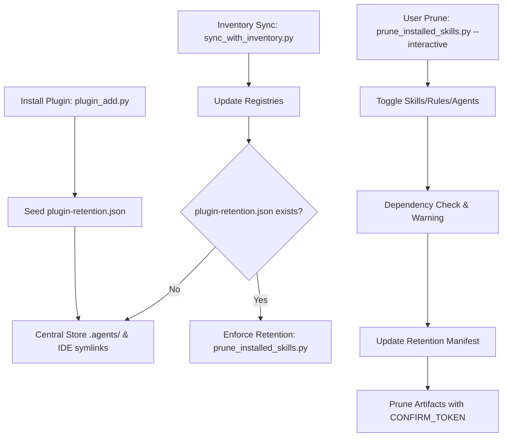

# Component Retention Workflow

This document outlines the lifecycle of component retention across installation, post-sync enforcement, and selective pruning.

## Retention Stages

1. **Seeding (Day 1)**:
   - `plugin_add.py` or `plugin_installer.py` records newly installed components in `plugin-retention.json`.
   - Granular toggles during install allow selecting a subset of skills.
2. **Maintenance (Day 2+)**:
   - `prune_installed_skills.py --interactive` allows reviewing installed components per plugin.
   - Space toggles components; `a` toggles all; `/` searches; `q` exits.
   - Inline dependency advisory alerts if a retained skill references an unselected skill or rule.
3. **Automated Enforcement (Post-Sync)**:
   - `sync_with_inventory.py` automatically applies pruning based on `plugin-retention.json` unless `--no-prune` is passed.
