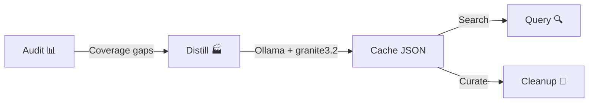

# RLM Factory Plugin 🏭

Recursive Language Model factory — distill repository files into semantic summaries
using Ollama for instant context retrieval.

## Installation

### Local Development
```bash
claude --plugin-dir ./plugins/rlm-factory
```

### Prerequisites
- **Claude Code** ≥ 1.0.33
- **Python** ≥ 3.8
- **Ollama** (Required for `distill` command):
    1.  **Install**: `brew install ollama` or download from [ollama.com](https://ollama.com/)
    2.  **Pull Model**: `ollama pull granite3.2:8b` (default profile model)
    3.  **Run Server**: `ollama serve` (must be running in the background)
- **Python Dependencies**: `pip install requests python-dotenv`

> **Note:** Only `distill` requires Ollama. The `query`, `audit`, and `cleanup` commands
> work offline — they just read/write JSON.

### Verify Installation
After loading, `/help` should show:
```
/rlm-factory:distill   Summarize files via Ollama
/rlm-factory:query     Search the semantic ledger
/rlm-factory:audit     Report cache coverage
/rlm-factory:cleanup   Remove stale entries
```

---

## Configuration

### Environment Variables (.env)
Create a `.env` file in the **project root** (`.env`) to customize the factory:

```bash
# Configuration in <project_root>/.env
OLLAMA_MODEL=granite3.2:8b
OLLAMA_HOST=http://localhost:11434

# Optional Cache Overrides
# RLM_TOOL_CACHE=.agent/learning/rlm_tool_cache.json
# RLM_SUMMARY_CACHE=.agent/learning/rlm_summary_cache.json
```

---

## Usage Guide

### Quick Start
```bash
# 1. Check what's already memorized
/rlm-factory:audit

# 2. Search for a topic (no Ollama needed)
/rlm-factory:query "authentication"

# 3. Distill missing files (requires Ollama running)
ollama serve  # in another terminal
/rlm-factory:distill

# 4. Clean up deleted files
/rlm-factory:cleanup --apply
```

### Memory Banks (Profiles)

| Profile | Flag | Cache File | Use For |
|:---|:---|:---|:---|
| **Project** | `--type project` | `rlm_summary_cache.json` | Project Docs, READMEs |
| **Tool** | `--type tool` | `rlm_tool_cache.json` | Python scripts, CLI tools |

---

## Customizing Your Factory 🛠️

The RLM Factory is now entirely manifest-driven and project-agnostic. You can customize the distillation behavior by editing the files in the `resources/` directory:

### 1. `resources/manifest-index.json`
This is the profile registry. You can add or rename profiles here:
```json
"project": {
    "description": "Custom Docs Profile",
    "manifest": "plugins/rlm-factory/resources/rlm_manifest.json",
    "cache": ".agent/learning/custom_cache.json",
    "parser": "directory_glob",
    "prompt_path": "plugins/rlm-factory/resources/prompts/rlm/custom_prompt.md",
    "env_prefix": "RLM_CUSTOM",
    "allowed_suffixes": [".md", ".txt"],
    "llm_model": "granite3.2:8b"
}
```

### 2. `resources/rlm_manifest.json`
Defines the **Source of Truth** for which files to process. Use this for structured data (like `core_files`).

### 3. `resources/distiller_manifest.json`
Defines the **Broad Scope** (include/exclude patterns) for recursive distillation.

### 4. `resources/prompts/rlm/`
Store your customized LLM summarization prompts here.

---

### Commands Reference

| Command | Script | Ollama? | Description |
|:---|:---|:---|:---|
| `/rlm-factory:distill` | `distiller.py` | ✅ | LLM-powered file summarization |
| `/rlm-factory:gap-fill` | Sub-Agent | ❌ | Agent-powered summarization (faster, higher quality) |
| `/rlm-factory:query` | `query_cache.py` | ❌ | Search the semantic ledger |
| `/rlm-factory:audit` | `inventory.py` | ❌ | Coverage report (fs vs cache) |
| `/rlm-factory:cleanup` | `cleanup_cache.py` | ❌ | Remove stale/orphan entries |

### Agent Distillation (The "Brain Upgrade")

For small batches (< 10 files), the agent can distill directly without Ollama by
reading the file and writing the summary into the cache JSON. This is 3-5x faster
and produces higher-quality summaries using frontier model intelligence.

See `agents/rlm-gap-fill.md` for the full Agent Distill protocol.

---

## Architecture

See [docs/rlm-factory-workflow.mmd](docs/rlm-factory-workflow.mmd) for the full
sequence diagram.



Additional diagrams:
- [distillation_process.mmd](skills/rlm-curator/references/distillation_process.mmd) — Detailed data flow
- [search_process.mmd](skills/rlm-curator/references/search_process.mmd) — Summary-first search
- [logic.mmd](skills/rlm-curator/references/logic.mmd) — Internal decision logic
- [workflow.mmd](skills/rlm-curator/references/workflow.mmd) — User workflow

### How It Works
1. **Distiller** reads each file, computes a content hash
2. If hash differs from cache → sends content to Ollama with a summarization prompt
3. Ollama (granite3.2:8b) returns a dense semantic summary
4. Summary is persisted to JSON immediately (crash-resilient)
5. **Query** does O(1) substring search across all summaries
6. **Cleanup** compares cache keys against filesystem to remove stale entries

### Plugin Directory Structure
```
rlm-factory/
├── .claude-plugin/
│   └── plugin.json              # Plugin identity + runtime deps
├── commands/
│   ├── distill.md               # /rlm-factory:distill
│   ├── rlm-factory_gap-fill.md  # /rlm-factory:gap-fill
│   ├── query.md                 # /rlm-factory:query
│   ├── audit.md                 # /rlm-factory:audit
│   └── cleanup.md               # /rlm-factory:cleanup
├── skills/
│   ├── rlm-curator/
│   │   ├── SKILL.md             # Auto-invoked curator skill
│   │   ├── references/          # Architecture docs, diagrams, research
│   │   └── scripts/             # distiller.py, query_cache.py, etc.
│   └── ollama-launch/
│       └── SKILL.md             # Ollama server management
├── agents/
│   └── rlm-gap-fill.md          # Primary Gap-Fill Sub-Agent configuration
├── resources/
│   ├── manifest-index.json      # Profile registry
│   ├── distiller_manifest.json  # Default scope config
│   └── rlm_manifest.json        # Legacy manifest
├── requirements.in              # Python dependencies
└── README.md
```

---

## License

MIT
