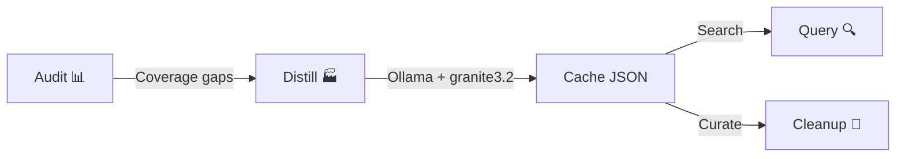

# RLM Factory Plugin 🏭

Recursive Language Model factory — distill repository files into semantic summaries
using Ollama for instant context retrieval.

## Installation

### Local Development
```bash
claude --plugin-dir ./plugins/rlm-factory
```

### Prerequisites
- **Claude Code** ≥ 1.0.33
- **Python** ≥ 3.8
- **Ollama** (Required for `distill` command):
    1.  **Install**: `brew install ollama` or download from [ollama.com](https://ollama.com/)
    2.  **Pull Model**: `ollama pull granite3.2:8b` (default profile model)
    3.  **Run Server**: `ollama serve` (must be running in the background)
- **Python Dependencies**: `pip install requests python-dotenv`

> **Note:** Only `distill` requires Ollama. The `query`, `audit`, and `cleanup` commands
> work offline — they just read/write JSON.

### Verify Installation
After loading, the following skills should be available:
- `rlm-init` (Bootstrap caching)
- `rlm-search` (Search semantic ledger)
- `rlm-curator` (Audit and analyze cache coverages)
- `rlm-distill-agent` / `rlm-distill-ollama` (Summarization engines)
- `rlm-cleanup-agent` (Pruning entries)

---

## Configuration

### Profiles (`rlm_profiles.json`)

Configuration lives in `.agent/learning/rlm_profiles.json` (no `.env` required).
Profiles declare which files to index, where to store the cache, and which model to use.

See `resources/` for manifest files and `rlm_profiles.json` for profile templates.

## Usage Guide

### Quick Start
```bash
# 1. Check what's already memorized
python3 ./scripts/inventory.py --profile project

# 2. Search for a topic (no Ollama needed)
python3 ./scripts/query_cache.py "authentication" --profile project

# 3. Distill missing files (requires Ollama running)
ollama serve  # in another terminal
python3 ./scripts/distiller.py --profile project

# 4. Clean up deleted files
python3 ./scripts/cleanup_cache.py --profile project --apply
```

### Memory Banks (Profiles)

| Profile | Flag | Cache File | Use For |
|:---|:---|:---|:---|
| **Project** | `--type project` | `rlm_summary_cache.json` | Project Docs, READMEs |
| **Tool** | `--type tool` | `rlm_tool_cache.json` | Python scripts, CLI tools |

---

## Customizing Your Factory 🛠️

The RLM Factory is now entirely manifest-driven and project-agnostic. You can customize the distillation behavior by editing the files in the `resources/` directory:

### 1. `resources/manifest-index.json`
This is the profile registry. You can add or rename profiles here:
```json
"project": {
    "description": "Custom Docs Profile",
    "manifest": "assets/resources/rlm_manifest.json",
    "cache": ".agent/learning/custom_cache.json",
    "parser": "directory_glob",
    "prompt_path": "./resources/prompts/rlm/custom_prompt.md",
    "env_prefix": "RLM_CUSTOM",
    "allowed_suffixes": [".md", ".txt"],
    "llm_model": "granite3.2:8b"
}
```

### 2. `resources/rlm_manifest.json`
Defines the **Source of Truth** for which files to process. Use this for structured data (like `core_files`).

### 3. `resources/distiller_manifest.json`
Defines the **Broad Scope** (include/exclude patterns) for recursive distillation.

### 4. `resources/prompts/rlm/`
Store your customized LLM summarization prompts here.

---

### Skills Reference

| Skill | Script | Ollama? | Description |
|:---|:---|:---|:---|
| `rlm-distill-ollama` | `skills/rlm-distill-ollama/scripts/distiller.py` | Yes | Ollama batch summarization |
| `rlm-distill-agent` | `skills/rlm-distill-agent/scripts/inject_summary.py` | No | Agent-powered summarization |
| `rlm-search` | `skills/rlm-search/scripts/query_cache.py` | No | Search the semantic ledger |
| `rlm-curator` | `skills/rlm-curator/scripts/inventory.py` | No | Coverage report (fs vs cache) |
| `rlm-cleanup-agent` | `skills/rlm-cleanup-agent/scripts/cleanup_cache.py` | No | Remove stale/orphan entries |

### Agent Distillation (The "Brain Upgrade")

For small batches (< 10 files), the agent can distill directly without Ollama by
reading the file and writing the summary into the cache JSON. This is 3-5x faster
and produces higher-quality summaries using frontier model intelligence.

See `skills/rlm-distill-agent/SKILL.md` for the full Agent Distill protocol.

---

## Architecture

See [docs/rlm-factory-workflow.mmd](docs/rlm-factory-workflow.mmd) for the full
sequence diagram.


```mermaid
graph LR
    A["Audit 📊"] -->|Coverage gaps| B["Distill 🏭"]
    B -->|Ollama + granite3.2| C["Cache JSON"]
    C -->|Search| D["Query 🔍"]
    C -->|Curate| E["Cleanup 🧹"]
```

Additional diagrams (in `references/diagrams/`):
- [search_process.mmd](references/diagrams/search_process.mmd) -- 3-phase search strategy (RLM -> VDB -> Grep)
- [rlm-factory-architecture.mmd](references/diagrams/rlm-factory-architecture.mmd) -- RLM vs Vector DB routing
- [rlm-factory-dual-path.mmd](references/diagrams/rlm-factory-dual-path.mmd) -- Super-RAG context injection
- [rlm-factory-workflow.mmd](references/diagrams/rlm-factory-workflow.mmd) -- Full distill/audit/query/cleanup lifecycle
- [workflow.mmd](references/diagrams/workflow.mmd) -- Build + query decision flow
- [logic.mmd](references/diagrams/logic.mmd) -- Install + distill + consume overview

### How It Works
1. **Distiller** reads each file, computes a content hash
2. If hash differs from cache → sends content to Ollama with a summarization prompt
3. Ollama (granite3.2:8b) returns a dense semantic summary
4. Summary is persisted to JSON immediately (crash-resilient)
5. **Query** does O(1) substring search across all summaries
6. **Cleanup** compares cache keys against filesystem to remove stale entries

### Plugin Directory Structure
```
rlm-factory/
+-- .claude-plugin/
|   +-- plugin.json              # Plugin identity + runtime deps
+-- scripts/
|   +-- rlm_config.py            # Shared utility
|   +-- inventory.py             # Shared utility
|   +-- debug_rlm.py             # Shared utility
+-- skills/
|   +-- rlm-curator/             # WRITE skill: audit/overall curation
|   |   +-- SKILL.md
|   |   +-- scripts/             # Symlinks to inventory.py, rlm_config.py
|   |   +-- references/          # Architecture .mmd diagrams
|   +-- rlm-search/              # READ skill: 3-phase search protocol
|   |   +-- scripts/query_cache.py
|   +-- rlm-distill-agent/       # WRITE skill: Agent-based fast RLM injection
|   |   +-- scripts/inject_summary.py
|   +-- rlm-distill-ollama/      # WRITE skill: Batch processing script
|   |   +-- scripts/distiller.py
|   +-- rlm-cleanup-agent/       # WRITE skill: Cache pruning
|   |   +-- scripts/cleanup_cache.py
|   +-- rlm-init/                # SETUP skill: New configurations
|   +-- ollama-launch/           # SETUP skill: Ollama management
+-- resources/
|   +-- manifest-index.json      # Profile registry
|   +-- distiller_manifest.json  # Default scope config
|   +-- prompts/rlm/             # LLM summarization prompts
+-- requirements.in              # Python dependencies (pip-compile)
+-- README.md
```

---

## License

MIT

## Plugin Components

### Skills
- `ollama-launch`
- `rlm-cleanup-agent`
- `rlm-curator`
- `rlm-distill-agent`
- `rlm-distill-ollama`
- `rlm-init`
- `rlm-search`

### Scripts
- `scripts/inventory.py`
- `scripts/rlm_config.py`
- `skills/rlm-cleanup-agent/scripts/cleanup_cache.py`
- `skills/rlm-curator/scripts/debug_rlm.py`
- `skills/rlm-distill-agent/scripts/inject_summary.py`
- `skills/rlm-distill-ollama/scripts/distiller.py`
- `skills/rlm-search/scripts/query_cache.py`

### Dependencies
- `vector-db`
- `agent-loops`

