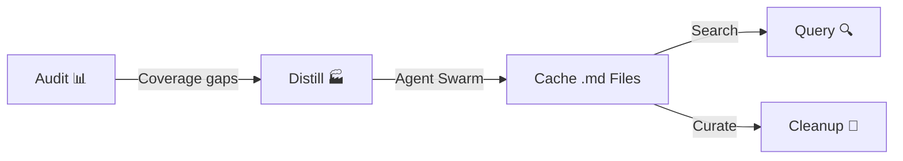

# RLM Factory Plugin 🏭

Recursive Language Model factory — distill repository files into dense semantic summaries
for O(1) keyword retrieval. **Works completely standalone** with zero external plugin deps.
Pair with vector-db and/or obsidian-wiki-engine for a full Super-RAG 3-tier search stack.

## Standalone vs Combined

**RLM factory is a complete product on its own.** Every file read once, summarized once,
cached as plain text JSON. Searching is O(1) keyword lookup — no embeddings, no inference.

| Mode | What you get | External deps in `.agents/` |
|:-----|:-------------|:----------------------------|
| **Standalone** | O(1) keyword search across all file summaries | None |
| **+ vector-db** | Phase 1 narrows candidates; Phase 2 finds by meaning | `vector-db-init/` |
| **+ obsidian-wiki-engine** | RLM distillation layers per concept node; wiki query uses RLM pre-filter | `obsidian-wiki-builder/` |
| **Full Super-RAG** | All three: keyword → semantic → concept node | Both above |

## Start Here

**Skills run from `.agents/skills/` (the deployed runtime), not from `plugins/`.**

```bash
# Verify this plugin is installed and active
ls .agents/skills/rlm-init/           # should exist
ls .agents/agents/rlm-factory-init-agent.md  # should exist

# If missing — install via:
uvx --from git+https://github.com/richfrem/agent-plugins-skills plugin-add richfrem/agent-plugins-skills
# or: npx skills add richfrem/agent-plugins-skills
# or: see INSTALL.md
```

**To initialize:** invoke `rlm-factory-init-agent` (or say "initialize RLM" / "set up my semantic cache").
The agent asks what mode you want (standalone or combined with vector-db / obsidian-wiki-engine).

## Prerequisites

- **Claude Code** ≥ 1.0.33
- **Python** ≥ 3.8
- **Python Dependencies**: `pip install requests python-dotenv`

## Verify Installation

After loading, the following skills should be available in `.agents/skills/`:
- `rlm-init` — Bootstrap caching and profile setup
- `rlm-search` — O(1) keyword search across the summary ledger
- `rlm-curator` — Audit coverage, analyze cache gaps
- `rlm-distill-agent` — Agent-powered summarization engine
- `rlm-cleanup-agent` — Pruning stale/orphan entries

```bash
# Confirm skills are installed
ls .agents/skills/ | grep rlm
```

---

## Configuration

### Profiles (`rlm_profiles.json`)

Configuration lives in `.agent/learning/rlm_profiles.json` (no `.env` required).
Profiles declare which files to index, where to store the cache, and which model to use.

See `resources/` for manifest files and `rlm_profiles.json` for profile templates.

## Usage Guide

### Quick Start
```bash
# 1. Check what's already memorized
python ./scripts/inventory.py --profile project

# 2. Search for a topic (natively across markdown)
python ./scripts/query_cache.py "authentication" --profile project

# 3. Distill missing files (Automatic via Swarm)
# Note: Limit --workers 2 when using gpt-5-mini free tier
python ./scripts/swarm_run.py --engine copilot --workers 2 ...

# 4. Clean up deleted files
python ./scripts/cleanup_cache.py --profile project --apply
```

### Memory Banks (Profiles)

| Profile | Flag | Cache Location | Use For |
|:---|:---|:---|:---|
| **Project** | `--type project` | `rlm_summary_cache/` | Project Docs, READMEs |
| **Tool** | `--type tool` | `rlm_tool_cache/` | Python scripts, CLI tools |

---

## Customizing Your Factory 🛠️

The RLM Factory is now entirely manifest-driven and project-agnostic. You can customize the distillation behavior by editing the files in the `resources/` directory:

### 1. `resources/manifest-index.json`
This is the profile registry. You can add or rename profiles here:
```json
"project": {
    "description": "Custom Docs Profile",
    "manifest": "assets/resources/rlm_manifest.json",
    "cache": ".agent/learning/custom_cache.json",
    "parser": "directory_glob",
    "prompt_path": "./resources/prompts/rlm/custom_prompt.md",
    "env_prefix": "RLM_CUSTOM",
    "allowed_suffixes": [".md", ".txt"],
    "llm_model": "granite3.2:8b"
}
```

### 2. `resources/rlm_manifest.json`
Defines the **Source of Truth** for which files to process. Use this for structured data (like `core_files`).

### 3. `resources/distiller_manifest.json`
Defines the **Broad Scope** (include/exclude patterns) for recursive distillation.

### 4. `resources/prompts/rlm/`
Store your customized LLM summarization prompts here.

---

### Skills Reference

| Skill | Script | Description |
|:---|:---|:---|
| `rlm-distill-agent` | `skills/rlm-distill-agent/scripts/inject_summary.py` | Agent-powered summarization |
| `rlm-search` | `skills/rlm-search/scripts/query_cache.py` | Search the semantic ledger |
| `rlm-curator` | `skills/rlm-curator/scripts/inventory.py` | Coverage report (fs vs cache) |
| `rlm-cleanup-agent` | `skills/rlm-cleanup-agent/scripts/cleanup_cache.py` | Remove stale/orphan entries |

### Agent Distillation (The "Brain Upgrade")

For small batches (< 10 files), the agent can distill directly by
reading the file and writing the summary natively as a Markdown file. This is 3-5x faster
and produces higher-quality summaries using frontier model intelligence.

See `skills/rlm-distill-agent/SKILL.md` for the full Agent Distill protocol.

---

## Architecture

See [rlm-factory-workflow.mmd](assets/diagrams/rlm-factory-workflow.mmd) for the full
sequence diagram.


```mermaid
graph LR
    A["Audit 📊"] -->|Coverage gaps| B["Distill 🏭"]
    B -->|Agent Swarm| C["Cache .md Files"]
    C -->|Search| D["Query 🔍"]
    C -->|Curate| E["Cleanup 🧹"]
```

Additional diagrams (in `assets/diagrams/`):
- [search_process.mmd](assets/diagrams/search_process.mmd) -- 3-phase search strategy (RLM -> VDB -> Grep)
- [rlm-factory-architecture.mmd](assets/diagrams/rlm-factory-architecture.mmd) -- RLM vs Vector DB routing
- [rlm-factory-dual-path.mmd](assets/diagrams/rlm-factory-dual-path.mmd) -- Super-RAG context injection
- [rlm-factory-workflow.mmd](assets/diagrams/rlm-factory-workflow.mmd) -- Full distill/audit/query/cleanup lifecycle
- [workflow.mmd](assets/diagrams/workflow.mmd) -- Build + query decision flow
- [logic.mmd](assets/diagrams/logic.mmd) -- Install + distill + consume overview

### How It Works
1. **Distiller** reads each file, computes a content hash
2. If hash differs → agent is fed the content with a summarization prompt
3. Cheap Sub-Agent (gpt-5-mini / flash) returns a dense semantic summary
4. Summary is persisted to Markdown YAML immediately (atomic file writes)
5. **Query** does O(1) substring search across all summaries
6. **Cleanup** compares cache keys against filesystem to remove stale .md files

### Plugin Directory Structure
```
rlm-factory/
+-- .claude-plugin/
|   +-- plugin.json              # Plugin identity + runtime deps
+-- scripts/
|   +-- rlm_config.py            # Shared utility
|   +-- inventory.py             # Shared utility
|   +-- debug_rlm.py             # Shared utility
+-- skills/
|   +-- rlm-curator/             # WRITE skill: audit/overall curation
|   |   +-- SKILL.md
|   |   +-- scripts/             # Symlinks to inventory.py, rlm_config.py
|   |   +-- references/          # Architecture .mmd diagrams
|   +-- rlm-search/              # READ skill: 3-phase search protocol
|   |   +-- scripts/query_cache.py
|   +-- rlm-distill-agent/       # WRITE skill: Agent-based fast RLM injection
|   |   +-- scripts/inject_summary.py
|   +-- rlm-cleanup-agent/       # WRITE skill: Cache pruning
|   |   +-- scripts/cleanup_cache.py
|   +-- rlm-init/                # SETUP skill: New configurations
+-- assets/resources/
|   +-- manifest-index.json      # Profile registry
|   +-- distiller_manifest.json  # Default scope config
|   +-- prompts/rlm/             # LLM summarization prompts
+-- requirements.in              # Python dependencies (pip-compile)
+-- README.md
```

---

## License

MIT

## Plugin Components

### Skills
- `rlm-cleanup-agent`
- `rlm-curator`
- `rlm-distill-agent`
- `rlm-init`
- `rlm-search`

### Scripts
- `scripts/inventory.py`
- `scripts/rlm_config.py`
- `skills/rlm-cleanup-agent/scripts/cleanup_cache.py`
- `skills/rlm-curator/scripts/debug_rlm.py`
- `skills/rlm-distill-agent/scripts/inject_summary.py`
- `skills/rlm-search/scripts/query_cache.py`

### Optional Integrations (installed in `.agents/`)

| Plugin | What it adds | Install |
|:-------|:-------------|:--------|
| `vector-db` | Phase 2 semantic search after RLM Phase 1 keyword filter | See [INSTALL.md](../../INSTALL.md) |
| `obsidian-wiki-engine` | RLM distillation layers per wiki concept node | See [INSTALL.md](../../INSTALL.md) |

```bash
# Install via uvx (recommended)
uvx --from git+https://github.com/richfrem/agent-plugins-skills plugin-add richfrem/agent-plugins-skills

# Or via npx (Mac/Linux)
npx skills add richfrem/agent-plugins-skills

# Check what's installed
ls .agents/skills/ | grep -E "vector-db|obsidian-wiki"
```

### Required Runtime Dependencies
- `agent-loops`

