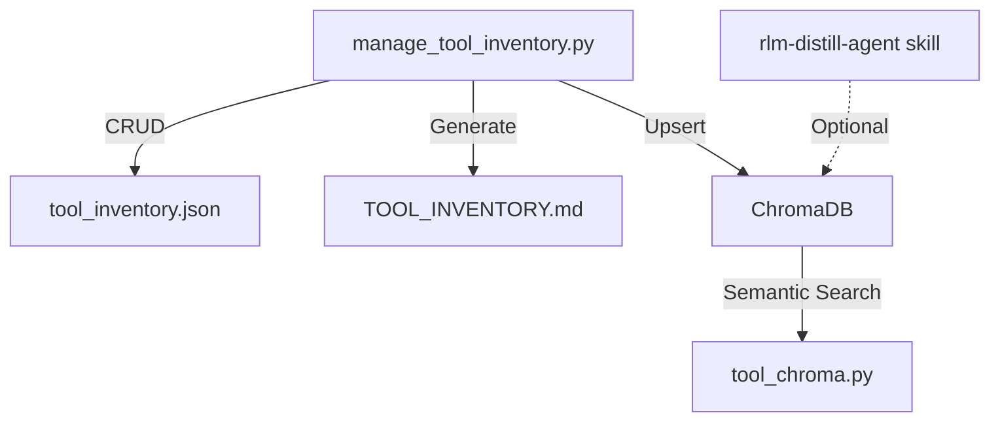

# Tool Inventory Plugin 📊

Manage tool registries with embedded ChromaDB for semantic tool discovery.
Semantic tool discovery powered by ChromaDB. Integrates directly with the `rlm-factory` plugin for gap-filling and cache generation.

## Usage Guide

### Quick Start
```bash
# 1. Seed ChromaDB from existing cache (one-time migration)
/tool-inventory:sync import-json .agent/learning/rlm_tool_cache.json

# 2. Semantic search for tools
/tool-inventory:search "cache management"

# 3. Discover untracked scripts
/tool-inventory:discover --auto-stub

# 4. Generate docs
/tool-inventory:generate
```

### Dual-Store Architecture

| Store | Location | Purpose |
|:---|:---|:---|
| **ChromaDB** | `plugins/tool-inventory/data/chroma/` | Semantic search (primary) |
| **JSON Inventory** | `plugins/tool_inventory.json` | Project-level structured registry |
| **JSON Cache** | `.agent/learning/rlm_tool_cache.json` | Backward compat |

ChromaDB is the primary truth store. JSON cache is kept for backward compatibility.

### Commands Reference

| Command | Script | Description |
|:---|:---|:---|
| `/tool-inventory:list` | `manage_tool_inventory.py list` | List all tools |
| `/tool-inventory:add` | `manage_tool_inventory.py add` | Register tool + ChromaDB upsert |
| `/tool-inventory:remove` | `manage_tool_inventory.py remove` | Deregister + ChromaDB delete |
| `/tool-inventory:search` | `tool_chroma.py search` | Semantic vector search |
| `/tool-inventory:audit` | `manage_tool_inventory.py audit` | Coverage report |
| `/tool-inventory:discover` | `manage_tool_inventory.py discover` | Find untracked scripts |
| `/tool-inventory:generate` | `manage_tool_inventory.py generate` | Render markdown docs |
| `/tool-inventory:sync` | `tool_chroma.py import-json` | Migrate from JSON cache |

### RLM Factory Integration

| RLM Command/Script | Purpose | Executable Type |
|:---|:---|:---|
| `/rlm-factory:distill-agent` | Agent-powered file summarization | Agent |
| `rlm-distill-agent skill` | Batch LLM summarization | ✅ Orchestrator |
| `rlm-query-agent skill` | Legacy JSON cache search | ❌ Command Line |
| `rlm-curator skill` | Coverage reporting | ❌ Command Line |

---

## Architecture

See [tool-inventory-workflow.mmd](assets/diagrams/tool-inventory-workflow.mmd).



### Plugin Directory Structure
```
tool-inventory/
├── .claude-plugin/
│   └── plugin.json
├── commands/
│   ├── list.md
│   ├── add.md
│   ├── remove.md
│   ├── search.md
│   ├── audit.md
│   ├── discover.md
│   ├── generate.md
│   └── sync.md
├── skills/
│   └── inventory-agent/
│       └── SKILL.md
├── scripts/
│   ├── manage_tool_inventory.py   # Core registry manager
│   ├── tool_chroma.py             # ChromaDB wrapper (NEW)
│   ├── audit_plugins.py           # Inventory auditor (filesystem check)
├── data/
│   └── chroma/                    # ChromaDB persistent storage
├── docs/
│   └── tool-inventory-workflow.mmd
└── README.md
```

---

## License

MIT

## Plugin Components

### Dependencies
- `rlm-factory`

