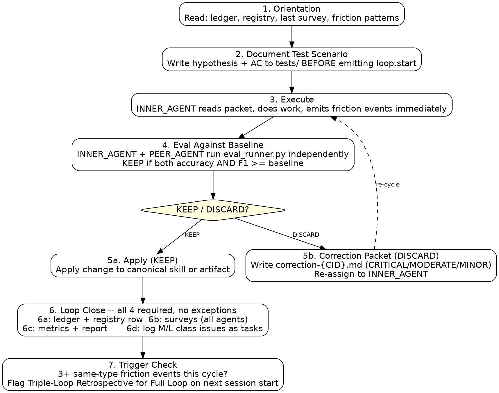

# Self-Evolution Architecture — Round 5 Review
**Generated:** 2026-06-28 00:10:32

All round 4 changes implemented: friction.resolved protocol, Cycle ID+Status in map-debt, broadened globs, bypass spec, skill count fixed.

### 📊 Bundle Metadata
- **Total Files:** 9
- **Estimated Tokens:** ~29,109

---

## 📑 Index
1. `temp/prompts/self-evolution-design.md` (1,624 tokens | 1,624 total) - Round 5 design questions — read this first.
2. `temp/bundles/self-evolution/reviews/round4/gpt.md` (3,141 tokens | 4,765 total) - Round 4 GPT review — drove these changes.
3. `temp/bundles/self-evolution/reviews/round4/opus.md` (2,340 tokens | 7,105 total) - Round 4 Opus review — drove these changes.
4. `.agent/rules/self-evolution-policy.md` (1,398 tokens | 8,503 total) - UPDATED: globs broadened to **/*; Tier 0 Map Debt wording; PRE-COMPLETION GATE capability check; Map Debt schema adds Cycle ID + Status.
5. `.agent/rules/skill-deletion-guard.md` (1,254 tokens | 9,757 total) - Unchanged this round — reference for continuity.
6. `plugins/agent-agentic-os/skills/self-evolution/SKILL.md` (3,221 tokens | 12,978 total) - UPDATED: body trigger text fixed; map-debt schema adds Cycle ID + Status + aging rule.
7. `plugins/agent-agentic-os/skills/os-improvement-loop/SKILL.md` (11,313 tokens | 24,291 total) - UPDATED: Friction Resolution Event section added; INNER_AGENT step 8 requires friction.resolved before task.complete.
8. `.agent/hooks/specs/bypass-detection-hook.md` (656 tokens | 24,947 total) - NEW: Bypass detection spec — 7 rules, registry format, implementation prerequisites. Deferred.
9. `CLAUDE.md` (4,162 tokens | 29,109 total) - UPDATED: skill count fixed to Active(17) + Reference(1).

---

## File: `temp/prompts/self-evolution-design.md`
> Note: Round 5 design questions — read this first.

````markdown
# Self-Evolution Architecture — Round 5 Review

## What Was Changed (this session — Round 4 feedback implemented)

Both GPT and Opus reviewed round 4. Strong convergence on all five Q answers. All changes now
implemented. Prior GPT and Opus round 4 reviews are in this bundle.

### Change 1 — `friction.resolved` event protocol (both Q1 — highest priority)

Added `### Friction Resolution Event` subsection to `os-improvement-loop/SKILL.md` immediately
after the Friction Event Protocol block. Every `type: friction` event must be closed by a
`friction.resolved` event before `task.complete` or `loop.close`.

Event shape: `--type friction --action friction.resolved` with `friction-id`, `outcome`, and
`artifact` in summary. Valid outcomes: `FIX`, `MAP_DEBT`, `ESCALATE`.

Stage 4.0 previously referenced `friction.resolved` as the verification target but the event
type was not defined anywhere. Now defined.

### Change 2 — INNER_AGENT obligation: close friction before task.complete (GPT Q5.3, Opus Q1)

INNER_AGENT execution obligations in Stage 3 now has step 8: "Before emitting `task.complete`,
close every friction event emitted this cycle with a `friction.resolved` event." Step 9 is the
existing `task.complete`. Stage 4.0 remains the backstop gate; this makes enforcement earlier.

### Change 3 — Bypass detection spec created, not implemented (both Q2)

Created `.agent/hooks/specs/bypass-detection-hook.md` with 7 initial detection rules,
registry format, integration point, and prerequisites for implementation. Deferred until
3–5 real cycles produce trace data showing which bypasses actually occur.

### Change 4 — Map Debt aging: Cycle ID + Status fields (GPT Q3 over Opus)

`map-debt.md` schema updated in both `self-evolution/SKILL.md` and `self-evolution-policy.md`:
- Added `Cycle ID` column (from `events.jsonl`)
- Added `Status` column: `OPEN / RESOLVED / ESCALATED`

Aging rule updated: "count completed cycles since entry's Cycle ID; if OPEN entry is older
than 3 completed cycles, auto-escalate." Date-based aging (Opus) deferred — dates are a proxy
for cycles; Cycle ID is the actual invariant.

### Change 5 — Globs broadened to `**/*` (Opus Q4 Scenario B)

`self-evolution-policy.md` globs changed from
`["plugins/**/SKILL.md", "plugins/**/scripts/*.py", "plugins/**/agents/*.md"]`
to `["**/*"]`. The friction model was only loading on plugin file edits. Most user tasks
don't touch those paths, so the Pre-Completion Gate and No Silent Bypass Rule weren't firing.

### Change 6 — PRE-COMPLETION GATE: capability check prefix added (GPT Q4)

Gate now opens with:
`Capability check: Did I verify whether an existing repo capability was intended for this task? [YES/NO]`

This closes the "I didn't know a capability existed" loophole before the three attestation
questions. Light-touch — one extra line, not a full audit.

### Change 7 — Stale body trigger text fixed (both Q5.1)

`self-evolution/SKILL.md` body text "Trigger: Any tool call or subprocess returns a failure..."
replaced with version that includes workaround/bypass/guess scenarios. The frontmatter trigger
was already correct; the body was still failure-only from before round 3.

### Change 8 — Tier 0 Map Debt wording fixed (both Q5.2)

`self-evolution-policy.md` Tier 0 section: "log as Map Debt in the evolution log" →
"record Map Debt in `<plugin>/references/map-debt.md` and append an audit row to the
evolution log." Round 4 separated the two concepts; the Tier 0 bullet hadn't been updated.

### Change 9 — Skill count fixed, third and final time (Opus Q5.3 + GPT Q5)

CLAUDE.md, GEMINI.md, copilot-instructions.md all updated:
- Old: "Active skills (17):" list of 17 + separate callout for os-skill-improvement (implied 18th)
- New: "Active skills (17):" list of 17 + "Reference skills (1): os-skill-improvement — methodology/reference only; prefer os-improvement-loop. Do not delete."
- Removed duplicate os-skill-improvement callout below the agents line.

Two sources of truth → one explicit label. The tripwire from the April 2026 incident is removed.

---

## Questions for Round 5

**Q1 — Is the `friction.resolved` protocol actually implementable with the current kernel?**
The new protocol says `--type friction --action friction.resolved`. The existing kernel
(`emit_event`) accepts arbitrary `type` and `action` strings — there's no schema validation.
But `read_events --type friction` would return BOTH `friction.encountered` and `friction.resolved`
events, making Stage 4.0's "verify exactly one resolution per friction" check ambiguous.
Does Stage 4.0 need to filter by `--action friction.resolved` separately from `--action encountered`?
Or should the type be `friction.resolved` (not `friction`) so they're distinct event types?

**Q2 — Session boundary: can the Cycle ID aging work across sessions?**
Cycle IDs come from `events.jsonl`, which is per-session (the event bus resets). If a Map Debt
entry is logged in cycle CID-001 of session A, and session B starts fresh with new CIDs, Phase 0
can read the map-debt.md but has no way to count "3 completed cycles since CID-001" without
cross-session event history. Does the architecture need a persistent cycle counter? Or should
we fall back to calendar-day aging (Opus's suggestion) for cross-session entries?

**Q3 — Tier 0 duplication (Opus Q5.1, deferred):**
Tier 0 signal list appears identically in `self-evolution-policy.md` AND `self-evolution/SKILL.md`
Phase 1. Opus flagged this as a drift risk — when one is updated, the other won't be.
Is the right fix: keep iron-law version in the rule file, replace Phase 1 list with a pointer?
Or is the duplication acceptable as a redundancy (both files load in different contexts)?

**Q4 — Evolution log header location (Opus Q5.2):**
The evolution log creation logic appears in both Phase 0 (bootstrap profile mentions the path)
and Phase 7 (creates the file with header if missing). Is this acceptable or should Phase 7
be the single owner of "create evolution log with header"?

**Q5 — Is this architecture now complete enough to close the branch and ship?**
After 5 rounds of multi-LLM review, the architecture covers: friction-driven triggering (Tier 0),
mandatory self-reporting (Pre-Completion Gate + friction.resolved), persistent debt tracking
(map-debt.md with Cycle ID + Status), external bypass spec (deferred), and deletion guard.
Is there a remaining structural gap that would justify a round 6, or is the right next step
to merge and run real sessions against it?
````

---

## File: `temp/bundles/self-evolution/reviews/round4/gpt.md`
> Note: Round 4 GPT review — drove these changes.

````markdown
# Round 4 — GPT Review

<!-- Paste GPT feedback here -->
Reviewed Round 4. This is now a much stronger architecture. The biggest Round 3 gaps were addressed: Tier 0 routing is no longer decorative, the pre-completion gate is auditable, Map Debt is readable at orientation, and loop close now has a real friction-resolution gate before `loop.close`. [\[bcgov-my.s...epoint.com\]](https://bcgov-my.sharepoint.com/personal/richard_fremmerlid_gov_bc_ca/Documents/Microsoft%20Copilot%20Chat%20Files/bundle-round4.md)

My overall recommendation: **stop adding broad policy now. Add only one small event-protocol patch, then bed it in.** The system is close to “enough governance to force learning” without becoming governance theatre.

***

## Executive verdict

Round 4 is good. I would make **three targeted fixes**:

1. **Implement `friction.resolved` as an event action, not a big new kernel feature.**
2. **Do not build the external bypass hook yet. Spec it, but defer implementation.**
3. **Make Map Debt aging enforceable with a lightweight field, not date parsing.**

Then pause and run it against real agent sessions.

***

# Q1 — `friction.resolved` event type

## Recommendation

**Yes, add it now, but keep it tiny.**

You already referenced `friction.resolved` in Stage 4.0, where ORCHESTRATOR must verify that each friction event has a corresponding resolution with outcome `FIX`, `MAP_DEBT`, or `ESCALATE`. But the prompt notes that this was not actually implemented in the kernel protocol yet. That means the docs now depend on an event shape that may not exist. [\[bcgov-my.s...epoint.com\]](https://bcgov-my.sharepoint.com/personal/richard_fremmerlid_gov_bc_ca/Documents/Microsoft%20Copilot%20Chat%20Files/bundle-round4.md)

Do not build a new event subsystem. Just standardize the event convention.

Recommended shape:

```bash
python "$KERNEL_PY" emit_event \
  --agent INNER_AGENT \
  --type friction \
  --action friction.resolved \
  --correlation-id "$CID" \
  --summary "friction_id:<id> outcome:MAP_DEBT artifact:plugins/x/references/map-debt.md"
```

If the kernel already accepts arbitrary `type` and `action`, this is just documentation plus examples. If it validates actions, add only this one action.

## Why now?

Because Stage 4.0 already says no loop close unless every friction event has a corresponding `friction.resolved`. Without the event convention, the rule is partially aspirational. [\[bcgov-my.s...epoint.com\]](https://bcgov-my.sharepoint.com/personal/richard_fremmerlid_gov_bc_ca/Documents/Microsoft%20Copilot%20Chat%20Files/bundle-round4.md)

## Minimal patch

Add a short subsection under **Friction Event Protocol**:

````markdown
### Friction Resolution Event

Every friction event must be closed by a matching resolution event before `task.complete`
or `loop.close`.

Resolution event format:

```bash
python "$KERNEL_PY" emit_event \
  --agent <AGENT> \
  --type friction \
  --action friction.resolved \
  --correlation-id "$CID" \
  --summary "friction_id:<id> outcome:FIX|MAP_DEBT|ESCALATE artifact:<path>"
````

Valid outcomes:

* `FIX` — underlying artifact fixed and Map updated
* `MAP_DEBT` — recorded in `<plugin>/references/map-debt.md`
* `ESCALATE` — user escalation required

````

That’s enough.

---

# Q2 — External bypass detection hook

## Recommendation

**Spec it now, do not implement yet.**

Opus is right about the deepest remaining hole: an agent can bypass a canonical capability without realizing it was a bypass. The pre-completion gate improves accountability but still depends on self-reporting. Round 4 explicitly calls this out as “External bypass detection.” 【1-ad82af】

But implementing the hook now is premature for two reasons:

1. You need real session traces to know which bypasses actually happen.
2. A generic hook can become noisy fast and create the exact bureaucracy you are trying to avoid.

## What I would do now

Create a **hook spec**, not the hook.

Suggested file:

```text
.agent/hooks/specs/bypass-detection-hook.md
````

Keep it scoped to 5–7 high-confidence rules only.

Example first rules:

```markdown
# Bypass Detection Hook Spec

Purpose: detect likely Tier 0 bypasses that agents may not self-report.

Initial detection rules:

1. Wrote `plugins/**/skills/*/SKILL.md` for a new skill without invoking `create-skill`.
2. Modified `symlinks.json` or created links without running `symlink_manager.py`.
3. Wrote a `.sh` script despite Python-only helper-script rule.
4. Edited `.agents/**` as source of truth instead of `plugins/**`.
5. Modified `plugins/**/scripts/*.py` after a failure without updating `references/evolution-log.md`.
6. Added Map Debt in chat/output but did not write `<plugin>/references/map-debt.md`.
7. Deleted or moved any skill path without exact named user permission.
```

Then run a few sessions and see which rules would have caught real misses.

## Why ADR-004 matters

ADR-004 says plugins and skills must be self-contained and cannot rely on cross-plugin runtime script paths. That argues against hiding the hook inside one plugin as a cross-plugin dependency. If you build it later, repo-root `.agent/hooks/` is the right place. [\[bcgov-my.s...epoint.com\]](https://bcgov-my.sharepoint.com/personal/richard_fremmerlid_gov_bc_ca/Documents/Microsoft%20Copilot%20Chat%20Files/bundle-round4.md)

***

# Q3 — Map Debt aging enforcement

## Recommendation

Do **not** parse logged dates to infer cycles. Add an explicit `Cycle` field.

The rule currently says Map Debt entries older than 3 cycles auto-escalate, and `map-debt.md` entries include `Logged date`, but a date is not a cycle count. A task could have three cycles in one day or zero cycles for a week. So date parsing is the wrong primitive. [\[bcgov-my.s...epoint.com\]](https://bcgov-my.sharepoint.com/personal/richard_fremmerlid_gov_bc_ca/Documents/Microsoft%20Copilot%20Chat%20Files/bundle-round4.md)

## Minimal patch

Change the `map-debt.md` format from:

```markdown
| Logged | Artifact | Friction | Why Not Fixed | Recommended Fix | Severity | Repeat |
```

To:

```markdown
| Logged | Cycle ID | Artifact | Friction | Why Not Fixed | Recommended Fix | Severity | Repeat | Status |
```

Add statuses:

```text
OPEN | RESOLVED | ESCALATED
```

Then add this rule:

```markdown
At orientation, ORCHESTRATOR counts completed cycles since `Cycle ID`.
If an OPEN item is older than 3 completed cycles, escalate before starting new work.
```

This avoids fuzzy date logic.

## Future auditor

A future `map-debt-auditor.py` is useful, but defer. The immediate fix is to make the data model capable of enforcement.

***

# Q4 — Remaining bypass scenario at session boundaries

## Short answer

Yes, there is still one scenario:

> A fresh agent starts a new session, does not load the relevant plugin context, does not know a capability exists, manually solves the task, outputs the pre-completion gate as all “NO,” and never touches a path covered by the rules.

Round 4 reduces this risk by adding the friction rule to `CLAUDE.md`, reading `map-debt.md` during `os-improvement-loop` orientation, and requiring the literal `PRE-COMPLETION GATE` block before claiming done. [\[bcgov-my.s...epoint.com\]](https://bcgov-my.sharepoint.com/personal/richard_fremmerlid_gov_bc_ca/Documents/Microsoft%20Copilot%20Chat%20Files/bundle-round4.md)

But if the agent does not recognize that a repo capability exists, self-reporting is still weak.

## Best mitigation without hook implementation

Add one line to the pre-completion gate:

```markdown
Before answering the gate, check whether an existing repo capability was intended for this task.
If unsure, inspect CLAUDE.md Plugin Evolution Entry Points and the active plugin's skills list.
```

But don’t make it too heavy. The goal is a light “capability lookup before no-bypass attestation.”

Suggested updated block:

```markdown
PRE-COMPLETION GATE:
  Capability check: Did I verify whether an existing repo capability was intended for this task? [YES/NO]
  1. Did any existing capability fail, get bypassed, or get manually replaced? [YES/NO — 1 line if YES]
  2. Did I guess, assume, or get corrected on a repeatable process? [YES/NO — 1 line if YES]
  3. Did I notice something the next agent will hit again if not fixed? [YES/NO — 1 line if YES]
If any YES: action taken → FIX / MAP_DEBT / ESCALATE
```

This is a small addition but closes the “I didn’t know a capability existed” loophole better than the current 3Q block.

***

# Q5 — Simplification risk

## Yes, there is now some duplication, but most of it is useful

The architecture now spans:

* `.agent/rules/self-evolution-policy.md`
* `.agent/rules/skill-deletion-guard.md`
* `self-evolution/SKILL.md`
* `os-improvement-loop/SKILL.md`
* `CLAUDE.md`

That sounds large, but the layering is mostly right:

* `CLAUDE.md` = always-loaded headline rules
* `.agent/rules/self-evolution-policy.md` = always-on invariants
* `self-evolution/SKILL.md` = repair execution protocol
* `os-improvement-loop/SKILL.md` = multi-agent cycle enforcement
* `skill-deletion-guard.md` = destructive-action hard gate

So I would not collapse files.

## What I would trim

### 1. Stale trigger paragraph in `self-evolution/SKILL.md`

The frontmatter now correctly says the skill applies to failures **or** workaround, bypass, guess, or manual substitute. But the body still says:

```markdown
**Trigger:** Any tool call or subprocess returns a failure that may be caused by a stale
selector, missing helper, or broken script...
```

That is now stale and failure-only. [\[bcgov-my.s...epoint.com\]](https://bcgov-my.sharepoint.com/personal/richard_fremmerlid_gov_bc_ca/Documents/Microsoft%20Copilot%20Chat%20Files/bundle-round4.md)

Replace with:

```markdown
**Trigger:** Any tool call, subprocess, workflow, skill, sub-agent, helper, or documented
repo capability fails, behaves ambiguously, or is bypassed through a workaround, guess,
or manual substitute — and the fix or Map Debt entry is within allowed boundaries.
```

### 2. `self-evolution-policy.md` says Map Debt is logged in evolution log

Under Tier 0 it still says:

```markdown
Fix is not safe or not small → log as Map Debt in the evolution log.
```

But Round 4 moved Map Debt to `<plugin>/references/map-debt.md`, with the evolution log as append-only audit history. [\[bcgov-my.s...epoint.com\]](https://bcgov-my.sharepoint.com/personal/richard_fremmerlid_gov_bc_ca/Documents/Microsoft%20Copilot%20Chat%20Files/bundle-round4.md)

Replace with:

```markdown
Fix is not safe or not small → record Map Debt in `<plugin>/references/map-debt.md`
and append an audit row to the evolution log.
```

### 3. Stage 4.0 references `friction.resolved`, but Stage 3 does not require INNER\_AGENT to emit it

Stage 4.0 is a close gate, but the INNER\_AGENT execution obligations still only say “emit friction events immediately.” They do not say “resolve them before task.complete.” [\[bcgov-my.s...epoint.com\]](https://bcgov-my.sharepoint.com/personal/richard_fremmerlid_gov_bc_ca/Documents/Microsoft%20Copilot%20Chat%20Files/bundle-round4.md)

Add to INNER\_AGENT step 8 or before it:

```markdown
Before emitting `task.complete`, close every friction event emitted by this agent with
`friction.resolved` outcome `FIX`, `MAP_DEBT`, or `ESCALATE`.
```

This moves enforcement earlier and makes Stage 4.0 a backstop.

***

# My final Round 4 answers

## Q1

Add `friction.resolved` now as a **small event convention**. Do not build a large protocol layer.

## Q2

Spec external bypass detection now, but defer implementation until you have real traces. Keep it repo-root, not plugin-cross-dependent.

## Q3

Use explicit `Cycle ID` and `Status` fields in `map-debt.md`. Do not use date parsing as the primary aging mechanism.

## Q4

The remaining session-boundary bypass is: a fresh agent does not know a capability exists and honestly answers “NO.” Mitigate with a lightweight capability-check line in the pre-completion gate.

## Q5

Do not collapse the architecture. Trim only stale wording and one inconsistency:

* update stale failure-only trigger text in `self-evolution/SKILL.md`
* fix Tier 0 wording to point to `map-debt.md`
* require INNER\_AGENT to emit `friction.resolved` before `task.complete`

***

## Bottom line

Round 4 is close. I would not add the bypass hook yet. The right next step is:

```text
Implement friction.resolved as a tiny event convention
+ fix three stale/inconsistent text spots
+ add Cycle ID / Status to Map Debt
+ then run real sessions
```

That gives you enforcement without overbuilding.
````

---

## File: `temp/bundles/self-evolution/reviews/round4/opus.md`
> Note: Round 4 Opus review — drove these changes.

````markdown
# Round 4 — Opus Review

<!-- Paste Opus feedback here -->
# Round 4 Review

All 10 Round 3 changes landed correctly and the architecture is now coherent end-to-end. Direct answers below, then the two real issues left.

## Q1: `friction.resolved` event type — do it now

**Yes, add it. The Stage 4.0 gate is currently a fiction.**

Stage 4.0 says "verify exactly one resolution exists" and references `friction.resolved` with `outcome: FIX | MAP_DEBT | ESCALATE`. But:

* The Friction Event Protocol section earlier in the same SKILL.md doesn't mention emitting any resolution event. Agents read the friction emit pattern, see no resolve pattern, and won't emit one.
* The kernel doesn't have a documented `friction.resolved` action.
* Stage 4.0's verification command is `read_events --type friction` then "verify resolution" — but the protocol for *how* to verify is undefined. Verify what? A second event with what schema?

Without the event type defined, Stage 4.0 is enforcement theatre — agents will read it, find no friction.resolved events (because nobody emits them), and either skip the gate ("nothing to resolve") or game it (emit one without doing anything).

Spec it as one section in os-improvement-loop, near the existing Friction Event Protocol:

```markdown
## Friction Resolution Event (paired with every friction event)

For every `type: friction` event emitted during a cycle, the agent MUST 
later emit a matching `type: friction.resolved` event tied by 
`correlation-id` and a `friction-id` (timestamp or uuid of the original).

python "$KERNEL_PY" emit_event \
  --agent INNER_AGENT --type friction.resolved \
  --correlation-id "$CID" \
  --summary "friction-id:<ts> outcome:FIX|MAP_DEBT|ESCALATE artifact:<path> details:<one line>"

Stage 4.0 verifies: for each friction event in this cycle, exactly one 
friction.resolved exists with matching friction-id.
```

This is small. Do it.

## Q2: External bypass detection — not yet, but spec it

**Don't write the hook this round. The rules layer needs one real session of use first.**

You're right to flag it. But three reasons to hold:

1. The 10 changes from Round 3 haven't been exercised against a real cycle yet. You don't know which rules agents actually comply with vs. which get ignored. Writing a hook against unverified behavior is over-engineering.
2. The bypass-detection script needs a "canonical capability registry" — a list of which scripts/skills should be used for which operations. That registry doesn't exist yet. You'd be writing detector and registry simultaneously, which is high blast radius.
3. The `friction.resolved` event (Q1) is the missing structural piece. Add that, run a cycle, look at the events.jsonl, *then* you know what bypass patterns to detect externally.

What to do now instead: write a one-page spec for the hook. Include the registry format, the detection rules, the hook integration point. Park in `tasks/backlog/`. Revisit after 3-5 cycles of friction-driven evolution have produced real bypass examples.

## Q3: Map Debt aging — defer the auditor

**Implement the cycle-count check in Phase 0 read. Don't write a separate auditor.**

The aging rule is currently honor-system in both the rule and the skill. Agents read map-debt.md, see "Logged: 2026-06-15", and need to compare against "current cycle." There's no cycle counter exposed.

Simplest fix that doesn't require new infrastructure: use **dates**, not cycle counts. You already log `YYYY-MM-DD`. Phase 0 already reads map-debt.md.

Add to Phase 0:

```markdown
For each open entry, compute (today - Logged date). If > 14 days OR if 
the entry has been read in 3+ prior cycles without resolution, escalate 
immediately rather than defer.
```

Date math is two lines of Python. No auditor script needed. The "3+ prior cycles" condition needs a counter, which means adding a `Reads: N` column to the map-debt schema and incrementing on every Phase 0 read.

Simpler still: just use date. 14 days as auto-escalate threshold is concrete and verifiable. Drop the "3 cycles" framing entirely. Cycles vary in length; calendar days don't.

Patch:

```markdown
## Map Debt
...
Aging rule: entries with Logged date > 14 days old auto-escalate on next 
self-evolution run, regardless of Repeat flag.
```

This is enforceable from a single date comparison in Phase 0. No new scripts.

## Q4: Completeness — session boundary is the remaining hole

**Yes, two scenarios still slip through.**

### Scenario A: Fresh session, no prior friction context

A new agent starts a session, has no events.jsonl from the prior session (the bus is per-session), and runs a task. The Pre-Completion Gate fires at the end of *this* session's task, but the agent has no knowledge of friction that the previous session's agent silently bypassed.

`map-debt.md` partly addresses this (it persists across sessions). But map-debt.md only contains friction the *prior agent recognized and chose to defer*. Silent bypasses — the exact failure mode this whole architecture targets — by definition don't get logged. So they don't propagate.

The architecture has no mechanism to surface a workaround as friction *after the fact*. Once a session closes with the PRE-COMPLETION GATE answered "no" (honestly or not), that bypass is invisible forever.

The bypass-detection hook (Q2) is the only real fix for this. The rules layer can't catch what the agent didn't notice.

### Scenario B: User-initiated session that doesn't trigger os-improvement-loop

The architecture assumes work happens inside an os-improvement-loop cycle (Stage 4.0 friction gate, Stage 1 map-debt read, etc.). But most user tasks don't go through this loop — the loop is for *improvement* of skills, not normal usage.

For a regular task ("help me write this email"), the os-improvement-loop machinery doesn't activate. Stage 4.0 doesn't run. The friction.resolved gate doesn't fire. The only thing protecting against silent bypass is the Pre-Completion Gate in `self-evolution-policy.md`, which is rule-loaded (always-on) but globbed to `plugins/**/SKILL.md`, `scripts/*.py`, `agents/*.md`.

If the user task touches none of those globs (which is the majority of work), the friction model doesn't load at all.

**Fix:** broaden the globs in `self-evolution-policy.md`:

```yaml
globs: ["**/*"]
```

Or, since CLAUDE.md is now correctly loaded everywhere and carries the friction-event line, accept that CLAUDE.md is the always-on layer and let the rule file be more specific. But pick one and own it. Right now the line in CLAUDE.md says "always applied" while the rule file it points to is glob-restricted. That's inconsistent.

I'd broaden the rule's globs. CLAUDE.md is the headline; the rule is the detail. Both need to fire everywhere.

## Q5: Simplification risk — three trimmable items

The architecture has grown, but most of it is load-bearing. Three real candidates for trimming:

### 1. Tier 0 signals duplicated in two places verbatim

The Tier 0 signal list appears identically in:

* `self-evolution-policy.md` (Tier 0 section)
* `self-evolution/SKILL.md` Phase 1 Tier 0 section

That's word-for-word duplication. When you update one (you will), the other will drift. Pattern: keep the iron-law version in the rule, the response-detail version in the skill, point each at the other.

### 2. Evolution log header is documented twice

Phase 7 creates the evolution-log.md header in one block, then map-debt.md gets a similar header treatment in the same Phase 7. Both are good — but the evolution log creation logic appears in both Phase 0 (profile bootstrap mentions the path) and Phase 7 (creates the file). Pick one place that owns "creates the file with header if missing."

### 3. The "Active skills (17)" line in CLAUDE.md is wrong again

Same Q3a issue from Round 2: skill count says 17, list has 17 skills, but the immediately-following line names `os-skill-improvement` as an 18th (methodology/reference) skill that exists but is special-cased.

This count discrepancy is the *exact* trigger that started the April 2026 incident. It's been flagged twice now (Round 2 Q3a, here) and not actually fixed. Either:

* Change the line to `Active skills (17) + 1 reference skill (os-skill-improvement):` and add it to the list with the parenthetical
* Or remove the "do not delete" callout (it's redundant with the deletion guard)

Right now you have the worst of both: count says 17, list shows 17, prose explicitly says "an 18th exists, don't delete it." Two sources of truth, both load-bearing, both invitations for the next agent to "reconcile" by deletion.

This is the third time. Fix it this round.

## Bottom line

Architecture is correct and load-bearing across rules → skills → loop. Four things to do this round:

1. **Define `friction.resolved` event** (Q1) — Stage 4.0 is currently unenforceable without it
2. **Broaden `self-evolution-policy.md` globs** (Q4 Scenario B) — the friction model doesn't load on most tasks
3. **Switch Map Debt aging to calendar days** (Q3) — eliminates the missing cycle-counter
4. **Fix the CLAUDE.md skill count, third time** (Q5.3) — same tripwire that caused April 2026

Defer external bypass detection (Q2) until you have one real cycle of friction data to design against. Park the spec in backlog.

Want me to draft the `friction.resolved` event spec section as a copy-pasteable patch?
````

---

## File: `.agent/rules/self-evolution-policy.md`
> Note: UPDATED: globs broadened to **/*; Tier 0 Map Debt wording; PRE-COMPLETION GATE capability check; Map Debt schema adds Cycle ID + Status.

````markdown
---
description: Universal rules for agent self-healing, selector repair, and error recovery policies.
globs: ["**/*"]
---

## 🌀 Self-Evolution & Self-Healing Policy

**Full execution protocol (Phases 0–7) → `plugins/agent-agentic-os/skills/self-evolution/SKILL.md`**  
**Skill/directory deletion rules → `.agent/rules/skill-deletion-guard.md`**

This policy states the always-on safety gates. They apply before any skill is invoked and
regardless of whether a self-evolution run is in progress.

### Hard Gates (always active)

1. **Edit boundaries first**: Before any autonomous edit, verify the target file is inside
   the plugin's permitted edit directories (`plugins/<plugin>/skills/`, `scripts/`, `references/`).
   If no `self-evolution-profile.md` exists for the plugin, use that conservative default.
   Anything outside those dirs requires explicit user confirmation.

2. **Three-attempt maximum**: Attempt a repair up to three times. On the third failure,
   hard stop and present the Escalation Template with the full evidence bundle.

3. **Update The Map, not just the Diary**: Every fix must update the relevant domain playbook
   or reference file. A fix that is not recorded is a future regression.

4. **Autonomy gates**:
   - Auto-approved: adding new functions/exports, fallback selectors, appending to existing files
   - Explicit confirmation required: renaming or moving any file
   - **Hard gated — always requires explicit human permission**: any deletion of any file,
     function, skill, SKILL.md, eval, or reference. See `skill-deletion-guard.md`.

5. **The Absorption Fallacy — always wrong**: Concluding that a skill, file, or directory is
   "redundant", "absorbed", "consolidated", or "superseded" and deleting it autonomously.
   Overlap is never evidence that deletion is safe. Flag it; never act on it.

6. **One logical change per pass**: Never bundle multiple independent repairs in a single
   execution pass.

---

### Friction-Driven Self-Evolution (always active)

Agents must not silently work around broken, unclear, missing, or awkward repo capabilities.

A self-evolution event is required when **any** of the following occurs:

- A script, helper, command, skill, sub-agent, selector, eval, or documented workflow fails.
- The agent avoids an existing capability and performs the work manually instead.
- The agent uses a workaround because the intended path was broken, unclear, or ambiguous.
- The agent has to guess because instructions, profiles, schemas, or routing are unclear.
- The user corrects the agent on a repeatable process problem.
- The agent notices a missing helper, stale reference, stale agent instruction, or broken skill invocation.

**Successful task completion does not waive this requirement.** If the task succeeded only
because the agent bypassed friction, self-evolution handling is still required.

---

### Tier 0 — Friction / Workaround

> "The task completed, but the system did not improve."

**Signals:**
- Agent bypassed an existing script, skill, sub-agent, or helper
- Agent manually performed work that an existing repo capability should handle
- Agent encountered ambiguity and guessed instead of improving instructions
- Agent noticed an awkward or error-prone workflow but did not update The Map
- Agent used a temporary workaround

**Required response — pick exactly one:**
- Fix is small + inside allowed edit boundaries → patch it now, update The Map.
- Fix is not safe or not small → record **Map Debt** in `<plugin>/references/map-debt.md` and append an audit row to the evolution log.
- Friction is repeated or blocking → escalate to the user.

---

### No Silent Bypass Rule

If an existing repo capability is intended for the task, the agent must use it.
If the capability fails, the agent may use a workaround only after recording the failure
as a self-evolution event. Silent bypass is a protocol violation.

---

### Pre-Completion Self-Evolution Gate

Before claiming a task is complete, output this block verbatim:

```
PRE-COMPLETION GATE:
  Capability check: Did I verify whether an existing repo capability was intended for this task? [YES/NO]
  1. Did any existing capability fail, get bypassed, or get manually replaced?  [YES/NO — 1 line if YES]
  2. Did I guess, assume, or get corrected on a repeatable process?              [YES/NO — 1 line if YES]
  3. Did I notice something the next agent will hit again if not fixed?          [YES/NO — 1 line if YES]

If any YES: action taken → FIX / MAP_DEBT / ESCALATE
```

The block must be emitted as literal text, not silent introspection. The task is not complete
until every YES has a declared action.

---

### Map Debt

If friction is real but cannot be fixed immediately, record it as Map Debt.

Map Debt lives in `<plugin>/references/map-debt.md` — a working queue separate from the
evolution log. The evolution log is append-only audit history. Map Debt is mutable: entries
are resolved, aged, or escalated over time. Do not conflate the two.

Each Map Debt entry must include:
- Logged date (`YYYY-MM-DD`)
- Cycle ID (from `events.jsonl`)
- Artifact affected (file path or skill slug)
- Friction observed (one sentence)
- Why it was not fixed now
- Recommended fix
- Evidence or reproduction step
- Severity: S / M / L
- Repeat: YES / NO
- Status: OPEN / RESOLVED / ESCALATED

**Aging rule:** At Phase 0 read, count completed cycles since entry's Cycle ID. If an `OPEN`
entry is older than 3 completed cycles, auto-escalate before starting new work.
**Repeat = YES:** must escalate on next encounter — no further deferral permitted.
````

---

## File: `.agent/rules/skill-deletion-guard.md`
> Note: Unchanged this round — reference for continuity.

````markdown
---
description: Hard gate preventing agents from deleting skill directories based on consolidation or absorption reasoning. Covers the specific failure mode where an agent incorrectly concludes a skill's function has been absorbed by another skill.
globs: ["plugins/**/skills/**", "plugins/**/SKILL.md"]
---

# Rule: Skill Deletion Guard — No Absorption Deletions

## The Failure Mode This Rule Prevents

An agent reviews two skills, concludes that skill A's "functionality is covered by" or "has been absorbed into" skill B, then **deletes skill A's directory**. This is always wrong without explicit user instruction.

This exact incident occurred in April 2026: `os-skill-improvement` was deleted because an agent concluded its methodology was "absorbed" by `os-improvement-loop`. It was not. Recovery required `git show` from history and manual restoration.

---

## Iron Law

**Never delete a skill directory, its SKILL.md, or its evals because you believe the skill is redundant, absorbed, consolidated, or superseded.**

This is a hard gate. No amount of reasoning makes autonomous deletion acceptable.

---

## Why "Absorption" Is Always a Rationalization

Even when two skills appear to overlap in body content, they are never interchangeable because each skill has three components that are always unique:

1. **Routing identity** — the `trigger:` field and `description:` in frontmatter. Two skills that do similar things still have different routing signatures. Deleting one breaks all prompts that relied on its specific triggers.

2. **Eval contract** — `evals/evals.json` contains should_trigger test cases specific to this skill's domain boundary. These cases define where the skill starts and its neighbors end. No other skill has the same eval contract.

3. **Methodology** — the skill body may encode a distinct protocol, phase sequence, or heuristic that the "absorbing" skill does not replicate verbatim, even if the overall goal is similar.

---

## What to Do Instead of Deleting

| Situation | Correct action |
|---|---|
| Skill seems redundant with another | Flag it to the user: "I noticed overlap between X and Y — do you want to consolidate?" |
| Skill directory exists but SKILL.md is missing | Report it as a zombie directory. Do NOT delete. Ask user. |
| Skill was renamed or moved | Update references. Do NOT delete the original until user confirms. |
| Consolidation task in progress | Move files, update symlinks. The delete step requires explicit user confirmation for each directory. |

---

## Permitted vs Prohibited

| Action | Permitted without user confirmation? |
|---|---|
| Adding content to a skill | Yes |
| Editing SKILL.md | Yes |
| Adding evals | Yes |
| Renaming a skill directory | No — requires explicit confirmation |
| Deleting a skill directory | **No — hard gate, always requires explicit user instruction naming the exact skill** |
| Deleting a skill because it "looks absorbed" | **Never — not even with user permission phrased as "clean up redundant skills"** |

The last row is intentional: "clean up redundant skills" is not explicit permission to delete. The user must name the specific skill: "delete `os-skill-improvement`."

A user request to "clean up", "deduplicate", "merge", "simplify", or "consolidate" skills is **not** deletion permission. These words describe intent, not authorization. Deletion permission must name the exact path or skill slug.

---

## Zombie Directory Protocol

A zombie is a skill directory that exists but has no `SKILL.md`. Zombies are created when:
- A consolidation move was interrupted
- A skill was accidentally deleted mid-migration
- A directory was created for a skill that was never completed

**Do not delete zombie directories.** Instead:
1. Check `git log -- plugins/<plugin>/skills/<name>/` to see the last known state
2. Report to user: "Found zombie directory at `<path>` — no SKILL.md. Last commit: `<sha>`. Restore or delete?"
3. Wait for explicit instruction

---

## For Audit Tools

When auditing a plugin, check for:

```bash
# Zombie skill directories (no SKILL.md)
for dir in plugins/<plugin>/skills/*/; do
    [ -f "${dir}SKILL.md" ] || echo "ZOMBIE: $dir"
done

# Skills listed in CLAUDE.md Plugin State but missing from plugins/
# (cross-reference CLAUDE.md skill lists against actual filesystem)
```

Report zombies as **Critical** findings — they indicate either data loss or an interrupted migration.

---

## Cleanup After Self-Evolution — Also Gated

Accidental deletion often happens during "cleanup after improvement" — an agent self-evolves a
skill, then tries to simplify or tidy surrounding artifacts. This is a common deletion vector.

Any "simplification", "tidying", "removal of overlap", or "cleanup" that occurs during or after
a self-evolution run is subject to the same hard gate as any other deletion. Self-evolution does
not grant additional deletion authority. The classification of a repair as Tier 0 (friction) does
not authorize removing the thing that caused friction.
````

---

## File: `plugins/agent-agentic-os/skills/self-evolution/SKILL.md`
> Note: UPDATED: body trigger text fixed; map-debt schema adds Cycle ID + Status + aging rule.

````markdown
---
name: self-evolution
plugin: agent-agentic-os
version: 1.0.0
description: >
  Self-healing and self-evolving pattern for agents operating against repo capabilities,
  scripts, skills, sub-agents, selectors, workflows, and external systems. Classifies
  evolution events into four tiers — Friction/Workaround, Gap, Failure, Regression —
  applies repo-profile-gated edits with appropriate autonomy, verifies the fix, and
  updates domain reference files ("The Map, not the Diary"). Invoke whenever a tool call,
  subprocess, or workflow returns a failure OR whenever the agent used a workaround,
  bypass, guess, or manual substitute for an existing repo capability.
model: inherit
color: orange
tools: ["Bash", "Read", "Write", "Edit"]
trigger: >
  self-heal, self-evolving, friction, workaround used, bypassed existing capability,
  manual workaround, guessed because unclear, ambiguous instruction, friction encountered,
  system did not improve, stale selector, DOM changed, element not found,
  selector not found, script broken, helper broken, CDP failure, automation failure,
  evolve skill, patch helper, update reference, domain playbook, map not diary,
  fix broken script, regression detected
---

# Self-Evolution Skill

**Trigger:** Any tool call, subprocess, workflow, skill, sub-agent, helper, or documented
repo capability fails, behaves ambiguously, or is bypassed through a workaround, guess,
or manual substitute — and the fix or Map Debt entry is within allowed boundaries.

**Core principle:** The agent does not just retry — it learns. Every fix either patches
a helper (so the failure can't recur) or updates a reference file (so future agents
avoid the same dead end). Fixes that aren't recorded are not fixes; they are patches
waiting to become the same bug again.

---

## Phase 0 — Read the Repo Profile

Before doing anything else, locate and read the repo's self-evolution profile:

```
<repo-root>/plugins/<plugin>/references/self-evolution-profile.md
```

If no profile exists for the current repo/plugin, create a conservative default one now
using the template in Phase 0.1 below, then continue — but only proceed if the target
edit is inside the default allowed directories.

Also read `<plugin>/references/map-debt.md` if it exists. Surface any open entry that
matches the current friction — if `Repeat: YES`, escalate immediately (go to Phase 6)
instead of deferring again.

The profile defines:
- **Allowed edit directories** — the only dirs the agent may edit autonomously
- **Error pattern → tier classification table** — maps known error signatures to tiers
- **Domain playbook location** — where reference files ("The Map") live
- **Evolution log path** — where to append the fix record

### Phase 0.1 — Bootstrap Profile (if missing)

If no profile exists, write one at `<plugin>/references/self-evolution-profile.md`:

```markdown
# Self-Evolution Profile — <Plugin Name>

## Allowed Edit Directories

- plugins/<plugin>/skills/
- plugins/<plugin>/scripts/
- plugins/<plugin>/references/

## Explicit Confirmation Required

- plugin.json
- CLAUDE.md
- .agent/rules/
- ADRs/
- docs/
- repository root files
- any file outside this plugin
- any rename, move, or deletion

## Error Pattern Classification
| Pattern | Tier |
|---------|------|
| workaround used / bypassed capability | Friction |
| element not found / selector missing | Regression |
| function not exported / module not found | Gap |
| TypeError / syntax error | Failure |
| subprocess timeout | Regression |
| JSON parse error | Failure |

## Domain Playbook Location
plugins/<plugin>/references/

## Evolution Log
plugins/<plugin>/references/evolution-log.md

## Map Debt
plugins/<plugin>/references/map-debt.md
```

---

## Phase 1 — Classify the Evolution Event

**First ask:** did the task succeed only because of a workaround, bypass, guess, or manual
substitute for an existing repo capability? If yes → classify as **Tier 0** directly.

Otherwise, using the error message, stack trace, and context, classify into exactly one tier:

### Tier 0 — Friction / Workaround
> "The task completed, but the system did not improve."

**Signals:**
- Agent bypassed an existing script, skill, sub-agent, or helper
- Agent manually performed work that an existing repo capability should handle
- Agent encountered ambiguity and guessed instead of improving instructions
- Agent noticed an awkward or error-prone workflow but did not update The Map
- Agent used a temporary workaround

**Response:** If small + inside allowed edit boundaries — patch now, update The Map. If not safe or small — log as Map Debt (see Phase 7). If repeated or blocking — escalate.

### Tier 1 — Gap
> "The capability doesn't exist yet."

**Signals:**
- No code handles this action at all
- `function not found`, `is not a function`, `module has no export`
- Agent is at the boundary of what the codebase supports
- No evidence this ever worked

**Response:** Build the missing piece. No evidence collection needed.

### Tier 2 — Failure
> "Code exists but is broken."

**Signals:**
- `TypeError`, `SyntaxError`, `ReferenceError` inside our own code
- Logic bug producing wrong output (wrong JSON shape, wrong return value)
- Wrong arguments passed to an existing function
- No external system change implied

**Response:** Debug the code. Read the relevant source, identify the bug, patch it.

### Tier 3 — Regression
> "This worked before. Something external changed."

**Signals:**
- Selector that previously matched now returns null/empty
- Subprocess timeout on an operation with known prior success
- `element not found`, `cannot read property of null` on a well-used DOM path
- git log or session memory confirms prior success

**Response:** Collect evidence first (screenshot + DOM snapshot), then patch with a
fallback selector or updated timing. Document the change in The Map.

**If ambiguous between Failure and Regression:** default to Regression and collect
evidence — the cost of a screenshot is lower than patching the wrong layer.

---

## Phase 2 — Collect Evidence

Evidence collection is tier-dependent:

| Tier | Evidence to collect |
|------|-------------------|
| Friction / Workaround | Intended capability, what was bypassed, workaround used, why the intended path was not used, reproduction step |
| Gap | None — log the capability boundary in the evolution log |
| Failure | Error message + stack trace (last 20 lines of stderr) + relevant source lines |
| Regression | Screenshot of current UI state + DOM snapshot of the failing selector area + `git log --oneline -5` on the affected file |

For Regression, run the DOM snapshot before touching any code:
```javascript
// Inline Node snippet to dump selector context
const els = document.querySelectorAll('[data-name]');
console.log(JSON.stringify([...els].map(e => e.getAttribute('data-name')).filter(Boolean)));
```

Save evidence to `temp/self-evolution/<timestamp>-evidence/`.

---

## Phase 3 — Plan the Repair

Based on tier and evidence:

**Gap:** Identify the exact file and function to create. Check the allowed edit
directories from the profile. If the target file is outside those dirs, escalate
to the user (Phase 6).

**Failure:** Read the failing function. Identify the minimal fix. Prefer adding a
guard or correcting an argument over rewriting logic.

**Regression:** Identify the old selector/timing from git history or the domain
playbook. Find a new stable selector from the DOM snapshot. Plan a two-path patch:
primary (new selector) + fallback (broader query with filter).

Write the plan as 3–5 bullet points before touching any file.

---

## Phase 4 — Execute with Permission Gates

Check the **edit type** before writing:

| Edit type | Gate |
|-----------|------|
| Add new function / export | Auto-approved — proceed |
| Add new selector / fallback path | Auto-approved — proceed |
| Modify existing function logic | Auto-approved — append git diff to evolution log after edit |
| Rename or move a file | Confirm with user: "About to rename X → Y. Confirm?" |
| Delete any file or function | **Hard stop** — always confirm with user before proceeding |

Steps:
1. Verify target file is inside an allowed edit directory (from profile).
2. Apply the edit.
3. If edit type is "modify existing": immediately run `git diff <file>` and save output to evolution log.
4. Do not make multiple independent changes in a single Phase 4 pass — one logical fix at a time.

---

## Phase 5 — Verify the Fix

Re-run the exact operation that originally failed:

```bash
# Re-run the specific command / test that triggered self-evolution
```

**Pass:** Proceed to Phase 6.

**Fail (attempt 1):** Return to Phase 3, reconsider the diagnosis. Try a different
repair approach.

**Fail (attempt 2):** Return to Phase 3, broaden evidence collection.

**Fail (attempt 3 — final):** Escalate to user (Phase 6, escalation path). Do not
make further edits. Present the full evidence bundle and the three approaches tried.

---

## Phase 6 — Update The Map

Whether or not the fix succeeded, update the domain reference files:

**If fix succeeded:**
- If a selector changed: update the relevant `references/*.md` with the new selector
  and a note: `<!-- updated <date>: old=[...] new=[...] TV regression -->`
- If a new capability was built: create or update a domain playbook in the
  `<playbook-location>` from the profile (see Playbook Format below)
- If a timing constant changed: update comments in the patched file noting the
  observed minimum wait

**If escalating to user:**
- Write a brief summary to the domain playbook with status `UNRESOLVED` and the
  three approaches tried — so the next agent doesn't repeat the same dead ends

### Domain Playbook Format

Create `<playbook-location>/<topic>-playbook.md`:

```markdown
# Playbook: <Topic>

**Status:** ACTIVE | UNRESOLVED
**Last verified:** YYYY-MM-DD
**Relevant files:** list of files

## What This Covers
One sentence.

## The Mechanics
Step-by-step: what works, what the exact selectors/timing are, why.

## Known Failure Modes
| Symptom | Tier | Fix applied |
|---------|------|-------------|

## Change History
| Date | What changed | Tier | Outcome |
```

---

## Phase 7 — Log the Evolution

Append one row to the evolution log (`evolution-log.md` from profile):

```markdown
| <date> | <tier> | <what failed or friction observed (one line)> | <what was patched, OR "Map Debt: <reason>"> | <edit type> | <outcome: FIXED/MAP_DEBT/ESCALATED> |
```

When outcome is `MAP_DEBT`, also append an entry to `<plugin>/references/map-debt.md`
(create with header if missing). Map Debt is a working queue — items are resolved over time;
the evolution log is the immutable audit trail. Do not double-count: one write to each.

```markdown
# Map Debt

| Logged | Cycle ID | Artifact | Friction | Why Not Fixed | Recommended Fix | Severity | Repeat | Status |
|--------|----------|----------|----------|---------------|-----------------|----------|--------|--------|

| <YYYY-MM-DD> | <CID from events.jsonl> | <file path or skill slug> | <friction in one sentence> | <reason> | <recommended fix> | S/M/L | YES/NO | OPEN |
```

**Aging rule:** At Phase 0 read, count completed cycles since the entry's `Cycle ID`. If an
`OPEN` entry is older than 3 completed cycles, auto-escalate before starting new work.
Set `Status` to `RESOLVED` when fixed, `ESCALATED` when escalated to the user.

If the log file doesn't exist yet, create it with the header:

```markdown
# Evolution Log

| Date | Tier | Failure | Patch | Edit Type | Outcome |
|------|------|---------|-------|-----------|---------|
```

---

## Escalation Template

When escalating to the user after 3 failed attempts:

> **Self-Evolution Escalation — [Tier: Regression/Failure/Gap]**
>
> **Operation that failed:** `<command>`
> **Error:** `<error message>`
> **Evidence:** `temp/self-evolution/<timestamp>-evidence/`
>
> **Three approaches tried:**
> 1. `<approach 1>` → `<result>`
> 2. `<approach 2>` → `<result>`
> 3. `<approach 3>` → `<result>`
>
> **What I need from you:** `<specific question — e.g., "What is the new selector for the Indicators dialog?">`
>
> Once you provide it, I will apply the fix and update The Map.

---

## Rules

1. **Never edit outside the allowed directories.** If the fix requires editing a file
   outside the profile's allowlist, escalate immediately — do not ask forgiveness.
2. **Never delete without confirmation.** Regardless of what the profile says.
3. **Always update The Map.** A fix that isn't recorded is a future regression waiting
   to happen.
4. **One logical change per Phase 4 pass.** Do not bundle multiple fixes.
5. **Evidence before editing on Regression.** Screenshot and DOM snapshot first, always.
6. **Three attempts maximum.** After three failures, escalate with the full evidence
   bundle — do not keep trying different approaches silently.
````

---

## File: `plugins/agent-agentic-os/skills/os-improvement-loop/SKILL.md`
> Note: UPDATED: Friction Resolution Event section added; INNER_AGENT step 8 requires friction.resolved before task.complete.

````markdown
---
name: os-improvement-loop
plugin: agent-agentic-os
version: 0.5.0
description: >
  Pattern 5: Concurrent Event-Driven Multi-Agent Loop. Coordinates multiple Claude sessions
  as OS threads sharing a common event bus and memory address space. Every loop cycle is a
  full improvement cycle: execute, eval against benchmark (KEEP/DISCARD), emit friction events
  during work, close with post_run_metrics, agent self-assessment survey saved to retrospectives,
  memory persistence, and Triple-Loop Retrospective trigger if friction threshold crossed.
  Four coordination topologies: turn-signal, fan-out, request-reply, triple-loop (Pattern D).
status: active
trigger: concurrent agents, shared event log, parallel agents, turn signal, fan-out,
  request-reply, background task shared state, event-driven agents, agent threads, kernel event bus,
  cross-session coordination, replace AGENT_COMMS, concurrent skill audit, claim task,
  inner agent, orchestrator peer agent, worker agent, continuous improvement loop,
  eval benchmark, self-assessment survey, post-run survey, friction events, metrics,
  Triple-Loop Retrospective, skill improvement, memory persistence, retrospective
allowed-tools: Read, Write, Edit, Bash, Glob, Grep
---

# Concurrent Agent Loop

> Pattern 5 in the agent-loops taxonomy. Treats concurrent Claude sessions as OS threads
> sharing a filesystem address space. The kernel event bus coordinates signals. Every cycle
> includes real work, eval against benchmark, friction tracking, agent self-assessment survey,
> post-run metrics, and memory persistence. The OS learns from every run.

---

## Triple-Loop Architecture

There are **two distinct Triple-Loop orchestration cycles** operating at different scopes. Do not conflate them.

```
┌─────────────────────────────────────────────────────────┐
│  TRIPLE-LOOP ARCHITECT — OS Self-Improvement (this skill)       │
│                                                          │
│  os-improvement-loop evaluates and improves the OS       │
│  workflows, protocols, agent coordination patterns,      │
│  and this SKILL.md itself.                               │
│                                                          │
│  Target: the OS machinery — ledgers, surveys, kernel,    │
│  event bus, loop protocol.                               │
│  Eval gate: ORCHESTRATOR + PEER_AGENT run eval_runner.py │
│  on the OS skill being patched.                          │
│  Self-improvement: ORCHESTRATOR updates this SKILL.md    │
│  when a confirmed protocol fix is found.                 │
└────────────────────┬────────────────────────────────────┘
                     │ spawns / governs
┌────────────────────▼────────────────────────────────────┐
│  TRIPLE-LOOP EXECUTOR — Individual Skill Improvement           │
│                                                          │
│  os-eval-runner evaluates and improves a specific        │
│  target SKILL.md (routing accuracy,                     │
│  trigger descriptions, example blocks).                  │
│                                                          │
│  Target: a single skill's description and routing.       │
│  Eval gate: os-eval-runner scores the target skill.      │
│  Improvement: os-eval-runner runs RED-GREEN-REFACTOR     │
│  until score ≥ threshold.                                │
└─────────────────────────────────────────────────────────┘
```

**Key distinction:**
- The OUTER loop asks: *"Is the OS improvement process itself working correctly?"*
- The INNER loop asks: *"Does this specific skill route and execute correctly?"*

**`Triple-Loop Retrospective` vs `os-improvement-loop`:** `Triple-Loop Retrospective` (agent) is the
trigger/diagnostic layer — it analyzes friction events, identifies improvement targets,
and decides which Triple-Loop to invoke. `os-improvement-loop` (skill) is the execution
protocol that agents follow once a target has been identified. Do not conflate them.

**Session Lifecycle Invariant**: The OUTER loop owns session lifecycle. INNER loop work
(`os-eval-runner`) never closes a session. A session is incomplete
until Phase 6 (os-memory-manager) is executed. An INNER loop that completes without running
Phase 6/7 has silently discarded its learnings.

Each Triple-Loop has its own eval targets, its own memory artifacts, and its own close protocol.
A session that runs INNER loop work must still close through the OUTER loop's Phase 6/7
(os-memory-manager + os-eval-runner) to persist learnings and harden OS-level routing.

See `assets/diagrams/agent-agentic-os-architecture.mmd` for the plugin structure overview.

---

## CRITICAL: Two-Tier Loop Model

Every loop cycle uses one of two tiers. **Triple-Loop cycle is the default.**
Use Standard Cycle only when the north star is regressing or explicitly requested.

### Triple-Loop cycle (7 steps, ~30 min) -- default for every run



1. **Orientation** -- ORCHESTRATOR reads `improvement-ledger.md` (score trend, pending Section 2
   items) and the last registry row (what was recommended next).
2. **Test scenario documented** -- ORCHESTRATOR writes hypothesis + acceptance criteria to
   `context/memory/tests/[CYCLE_ID]_[TARGET].md` BEFORE emitting `task.assigned`.
3. **Execution** -- INNER_AGENT reads strategy packet, does real work, emits friction events
   immediately on uncertainty or wrong syntax.
4. **Eval against baseline** -- INNER_AGENT runs `eval_runner.py`. PEER_AGENT runs it
   independently. KEEP if both accuracy AND F1 score >= baseline. DISCARD otherwise.
   On BASELINE verdict (first run of a skill): record the score, do not apply or revert any
   change, proceed to step 5.
5. **Apply verdict** -- KEEP: apply change. DISCARD: correction packet, re-assign to INNER_AGENT.
6. **Loop close (4 required actions -- all mandatory every Triple-Loop cycle):**

   **6a. Ledger + Registry** -- Append one row to ledger Section 1 (date, cycle ID, target,
   scores, verdict). Update `context/memory/tests/registry.md` row to CLOSED-KEEP or
   CLOSED-DISCARD. Full scenario file fill-in and ledger Section 2+3 are Standard Cycle only.

   **6b. Survey child agents** -- INNER_AGENT and PEER_AGENT each complete the Post-Run
   Self-Assessment Survey (`references/memory/post_run_survey.md`), save to
   `context/memory/retrospectives/survey_[DATE]_[TIME]_[AGENT].md`, and emit `survey_completed`.
   Even on Triple-Loop cycle, surveys are required -- they are the source of truth for what to improve next.

   **6c. Metrics + report** -- Run `post_run_metrics.py --correlation-id "$CID"`. If this is a
   KEEP cycle, optionally run `generate_report.py` to update the progress chart. Update
   `temp/agent-agentic-os-review/HOW-TO-RESTART.md` in UPSTREAM with any state changes
   (new known bugs fixed, backlog items added, what-exists status changed).

   **6d. Log issues as tasks** -- Any problem, opportunity, or improvement observed this cycle
   that is M-class or L-class (requires thought or architecture) MUST be created as a task file
   in `tasks/backlog/` in UPSTREAM using the naming convention `NNNN-[slug].md`:
   ```
   # Task NNNN: [Title]

   ## Objective
   [what needs to change and why -- cite cycle ID and agent that observed it]

   ## Acceptance Criteria
   [specific, testable definition of done]

   ## Notes
   [options considered, links to backlog.md entry if one exists]
   ```
   S-class issues (trivial, <5 min fix) can go directly into `backlog.md` without a task file.
   The next available task number is the highest NNNN across all lanes in `tasks/` + 1.
   Check with: `ls tasks/backlog/ tasks/todo/ tasks/in-progress/ tasks/done/ | grep -o '^[0-9]*' | sort -n | tail -1`

   **6e. ORCHESTRATOR memory ownership** -- ORCHESTRATOR is solely responsible for writing and
   keeping current all of the following at loop close. No other agent owns these files.

   | File | Location | When written |
   |------|----------|--------------|
   | `improvement-ledger.md` | LAB `context/memory/` | Every Triple-Loop cycle (Section 1). Standard Cycle adds S2+S3. |
   | `tests/registry.md` | LAB `context/memory/tests/` | Every cycle -- row updated to CLOSED. |
   | `tests/[CID]_[TARGET].md` | LAB `context/memory/tests/` | Before emit (scenario). Results filled in on Standard Cycle. |
   | `memory/YYYY-MM-DD.md` | LAB `context/memory/` | Standard Cycle only (session log). |
   | `loop-reports/report_[CID].md` | LAB `context/memory/loop-reports/` | Standard Cycle only. |
   | `memory.md` | LAB `context/` | Standard Cycle -- promoted L3 facts via os-memory-manager. |
   | `HOW-TO-RESTART.md` | UPSTREAM `temp/agent-agentic-os-review/` | Every cycle -- reflect state changes. |
   | `tasks/backlog/NNNN-[slug].md` | UPSTREAM `tasks/backlog/` | When M/L-class issue is observed. |
   | `references/meta/backlog.md` | UPSTREAM `references/` | When any issue is observed (S/M/L). |
   | **`SKILL.md` (this file)** | UPSTREAM `.agents/skills/os-improvement-loop/` | **When applicable** -- if the loop produces a confirmed protocol improvement (step unclear, gap found, new requirement), ORCHESTRATOR updates this file before closing the cycle. Self-improvement of the loop protocol is a first-class output of every loop. |

   A cycle that produces a protocol fix but does not update this SKILL.md has not fully closed.

**Cycle Completion Checklist** — a Triple-Loop cycle is complete only when ALL of these exist:
- [ ] Ledger Section 1 row appended (`improvement-ledger.md`)
- [ ] Registry row updated to CLOSED (`tests/registry.md`)
- [ ] At least one survey saved (`context/memory/retrospectives/`)
- [ ] Metrics run (`post_run_metrics.py --correlation-id "$CID"`)
- [ ] Claude auto-memory reviewed and updated if warranted (`memory/MEMORY.md`) — see 4.9
- [ ] `loop.close` event emitted

Missing any item = incomplete cycle. Do not start the next cycle until the checklist is done.

7. **Trigger check** -- if 3+ friction events of the same type this cycle, flag Triple-Loop Retrospective
   for Full Loop at next session start. Read `context/memory/improvement-ledger.md` Section 3:
   if the last two Trend values are both negative, emit `north_star_regression` event and trigger
   Triple-Loop Retrospective immediately (do not wait for next session).

Emitting `eval.result` without completing steps 6a-6d and 7 is an incomplete Triple-Loop cycle.

---

### Standard Cycle -- adds these steps after step 5, before step 6

Used when: north star completion rate declining, or explicitly requested.
These steps are NOT required on every run:

- **4.2 Surveys** -- both PEER_AGENT and ORCHESTRATOR complete Post-Run Self-Assessment Survey,
  save to `context/memory/retrospectives/`.
- **4.4 Session log** -- ORCHESTRATOR writes `context/memory/YYYY-MM-DD.md`.
- **4.5 Loop report** -- write `context/memory/loop-reports/report_[CYCLE_ID].md` with baseline
  vs result table, survey summary, artifacts updated.
- **4.6 Test registry close** -- fill Results section of scenario file, update `registry.md`
  row to CLOSED, write recommended next test.
- **4.7 Ledger Section 2 + 3** -- Section 2: one row per friction item that generated a change
  (with grep verification -- see improvement-ledger-spec.md). Section 3: north star row.
- **4.8 Memory promotion** -- run `os-memory-manager` for L3 promotion.


---

## When to Use This Pattern

Use when:
- Two or more Claude sessions coordinating continuous improvement work
- N skills, workflows, or artifacts to eval and improve in parallel
- You want every cycle to produce measurable improvement and persistent memory

Do NOT use for:
- Single-session work on a well-understood problem (use os-eval-runner directly)
- Signal-only coordination with no eval, survey, or memory steps

---

## Agent Roles

| Role | Responsibility |
|------|---------------|
| ORCHESTRATOR | Orients, writes strategy packets, applies improvements on KEEP, owns git, runs metrics, closes all memory files, updates SKILL.md when protocol improvements are found |
| PEER_AGENT | Runs `os-eval-runner` independently, produces KEEP/DISCARD verdict, completes self-assessment survey |
| INNER_AGENT | Reads strategy packet, executes work, runs `eval_runner.py`, emits friction events during work, completes self-assessment survey |
| WORKER | Stateless subprocess, no bus, returns result via file/stdout, no survey required |

---

## Architecture

```
${CLAUDE_PROJECT_DIR}/context/
  events.jsonl                         <- shared event bus (append-only, atomic)
  agents.json                          <- permitted agent registry
  os-state.json                        <- shared counters and state
  agents/<id>.cursor                   <- per-agent read cursor (line-count)
  .locks/                              <- per-resource execution lock directories
  memory/YYYY-MM-DD.md                 <- session log written at every loop close
  memory/retrospectives/               <- per-agent self-assessment surveys
    survey_[DATE]_[TIME]_[AGENT].md    <- one file per agent per cycle
  memory.md                            <- L3 long-term facts (promoted from session logs)
  memory/hook-errors.log               <- hook failures (read by post_run_metrics.py)
```

Companion skills (all required for a complete loop):
- `triple-loop` — strategy packet format, correction packet protocol, verification
- `os-eval-lab-setup` — bootstrap experiment dirs (deploys program.md, evals.json, results.tsv); use **before** running any eval cycle on a new target
- `os-eval-runner` — eval_runner.py (pure scorer), evaluate.py (loop gate with KEEP/DISCARD exit codes), results.tsv baseline; the canonical eval engine
- `os-memory-manager` — session log template, L2/L3 promotion, deduplication
- `Triple-Loop Retrospective` — root cause analysis, Full Loop improvement, auto-patching skills

## Dependencies
- **os-eval-lab-setup** (agent-agentic-os plugin) — required for experimental scaffolding.
- **os-eval-runner** (agent-agentic-os plugin) — the canonical evaluation engine.

> [!TIP]
> See [INSTALL.md](https://github.com/richfrem/agent-plugins-skills/blob/main/INSTALL.md) for instructions on how to install missing dependencies.

---

### Evaluation Budget Guard (enforced)

These limits are hard constraints enforced by the orchestrator, not guidelines:

| Limit | Value | Rationale |
|-------|-------|-----------|
| max_iterations_per_lab | 10 | Prevents runaway cost; sufficient for signal |
| max_eval_datasets_per_run | 3 | base + holdout + adversarial only |
| critic_invocations_per_iteration | 1 | One cheap-model challenge per mutation |

Labs that exceed these limits must be split into separate sessions.

---

## Friction Event Protocol

Agents MUST emit a `type: friction` event immediately whenever they encounter:
- Uncertainty about what to do next
- An ambiguous or underspecified instruction, rule, or workflow step
- A wrong CLI command or tool syntax
- Being redirected or corrected by a human
- A `<WRITE_FAILED>` or tool error requiring retry

```bash
python "$KERNEL_PY" emit_event \
  --agent INNER_AGENT --type friction --action encountered \
  --correlation-id "$CID" \
  --summary "step:eval-runner cause:wrong-flag-name"
```

These events are counted by `post_run_metrics.py` at close and drive the Triple-Loop Retrospective
auto-trigger (3+ friction events of same type = Full Loop improvement automatically).

### Friction Resolution Event

Every `type: friction` event emitted during a cycle MUST be closed by a matching resolution
event before `task.complete` or `loop.close`.

```bash
python "$KERNEL_PY" emit_event \
  --agent INNER_AGENT --type friction --action friction.resolved \
  --correlation-id "$CID" \
  --summary "friction-id:<original-timestamp> outcome:FIX|MAP_DEBT|ESCALATE artifact:<path>"
```

Valid outcomes:
- `FIX` — underlying artifact patched and Map updated
- `MAP_DEBT` — recorded in `<plugin>/references/map-debt.md`
- `ESCALATE` — user escalation required

Stage 4.0 verifies: for each `friction` event in this cycle, exactly one `friction.resolved`
exists with matching `correlation-id`.

---

## Bash Polling Pattern

```bash
poll_for_event() {
  local AGENT=$1 ACTION=$2 CID=$3
  for i in $(seq 1 30); do
    EVENTS=$(python "$KERNEL_PY" read_events --agent "$AGENT")
    MATCH=$(echo "$EVENTS" | python -c "
import sys, json
evs = json.load(sys.stdin)
hits = [e for e in evs if e.get('action') == '$ACTION'
        and (not '$CID' or e.get('correlation_id') == '$CID')]
print(json.dumps(hits[0]) if hits else '')
")
    if [ -n "$MATCH" ]; then echo "$MATCH"; return 0; fi
    sleep 2
  done
  echo ""; return 1
}
```

---

## Stage 1: Setup and Orientation

**Goal**: Every agent orients before any work begins. No agent starts cold.

> **New target?** Before running any eval cycle on a target skill for the first time, use
> `os-eval-lab-setup` to bootstrap the experiment dir. This deploys:
> - `evals/evals.json` — test prompts with `should_trigger` boolean schema (REQUIRED — legacy
>   `expected_behavior` string fields score 0.0 and will destroy accuracy)
> - `evals/results.tsv` — baseline ledger (written when you run `evaluate.py --baseline`)
> - `references/program.md` — your optimization goal, target score, and max iterations
>
> Without this setup, `evaluate.py` will fail with exit code 2 (missing experiment structure).

1. **ORCHESTRATOR reads (in order):**
   - `context/memory/improvement-ledger.md` — cross-session OS-level trajectory per skill, survey-to-action trace, north star trend
   - `<target-experiment-dir>/evals/results.tsv` — per-experiment baseline and iteration history (written by os-eval-runner's evaluate.py); this is the authoritative score history for the specific target being improved
   - `context/memory/tests/registry.md` — what has been tested, what was recommended next
   - `context/memory.md` (L3 long-term facts)
   - Last session log: `context/memory/YYYY-MM-DD.md`
   - Last retrospective surveys: `context/memory/retrospectives/` (most recent per agent)
   - `context/events.jsonl` last 100 lines for friction patterns from prior cycle
   - `plugins/<active-plugin>/references/map-debt.md` — open Map Debt entries; surface any with `Repeat: YES` as the first priority before writing the strategy packet
2. **ORCHESTRATOR answers before writing any strategy packet:**
   - What does the improvement ledger show for this target's score trajectory? (flat = try a different approach; declining = revert last change)
   - Is the north star completion rate regressing 2+ sessions in a row? (if yes, trigger Triple-Loop Retrospective before this cycle)
   - What does the test registry say was the recommended next test?
   - Has this hypothesis already been confirmed or falsified? (check registry — do not re-run)
   - Which survey friction items from prior cycles have not been acted on yet? (Section 2 gaps)
3. Confirm `agents.json` lists all participating agents.
4. Each agent emits `agent_start`:
   ```bash
   python "$KERNEL_PY" emit_event \
     --agent ORCHESTRATOR --type agent_start --action registered \
     --summary "ORCHESTRATOR online — registry read, designing test from prior results"
   ```
5. **ORCHESTRATOR documents the test scenario** in `context/memory/tests/[CYCLE_ID]_[TARGET_SLUG].md`
   per `references/testing/test-registry-protocol.md` — hypothesis, acceptance criteria, failure criteria,
   prior results consulted, known weaknesses — BEFORE emitting `loop.start`.
6. Add row to `context/memory/tests/registry.md` with status IN PROGRESS.
7. ORCHESTRATOR emits `loop.start`:
   ```bash
   CYCLE_ID="cycle-$(date +%Y%m%d-%H%M%S)"
   python "$KERNEL_PY" emit_event \
     --agent ORCHESTRATOR --type intent --action loop.start \
     --correlation-id "$CYCLE_ID" \
     --summary "target:[TARGET_SLUG] hypothesis:[one-line] scenario:tests/${CYCLE_ID}_[TARGET_SLUG].md"
   ```
8. ORCHESTRATOR writes strategy packet informed by the test scenario, prior survey
   recommendations, and friction patterns from the last cycle.

---

## Stage 2: Coordinate

### Pattern A: Turn Signal (Sequential Handoff)

```bash
# ORCHESTRATOR: apply fix, signal PEER_AGENT to eval
python "$KERNEL_PY" emit_event \
  --agent ORCHESTRATOR --type signal --action signal.wakeup \
  --to PEER_AGENT --correlation-id "$CID" \
  --summary "target:skills/skill-A/SKILL.md change:updated-triggers"

# PEER_AGENT: poll, run full eval cycle (Stage 3), emit verdict
RESULT=$(poll_for_event ORCHESTRATOR eval.result "$CID")
# ORCHESTRATOR: act on verdict (Stage 3 and Stage 4)
```

### Pattern B: Fan-Out (N Skills in Parallel)

```bash
for partition in 1 2 3; do
  (
    CLAIM=$(python "$KERNEL_PY" claim_task \
      --task-id "$CYCLE_ID" --partition $partition --agent INNER_AGENT --ttl 600)
    if [ "$CLAIM" = "claimed" ]; then
      # INNER_AGENT: full execution obligation (Stage 3)
      python "$KERNEL_PY" emit_event \
        --agent INNER_AGENT --type result --action task.complete \
        --status success --to ORCHESTRATOR --correlation-id "$CYCLE_ID" \
        --summary "partition:$partition score:0.88 verdict:KEEP survey:saved"
      python "$KERNEL_PY" release_lock "task_${CYCLE_ID}_p${partition}"
    fi
  ) &
done
wait
python "$KERNEL_PY" read_events --agent ORCHESTRATOR
```

### Pattern C: Request-Reply (Delegated Subtask)

```bash
CID=$(python -c "import uuid; print(uuid.uuid4().hex[:8])")
python "$KERNEL_PY" emit_event \
  --agent ORCHESTRATOR --type intent --action task.assigned \
  --to INNER_AGENT --correlation-id "$CID" \
  --summary "packet:handoffs/packet-${CID}.md target:skill-B"

# INNER_AGENT: poll, execute, eval, survey, reply (Stage 3)
REPLY=$(poll_for_event ORCHESTRATOR task.complete "$CID")
```

### Pattern D: Dual-Loop as Event-Native (Primary Improvement Pattern)

**Mandatory event chain:**
```
loop.start -> task.assigned -> task.complete -> eval.result -> orchestrator.decision -> loop.close
```

> **MANDATORY GATE: ORCHESTRATOR must receive `eval.result` with KEEP/DISCARD verdict from
> PEER_AGENT before applying any improvement or emitting `orchestrator.decision`. The
> eval.result event carries the verdict AND the PEER_AGENT self-assessment reference.
> Merging on `task.complete` alone is a protocol violation.**

```bash
# ORCHESTRATOR assigns task
python "$KERNEL_PY" emit_event \
  --agent ORCHESTRATOR --type intent --action task.assigned \
  --to INNER_AGENT --correlation-id "$CID" \
  --summary "packet:handoffs/packet-${CID}.md target:skills/skill-A/SKILL.md"

# Wait for task.complete
TC=$(poll_for_event ORCHESTRATOR task.complete "$CID")

# Signal PEER_AGENT to eval
python "$KERNEL_PY" emit_event \
  --agent ORCHESTRATOR --type signal --action signal.wakeup \
  --to PEER_AGENT --correlation-id "$CID" \
  --summary "eval-target:skills/skill-A/SKILL.md output:handoffs/out-${CID}.md"

# Wait for eval.result — MANDATORY before any decision
ER=$(poll_for_event ORCHESTRATOR eval.result "$CID")

# Emit decision
python "$KERNEL_PY" emit_event \
  --agent ORCHESTRATOR --type result --action orchestrator.decision \
  --status success --correlation-id "$CID" \
  --summary "verdict:KEEP improvements-applied:yes"
```

---

## Stage 3: Mandatory Loop Content (Every Agent, Every Cycle)

### INNER_AGENT Execution Obligation

Every time INNER_AGENT receives `task.assigned`, it MUST:

1. **Read the strategy packet** at the path in the event summary.
2. **Execute the assigned work** — edit target skill, workflow doc, or artifact.
3. **Emit friction events immediately** when hitting uncertainty, wrong syntax, or needing help.
4. **Run the eval engine** using the os-eval-runner canonical scripts.
   The experiment dir must have been bootstrapped by `os-eval-lab-setup` first
   (deploys `evals/evals.json` with `should_trigger` boolean schema, `evals/results.tsv`,
   and `references/program.md`).

   **Option A — pure scorer** (get JSON metrics, decide KEEP/DISCARD manually):
   ```bash
   python ./scripts/eval_runner.py --skill path/to/target/
   # Pass the FOLDER path, not a file. Output: JSON with accuracy + F1 scores.
   ```

   **Option B — loop gate** (evaluate.py returns exit 0=KEEP, 1=DISCARD automatically):
   ```bash
   python ./scripts/evaluate.py --skill path/to/target/
   # Exit 0 = KEEP (accuracy AND F1 >= baseline). Exit 1 = DISCARD. Exit 2 = path error.
   # Exit 3 = tampered env (.lock.hashes mismatch) — delete .lock.hashes, re-run --baseline.
   ```
   See `os-eval-runner` Troubleshooting section for exit code reference, keywords footgun,
   and 4-character word floor.

5. If DISCARD: revert edit, note failure in output file, emit `task.complete --status fail`.
6. Write output to `handoffs/out-${CID}.md`.
7. **Complete the Post-Run Self-Assessment Survey** (see Stage 4.2).
8. **Before emitting `task.complete`**, close every friction event emitted this cycle with a `friction.resolved` event (outcome: `FIX`, `MAP_DEBT`, or `ESCALATE`).
9. Emit `task.complete` including score, output path, and survey path in summary.

### PEER_AGENT Eval Obligation

Every time PEER_AGENT receives `signal.wakeup` for eval, it MUST:

1. **Read the INNER_AGENT output file** at the path in the wakeup summary.
2. **Run `evaluate.py` independently** — do NOT read the score from the INNER_AGENT event.
   Use `evaluate.py` (loop gate) for KEEP/DISCARD; it compares against `results.tsv` baseline
   automatically and returns exit code 0=KEEP or 1=DISCARD.
   ```bash
   python ./scripts/evaluate.py --skill path/to/target/
   # Note: PEER_AGENT runs this from its OWN session independently.
   ```
3. DISCARD if exit code 1. Note: `results.tsv` is the authoritative per-experiment baseline
   (written by os-eval-runner). The improvement-ledger.md tracks cross-cycle OS-level trajectory.
4. **Complete the Post-Run Self-Assessment Survey** (see Stage 4.2).
5. Emit `eval.result` with KEEP/DISCARD verdict, score delta, and survey path:
   ```bash
   python "$KERNEL_PY" emit_event \
     --agent PEER_AGENT --type result --action eval.result \
     --status success --to ORCHESTRATOR --correlation-id "$CID" \
     --summary "verdict:KEEP score-before:0.82 score-after:0.89 gaps:adversarial survey:retrospectives/survey_DATE_PEER_AGENT.md"
   ```

### ORCHESTRATOR Improvement Obligation

On **KEEP** verdict:
1. Apply the approved changes to the canonical skill or workflow doc.
2. Emit `orchestrator.decision`.
3. Update task tracking to Done.

On **DISCARD** verdict:
1. Write a correction packet to `handoffs/correction-${CID}.md` using severity schema:
   - CRITICAL: feature missing or tests fail
   - MODERATE: works but violates architecture or standards
   - MINOR: works, style issues only
2. Re-signal INNER_AGENT with correction packet for next sub-cycle.
3. Do NOT emit `orchestrator.decision` until KEEP is received.

---

## Stage 4: Mandatory Loop Close (Every Cycle — No Exceptions)

### 4.0 Friction Resolution Gate

Before `loop.close` may be emitted, ORCHESTRATOR must verify all friction events from this
cycle are resolved. A loop cannot close with unhandled friction.

```bash
# Read friction events for this cycle
python "$KERNEL_PY" read_events --type friction --correlation-id "$CYCLE_ID"
```

For each friction event, verify exactly one resolution exists:
- Fixed and Map updated (`friction.resolved` with `outcome: FIX`)
- Logged as Map Debt (`friction.resolved` with `outcome: MAP_DEBT`)
- Escalated to user (`friction.resolved` with `outcome: ESCALATE`)

If any friction event has no corresponding `friction.resolved`, do **not** emit `loop.close`.
Resolve or escalate before proceeding to 4.1.

### 4.1 Emit loop.close

```bash
python "$KERNEL_PY" emit_event \
  --agent ORCHESTRATOR --type result --action loop.close \
  --status success --correlation-id "$CYCLE_ID" \
  --summary "improvements-applied:N friction-events:N"
```

### 4.2 Agent Self-Assessment Survey (Each Agent)

Every agent that performed work this cycle MUST complete the Post-Run Self-Assessment Survey
(`references/memory/post_run_survey.md`). Answer every section — do not skip.

Save completed survey to:
```
context/memory/retrospectives/survey_[YYYYMMDD]_[HHMM]_[AGENT].md
```

Survey sections (all mandatory):

**Run Metadata**: date, task type, task complexity, skill under test

**Completion Outcome**:
- Did you complete the full intended workflow end to end? (Yes/No)
- Did the run require major human rescue? (Yes/No)

**Count-Based Signals (Karpathy Parity)**:
- How many times did you not know what to do next?
- How many times did you miss or skip a required step?
- How many times did you use the wrong CLI syntax?
- How many times were you redirected by a human?
- Total Friction Events

**Qualitative Friction**:
1. At what point were you most uncertain about what to do next?
2. Which instruction, rule, or workflow step felt ambiguous or underspecified?
3. Which command, tool, or template was most confusing in practice?
4. What was the single biggest source of friction in this run?
5. Which failure felt avoidable with a better prompt, skill, or rule?
6. What is the smallest workflow change that would have improved this run the most?

**Improvement Recommendation**:
- What one change should be tested before the next run?
- What evidence from this run supports that change?
- Target (Skill/Prompt/Script/Rule)?

After saving, emit survey_completed event:
```bash
python "$KERNEL_PY" emit_event \
  --agent PEER_AGENT --type learning --action survey_completed \
  --summary "retrospectives/survey_${DATE}_${TIME}_PEER_AGENT.md"
```

### 4.3 Run Post-Run Metrics

```bash
python "${CLAUDE_PROJECT_DIR}/context/kernel.py" emit_event \
  --agent post_run_hook --type intent --action session_summary

python ./scripts/post_run_metrics.py
```

This emits a `type: metric` event with:
- `human_interventions` — count of human rescues this cycle
- `workflow_uncertainty` — count of uncertainty friction events
- `missed_steps` — count of skipped required steps
- `cli_errors` — count of wrong CLI syntax errors
- `friction_events_total` — total friction events
- `hook_errors` — count from `context/memory/hook-errors.log`

### 4.4 Write Session Log

ORCHESTRATOR writes `context/memory/YYYY-MM-DD.md`:

```markdown
# Session Log: YYYY-MM-DD (Cycle: CYCLE_ID)

## Summary
[What was improved, which skills/workflows were modified]

## Eval Results
- Target: [skill or artifact]
- Score before: [baseline from results.tsv]
- Score after: [new score]
- Verdict: KEEP / DISCARD
- Gaps remaining: [from PEER_AGENT survey]

## Metrics (from post_run_metrics.py)
- Human interventions: N
- Friction events: N
- CLI errors: N
- Hook errors: N

## Agent Surveys
- INNER_AGENT: retrospectives/survey_DATE_TIME_INNER_AGENT.md
- PEER_AGENT: retrospectives/survey_DATE_TIME_PEER_AGENT.md
- Top recommendation: [single most impactful change from surveys]

## Skills / Workflows Updated
- [skill name]: [what changed and why]

## Open Items
- [ ] [Gaps flagged CRITICAL or MODERATE in surveys for next cycle]
```

### 4.5 Loop Report (Every Cycle — Published Before Memory Close)

ORCHESTRATOR writes a Loop Report before running `os-memory-manager`. This is the
cycle's official record. Save to `context/memory/loop-reports/report_[CYCLE_ID].md`:

```markdown
# Loop Report: [CYCLE_ID] — [YYYY-MM-DD HH:MM]

## Agent Summaries
### ORCHESTRATOR
[2-3 sentence summary: what was assigned, what decision was made, what was applied]

### INNER_AGENT
[2-3 sentence summary: what was executed, what score was produced, what friction was hit]

### PEER_AGENT
[2-3 sentence summary: eval run, verdict, gaps identified, self-assessment headline]

## Baseline vs Result
| Metric | Before | After | Delta |
|--------|--------|-------|-------|
| Eval score | [results.tsv baseline] | [new score] | [+/-] |
| Friction events | [prior cycle count] | [this cycle count] | [+/-] |
| Human interventions | [prior] | [this cycle] | [+/-] |

## Survey Response Summary
- INNER_AGENT biggest friction: [one line from survey qualitative section]
- PEER_AGENT biggest friction: [one line from survey qualitative section]
- ORCHESTRATOR biggest friction: [one line from survey qualitative section]
- Top improvement recommendation: [the single most impactful change cited across surveys]

## Artifacts Updated This Cycle
- [ ] Skill updated: [path] — [what changed]
- [ ] Script updated: [path] — [what changed]
- [ ] Hook updated: [path] — [what changed]
- [ ] Memory updated: context/memory/YYYY-MM-DD.md
- [ ] L3 promoted: [N facts to context/memory.md]
- [ ] Survey saved: retrospectives/survey_[DATE]_[AGENT].md (each agent)

## Status
- [ ] Results saved to memory: YES / NO
- [ ] Triple-Loop Retrospective triggered: YES (cause: [friction pattern]) / NO
```

Emit loop report written event:
```bash
python "$KERNEL_PY" emit_event \
  --agent ORCHESTRATOR --type result --action loop.report \
  --correlation-id "$CYCLE_ID" \
  --summary "report:loop-reports/report_${CYCLE_ID}.md"
```

**The loop report is always written to disk.** After writing, ask the user:
> "Loop report saved to `context/memory/loop-reports/report_[CYCLE_ID].md`. Would you like me to surface the summary now?"

Only display the report content if the user says yes. Never display it automatically.

### 4.6 Test Registry Update (MANDATORY — Every Cycle)

After the loop report is written, update the test scenario record per
`references/testing/test-registry-protocol.md`:

1. Open `context/memory/tests/[CYCLE_ID]_[TARGET_SLUG].md` and fill in the Results section:
   - Eval scores (baseline vs after, delta, verdict)
   - Metrics (friction count, human interventions, cycles to KEEP)
   - Survey findings (headline friction per agent, shared patterns)
   - Hypothesis outcome: Confirmed / Falsified / Inconclusive
   - What this test did NOT cover
   - **Recommended next test** (hypothesis, target, design improvement)

2. Update `context/memory/tests/registry.md` row from IN PROGRESS to CLOSED with verdict.

3. If the hypothesis was **Confirmed**: promote the finding to `context/memory.md` L3 with
   a dedup ID and a reference to the cycle ID as evidence.

4. If the hypothesis was **Falsified**: add a "DO NOT RE-TEST" entry to `context/memory.md`
   with the cycle ID, so future cycles do not waste time re-running it.

5. If **Inconclusive**: note what additional data would be needed and what to change in
   the test design before retrying.

Emit registry updated event:
```bash
python "$KERNEL_PY" emit_event \
  --agent ORCHESTRATOR --type learning --action test_registry_updated \
  --correlation-id "$CYCLE_ID" \
  --summary "scenario:tests/${CYCLE_ID}_[TARGET_SLUG].md verdict:[KEEP/DISCARD] next-hypothesis:[one-line]"
```

### 4.7 Update Improvement Ledger (Every Cycle — No Exceptions)

After the test registry update, ORCHESTRATOR appends to `context/memory/improvement-ledger.md`.
This is the longitudinal record that makes the cycle of improvement visible over time.
See `references/memory/improvement-ledger-spec.md` for the full format and writing protocol.

**Section 1 — Eval Score Progression** (one row, every cycle):
```
| [DATE] | [CYCLE_ID] | [TARGET] | [baseline score] | [after score] | [+/-delta] | KEEP/DISCARD | [N sub-cycles] | [what changed in 5-10 words] |
```

**Section 2 — Survey-to-Action Trace** (one row per friction item that generated a change):
```
| [DATE] | [survey file name] | [AGENT] | [friction item — exact quote from survey] | [action taken] | [target file] | [what changed] | [eval delta after change] | KEEP/DISCARD/pending |
```

**Section 3 — North Star Metric** (one row per session, written ONCE at session close):
```
| [DATE] | [session ID] | [total cycles] | [cycles without human rescue] | [completion %] | [human interventions total] | [friction events total] | [trend vs prior session] |
```

After appending, emit:
```bash
python "$KERNEL_PY" emit_event \
  --agent ORCHESTRATOR --type learning --action ledger_updated \
  --correlation-id "$CYCLE_ID" \
  --summary "target:[TARGET] delta:[DELTA] verdict:[VERDICT] survey-actions:[N rows added to section 2]"
```

**Optional: update progress chart** (run after every KEEP cycle, or on user request):
```bash
python ./scripts/generate_report.py \
  --project-dir "${CLAUDE_PROJECT_DIR}" \
  --plugin-dir "${CLAUDE_PLUGIN_ROOT}"
```

After running: "Progress chart updated at `context/memory/reports/progress_[TIMESTAMP].png`. Want to see the summary?"
Only display the chart/summary if the user says yes — never auto-display.

**If north star regresses 2 consecutive sessions**: log a warning in the ledger and invoke
`Triple-Loop Retrospective` in Full Loop mode at the start of the next session. Do not wait for the
friction event threshold — a completion rate decline is a systemic signal.

### 4.8 Promote to Long-Term Memory

Run `os-memory-manager` to evaluate session log entries for L3 promotion:
- Ephemeral state -> SKIP
- System facts, architectural decisions, new conventions -> PROMOTE with dedup ID
- Use `<SUPERSEDE old_id=NNN>` if overwriting a prior fact

### 4.9 Update Claude Auto-Memory (MEMORY.md)

After `os-memory-manager` runs, review the session for facts worth persisting in Claude's
**cross-session auto-memory** (`memory/MEMORY.md` in the project memory directory).

This is distinct from `os-memory-manager` (which promotes facts into `context/memory.md`
inside the lab). Auto-memory persists across all future conversations — it is the agent's
durable long-term knowledge about the user, project, and working patterns.

**What belongs here** (not in os-memory-manager):
- New non-obvious user preferences or feedback on how to collaborate
- Structural decisions made this session (e.g. skill moved, plugin renamed, pattern adopted)
- Surprising findings that should inform future sessions (e.g. sweep results, failed approaches)
- Project state changes that will be non-obvious next session

**What does NOT belong here** (use os-memory-manager instead, or skip):
- Code patterns, file paths, architecture derivable by reading the repo
- Temporary/ephemeral task state
- Anything already in CLAUDE.md

**Procedure:**
1. Read `memory/MEMORY.md` — check for stale entries that need updating
2. For each non-obvious fact worth preserving: write a new memory file or update an existing one
3. Add/update pointer in `memory/MEMORY.md`

**Checklist — ask before closing:**
- [ ] Did the user give explicit or implicit feedback on my approach? → `feedback_*.md`
- [ ] Were structural decisions made (skills moved, plugins renamed, patterns adopted)? → `project_*.md`
- [ ] Were there surprising findings that will matter next session? → `project_*.md` or `feedback_*.md`
- [ ] Did I learn anything about what the user values or how they work? → `user_*.md`

If all four answers are "no", skip this step. Otherwise, update memory before emitting `loop.close`.

> **Note**: The most common omission is feedback memory — if the user corrected an approach or
> confirmed a non-obvious choice worked, that should be saved. Watch for it.

### 4.10 Triple-Loop Retrospective Trigger Check

After metrics are collected, ORCHESTRATOR checks the friction threshold:

```bash
FRICTION=$(python -c "
import json
events = [json.loads(l) for l in open('${CLAUDE_PROJECT_DIR}/context/events.jsonl') if l.strip()]
# Count friction events by cause this cycle
from collections import Counter
causes = Counter(e.get('summary','').split('cause:')[-1].split()[0]
                 for e in events if e.get('type') == 'friction' and e.get('correlation_id') == '$CYCLE_ID')
print(max(causes.values()) if causes else 0, list(causes.most_common(1)))
")
```

If any single friction cause appears 3+ times this cycle: invoke `Triple-Loop Retrospective` in
**Full Loop mode** automatically. Pass the friction pattern and relevant survey excerpts.
The learning loop will run root cause analysis (Kernel/RAM/Stdlib layer), propose a fix,
run the eval-gate, and apply the improvement before the next cycle begins.

### 4.11 Release Locks and Shutdown

```bash
python "$KERNEL_PY" release_lock memory
# Each agent:
python "$KERNEL_PY" emit_event --agent <ROLE> --type agent_stop --action shutdown \
  --summary "surveys:saved metrics:emitted memory:written"
```

Invoke `os-clean-locks` if any `.lock` dirs remain.

---

## North Star Metric

**Autonomous Workflow Completion Rate**: percentage of cycles that complete the full
`loop.start -> task.complete -> eval.result -> orchestrator.decision -> loop.close`
chain without human rescue. Track this in the session log. Goal: increase every cycle.

Supporting metrics (all tracked by `post_run_metrics.py`, goal: decrease every cycle):
- Human Interventions
- Workflow Uncertainty events
- Missed Step Rate
- CLI Error Rate
- Friction Events Total

---

<example>
User: "run a continuous improvement loop on the os-eval-runner skill"
ORCHESTRATOR reads last survey (notes INNER_AGENT flagged eval_runner.py flag confusion as
biggest friction). Writes strategy packet incorporating that fix. INNER_AGENT runs, emits
friction event when hitting the confusing flag, completes eval, saves survey noting the fix
worked. PEER_AGENT runs os-eval-runner independently, produces KEEP verdict with
score delta, saves survey noting zero friction. ORCHESTRATOR applies edit, runs post_run_metrics
(friction count dropped from 3 to 0), writes session log with before/after scores, promotes
fix to memory.md. No Triple-Loop Retrospective trigger needed — friction threshold not crossed.
</example>

<example>
User: "audit 3 skills in parallel"
ORCHESTRATOR dispatches 3 INNER_AGENTs via claim_task. Each emits friction events during work,
runs eval_runner.py, saves survey. ORCHESTRATOR collects all results, identifies lowest scorer,
writes correction packet. After correction cycle, runs post_run_metrics — 4 friction events
for same cause (wrong CLI syntax in eval_runner). Triggers Triple-Loop Retrospective Full Loop to patch
eval_runner documentation in the skill. Closes with session log and memory promotion.
</example>

<example>
User: "replace AGENT_COMMS.md with the event bus and track whether it's faster"
ORCHESTRATOR establishes bus, runs Pattern A turn-signal cycle, records round-trip latency.
INNER_AGENT and PEER_AGENT both complete post-run surveys noting any friction with polling syntax.
post_run_metrics emitted. Session log records latency delta vs AGENT_COMMS baseline.
Surveys compared — if both agents report same confusion point, Triple-Loop Retrospective patches SKILL.md.
</example>

---

## References

- This skill delegates to [agent-loops Pattern 5 (triple-loop-learning)](../../agent-loops/skills/triple-loop-learning/SKILL.md)
  for the inner loop execution pattern. agent-loops is the execution substrate;
  os-improvement-loop adds the eval gate, experiment log, and lab isolation on top.
- [os-eval-runner SKILL](../os-eval-runner/SKILL.md) - eval_runner.py, KEEP/DISCARD, results.tsv
- [os-memory-manager SKILL](../os-memory-manager/SKILL.md) - session log template, L2/L3 promotion
- [Triple-Loop Retrospective agent](../../agents/Triple-Loop Retrospective.md) - root cause analysis, Full Loop patching
- [os-improvement-report SKILL](../os-improvement-report/SKILL.md) - generate progress chart from improvement ledger
- [improvement-ledger-spec.md](../../references/memory/improvement-ledger-spec.md) - ledger format, Section 1/2/3 writing protocol
- [post_run_survey.md](../../references/memory/post_run_survey.md) - self-assessment survey template (all sections mandatory)
- [post_run_metrics.py](scripts/post_run_metrics.py) - automated metric collection script
- [metrics.md](../../references/memory/metrics.md) - North Star metric definition and review cadence
- [kernel.py](scripts/kernel.py) - v3 kernel: seven commands, ~200 lines
````

---

## File: `.agent/hooks/specs/bypass-detection-hook.md`
> Note: NEW: Bypass detection spec — 7 rules, registry format, implementation prerequisites. Deferred.

````markdown
# Bypass Detection Hook Spec

> **Status: DEFERRED** — spec only. Implement after 3–5 real cycles of friction-driven
> evolution have produced trace data showing which bypasses actually occur.
> See round 4 reviews for rationale (GPT Q2, Opus Q2).

## Purpose

Detect likely Tier 0 bypasses that agents may not self-report. Complements the Pre-Completion
Gate (which depends on self-reporting) with external verification at known high-risk operations.

## Integration Point

Repo-root `.agent/hooks/` — per ADR-004, must not be inside any plugin (would create a
cross-plugin runtime dependency). Hook fires as a PostToolUse or PreToolUse event on file
write operations.

## Canonical Capability Registry Format

```json
{
  "operations": [
    {
      "description": "Create a new skill",
      "canonical_path": "plugins/**/skills/*/SKILL.md",
      "required_capability": "create-skill",
      "detection": "wrote plugins/**/skills/*/SKILL.md without prior create-skill invocation"
    }
  ]
}
```

Registry location: `.agent/hooks/specs/bypass-capability-registry.json`

## Initial Detection Rules (7 high-confidence)

1. Wrote `plugins/**/skills/*/SKILL.md` for a **new** skill without invoking `create-skill`.
2. Modified `symlinks.json` or created symlinks without running `symlink_manager.py diagnose` first.
3. Wrote a `.sh` script despite the Python-only helper-script rule.
4. Edited `.agents/**` as if it were source of truth instead of `plugins/**`.
5. Modified `plugins/**/scripts/*.py` after a failure without updating `references/evolution-log.md`.
6. Added Map Debt in chat/output but did not write `<plugin>/references/map-debt.md`.
7. Deleted or moved any file under `plugins/**/skills/` without matching `skill-deletion-guard.md` gate.

## Implementation Notes (for when deferred work is picked up)

- Start with rules 2, 6, and 7 — highest signal, lowest false-positive risk.
- Rule 1 requires tracking whether `create-skill` was invoked this session (session state).
- Rules 3 and 4 are file-pattern checks — straightforward glob matching.
- Rule 5 requires correlating a script edit with an evolution-log append in the same session.
- Do not implement rules with high false-positive risk before running baseline session traces.
- When built: emit a `friction` event (not an error) so the friction-driven loop handles it.

## Prerequisite Before Implementation

Run 3–5 os-improvement-loop cycles with `friction.resolved` events active and review
`events.jsonl` to identify which bypass patterns actually appear vs. which are theoretical.
Design the hook against observed patterns, not anticipated ones.
````

---

## File: `CLAUDE.md`
> Note: UPDATED: skill count fixed to Active(17) + Reference(1).

````markdown
# CLAUDE.md

Behavioral guidelines to reduce common LLM coding mistakes. Merge with project-specific instructions as needed.

**Tradeoff:** These guidelines bias toward caution over speed. For trivial tasks, use judgment.

## 1. Think Before Coding

**Don't assume. Don't hide confusion. Surface tradeoffs.**

Before implementing:
- State your assumptions explicitly. If uncertain, ask.
- If multiple interpretations exist, present them - don't pick silently.
- If a simpler approach exists, say so. Push back when warranted.
- If something is unclear, stop. Name what's confusing. Ask.

## 2. Simplicity First

**Minimum code that solves the problem. Nothing speculative.**

- No features beyond what was asked.
- No abstractions for single-use code.
- No "flexibility" or "configurability" that wasn't requested.
- No error handling for impossible scenarios.
- If you write 200 lines and it could be 50, rewrite it.

Ask yourself: "Would a senior engineer say this is overcomplicated?" If yes, simplify.

## 3. Surgical Changes

**Touch only what you must. Clean up only your own mess.**

When editing existing code:
- Don't "improve" adjacent code, comments, or formatting.
- Don't refactor things that aren't broken.
- Match existing style, even if you'd do it differently.
- If you notice unrelated dead code, mention it - don't delete it.

When your changes create orphans:
- Remove imports/variables/functions that YOUR changes made unused.
- Don't remove pre-existing dead code unless asked.

The test: Every changed line should trace directly to the user's request.

## 4. Goal-Driven Execution

**Define success criteria. Loop until verified.**

Transform tasks into verifiable goals:
- "Add validation" → "Write tests for invalid inputs, then make them pass"
- "Fix the bug" → "Write a test that reproduces it, then make it pass"
- "Refactor X" → "Ensure tests pass before and after"

For multi-step tasks, state a brief plan:
```
1. [Step] → verify: [check]
2. [Step] → verify: [check]
3. [Step] → verify: [check]
```

Strong success criteria let you loop independently. Weak criteria ("make it work") require constant clarification.

---

**These guidelines are working if:** fewer unnecessary changes in diffs, fewer rewrites due to overcomplication, and clarifying questions come before implementation rather than after mistakes.

---

## Project-Specific Rules

### Purpose
Upstream source monorepo for a cross-platform library of reusable AI agent plugins and skills.
Plugins are authored here and deployed into target projects via the bridge installer.
Individual skills must be **fully self-contained** — no runtime cross-plugin dependencies.

### Key Commands
```bash
# Install plugins into any project (recommended)
uvx --from git+https://github.com/richfrem/agent-plugins-skills plugin-add richfrem/agent-plugins-skills

# Install a specific plugin non-interactively (e.g., agent-loops)
uvx --from git+https://github.com/richfrem/agent-plugins-skills plugin-add richfrem/agent-plugins-skills/plugins/agent-loops -y

# Interactive local install
python plugins/plugin-manager/scripts/plugin_add.py

# Bulk install all plugins
python plugins/plugin-manager/scripts/plugin_add.py --all -y

# Local installation testing via uvx (uses remote script but local plugin files)
uvx --from git+https://github.com/richfrem/agent-plugins-skills plugin-add plugins/
uvx --from git+https://github.com/richfrem/agent-plugins-skills plugin-add plugins/agent-scaffolders
```

> **Windows**: Never use `npx skills add` — use `uvx` or `bootstrap.py` instead.

```bash
# Dependencies (per plugin)
pip-compile ./requirements.in && pip install -r ./requirements.txt
```

### Architecture
```
plugins/<plugin>/           ← canonical source
  skills/<skill>/SKILL.md   ← skill definition
  evals/evals.json          ← routing evals (should_trigger boolean schema)
  scripts/                  ← shared scripts (file-level symlinks only)
  agents/ commands/         ← sub-agents and slash commands

.agents/                    ← bridge installer output (hard copies, symlinks resolved)
  skills/ agents/ workflows/
```
> **`plugins/` is the source of truth.** `.agents/` and the Claude Code marketplace/plugin system
> contain installed copies only — never treat them as authoritative. All counts, skill lists, and
> version references in this file must reflect what is in `plugins/`, not what is installed.
> Skills run from `.agents/skills/` at runtime — NOT from `plugins/`. Files in `plugins/` are
> inactive until installed via `plugin_add.py` or `uvx`.

See `plugins/plugin-manager/scripts/` for ecosystem management scripts.
See `ADRs/` for authoritative architecture rules.

---

## Plugin Evolution Entry Points

The agent-agentic-os plugin provides a structured workflow for evolving any plugin,
skill, or sub-agent in this repo. Three key capabilities:

| Skill / Agent | Invoke as | Purpose |
|---------------|-----------|---------|
| `os-architect` | `/os-architect` | Front-door intake — start here for any evolution activity |
| `os-evolution-planner` | called by os-architect | Writes task plans + Copilot CLI delegation prompts |
| `os-architect-tester` | agent dispatch | Validates os-architect via pre-scripted scenario transcripts |

### Evolution workflow

1. **Invoke `/os-architect`** — describe what you want to evolve in plain language
2. **Intent classified** into one of 5 categories (pattern abstraction, research application, lab setup, gap fill, multi-loop)
3. **Ecosystem audit** — os-architect checks what exists vs what's needed
4. **Path proposed**: A (orchestrate existing) / B (update existing) / C (create new)
5. **os-evolution-planner** writes the task plan + Copilot CLI delegation prompt
6. **Dispatch** via `run_agent.py` with `claude-sonnet-4.6` (single premium request, batch everything)
7. **Validate** via `os-architect-tester` after any changes to os-architect

---

## Plugin State — Current Versions (11 plugins · 137 skills)

### agent-agentic-os (v1.7.0)

Core improvement loop:
```
os-architect → os-improvement-loop → os-eval-runner → os-eval-backport → os-experiment-log
```

**Active skills (17):** os-architect, os-improvement-loop, os-eval-runner, os-eval-lab-setup,
os-eval-backport, os-experiment-log, os-evolution-planner, os-evolution-verifier,
os-environment-probe, os-memory-manager, os-improvement-report, os-guide, os-init,
os-clean-locks, todo-check, optimize-agent-instructions, self-evolution

**Reference skills (1):** os-skill-improvement — methodology/reference only; prefer `os-improvement-loop` for active orchestration. **Do not delete.**

**Agents (5):** os-architect-agent, os-architect-tester-agent, improvement-intake-agent,
agentic-os-setup, os-health-check

**Do not reference:** `triple-loop-architect`, `triple-loop-orchestrator`

---

### agent-loops (v2.1.0) — OS-decoupled

**6 execution primitives:** orchestrator, learning-loop, dual-loop, agent-swarm, red-team-review, triple-loop-learning

**Plugin boundary:** agent-loops provides execution patterns only — no eval gate, no memory.
os-improvement-loop delegates its inner loop to `triple-loop-learning` as the execution substrate.

Do not add OS infrastructure (evals, memory promotion, kernel calls) to agent-loops skills.

---

### cli-agents (v1.1.0) — consolidated from claude-cli, copilot-cli, gemini-cli

**Skills (6):** agy-cli-agent, claude-cli-agent, copilot-cli-agent, gemini-cli-agent,
claude-project-setup, antigravity-project-setup

**Note:** `gemini-cli-agent` — Gemini CLI consumer access ends June 18, 2026. Use `agy-cli-agent` for frontier models going forward.

**Scripts:** Each skill has its own `scripts/run_agent.py` for its respective CLI tool.

**Do not reference:** `plugins/claude-cli`, `plugins/copilot-cli`, `plugins/gemini-cli` — all deleted.

---

### agent-memory (v1.0.0) — consolidated from rlm-factory, vector-db, memory-management

**Skills (13):** rlm-init, rlm-curator, rlm-search, rlm-distill-agent, rlm-cleanup-agent,
rlm-audit, vector-db-init, vector-db-launch, vector-db-ingest, vector-db-search,
vector-db-cleanup, vector-db-audit, memory-management

**Do not reference:** `plugins/rlm-factory`, `plugins/vector-db`, `plugins/memory-management` — all deleted.

---

### dev-utils (v1.1.0) — consolidated from 9 standalone plugins

**Skills (12):** adr-management, coding-conventions-agent, context-bundler, convert-mermaid,
hf-init, hf-upload, humanize, link-checker-agent, optimize-context, red-team-bundler,
symlink-manager, task-agent

**Do not reference:** `plugins/adr-manager`, `plugins/coding-conventions`, `plugins/context-bundler`,
`plugins/huggingface-utils`, `plugins/link-checker`, `plugins/mermaid-to-png`,
`plugins/task-manager`, `plugins/voice-writer` — all deleted.

### Copilot CLI delegation pattern (canonical)

> **June 2026:** `gpt-5-mini` remains included (no AI Credits cost). All other models consume credits per token. Plan first — fewer requests saves quality, not necessarily credits. See `cli-agents/skills/copilot-cli-agent` for updated model table.

```bash
# 1. Heartbeat (included model — always first, zero credit cost)
python3 plugins/cli-agents/skills/copilot-cli-agent/scripts/run_agent.py \
  /dev/null /dev/null temp/heartbeat.md "HEARTBEAT CHECK: Respond HEARTBEAT_OK only."

# 2. Dispatch (plan well, batch for coherence)
python3 plugins/cli-agents/skills/copilot-cli-agent/scripts/run_agent.py \
  /dev/null tasks/todo/copilot_prompt_<task>.md temp/copilot_output_<task>.md \
  "Generate all files exactly as specified. Use the Write tool to write files directly." \
  claude-sonnet-4.6

# 3. Verify output before claiming complete
wc -l temp/copilot_output_<task>.md  # expect 100+ lines for multi-file output
```

---

## Behavior & Judgment (Karpathy Principles)

These govern HOW to think, not just what to do. Apply before writing any code or content.

### 1. Think Before Acting

Don't assume. Don't hide confusion. Surface tradeoffs before starting.

- State assumptions explicitly. If uncertain, ask — don't run with a guess.
- If multiple interpretations exist, name them. Pick only after confirming.
- Before adding a new skill or plugin, ask: does this belong in an existing plugin? Is there a scaffold skill to use (`create-skill`, `create-plugin`)?
- If something is unclear, stop. Name what's confusing. Ask.

### 2. Simplicity First

Minimum change that solves the problem. Nothing speculative.

- No features beyond what was asked.
- No abstractions for single-use code.
- SKILL.md under ~500 lines — push extra detail to `references/` files.
- No error handling for impossible scenarios.
- If 200 lines could be 50, rewrite it. If a skill could be a pointer file, make it one.

Ask: *Would a senior engineer say this is overcomplicated? If yes, simplify.*

### 3. Surgical Changes

Touch only what you must. Clean up only your own mess.

- Don't "improve" adjacent SKILL.md sections, comments, or evals you weren't asked to change.
- Don't refactor things that aren't broken.
- Match existing style in the plugin you're editing, even if you'd do it differently.
- If you notice unrelated dead code or stale skill content, mention it — don't silently fix it.
- Every changed line should trace directly to what was asked.

### 4. Goal-Driven Execution

Define success criteria first. Loop until verified.

- For evals: write `evals.json` routing criteria *before* writing SKILL.md content. The evals are the spec.
- For scripts: state what the script will output and verify it before claiming complete.
- For multi-step tasks, state a brief plan with a verification step for each stage.
- Use the `verification-before-completion` skill on non-trivial tasks — it enforces shell verification before claiming done.

---

## Coding Rules (always applied)

- **Source of truth**: `plugins/` is authoritative. `.agents/`, the marketplace, and the Claude Code plugin system are installed copies — never use them to derive counts, versions, or skill lists.
- **TDD**: No production code without a failing test first. Invoke `superpowers:test-driven-development` before writing any implementation. Full rule: `.agent/rules/test-driven-development.md`
- **Friction = self-evolution event**: Any workaround, bypass, guess, or user correction requires fix / Map Debt / escalation before claiming done. Output the `PRE-COMPLETION GATE` block. Full rule: `.agent/rules/self-evolution-policy.md`
- **No file deletions without explicit user permission** (self-evolution policy). Auto-approved: adding functions, appending. Explicit confirmation required: rename/move. Hard gated: any deletion. Full rule: `.agent/rules/self-evolution-policy.md`
- **Skill deletion pre-check**: Before deleting anything under `plugins/**/skills/`, apply `.agent/rules/skill-deletion-guard.md`. If the reason contains "redundant", "absorbed", "consolidated", "superseded", "duplicate", "cleanup", "merge", "simplify", or "replace" — hard stop and ask the user to name the exact skill path.
- **ADR-001**: No cross-plugin script execution — delegate via agent skill at runtime
- **ADR-002**: Within-plugin multi-skill script sharing via hub-and-spoke (plugin root `scripts/`)
- **ADR-003**: File-level symlinks only — never directory symlinks, never duplicate files
- **ADR-004**: Installed artifacts must be self-contained — no runtime cross-plugin paths
- **ADR-007**: MAF is an optional certified runtime adapter — `.md` manifests are the source of truth, portable across Claude Code / Copilot CLI / Gemini CLI / MAF. Do not make MAF the primary orchestration kernel.

### Security-sensitive control plane (exploration-cycle-plugin)
`plugins/exploration-cycle-plugin/scripts/` contains the Python control plane: `dispatch.py`, `state_engine.py`, `sandbox_runner.py`. These files have active security work (v1.3 shipped; v1.4 in progress). Before modifying them, read `ADRs/007_maf_adapter_runtime_decision.md` and `docs/superpowers/specs/2026-05-31-maf-synthesis-v1.4-spec.md` for the current security model and planned changes. Do not add casual convenience bypasses to the authorization gate or path enforcement.

### Skill Standards (always applied)
- Skill `name`: kebab-case, matches directory name exactly, 1–64 chars
- Skill `description`: third person ("Extracts text", not "I extract text")
- `evals.json`: must use `should_trigger: true/false` — legacy `expected_behavior` produces 0% accuracy
- SKILL.md: under ~500 lines; extra detail goes in `references/` files
- Helper scripts: Python only — never generate `.sh` bash scripts

### After editing any skill or script in a plugin — audit symlinks
**Never use `ln -s` directly. All symlink operations must go through `symlink_manager.py`.**
(Full protocol: `.agent/rules/symlink-cross-platform.md`)

```bash
# 1. Diagnose first — always
python3 .agents/skills/symlink-manager/scripts/symlink_manager.py diagnose

# 2. Add new links to symlinks.json manifest (not by hand — via script)
# 3. Restore all from manifest
python3 .agents/skills/symlink-manager/scripts/symlink_manager.py restore

# 4. Verify — zero broken or real-file imposters before committing
python3 .agents/skills/symlink-manager/scripts/symlink_manager.py diagnose
```
Fix any BROKEN entries before committing. A broken symlink in `plugins/` will silently fail at install time.
Shared scripts live in `plugins/<plugin>/scripts/` and are symlinked into each skill's `scripts/` — if you add a new shared script, add it to `symlinks.json` then run `restore`.

### Scaffolding New Plugins/Skills
Use these skills rather than hand-rolling structure:
- `create-plugin` — full plugin scaffold with discovery interview
- `create-skill` — skill scaffold with evals, references, acceptance-criteria
- `audit-plugin` — validate structure after scaffolding

Then run `plugin_add.py` to deploy.

### Active Rule Files
Full rule definitions live in `.agent/rules/` — these are the authoritative source, CLAUDE.md carries only the key non-negotiables:
- `coding-conventions.md` — dual-layer docs, file headers, type hints, naming, `tool_inventory.json` registration
- `dependency-management.md` — pip-compile workflow, no manual pip install, tiered hierarchy
- `plugin-architecture-policy.md` — decoupling, hub-and-spoke, relative paths, self-contained skills
- `self-evolution-policy.md` — failure tiers, 3-attempt max, deletion prohibition, autonomy gates
- `symlink-cross-platform.md` — `symlink_manager.py` protocol, symlinks.json manifest
- `test-driven-development.md` — TDD iron law, test tier locations, anti-patterns

### Scratch Output
Write temporary files and analysis output to `temp/` — never to the project root directly.
````

---

